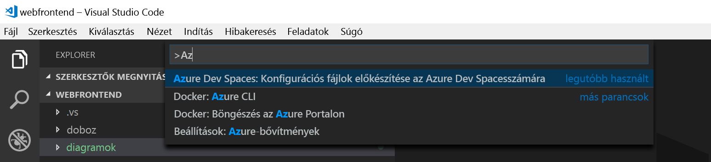

### A hibakeresési objektum inicializálása a VS Code-bővítménnyel
Először konfigurálja a kódprojektet úgy, hogy a VS Code kommunikálni tudjon az Azure-beli Dev Spaces-terünkkel. A VS Code Azure Dev Spaceshez készült bővítménye biztosít egy segítőparancsot a hibakeresési konfiguráció beállításához. 

Nyissa meg a **parancskatalógust** (**Nézet | Parancskatalógus** menü), és az automatikus kitöltés használatával írja be és válassza ki a következő parancsot: `Azure Dev Spaces: Prepare configuration files for Azure Dev Spaces`. 

Ez hozzáadja az Azure Dev Spaceshez készült hibakeresési konfigurációt a `.vscode` mappához. Ez a parancs nem keverendő össze az `azds prep` paranccsal, amely az üzembe helyezéshez konfigurálja a projektet.

