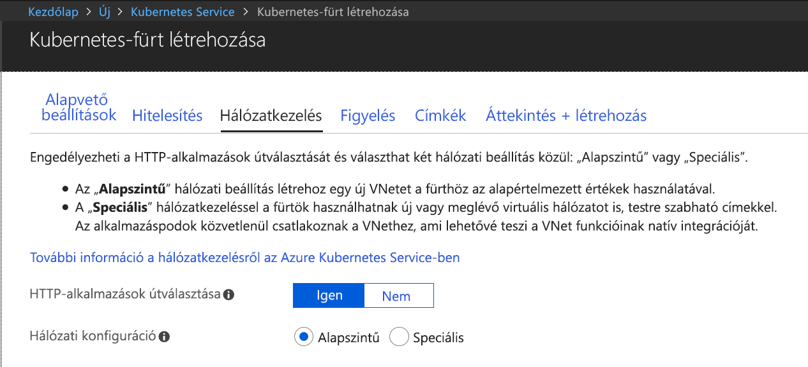

## Azure Dev Spaceshez engedélyezett Kubernetes-fürt létrehozása

1. Jelentkezzen be az Azure Portalra a http://portal.azure.com webhelyen.
1. Válassza az **Erőforrás létrehozása** lehetőséget > keressen a **Kubernetes** kifejezésre > válassza a **Kubernetes Service** > **Létrehozás** elemet.

   Tegye a következőket az AKS-fürt létrehozására szolgáló űrlap címsorai alatt.

    - **PROJEKT ADATAI**: válasszon ki egy Azure-előfizetést és egy új vagy meglévő Azure-erőforráscsoportot.
    - **FÜRT ADATAI**: adjon meg egy nevet, régiót (jelenleg kötelező az EastUS, Central US, WestEurope, WestUS2, CanadaCentral vagy CanadaEast régiót választani), verziót és DNS-névelőtagot az AKS-fürthöz.
    - **MÉRET**: válassza ki a virtuálisgép-méretet az AKS-ügynökcsomópontok számára, és a csomópontok számát. Ha most kezdte el az Azure Dev Spaces használatát, egyetlen csomópont elegendő az összes funkció kipróbálásához. A csomópontok száma bármikor egyszerűen beállítható a fürt telepítése után. Vegye figyelembe, hogy a virtuálisgép-méret az AKS-fürt létrehozását követően nem módosítható. Az AKS-fürt telepítése után azonban egyszerűen létrehozhat egy új, nagyobb virtuális gépekkel rendelkező AKS-fürtöt, majd a Dev Spaces használatával újratelepíthet erre a nagyobb fürtre, ha felskálázásra van szükség.

   Ügyeljen rá, hogy a Kubernetes 1.9.6-os vagy újabb verzióját válassza.

   

   Ha kész, válassza a **Következő: Hitelesítés** elemet.

1. Válassza ki a Szerepköralapú hozzáférés-vezérlés (RBAC) kívánt beállítását. Az Azure Dev Spaces engedélyezett és letiltott RBAC esetén is támogatja a fürtöket.

    

1. Győződjön meg róla, hogy a HTTP-alkalmazások útválasztása engedélyezve van.

   

    > [!Note]
    > A [Http Application Routing](/azure/aks/http-application-routing) engedélyezéséhez egy meglévő fürtön használja a következő parancsot: `az aks enable-addons --resource-group myResourceGroup --name myAKSCluster --addons http_application_routing`

1. Amikor végzett, válassza az **Áttekintés + létrehozás**, majd a **Létrehozás** lehetőséget.
