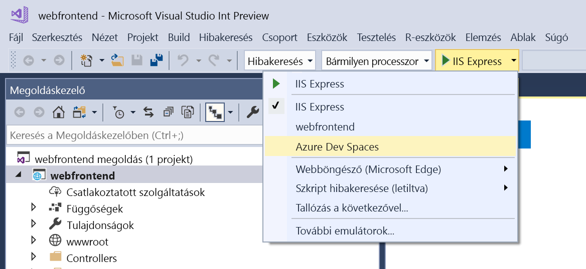
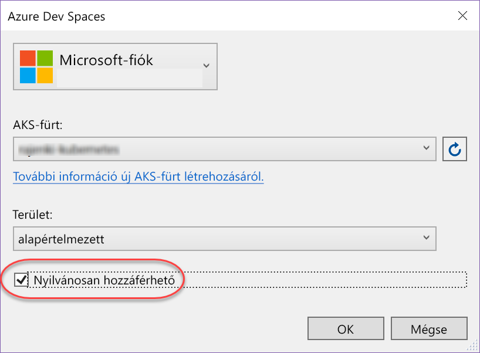
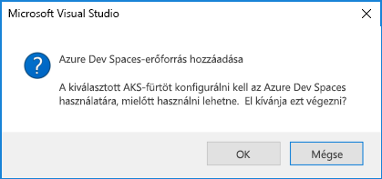
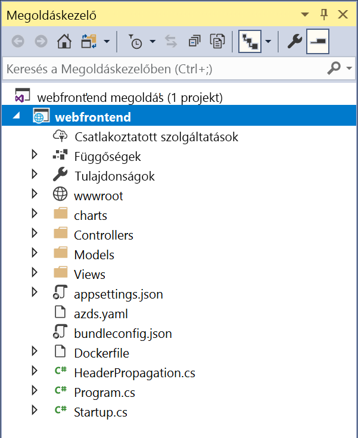

# Gyors útmutató: A Kubernetes fejlesztői tárolóhely létrehozása az Azure fejlesztési szóközöket (a .NET Core és a Visual Studio)

Ebből az útmutatóból a következőket tudhatja meg:

- Az Azure Dev Spaces beállítása Managed Kubernetes-fürttel az Azure-ban.
- Iteratív kódfejlesztés tárolókban a Visual Studio használatával.
- A fürtben futó kód hibakeresése.

> [!Note]
> **Ha bármikor elakad**, tekintse meg a [Hibaelhárítás](troubleshooting.md) szakaszt, vagy írjon egy hozzászólást erre a lapra. A részletesebb [oktatóanyagot](get-started-netcore-visualstudio.md) is kipróbálhatja.

## Előfeltételek

- Egy Kubernetes-fürtön futó Kubernetes 1.9.6 vagy újabb, az USA keleti régiója, EastUS2, CentralUS, WestUS2, WestEurope, SoutheastAsia, CanadaCentral vagy CanadaEast régióban.

- Visual Studio 2017 telepített webfejlesztési számítási feladattal. Ha nincs telepítve, [innen](https://aka.ms/vsdownload?utm_source=mscom&utm_campaign=msdocs) letöltheti.

## Az Azure Dev Spaces beállítása

[A Kuberneteshez készült Visual Studio-eszközök](https://aka.ms/get-vsk8stools) telepítése.

## Csatlakozás fürthöz

Ezután létrehozni és konfigurál egy projektet az Azure Dev Spaceshez.

### ASP.NET-webapp létrehozása

Hozzon létre egy új projektet a Visual Studio 2017-ben. Jelenleg a projektnek egy **ASP.NET Core-webalkalmazásnak** kell lennie. Adja a projektnek a **webfrontend** nevet.

Válassza ki a **Webalkalmazás (Model-View-Controller)** sablont, és ellenőrizze, hogy a **.NET Core** és az **ASP.NET Core 2.0** van-e kijelölve.

### A DevSpaces engedélyezése egy AKS-fürtön

Az imént létrehozott projektben válassza ki az **Azure Dev Spaces** lehetőséget az indítási beállítások legördülő menüjéből, ahogy az az alábbi képen látható.

Az ezt követően megjelenő párbeszédpanelen ellenőrizze, hogy a megfelelő fiókkal van-e bejelentkezve, majd válasszon ki egy meglévő fürtöt.

A **Tér** legördülő menüt egyelőre hagyja a `default` értéken. Jelölje be a **Nyilvánosan hozzáférhető** jelölőnégyzetet, hogy a webalkalmazás nyilvános végpontról is elérhető legyen.

A fürt kiválasztásához vagy létrehozásához kattintson az **OK** gombra.

Ha egy olyan fürtöt választ, amely nincs az Azure Dev Spaceshez konfigurálva, a rendszer egy üzenetben rákérdez, hogy szeretné-e konfigurálni.

Kattintson az **OK** gombra. 

### A projekthez adott fájlok ellenőrzése
Amíg a Dev Spaces-tér létrehozására vár, tekintse meg, milyen fájlokat rendelt a projekthez a rendszer, amikor az Azure Dev Spaces használatát választotta.

- A rendszer hozzáadott egy `charts` nevű mappát, amelyben előállított egy [Helm-diagramot](https://docs.helm.sh) az alkalmazásához. Ezek a fájlok szükségesek az alkalmazás Dev Spaces-térben való üzembe helyezéséhez.
- A `Dockerfile` olyan információt tartalmaz, amely az alkalmazás szabványos Docker-formátumba való csomagolásához szükséges.
- Az `azds.yaml` a Dev Spaces-térhez szükséges fejlesztéskori konfigurációs adatokat tartalmazza.

## Tároló hibakeresése a Kubernetesben
Amint a Dev Spaces-tér létrehozása sikeresen lezárul, hibakeresést végezhet az alkalmazáson. Állítson be egy töréspontot a kódban, például a `HomeController.cs` fájl 20. sorában, ahol a `Message` változó van beállítva. Nyomja le az **F5** billentyűt a hibakeresés indításához. 

A Visual Studio kommunikál a Dev Spaces-térrel, hogy az hozza létre és helyezze üzembe az alkalmazást, majd nyisson meg egy böngészőt a futó webalkalmazással. Úgy tűnhet, hogy a tároló futtatása helyileg történik, de valójában a Dev Spaces-térben fut az Azure-ban. A localhost cím oka az, hogy az Azure Dev Spaces egy ideiglenes SSH-alagutat hoz létre az AKS-ben futó tárolóhoz.

Kattintson az oldal tetején lévő **About** (Információ) hivatkozásra a töréspont aktiválásához. Ugyanúgy teljes körű hozzáférése van a hibakeresési információkhoz, mintha helyileg futna a kód (pl. hívási verem, helyi változók, kivételek adatai stb.).

## Iteratív kódfejlesztés

Az Azure Dev Spaces nem csupán a Kubernetesben futó kódok lekérésére szolgál – a segítségével gyorsan és iteratívan lehet megtekinteni a kódmódosítások életbe lépését a felhőben lévő Kubernetes-környezetben.

### Tartalomfájlok frissítése
1. Keresse meg a `./Views/Home/Index.cshtml` fájlt, és szerkessze a HTML-kódot. Például módosíthatja a 70. sor korábbi szövegét (`<h2>Application uses</h2>`) egy új szövegre (`<h2>Hello k8s in Azure!</h2>`).
1. Mentse a fájlt.
1. Lépjen a böngészőre, és frissítse az oldalt. A weboldalnak meg kell jelenítenie a frissített HTML-tartalmat.

Mi történt? A tartalomfájlok (például HTML és CSS) módosításait nem szükséges egy .NET Core webalkalmazásban újrafordítani, így az aktív F5-munkamenet automatikusan szinkronizálja a módosított tartalomfájlokat az Azure-ban futó tárolóba, így azonnal megtekintheti a tartalmak módosításait.

### Kódfájlok frissítése
A kódfájlok frissítése egy kicsit több munkát igényel, mert a .NET Core-alkalmazásnak újra létre kell hoznia és elő kell állítania az alkalmazás frissített bináris fájljait.

1. Állítsa le a hibakeresőt a Visual Studióban.
1. Nyissa meg a `Controllers/HomeController.cs` nevű kódfájlt, és szerkessze az Információ oldalon megjelenő üzenetet: `ViewData["Message"] = "Your application description page.";`
1. Mentse a fájlt.
1. Nyomja le az **F5** billentyűt a hibakeresés újraindításához. 

Ahelyett, hogy a kód minden szerkesztése alkalmával újra létrehozna és üzembe helyezne egy új tárolórendszerképet, ami általában sok időt vesz igénybe, az Azure Dev Spaces növekményesen újrafordítja a kódot a meglévő tárolón belül, hogy gyorsabb szerkesztési/hibakeresési ciklust biztosítson.

Frissítse a webalkalmazást a böngészőben, és lépjen az Információ oldalra. Az egyedi üzenetnek meg kell jelennie a felhasználói felületen.

## További lépések

> [!div class="nextstepaction"]
> [Több tároló használata és fejlesztés csapatban](multi-service-netcore-visualstudio.md)
