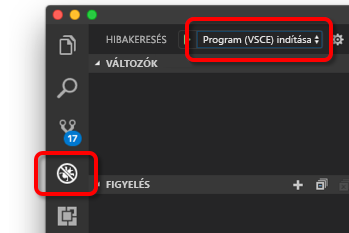

# <a name="quickstart-create-a-kubernetes-dev-space-with-azure-dev-spaces-nodejs"></a>Rövid útmutató: Kubernetes Dev Spaces-tér létrehozása az Azure Dev Spaces segítségével (Node.js)

Ebből az útmutatóból a következőket tudhatja meg:

- Az Azure Dev Spaces beállítása Managed Kubernetes-fürttel az Azure-ban.
- Iteratív kódfejlesztés tárolókban a VS Code és a parancssor használatával.
- A fürtben futó kód hibakeresése.

> [!Note]
> **Ha bármikor elakad**, tekintse meg a [Hibaelhárítás](troubleshooting.md) szakaszt, vagy írjon egy hozzászólást erre a lapra. A részletesebb [oktatóanyagot](get-started-nodejs.md) is kipróbálhatja.

## <a name="prerequisites"></a>Előfeltételek

- Azure-előfizetés. Ha nem rendelkezik Azure-előfizetéssel, létrehozhat egy [ingyenes fiókot](https://azure.microsoft.com/free).
- Az EastUS, WestEurope vagy CanadaEast régióban lévő, a Kubernetes 1.9.6 verziót futtató [Kubernetes-fürt](https://ms.portal.azure.com/#create/microsoft.aks) a **HTTP-alkalmazások engedélyezett útválasztásával**.

  

- Visual Studio Code (letölthető [innen](https://code.visualstudio.com/download)).

## <a name="set-up-azure-dev-spaces"></a>Az Azure Dev Spaces beállítása

1. Telepítse az [Azure CLI-t](/cli/azure/install-azure-cli?view=azure-cli-latest) (a 2.0.33-as vagy újabb verziót).
1. A Dev Spaces beállítása az AKS-fürtön: `az aks use-dev-spaces -g MyResourceGroup -n MyAKS`
1. Töltse le az [Azure Dev Spaces bővítményt](https://aka.ms/get-azds-code) a VS Code-hoz.
1. A bővítmény telepítése: `code --install-extension path-to-downloaded-extension/azds-0.1.1.vsix`

## <a name="build-and-run-code-in-kubernetes"></a>Kód létrehozása és futtatása Kubernetesben

1. Mintakód letöltése a GitHubról: [https://github.com/Azure/dev-spaces](https://github.com/Azure/dev-spaces) 
1. A könyvtár módosítása a webfrontend mappára: `cd dev-spaces/samples/nodejs/getting-started/webfrontend`
1. Docker és Helm diagramobjektumok létrehozása: `azds prep --public`
1. Dev Spaces-tér létrehozása az AKS-ben. Futtassa ezt a parancsot a terminálablakban a webfrontend nevű kódolási **gyökérmappából**: `azds up`
1. Keresse meg a konzolkimenetben az `up` parancs által létrehozott URL-re vonatkozó adatokat. Ez az alábbi formátumban lesz: 

   `Service 'webfrontend' port 'http' is available at <url>` 

   Nyissa meg ezt az URL-t egy böngészőablakban, és betöltődik a webalkalmazás. 

### <a name="update-a-content-file"></a>Tartalomfájlok frissítése
Az Azure Dev Spaces nem csupán a Kubernetesben futó kódok lekérésére szolgál – a segítségével gyorsan és iteratívan lehet megtekinteni a kódmódosítások életbe lépését a felhőben lévő Kubernetes-környezetben.

1. Keresse meg a `./public/index.html` fájlt, és szerkessze a HTML-kódot. Például módosítsa az oldal háttérszínét a kék egy árnyalatára:

    ```html
    <body style="background-color: #95B9C7; margin-left:10px; margin-right:10px;">
    ```

1. Mentse a fájlt. Néhány pillanat múlva egy, a terminálablakban megjelenő üzenet tájékoztatja, hogy a futó tárolóban lévő egyik fájl frissült.
1. Lépjen a böngészőre, és frissítse az oldalt. Látnia kell, ahogy a szín megváltozik.

Mi történt? A tartalomfájlok (például HTML és CSS) módosításai nem igénylik a Node.js folyamat újraindítását, így az aktív `azds up` parancs automatikusan és közvetlenül szinkronizálja a módosított tartalomfájlokat az Azure-ban futó tárolóba, így gyorsan megtekintheti a tartalmak módosításait.

### <a name="test-from-a-mobile-device"></a>Tesztelés mobileszközről
Ha a webalkalmazást egy mobileszközön nyitja meg, megfigyelheti, hogy a felhasználói felület nem megfelelően jelenik meg a kis méretű eszközökön.

Ennek kiküszöbölésére hozzáadunk egy `viewport` metacímkét:
1. Nyissa meg a `./public/index.html` fájlt.
1. Adja hozzá a `viewport` metacímkét a meglévő `head` elemhez:

    ```html
    <head>
        <!-- Add this line -->
        <meta name="viewport" content="width=device-width, initial-scale=1">
    </head>
    ```

1. Mentse a fájlt.
1. Frissítse a böngészőt az eszközön. Most a webalkalmazásnak megfelelően renderelve kell megjelennie. 

Ez a példa azt mutatja be, hogy bizonyos problémák csak akkor figyelhetők meg, ha olyan eszközökön teszteli az alkalmazást, amelyekre azt szánták. Az Azure Dev Spaces segítségével a kód gyorsan iterálható, és a módosítások is gyorsan ellenőrizhetők a céleszközökön.

### <a name="update-a-code-file"></a>Kódfájlok frissítése
A kiszolgálóoldali kódfájlok frissítése egy kicsit több munkát igényel, mert újra kell indítani egy Node.js-alkalmazást.

1. A terminálablakban nyomja le a `Ctrl+C` billentyűkombinációt (az `azds up` leállításához).
1. Nyissa meg a `server.js` nevű kódfájlt, és szerkessze a szolgáltatás üdvözlőüzenetét: 

    ```javascript
    res.send('Hello from webfrontend running in Azure!');
    ```

3. Mentse a fájlt.
1. Futtassa az `azds up` parancsot a terminálablakban. 

Ez újraépíti a tárolórendszerképet, és újra üzembe helyezi a Helm-diagramot. Töltse be újra az oldalt a böngészőben a módosított kód életbe léptetéséhez.

Azonban a kódfejlesztésnek van egy még ennél is *gyorsabb módszere*, amelyet a következő szakaszban mutatunk be. 

## <a name="debug-a-container-in-kubernetes"></a>Tároló hibakeresése a Kubernetesben

Ebben a részben közvetlenül a VS Code-dal végezhet hibakeresést az Azure-ban futó tárolón. Azt is megtudhatja, hogyan végezheti el gyorsabban a szerkesztés-futtatás-tesztelés hurkot.


### <a name="initialize-debug-assets-with-the-vs-code-extension"></a>A hibakeresési objektum inicializálása a VS Code-bővítménnyel
Először konfigurálja a kódprojektet úgy, hogy a VS Code kommunikálni tudjon az Azure-beli Dev Spaces-terünkkel. A VS Code Azure Dev Spaceshez készült bővítménye biztosít egy segítőparancsot a hibakeresési konfiguráció beállításához. 

Nyissa meg a **parancskatalógust** (**Nézet | Parancskatalógus** menü), és az automatikus kitöltés használatával írja be és válassza ki a következő parancsot: `Azure Dev Spaces: Create configuration files for connected development`. 

Ez hozzáadja az Azure Dev Spaceshez készült hibakeresési konfigurációt a `.vscode` mappához.


### <a name="select-the-azds-debug-configuration"></a>Az AZDS hibakeresési konfiguráció kiválasztása
1. A hibakeresési nézet megnyitásához kattintson a **tevékenységsáv** Hibakeresés ikonjára a VS Code oldalán.
1. Válassza a **Program indítása (AZDS)** lehetőséget mint aktív hibakeresési konfigurációt.



> [!Note]
> Ha nem lát Azure Dev Spaces-parancsokat a parancspalettán, győződjön meg róla, hogy a VS Code Azure Dev Spaces-hez készült bővítménye telepítve van.

### <a name="debug-the-container-in-kubernetes"></a>A tároló hibakeresése a Kubernetesben
A kód a Kubernetesben való hibakereséséhez nyomja le az **F5** billentyűt.

Az `up` parancshoz hasonlóan a hibakeresés indításakor a kód szinkronizálva lesz a Dev Spaces-térbe, továbbá létrejön és települ egy tároló a Kubernetesben. Ezúttal a hibakereső a távoli tárolóhoz van csatlakoztatva.

> [!Tip]
> A VS Code-állapotsáv egy kattintható URL-címet jelenít meg.

Állítson be egy töréspontot egy kiszolgálóoldali kódfájlban, például az `app.get('/api'...` helyen a `server.js` fájlban. Frissítse az oldalt a böngészőben vagy kattintson a „Kimondás újra” gombra. Ezzel elvileg elérheti a töréspontot, és írhatja a kódot.

Ugyanúgy teljes körű hozzáférése van a hibakeresési információkhoz, mint ha helyileg futna a kód (pl. hívási verem, helyi változók, kivételek adatai stb.).

### <a name="edit-code-and-refresh-the-debug-session"></a>A kód szerkesztése és a hibakeresési munkamenet frissítése
Miközben a hibakereső aktív, szerkessze a kódot, például módosítsa megint az üdvözlőüzenetet:

```javascript
app.get('/api', function (req, res) {
    res.send('**** Hello from webfrontend running in Azure! ****');
});
```

Mentse a fájlt, és a **Hibakeresési műveletek panelen** kattintson a **Frissítés** gombra. 


Ahelyett, hogy a kód minden szerkesztése alkalmával újra létrehozna és üzembe helyezne egy új tárolórendszerképet, ami általában sok időt vesz igénybe, az Azure Dev Spaces a hibakeresési munkamenetek között újraindítja a Node.js-folyamatot, hogy gyorsabb szerkesztési/hibakeresési ciklust biztosítson.

Frissítse a webalkalmazást a böngészőben, vagy kattintson a *Kimondás újra* gombra. Az egyedi üzenetnek meg kell jelennie a felhasználói felületen.

### <a name="use-nodemon-to-develop-even-faster"></a>Még gyorsabb fejlesztés a NodeMon használatával

A `webfrontend` mintaprojekt a [nodemon](https://nodemon.io/) használatára volt konfigurálva, amely egy népszerű eszköz a Node.js-fejlesztések gyorsabbá tételéhez, és teljesen kompatibilis az Azure Dev Spaces szolgáltatással.

Próbálja meg a következőket:
1. Állítsa le a VS Code hibakeresőt.
1. Kattintson a **tevékenységsáv** Hibakeresés ikonjára a VS Code oldalán. 
1. Válassza a **Csatolás (AZDS)** lehetőséget mint aktív hibakeresési konfigurációt.
1. Nyomja le az F5 billentyűt.

Ebben a konfigurációban a tároló úgy van beállítva, hogy elindítsa a *nodemon* eszközt. A kiszolgálói kód módosításakor a *nodemon* automatikusan újraindítja a Node-folyamatot, ahogy azt helyi fejlesztés esetén is tenné. 
1. Módosítsa újra az üdvözlőüzenetet a `server.js` fájlban, majd mentse azt.
1. Frissítse a böngészőt vagy kattintson a *Kimondás újra* gombra, és láthatja, ahogy a módosítások érvénybe lépnek.

**Most tehát rendelkezésére áll egy módszer, amellyel gyorsan iterálhatja a kódot, és közvetlenül a Kubernetesben végezheti a hibakeresést.**

## <a name="next-steps"></a>További lépések

> [!div class="nextstepaction"]
> [Több tároló használata és fejlesztés csapatban](get-started-nodejs.md#call-a-service-running-in-a-separate-container)