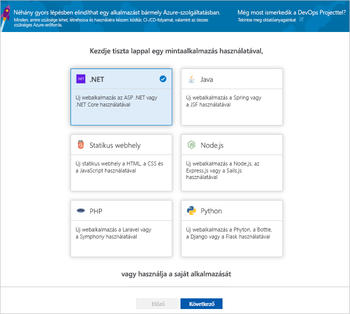
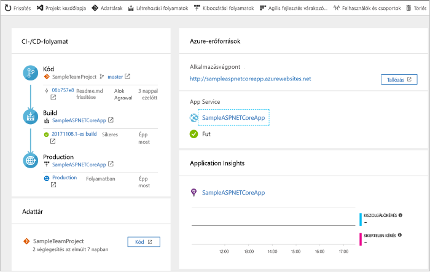
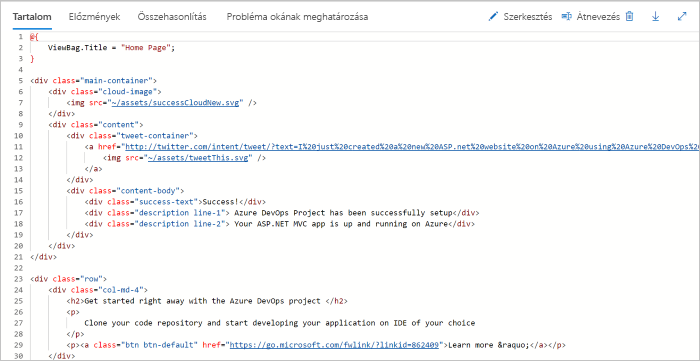
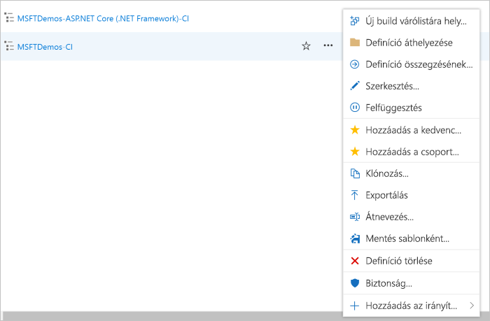

# A CI/CD-folyamat létrehozása a .NET-hez az Azure DevOps Projects segítségével

Folyamatos integrációs (CI) és a folyamatos készregyártás (CD) a .NET core- vagy ASP.NET-alkalmazás konfigurálása az DevOps Projects segítségével. DevOps-projektek egyszerűbbé teszi a kezdeti konfigurálása az Azure-folyamatok készítése és kiadása folyamat.

Ha nem rendelkezik Azure-előfizetéssel, létrehozhat egy ingyenes fiókot a [Visual Studio Dev Essentials](https://visualstudio.microsoft.com/dev-essentials/) segítségével.

## Jelentkezzen be az Azure Portalra

DevOps-projektek az Azure DevOps hoz létre a CI/CD-folyamat. Hozzon létre egy új Azure DevOps szervezetet, vagy használjon egy már meglévő szervezet. A DevOps Projects is létrehoz az Azure-erőforrások tetszőleges Azure-előfizetésben.

1. Jelentkezzen be a [Microsoft Azure Portalra](https://portal.azure.com).

1. A bal oldali panelen válassza ki a **erőforrás létrehozása** ikonra a bal oldali navigációs sávon, és keressen a **DevOps Projects**.  

3.  Kattintson a **Létrehozás** gombra.

    

## Mintaalkalmazás és Azure-szolgáltatás kiválasztása

1. Válassza ki a .NET-mintaalkalmazást. A .NET-minták esetén a nyílt forráskódú ASP.NET- vagy a platformfüggetlen .NET Core-keretrendszer közül választhat.

    

1. Válassza ki a .NET Core-alkalmazás keretrendszer.  
    Ez a minta egy ASP.NET Core MVC-alkalmazás.
    
2. Kattintson a **Tovább** gombra.  
    A Web App on Windows az alapértelmezett telepítési cél.  A Web App on Linux vagy a Web App for Containers használata mellett is dönthet.  Az alkalmazás-keretrendszer, amely korábban kiválasztott itt előírja a rendelkezésre álló Azure-szolgáltatás központi telepítési cél típusát.  
    
3. Hagyja az alapértelmezett szolgáltatást, és válassza ki **tovább**.

## Az Azure DevOps és az Azure-előfizetés konfigurálása 

1. Hozzon létre egy új ingyenes Azure DevOps szervezetet, vagy válasszon egy már meglévő szervezet.

    a. Válasszon egy nevet a projektnek. 

    b. Válassza ki az Azure-előfizetést és helyet, válasszon egy nevet az alkalmazáshoz, és válassza **kész**.  
    Néhány perc múlva a DevOps Projects irányítópult jelenik meg az Azure Portalon. Egy mintaalkalmazás be van állítva, a szervezet Azure DevOps-tárházban, build hajtja végre, és az alkalmazás központi telepítése az Azure-bA. Ezt az irányítópultot a kódtárat a CI/CD-folyamat és az Azure-ban az alkalmazás rálátást biztosít.
    

2. Az irányítópult a jobb oldalon válassza ki a **Tallózás** a futó alkalmazás megtekintéséhez.

     

## Kódmódosítások véglegesítése és a CI/CD végrehajtása

 A DevOps Projects egy Git-tárház létrehozott Azure-kódtárak és a GitHub. A tárház megtekintéséhez, és módosítsa a kódokat az alkalmazáshoz, tegye a következőket:

1. Az irányítópult bal oldalán, a DevOps Projects, jelölje be a hivatkozást a **fő** ágat.  
Ez a hivatkozás megnyitja az újonnan létrehozott Git-adattár nézetét.

1. Az adattárklón URL-címének megtekintéséhez válassza a **Klónozás** lehetőséget a böngésző jobb felső részén.  
A Git-adattárat klónozhatja például a kedvenc IDE-környezetébe.  A következő néhány lépésben a webböngésző segítségével közvetlenül a főágban hajthat végre és véglegesíthet kódmódosításokat.

1. A bal oldalon, a böngésző, nyissa meg a **Views/Home/index.cshtml** fájlt.

1. Válassza ki **szerkesztése**, és ezután hajtson végre módosítást a h2 fejléc. Írja be például **azonnal Ismerkedés az Azure DevOps Projects** vagy valamilyen más módosítást.

    

1. Válassza ki **véglegesítése**, majd mentse a módosításokat.

1. A böngészőben nyissa meg az Azure DevOps Project irányítópultot.  Látni fogja, hogy folyamatban van egy build. A módosítások automatikusan gyártja és a CI/CD-folyamat segítségével telepítve.

## Vizsgálja meg a CI/CD-folyamat

Az előző lépésben az Azure DevOps Projects automatikusan konfigurálva egy teljes CI/CD-folyamat. Vizsgálja meg és szükség szerinti szabja testre a folyamatot. A következő lépésekkel Ismerkedjen meg az Azure DevOps-buildelési és kiadási folyamatok.

1. Válassza ki a DevOps Projects irányítópult tetején lévő **hozhat létre folyamatokat**.  
Ez a hivatkozás megnyílik egy böngészőlap, és az Azure DevOps folyamat az új projekt létrehozása.

1. Kattintson a három pontra (...).  Ez a művelet egy menüt, ahol elkezdheti több tevékenységet, például az üzenetsor-kezelési egy új build, készítsen szüneteltetése és szerkesztését a buildelési folyamat megnyitja.

1. Válassza a **Szerkesztés** elemet.

    

1. Ezen az ablaktáblán keresse meg a különböző feladatok a a buildelési folyamat.  
 A build hajt végre különböző feladatokat, például a központi telepítésekhez használt források a Git-adattárból, függőségek visszaállítását és kimenetek használt közzétételi beolvasása.

1. A létrehozási folyamat elején jelölje ki a buildelési folyamat neve.

1. Módosítsa a buildelési folyamat nevét egy leíró, jelölje be **várólistára & mentése**, majd válassza ki **mentése**.

1. A buildelési folyamat neve alatt válassza az **Előzményeket**.   
Az a **előzmények** panelen láthatja, hogy az útmutató legutóbbi módosításait build auditnapló.  Azure folyamatok nyomon követi, hogy az összeállítási folyamat végzett módosításokat, és lehetővé teszi, hogy verziójának összehasonlítása.

1. Válassza az **Eseményindítókat**.  
A DevOps Projects automatikusan létrejön egy CI eseményindító, és a tárházban minden véglegesítéshez elindul egy új létrehozást.  Lehetősége van belefoglalni az ágakat, vagy kizárni őket a CI-folyamatból.

1. Válassza a **Megtartást**.  
A forgatókönyvtől függően a szabályzatokat, hogy megtartja vagy eltávolítja a buildek bizonyos számú is megadhat.

1. Válassza ki **készítése és kiadása**, majd **kiadásokban**.  
DevOps-projektek az Azure-bA központi telepítések felügyeletéhez szükséges kiadási folyamatot hoz létre.

1.  A bal oldalon válassza ki a kibocsátási folyamat melletti három pontra (...), majd **szerkesztése**.  
A kiadási folyamathoz egy folyamatot, amely meghatározza a kibocsátási folyamat tartalmazza.  

1. Az **Összetevők** alatt válassza az **Elvetést**.  Az előző lépésekben megvizsgált buildelési folyamat létrehozza a munkadarabhoz használt kimenetet. 

1. Mellett a **Drop** ikonra, válassza ki a **a folyamatos készregyártás eseményindítója**.  
A kibocsátási folyamat rendelkezik egy engedélyezett CD eseményindító, amely futtatja a központi telepítés minden alkalommal, amikor egy új buildösszetevő áll rendelkezésre. Szükség esetén letilthatja az eseményindítót, hogy a központi telepítések igénylik manuális végrehajtását.  

1. A bal oldalon válassza ki a **feladatok**.   
A feladatok olyan tevékenységek, amely végrehajtja a központi telepítési folyamat. Ebben a példában egy feladat létrehozása az Azure App Service üzembe helyezéséhez.

1. A jobb oldalon válassza ki a **verziók megtekintéséhez**. Ebben a nézetben a kiadások előzményei jelennek meg.

1. A kiadások egyik melletti három pontra (...), majd válassza ki és **nyílt**.  
Ismerje meg, például a kiadás összegzését, a társított munkaelemekhez és a tesztek a több menük találhatók meg.

1. Válassza a **Véglegesítéseket**.   
Ez a nézet megjeleníti az adott központi telepítési társított kód véglegesítéseket. 

1. Válassza a **Naplókat**.  
A naplók hasznos információkat tartalmaznak az üzembehelyezési folyamattal kapcsolatban. Ezek az üzembe helyezések alatt és után is megtekinthetők.

## Az erőforrások eltávolítása

Az Azure App Service és a többi kapcsolódó erőforrást, ha többé már nincs szükség rájuk létrehozott törölheti. Használja a **törlése** funkciókat a DevOps Projects-irányítópulton.

## További lépések

Ha arra vonatkozó információkra van szüksége, hogyan lehet módosítani a buildet és a kiadási folyamatokat a csapat igényei szerint, tekintse át az alábbi oktatóanyagot:

> [!div class="nextstepaction"]
> [CD-folyamat testreszabása](https://docs.microsoft.com/azure/devops/pipelines/release/define-multistage-release-process?view=vsts)

## Videók

> [!VIDEO https://www.youtube.com/embed/itwqMf9aR0w]
