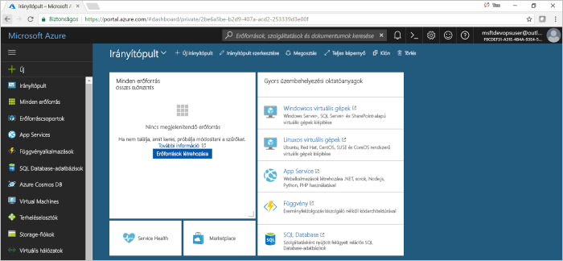
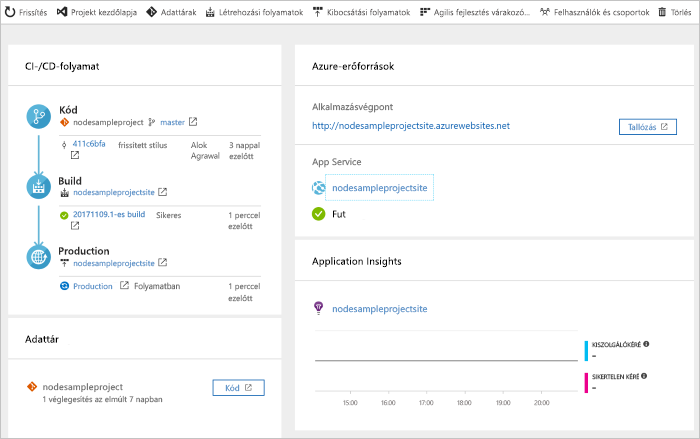

#  CI/CD-folyamat létrehozása a Node. js-hez Azure DevOps Projects 

Azure DevOps Projects az Azure-erőforrások létrehozását és a Node. js-alkalmazás folyamatos integrációs (CI) és folyamatos kézbesítési (CD) folyamatát mutatja be az Azure-folyamatokban.  

Ha nem rendelkezik Azure-előfizetéssel, létrehozhat egy ingyenes fiókot a [Visual Studio Dev Essentials](https://visualstudio.microsoft.com/dev-essentials/) segítségével.

## Jelentkezzen be az Azure Portalra

A DevOps Projects egy CI/CD-folyamatot hoz létre az Azure-folyamatokban. Létrehozhat egy új Azure DevOps-szervezetet, vagy használhat egy meglévő céget is. A DevOps Projects is létrehoz az Azure-erőforrások tetszőleges Azure-előfizetésben.

1. Jelentkezzen be a [Microsoft Azure Portalra](https://portal.azure.com).

1. A bal oldali panelen válassza az **erőforrás létrehozása**lehetőséget, majd keressen rá **DevOps projects**. 

    

## Mintaalkalmazás és Azure-szolgáltatás kiválasztása

1. Válassza ki a Node. js-minta alkalmazást.  
    A Node.js-minták esetén több alkalmazási keretrendszer közül választhat.

1. Az alapértelmezett minta keretrendszer Express. js. Hagyja meg az alapértelmezett beállítást, majd kattintson a **tovább**gombra.  
    Az alapértelmezett üzembehelyezési cél a **Web App on Windows**.  Az alkalmazás-keretrendszer, amelyet korábban választott, az itt elérhető Azure-szolgáltatás telepítési célhelyét diktálja.  

2. Hagyja meg az alapértelmezett szolgáltatást, majd válassza a **tovább**lehetőséget.
 
## Az Azure DevOps és az Azure-előfizetés konfigurálása 

1. Hozzon létre egy új Azure DevOps-szervezetet, vagy válasszon egy meglévő szervezetet. 

    a. Adja meg a projekt nevét.

    b. Válassza ki az Azure-előfizetést és-helyet, adjon meg egy nevet az alkalmazásnak, majd válassza a **kész**lehetőséget.  
    Néhány perc elteltével megjelenik a DevOps Projects irányítópult a Azure Portal. Egy minta alkalmazás az Azure DevOps-szervezet egy tárházában van beállítva, a rendszer létrehoz egy buildet, és az alkalmazást üzembe helyezi az Azure-ban. Ezt az irányítópultot a kódtárat a CI/CD-folyamat és az Azure-ban az alkalmazás rálátást biztosít.
     
3. A futó alkalmazás megtekintéséhez válassza a **Tallózás** lehetőséget.

     
    
DevOps Projects automatikusan konfigurálta a CI-Build és a kiadási triggert.  Most már készen áll arra, hogy együttműködjön egy, a Node. js-alkalmazásban található csapattal a CI/CD folyamattal, amely automatikusan üzembe helyezi a legújabb munkát a webhelyen.

## Kódmódosítások véglegesítése és a CI/CD végrehajtása

A DevOps Projects egy git-tárházat hoz létre az Azure Reposben vagy a GitHubban. Az alábbi lépéseket követve megtekintheti az adattárat, és programkód-módosításokat hajthat végre az alkalmazásban.

1. A DevOps Projects irányítópult bal oldalán válassza ki a fő ág hivatkozását.  
Ez a hivatkozás megnyitja az újonnan létrehozott Git-adattár nézetét.

1. A tárház klónozási URL-címének megtekintéséhez válassza a böngésző jobb felső sarkában található **klónozás** elemet.   
    A Git-adattárat klónozhatja például a kedvenc IDE-környezetébe. A következő néhány lépésben a webböngésző segítségével közvetlenül a főágban hajthat végre és véglegesíthet kódmódosításokat.

1. A böngésző bal oldalán lépjen a **views/index. mopsz** fájlra.

1. Válassza a **Szerkesztés**lehetőséget, majd módosítsa a H2-fejlécet.  
    Írja be például a következőt: **első lépések azonnal Azure DevOps projects** , vagy végezze el a módosítást.

1. Válassza ki **véglegesítése**, majd mentse a módosításokat.

1. A böngészőben nyissa meg a DevOps Projects irányítópultot.   
Ekkor megjelenik egy Build folyamatban. Az imént létrehozott módosításokat a rendszer automatikusan felépíti és telepíti a CI/CD-folyamaton keresztül.

## Az Azure CI-/CD-folyamat vizsgálata

Az előző lépésben DevOps Projects automatikusan konfigurálta a teljes CI/CD-folyamatot. Vizsgálja meg és szükség szerinti szabja testre a folyamatot. Az alábbi lépéseket követve Ismerkedjen meg a létrehozási és a kiadási folyamatokkal.

1. Válassza ki a DevOps Projects irányítópult tetején lévő **hozhat létre folyamatokat**.  
Ez a hivatkozás egy böngésző fület és az új projekthez tartozó Build folyamatot nyitja meg.

1. Mutasson az **állapot** mezőre, majd válassza a három pontot (...).  
    Ez a művelet egy menüt nyit meg, ahol számos tevékenységet indíthat el, például egy új Build kiépítését, egy Build szüneteltetését és a build folyamat szerkesztését.

1. Válassza a **Szerkesztés** elemet.

1. Ezen az ablaktáblán keresse meg a különböző feladatok a a buildelési folyamat.  
A Build számos feladatot hajt végre, például a git-tárházból beolvassa a forrásokat, visszaállítja a függőségeket, és közzéteszi az üzembe helyezéshez használt kimeneteket.

1. A létrehozási folyamat elején jelölje ki a buildelési folyamat neve.

1. Módosítsa a buildelési folyamat nevét egy leíró, jelölje be **várólistára & mentése**, majd válassza ki **mentése**.

1. A buildelési folyamat neve alatt válassza az **Előzményeket**.   
Az a **előzmények** panelen láthatja, hogy az útmutató legutóbbi módosításait build auditnapló.  Azure folyamatok nyomon követi, hogy az összeállítási folyamat végzett módosításokat, és lehetővé teszi, hogy verziójának összehasonlítása.

1. Válassza az **Eseményindítókat**.   
 A DevOps Projects automatikusan létrejön egy CI eseményindító, és a tárházban minden véglegesítéshez elindul egy új létrehozást.  Lehetősége van belefoglalni az ágakat, vagy kizárni őket a CI-folyamatból.

1. Válassza a **Megtartást**.   
A forgatókönyvtől függően a szabályzatokat, hogy megtartja vagy eltávolítja a buildek bizonyos számú is megadhat.

1. Válassza a **Létrehozás és kiadás**, majd a **kiadások**lehetőséget.  
 DevOps Projects létrehoz egy kiadási folyamatot az Azure-ba történő üzembe helyezések kezeléséhez.

1. A bal oldalon válassza a kiadási folyamat melletti három pontot (...), majd válassza a **Szerkesztés**lehetőséget.  
A kiadási folyamat meghatározza a kiadási folyamatot.

12. Az **Összetevők** alatt válassza az **Elvetést**.  
    Az előző lépésekben megvizsgált buildelési folyamat létrehozza a munkadarabhoz használt kimenetet. 

1. Mellett a **Drop** ikonra, válassza ki a **a folyamatos készregyártás eseményindítója**.  
A kibocsátási folyamat rendelkezik egy engedélyezett CD eseményindító, amely futtatja a központi telepítés minden alkalommal, amikor egy új buildösszetevő áll rendelkezésre. Szükség esetén letilthatja az eseményindítót, hogy a központi telepítések igénylik manuális végrehajtását. 

1. A bal oldalon válassza ki a **feladatok**.   
A feladatok olyan tevékenységek, amely végrehajtja a központi telepítési folyamat. Ebben a példában egy feladatot hoztak létre a Azure App Serviceba való üzembe helyezéshez.

1. A jobb oldalon válassza ki a **verziók megtekintéséhez**.  
Ebben a nézetben a kiadások előzményei jelennek meg.

1. A kiadások egyik melletti három pontra (...), majd válassza ki és **nyílt**.  
Ismerje meg, például a kiadás összegzését, a társított munkaelemekhez és a tesztek a több menük találhatók meg.

1. Válassza a **Véglegesítéseket**.   
Ez a nézet megjeleníti az adott központi telepítési társított kód véglegesítéseket.

1. Válassza a **Naplókat**.  
A naplók hasznos információkat tartalmaznak az üzembehelyezési folyamattal kapcsolatban. Ezek az üzembe helyezések alatt és után is megtekinthetők.

## Az erőforrások eltávolítása

Az Azure App Service és a többi kapcsolódó erőforrást, ha többé már nincs szükség rájuk létrehozott törölheti. Használja a **törlése** funkciókat a DevOps Projects-irányítópulton.

## További lépések

A CI/CD-folyamat beállításakor a rendszer automatikusan létrehozta a létrehozási és kiadási folyamatokat. A csapat igényeihez igazodva módosíthatja ezt a buildet és a kiadási folyamatokat. A CI/CD folyamattal kapcsolatos további tudnivalókért tekintse meg a következőt:

> [!div class="nextstepaction"]
> [CD-folyamat testreszabása](https://docs.microsoft.com/azure/devops/pipelines/release/define-multistage-release-process?view=vsts)

## Videók

> [!VIDEO https://www.youtube.com/embed/3etwjubReJs]
