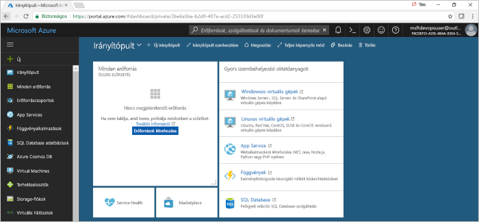

# CI/CD-folyamat létrehozása Pythonhoz az Azure DevOps Projecttel

Az Azure DevOps Projecttel egyszerűen létrehozhat Azure-erőforrásokat, és beállíthat egy folyamatos integrációs (CI) és folyamatos kézbesítési (CD) folyamatot Python-alkalmazáshoz az Azure DevOps Services szolgáltatásban.  

Ha nem rendelkezik Azure-előfizetéssel, létrehozhat egy ingyenes fiókot a [Visual Studio Dev Essentials](https://visualstudio.microsoft.com/dev-essentials/) segítségével.

## Jelentkezzen be az Azure Portalra

Az Azure DevOps Project létrehoz egy CI-/CD-folyamatot az Azure-ban.  Létrehozhat egy ingyenes, **új Azure DevOps Services**-szervezetet, vagy használhat egy **meglévő szervezetet** is.  A DevOps Project az **Azure-erőforrásokat** is létrehozza a választott **Azure-előfizetésben**.

1. Jelentkezzen be a [Microsoft Azure Portalra](https://portal.azure.com).

1. A bal oldali navigációs sávban válassza az **Erőforrás létrehozása** ikont, majd keresse meg a **DevOps Projectet**.  Válassza a **Létrehozás** elemet.

    

## Mintaalkalmazás és Azure-szolgáltatás kiválasztása

1. Válassza ki a **Python** mintaalkalmazást.  A Python-minták esetén több alkalmazási keretrendszer közül választhat.

1. Az alapértelmezett mintakeretrendszer a **Django**. Hagyja meg az alapértelmezett beállítást, majd válassza a **Tovább** gombot.  

1. Az alapértelmezett üzembehelyezési cél a **Web App for Containers**.  Az előző lépésekben kiválasztott alkalmazás-keretrendszer meghatározza az Azure-szolgáltatás üzembehelyezési céljának itt elérhető típusát.  Hagyja meg az alapértelmezett szolgáltatást, majd válassza a **Tovább** gombot.
 
## Az Azure DevOps Services és egy Azure-előfizetés konfigurálása 

1. Hozzon létre egy **új** Azure DevOps Services-szervezetet, vagy válasszon egy **meglévő** szervezetet.  Válasszon egy **nevet** az Azure DevOps-projektnek.  Válassza ki az **Azure-előfizetését**, a **helyet**, és adjon egy **nevet** az alkalmazásnak.  Ha elkészült, kattintson a **Kész** gombra.

1. Néhány percen belül betöltődik a **projekt irányítópultja** az Azure Portalon.  A rendszer beállít egy mintaalkalmazást az Azure DevOps Services-szervezetben található adattárban, végrehajt egy buildelést, és üzembe helyezi az alkalmazást az Azure-ban.  Ez az irányítópult biztosítja a **kódtár**, az **Azure CI/CD-folyamat** és az **Azure-ban található alkalmazás** áttekinthetőségét.  Az irányítópult jobb oldalán válassza a **Tallózást** a futó alkalmazás megtekintéséhez.

     
    
Az Azure DevOps Project automatikusan konfigurálja a CI-buildet és a kiadási eseményindítót.  Most már készen áll, hogy egy csapattal közösen dolgozzon a Python-alkalmazáson egy olyan CI-/CD-folyamat használatával, amely automatikusan üzembe helyezi a legújabb munkáját a webhelyen.

## Kódmódosítások véglegesítése és a CI/CD végrehajtása

Az Azure DevOps Project létrehozott egy Git-adattárat a Azure DevOps Services-szervezetben vagy a GitHub-fiókban.  Az adattár megtekintéséhez és az alkalmazásban történő kódmódosítások végrehajtásához kövesse az alábbi lépéseket.

1. A DevOps Project irányítópultjának bal oldalán válassza a **főághoz** tartozó hivatkozást.  Ez a hivatkozás megnyitja az újonnan létrehozott Git-adattár nézetét.

1. Az adattárklón URL-címének megtekintéséhez válassza a **Klónozás** lehetőséget a böngésző jobb felső részén. A Git-adattárat klónozhatja például a kedvenc IDE-környezetébe.  A következő néhány lépésben a webböngésző segítségével közvetlenül a főágban hajthat végre és véglegesíthet kódmódosításokat.

1. A böngésző bal oldalán keresse meg az **app/templates/app/index.html** fájlt.

1. Válassza a **Szerkesztés** elemet, és módosítson a szöveg valamely részén.  Módosítsa például az egyik div címkén belüli szöveget.

1. Válassza a **Véglegesítés** elemet, majd mentse a módosításokat.

1. A böngészőjében lépjen az **Azure DevOps Project irányítópultjára**.  Látni fogja, hogy folyamatban van egy build.  Az imént végrehajtott módosítások automatikusan létrejönnek és települnek egy Azure CI/CD-folyamaton keresztül.

## Az Azure CI-/CD-folyamat vizsgálata

Az Azure DevOps Project automatikusan konfigurált egy teljes Azure CI-/CD-folyamatot az Azure DevOps Services-szervezetben.  Vizsgálja meg és szükség szerinti szabja testre a folyamatot.  Az Azure DevOps Services buildelési és kiadási folyamatainak megismeréséhez kövesse az alábbi lépéseket.

1. Az Azure DevOps Project irányítópultjának **tetején** válassza a **Buildelési folyamatok** lehetőséget.  Ez a hivatkozás megnyit egy böngészőlapot, és megnyitja az új projekt Azure DevOps Services buildelési folyamatát.

1. Helyezze az egérmutatót a buildelési folyamat jobb oldalára, az **Állapot** mező mellé. Válassza a megjelenő **három pontot**.  Ez a művelet megnyitja a menüt, ahol több tevékenységet is végrehajthat, például várakozási sorba helyezhet egy új buildet, szüneteltethet egy buildet, vagy szerkesztheti a buildfolyamatot.

1. Válassza a **Szerkesztés** elemet.

1. Ebben a nézetben **megvizsgálhatja a buildelési folyamathoz tartozó különböző feladatokat**.  A build különböző feladatokat hajt végre, például erőforrásokat olvas be a Git-adattárból, visszaállítja a függőségeket, és közzéteszi az üzembe helyezésekhez használt kimeneteket.

1. A buildelési folyamat tetején válassza a **buildelési folyamat nevét**.

1. Módosítsa a buildelési folyamat **nevét** egy közérthetőbb névre.  Válassza a **mentésre és várakozási sorba helyezésre** szolgáló elemet, majd a **Mentést**.

1. A buildelési folyamat neve alatt válassza az **Előzményeket**.  Ekkor megjelenik a build legutóbbi módosításainak naplója.  Az Azure DevOps Services nyomon követi a buildelési folyamat módosításait, és lehetővé teszi a verziók összehasonlítását.

1. Válassza az **Eseményindítókat**.  Az Azure DevOps Project automatikusan létrehozott egy CI-eseményindítót, és az adattárban történő minden véglegesítés egy új buildet indít el.  Lehetősége van belefoglalni az ágakat, vagy kizárni őket a CI-folyamatból.

1. Válassza a **Megtartást**.  A forgatókönyv alapján megadhat szabályzatokat bizonyos számú build megtartására vagy eltávolítására.

1. Válassza ki a **Létrehozás és kiadást**, majd a **Kiadásokat**.  Az Azure DevOps Project létrehozott egy Azure DevOps Services-kiadási folyamatot, amely az Azure-ban történő üzembe helyezéseket kezeli.

1. A böngésző bal oldalán válassza a kiadási folyamat melletti **három pontot**, majd a **Szerkesztés** elemet.

1. A kiadási folyamat tartalmaz egy **folyamatot**, amely meghatározza a kiadási folyamatot.  Az **Összetevők** alatt válassza az **Elvetést**.  Az előző lépésekben megvizsgált buildelési folyamat létrehozza a munkadarabhoz használt kimenetet. 

1. Az **Elvetés** ikontól jobbra lévő területen válassza ki a **folyamatos üzembehelyezési eseményindítót**.  Ez a kiadási folyamat egy olyan engedélyezett CD-eseményindítóval rendelkezik, amely minden alkalommal végrehajtja az üzembe helyezést, amikor elérhetővé válik egy új buildmunkadarab.  Ha szeretné, letilthatja az eseményindítót, így az üzembe helyezéseket manuálisan kell majd végrehajtani. 

1. A böngésző bal oldalán válassza a **Feladatokat**.  A feladatok az üzembehelyezési folyamat által végrehajtott tevékenységek.  Ebben a példában létrejött egy feladat az **Azure App Service** üzembe helyezéséhez.

1. A böngésző jobb oldalán válassza a **Kiadások megtekintését**.  Ebben a nézetben a kiadások előzményei jelennek meg.

1. Válassza az egyik kiadás mellett a **három pontot**, majd a **Megnyitást**.  Ebben a nézetben több menüt is megtekinthet, például a kiadás összegzését, a társított munkaelemeket vagy a teszteket.

1. Válassza a **Véglegesítéseket**.  Ez a nézet az adott üzembe helyezéshez hozzárendelt kódvéglegesítéseket jeleníti meg. 

1. Válassza a **Naplókat**.  A naplók hasznos információkat tartalmaznak az üzembehelyezési folyamattal kapcsolatban.  Ezek az üzembe helyezések alatt és után is megtekinthetők.

## Az erőforrások eltávolítása

Ha már nincs rájuk szükség, törölheti az ebben a rövid útmutatóban létrehozott Azure App Service-t és a kapcsolódó erőforrásokat az Azure DevOps Project irányítópultján található **Törléssel**.

## További lépések

Amikor ebben a rövid útmutatóban konfigurálta a CI-/CD-folyamatot, automatikusan létrejött egy build és egy kiadási folyamat az Azure DevOps Projectben. A csapat igényeihez igazodva módosíthatja ezt a buildet és a kiadási folyamatokat. További tudnivalókért lásd ezt az oktatóanyagot:

> [!div class="nextstepaction"]
> [CD-folyamat testreszabása](https://docs.microsoft.com/azure/devops/pipelines/release/define-multistage-release-process?view=vsts)
