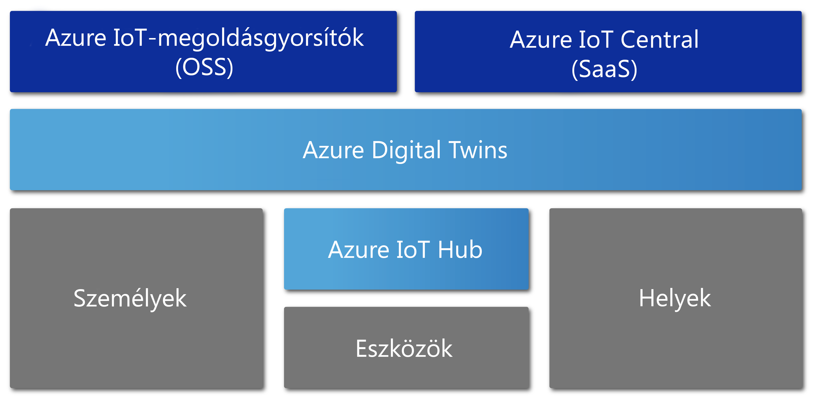

# Az Azure Digital Twins áttekintése

Az Azure Digital Twins egy Azure IoT-szolgáltatás, amellyel a fizikai környezet átfogó modelljei hozhatók létre. A rendszer számos szolgáltatása közül az egyik kiemelkedő a térbeliintelligencia-diagramok létrehozása, amelyekkel a személyek, terek és eszközök közötti kapcsolatok és interakciók modellezhetők.

Az Azure Digital Twins segítségével az adatok egy fizikai területre, és nem számos külön érzékelőre vonatkozóan kérhetők le. A szolgáltatással olyan többször felhasználható, rugalmasan méretezhető, tértudatos élmények hozhatók létre, amelyek összekapcsolják a streamadatokat a digitális és a fizikai világ között. Akár egy gyár karbantartásigényének előre jelzéséről, egy elektromos hálózat valós idejű energiaigényének elemzéséről vagy egy irodában a rendelkezésre álló tér optimalizálásáról van szó, alkalmazásai kibővíthetők ezekkel az egyedi módon releváns környezeti funkciókkal.

Az Azure Digital Twins bármilyen típusú környezetben alkalmazható, például raktárakban, irodákban, iskolákban, kórházakban, bankokban, stadionokban, gyárakban, parkolókban, parkokban, intelligens közműhálózatokban és városokban. Alkalmazási terület lehet például a napi hőmérsékletértékek rögzítése a különböző államokban, a forgalmas drónútvonalak monitorozása, az autonóm járművek azonosítása, egy épület foglaltságának elemzése vagy egy üzlet legnagyobb forgalmú pénztárának azonosítása. Akármi legyen is a valós üzleti forgatókönyv, az Azure Digital Twins segítségével készíthető hozzá megfelelő digitális példány.

Az alábbi videó részletesebben mutatja be a Digital Twins szolgáltatást:

> [!VIDEO https://www.youtube.com/embed/TvN_NxpgyzQ]

## Főbb képességek

Az Azure Digital Twins fő szolgáltatásai:

### Térbeliintelligencia-diagramok

A [*térbeliintelligencia-diagram*](./concepts-objectmodel-spatialgraph.md) vagy *térbeli diagram* a fizikai környezet egy virtuális leképezése, amelynek segítségével modellezhetők a személyek, helyek és eszközök közötti kapcsolatok.

Vegyünk példaként egy intelligens közműalkalmazást, amely több áramfogyasztás-mérőre kapcsolódik a környéken. Az áramfogyasztás pontos monitorozása és előrejelzése érdekében a közműszolgáltatónak mindegyik eszközt és érzékelőt a hellyel és a számlafizető ügyféllel kapcsolatos pontos környezeti adatokkal együtt kell modelleznie. A térbeliintelligencia-diagram segítségével az ilyen típusú összetett kapcsolatok modellezhetők.

### Digitális ikerobjektum-modellek

A [digitális ikerobjektum-modellek](./concepts-objectmodel-spatialgraph.md) előre definiált eszközprotokollok és adatsémák, amelyek segítségével a megoldás tartományspecifikus igényei igazíthatók a fejlesztés gyorsítása és egyszerűsítése érdekében.

Például egy szobafoglaltság-jelző alkalmazás használhat előre definiált tértípusokat: kampusz, épület, emelet, szoba stb.

### Többszörös és beágyazott bérlők

Biztonságosan méretezhető és több bérlőn is újra felhasználható megoldásokat készíthet. Több albérlőt is létrehozhat, amelyeket elkülönített és biztonságos módon érhet el és használhat.

Például egy helykihasználtság-figyelő alkalmazás konfigurálható úgy, hogy elkülönítse a bérlők adatait a többi bérlőtől egy épületen belül, vagy hogy kombinálja egy bérlő adatait több épületre vonatkozóan.

### Fejlett számítási képességek

A fejlett számítási képességekkel vagy más néven [felhasználó által definiált függvényekkel](./concepts-user-defined-functions.md) egyéni függvényeket definiálhat és futtathat a beérkező [eszközadatokon](./concepts-device-ingress.md), és ezek alapján jeleket küldhet az előre definiált végpontokra. Ezzel a képességgel hatékonyabban szabhatók testre és automatizálhatók az eszközfeladatok.

Például egy intelligens mezőgazdasági alkalmazás tartalmazhat egy felhasználó által definiált függvényt a talajnedvesség-érzékelők adatai, valamint az időjárás-előrejelzések kiértékelésére, majd ezek alapján az öntözés igényekkel kapcsolatos jelek küldésére.

### Beépített hozzáférés-vezérlés

A különféle hozzáférés- és az identitáskezelési szolgáltatásokkal (például [szerepköralapú hozzáférés-vezérlés](./security-role-based-access-control.md) és [Azure Active Directory](./security-authenticating-apis.md)) a felhasználók és az eszközök hozzáférése biztonságosan szabályozható.

Például egy létesítménykezelő alkalmazás konfigurálható úgy, hogy az egy adott szobában tartózkodók a hőmérsékletet egy adott tartományban, a létesítménykezelők azonban bármelyik szobában bármilyen értékre állíthassák.

### Ökoszisztéma

Az Azure Digital Twins-példányok számos hatékony Azure-szolgáltatásra csatlakoztathatók, többek közt a következőkre: Azure Stream Analytics, mesterséges intelligencia vagy tárolási szolgáltatások, valamint az Azure Maps, a Microsoft Mixed Reality, a Dynamics 365 vagy az Office 365.

Például egy intelligens irodaépület alkalmazás az Azure Digital Twins segítségével képezheti le az emeleteken lévő csapatokat és eszközöket. Ahogy az eszközök az élő adataikat a kiosztott Digital Twins-példányba streamelik, az Azure Stream Analytics az adatok feldolgozásával a gyakorlatban is használható kulcsmegállapításokat biztosíthat. Ezután az adatok tárolhatók az Azure Storage-ban, és megosztható fájlformátumokba konvertálva a teljes szervezetben terjeszthetők az Office 365 használatával.

## Az Azure Digital Twins előnyeit kihasználó megoldások

Az Azure Digital Twins jól használható a fizikai világ és annak kapcsolatai leképezésére, mivel egyszerűbbé teszi az IoT-modellezést, az adatfeldolgozást, ez eseménykezelést és az eszközök nyomon követését. Vegyük például az alábbi forgatókönyveket a legkülönfélébb iparágakban, ahol a Digital Twins előnyöket biztosíthat:

* Egy adott tér foglaltságadatai változásainak kimutatása az idő során, amelyek alapján az ingatlankezelő vállalat megállapításokat tehet az irodaépület optimális konfigurálásával kapcsolatban.
* Munkajegyek aktiválása egy, a biztonsági őrök beosztását, a takarítási feladatok, valamint az egyéb szolgáltatások ütemezését végző mobilalkalmazásban egy kereskedelmi vagy sportlétesítményben.
* Egy épület helyiségei foglaltságának valós idejű kijelzése a bent tartózkodók számára, majd a munkahelyek lefoglalásának lehetővé tétele.
* Az eszközök helyének nyomon követése egy adott térben.
* Az elektromos járművek töltésének optimalizálása a felhasználói preferenciák és a villamos hálózat korlátainak figyelembe vételével.

## Az Azure Digital Twins más IoT-szolgáltatások kontextusában

Az Azure Digital Twins az Azure IoT Hub segítségével csatlakozik az IoT-eszközökhöz és -érzékelőkhöz, amelyek naprakész adatokat szolgáltatnak a fizikai világról. Az alábbi ábra bemutatja, hogyan viszonyul az Azure Digital Twins a többi Azure IoT-szolgáltatáshoz:

Az IoT-ökoszisztéma többi részének részletes leírásáért lásd az [Azure IoT-technológiákat és -megoldásokat](https://docs.microsoft.com/azure/iot-fundamentals/iot-services-and-technologies) ismertető cikket.

## További lépések

Folytassa az Azure Digital Twins képességeinek rövid bemutatójával:

> [!div class="nextstepaction"]
> [Rövid útmutató: Szabad szobák keresése az Azure Digital Twins segítségével](./quickstart-view-occupancy-dotnet.md)

Egy, az Azure Digital Twinst alkalmazó létesítménykezelési alkalmazás részletes bemutatása:

> [!div class="nextstepaction"]
> [Oktatóanyag: Az Azure Digital Twins üzembe helyezése és egy térbeli diagram konfigurálása](./tutorial-facilities-setup.md)

Az Azure Digital Twins alapvető fogalmainak ismertetése:

> [!div class="nextstepaction"]
> [A Digital Twins-objektummodell és a térbeliintelligencia-diagram ismertetése](./concepts-objectmodel-spatialgraph.md)
