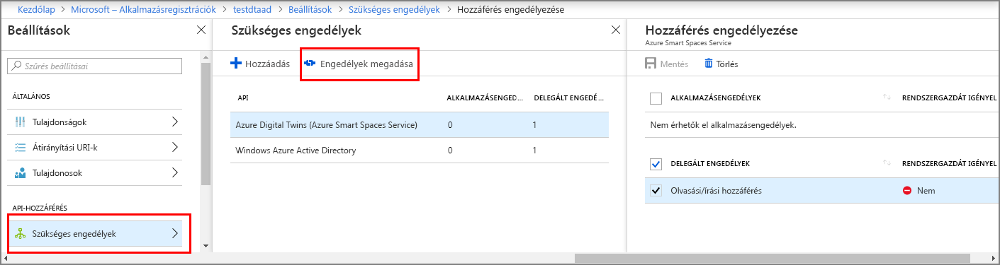

# <a name="how-to-configure-postman-for-azure-digital-twins"></a>Az Azure digitális Twins Postman konfigurálása

Ez a cikk bemutatja, hogyan kezelhetik és az Azure digitális Twins felügyeleti API-k tesztelése a Postman REST-ügyfél konfigurálásához. Pontosabban a ismerteti:

* hogyan konfigurálható az Azure Active Directory-alkalmazás, az OAuth 2.0 típusú implicit engedélyezés folyamat használata.
* A felügyeleti API-k használata a Postman REST-ügyféllel, hogy a jogkivonat hordozó HTTP kérelmeket.
* Hogyan használható a Postman, hogy több részből álló POST kéréseket a felügyeleti API-k.

## <a name="postman-summary"></a>Postman-összefoglaló

Bevezetés az Azure digitális Twins egy REST-ügyféleszköz segítségével [Postman](https://www.getpostman.com/) készítse elő a helyi tesztelési környezetét. A Postman-ügyfél segítségével gyorsan létrehozhat összetett HTTP-kérelmekre. Töltse le a Postman-ügyfél asztali verzióját a [www.getpostman.com/apps](https://www.getpostman.com/apps).

[Postman](https://www.getpostman.com/) REST teszteli, amely megkeresi a legfontosabb HTTP kérés funkciói egy hasznos, asztali és a grafikus felhasználói Felülettel beépülő modul-alapú eszköz. 

A Postman-ügyfélen keresztül megoldások fejlesztők adhatja meg a HTTP-kérelem típusú (*POST*, *első*, *frissítés*, *javítására*, és  *Törlés*), API-végpont meghívására, valamint az SSL használatát. Postman is támogatja a HTTP-kérelmek fejléceinek hozzáadását, paraméterek, űrlapadatokból és szervek.

## <a name="configure-azure-active-directory-to-use-the-oauth-20-implicit-grant-flow"></a>Az Azure Active Directory is használhassa azt az OAuth 2.0 típusú implicit engedélyezés konfigurálása

Az Azure Active Directory-alkalmazások, az OAuth 2.0 típusú implicit engedélyezés folyamat a konfigurálása.

1. Kövesse a [ebben a rövid útmutatóban](https://docs.microsoft.com/azure/active-directory/develop/quickstart-v1-integrate-apps-with-azure-ad) típusú natív Azure AD-alkalmazást létrehozni. Vagy használhat egy meglévő natív alkalmazás regisztrációja.

1. Alatt **szükséges engedélyek**válassza **Hozzáadás** , és adja meg **Azure digitális Twins** alatt **API-hozzáférés hozzáadása**. Ha a keresés nem találja meg az API-t, keressen inkább az **Azure Smart Spaces** kifejezésre. Ezután válassza ki **engedélyek megadása > delegált engedélyek** és **kész**.

    

1. Kattintson a **Manifest** az alkalmazásjegyzékben, az alkalmazás megnyitásához. Állítsa be *oauth2AllowImplicitFlow* való `true`.

      ![Az Azure Active Directory implicit folyamat][1]

1. Konfigurálja a **válasz URL-cím** való `https://www.getpostman.com/oauth2/callback`.

      ![Az Azure Active Directory-válasz URL-címe][2]

1. Másolja ki és tartsa a **Alkalmazásazonosító** az Azure Active Directory-alkalmazás. A következő lépések használatban van.

## <a name="obtain-an-oauth-20-token"></a>Az OAuth 2.0 jogkivonat beszerzése

Ezután állítsa be, és a egy Azure Active Directory-jogkivonat beszerzése Postman konfigurálása. Ezt követően hajtsa végre egy hitelesített HTTP-kérelem Azure digitális Twins beszerzett token használatával:

1. Lépjen a [www.getpostman.com](https://www.getpostman.com/) letölteni az alkalmazást.
1. Ellenőrizze, hogy a **engedélyezési URL-címet** helyes-e. A formátum kell vennie:

    ```plaintext
    https://login.microsoftonline.com/YOUR_AZURE_TENANT.onmicrosoft.com/oauth2/authorize?resource=0b07f429-9f4b-4714-9392-cc5e8e80c8b0
    ```

    | Name (Név)  | Csere erre | Példa |
    |---------|---------|---------|
    | YOUR_AZURE_TENANT | A bérlő vagy a szervezet neve | `microsoft` |

1. Válassza ki a **engedélyezési** lapon jelölje be **OAuth 2.0**, majd válassza ki **új hozzáférési Token letöltése**.

    | Mező  | Érték |
    |---------|---------|
    | Engedélyezési típus | `Implicit` |
    | Visszahívási URL | `https://www.getpostman.com/oauth2/callback` |
    | Hitelesítési URL-cím | Használja a **engedélyezési URL-címet** a 2. lépés |
    | Ügyfél-azonosító | Használja a **Alkalmazásazonosító** létrehozott vagy az előző szakaszban azt egy megváltozott célra az Azure Active Directory-alkalmazás |
    | Hatókör | Hagyja üresen |
    | Állapot | Hagyja üresen |
    | Ügyfél-hitelesítés | `Send as Basic Auth header` |

1. Az ügyfélnek meg kell jelennie mint:

   ![Postman-ügyfél példa][3]

1. Válassza ki **jogkivonat kérelmezéséhez**.

    >[!TIP]
    >Ha a hibaüzenetet kapja, "OAuth 2 nem lehet befejezni a", megpróbálkozhat a következőkkel:
    > * Postman, zárja be és nyissa meg újra, és próbálkozzon újra.
  
1. Görgessen lefelé, és válassza ki **használható jogkivonat**.

<div id="multi"></div>

## <a name="make-a-multipart-post-request"></a>Több részből álló POST kérés

Az előző lépések végrehajtását követően, hogy egy hitelesített többrészes HTTP-POST kérelem Postman konfigurálása:

1. Alatt a **fejléc** lapon maradva adja hozzá egy HTTP-kérelem fejléc kulcs **Content-Type** értékkel `multipart/mixed`.

   ![Tartalom típusa multipart/mixed][4]

1. Nem szöveges adatok szerializálása fájlokba. JSON-adatok JSON-fájlként menti.
1. Alatt a **törzs** lapon maradva adja hozzá az egyes fájlok hozzárendelésével egy **kulcs** név kiválasztása `file` vagy `text`.
1. Ezután válassza ki az egyes fájlok keresztül a **fájl kiválasztása** gombra.

   ![Postman-ügyfél példa][5]

   >[!NOTE]
   > * A Postman-ügyfél nem igényel, rendelkezik-e manuálisan hozzárendelt többrészes adattömbök **Content-Type** vagy **tartalomtípus-szabályozó**.
   > * Nem kell ezeket a fejléceket minden olyan részére.
   > * Ki kell választania `multipart/mixed` vagy egy másik megfelelő **Content-Type** a kérelmet.

1. Végül kattintson a **küldése** a többrészes HTTP POST-kérelmet küldeni.

## <a name="next-steps"></a>További lépések

- A digitális Twins felügyeleti API-k, és a használatukkal kapcsolatos további információkért olvassa el a [digitális Twins Azure felügyeleti API-k használata](how-to-navigate-apis.md).

- Használja a több részből álló kéréseket [blobok hozzáadása az Azure digitális Twins' entitások](./how-to-add-blobs.md).

- Hitelesítés a felügyeleti API-kkal kapcsolatos további információkért olvassa el a [hitelesítés API-kkal](./security-authenticating-apis.md).

<!-- Images -->
[1]: media/how-to-configure-postman/implicit-flow.png
[2]: media/how-to-configure-postman/reply-url.png
[3]: media/how-to-configure-postman/postman-oauth-token.png
[4]: media/how-to-configure-postman/content-type.png
[5]: media/how-to-configure-postman/form-body.png