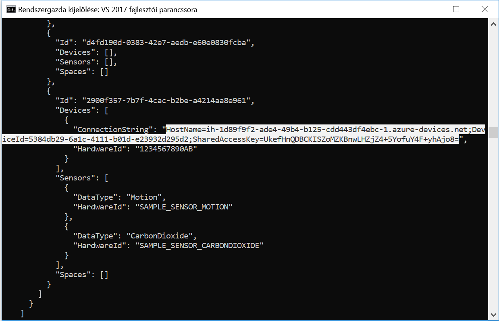
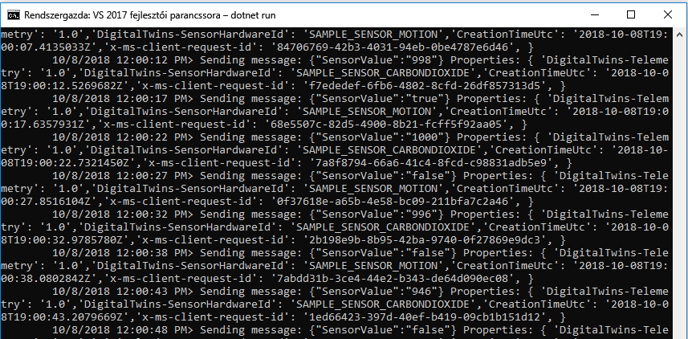
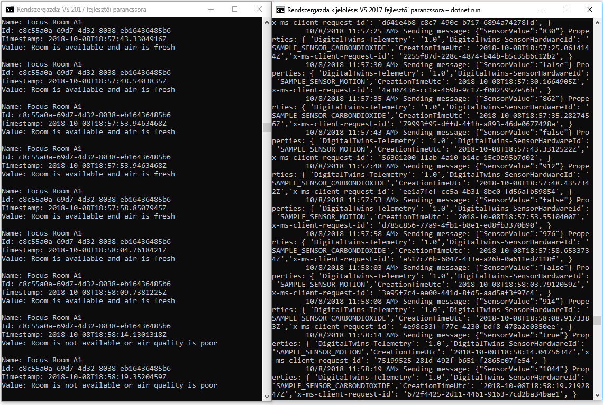

# <a name="quickstart-find-available-rooms-by-using-azure-digital-twins"></a>Gyors útmutató: elérhető szobák keresése az Azure Digital Twins használatával

Az Azure Digital Twins szolgáltatás lehetővé teszi a fizikai környezet digitális rendszerképének újbóli létrehozását. Ezután értesítéseket kaphat a környezetben zajló eseményekről, és testre szabhatja a rájuk adott válaszokat.

Ez a rövid útmutató [a .net-minták egy pár változatát](https://github.com/Azure-Samples/digital-twins-samples-csharp) használja egy képzeletbeli irodaház kialakításához. Bemutatja, hogyan találhat elérhető szobákat az adott épületben. A digitális ikrek segítségével számos érzékelőt társíthat a környezetéhez. Azt is megtudhatja, hogy a rendelkezésre álló helyiség légminősége optimális-e egy szimulált érzékelővel a széndioxid esetében. Az egyik minta alkalmazás véletlenszerű szenzor-adatmennyiséget hoz létre a forgatókönyv megjelenítéséhez.

A következő videó a rövid útmutatóban ismertetett beállítási folyamatot foglalja össze:

>[!VIDEO https://www.youtube.com/embed/1izK266tbMI]

## <a name="prerequisites"></a>Előfeltételek

1. Ha még nem rendelkezik Azure-fiókkal, első lépésként hozzon létre egy [ingyenes fiókot](https://azure.microsoft.com/free/?WT.mc_id=A261C142F).

1. Az ebben a rövid útmutatóban futtatott két konzolos alkalmazást a C#használatával kell megírni. Telepítse a [.net Core SDK 2.1.403 vagy újabb verziót](https://www.microsoft.com/net/download) a fejlesztői gépre. Ha a .NET Core SDK telepítve van, ellenőrizze a jelenlegi verzióját C# a fejlesztői gépen. `dotnet --version` futtatása parancssorból.

1. A [minta C# projekt](https://github.com/Azure-Samples/digital-twins-samples-csharp/archive/master.zip)letöltése. Bontsa ki a Digital-Twins-Samples-csharp-Master. zip archívumot.

## <a name="create-a-digital-twins-instance"></a>Digital Twins-példány létrehozása

A jelen szakaszban ismertetett lépéseket követve hozzon létre egy új digitális Twins-példányt a [portálon](https://portal.azure.com) .

[!INCLUDE [create-digital-twins-portal](../../includes/digital-twins-create-portal.md)]

## <a name="set-permissions-for-your-app"></a>Az alkalmazás engedélyeinek beállítása

Ez a szakasz regisztrálja a Azure Active Directory (Azure AD) alkalmazást, hogy hozzáférhessen a digitális Twins-példányhoz. Ha már rendelkezik Azure AD-alkalmazás-regisztrációval, használja újra a mintához. Győződjön meg arról, hogy az ebben a szakaszban leírt módon van konfigurálva.

[!INCLUDE [digital-twins-permissions](../../includes/digital-twins-permissions.md)]

## <a name="build-application"></a>Az alkalmazás összeállítása

A következő lépések végrehajtásával hozza létre a kihasználtsági alkalmazást.

1. Nyisson meg egy parancssort. Nyissa meg azt a mappát, ahová a `digital-twins-samples-csharp-master.zip` fájlokat kibontotta.
1. Futtassa az `cd occupancy-quickstart/src` parancsot.
1. Futtassa az `dotnet restore` parancsot.
1. Az [appSettings.json](https://github.com/Azure-Samples/digital-twins-samples-csharp/blob/master/occupancy-quickstart/src/appSettings.json) fájlban módosítsa az alábbi változókat:
    - **ClientId**: adja meg az Azure ad-alkalmazás regisztrációs azonosítóját az előző szakaszban leírtak szerint.
    - **Bérlő**: adja meg az Azure ad-bérlő CÍMTÁR-azonosítóját, amelyet az előző szakaszban is fel kell tüntetni.
    - **BaseUrl**: a digitális Twins-példány felügyeleti API URL-címének formátuma `https://yourDigitalTwinsName.yourLocation.azuresmartspaces.net/management/api/v1.0/`. Cserélje le az URL-címben szereplő helyőrzőket az előző szakaszból származó példány értékeire.

    Mentse a módosított fájlt.

## <a name="provision-graph"></a>Diagram kiépítése

Ez a lépés a digitális Twins térbeli gráfot a következővel építi ki:

- Több szóköz.
- Egy eszköz.
- Két érzékelő.
- Egy egyéni függvény.
- Egy szerepkör-hozzárendelés.

A térbeli gráf a [provisionSample. YAML](https://github.com/Azure-Samples/digital-twins-samples-csharp/blob/master/occupancy-quickstart/src/actions/provisionSample.yaml) fájl használatával lett kiépítve.

1. Futtassa az `dotnet run ProvisionSample` parancsot.

    >[!NOTE]
    >Az eszköz bejelentkezési Azure CLI-eszköze a felhasználó Azure AD-beli hitelesítésére szolgál. A felhasználónak egy megadott kódot kell megadnia a hitelesítéshez [a Microsoft bejelentkezési](https://microsoft.com/devicelogin) oldalának használatával. A kód megadása után végezze el a hitelesítés lépéseit. A felhasználónak hitelesítenie kell magát, amikor az eszköz fut.

    >[!TIP]
    > Ha ezt a lépést futtatja, ellenőrizze, hogy a változók megfelelően lettek-e másolva, ha a következő hibaüzenet jelenik meg: `EXIT: Unexpected error: The input is not a valid Base-64 string ...`

1. A kiépítési lépés eltarthat néhány percig. Emellett egy IoT Hub is kiépít a digitális Twins-példányon belül. Ez a ciklus egészen addig, amíg a IoT Hub megjeleníti az állapot =`Running`.

    [](media/quickstart-view-occupancy-dotnet/digital-twins-provision-sample.png#lightbox)

1. A végrehajtás végén másolja az eszköz `ConnectionString` a Device Simulator-mintában való használatra. Csak az ebben a képen vázolt karakterláncot másolja.

    [](media/quickstart-view-occupancy-dotnet/digital-twins-connection-string.png#lightbox)

    >[!TIP]
    > A térbeli gráfot az [Azure Digital Twins Graph Viewer](https://github.com/Azure/azure-digital-twins-graph-viewer)használatával tekintheti meg és módosíthatja.

A konzol ablakát később is megnyitva használhatja.

## <a name="send-sensor-data"></a>Érzékelőadatok küldése

Az alábbi lépéseket követve hozza létre és futtassa az Sensor Simulator eszköz alkalmazást.

1. Nyisson meg egy új parancssort. Lépjen a `digital-twins-samples-csharp-master` mappában letöltött projekthez.
1. Futtassa az `cd device-connectivity` parancsot.
1. Futtassa az `dotnet restore` parancsot.
1. Szerkessze a [appSettings. JSON](https://github.com/Azure-Samples/digital-twins-samples-csharp/blob/master/device-connectivity/appsettings.json) fájlt a **DeviceConnectionString** frissítéséhez az előző `ConnectionString`. Mentse a módosított fájlt.
1. `dotnet run` futtatása az érzékelői adatok küldésének megkezdéséhez. A rendszer a következő képen látható módon küldi el az Azure digitális Twins-nek.

     [](media/quickstart-view-occupancy-dotnet/digital-twins-device-connectivity.png#lightbox)

1. Futtassa ezt a szimulátort úgy, hogy a következő lépés művelettel megtekintheti az eredményeket egymás mellett. Ebben az ablakban láthatók a digitális ikreknek elküldett szimulált érzékelő-adathalmazok. A következő lépés valós időben kérdezi le a rendelkezésre álló szobákat a friss levegővel.

    >[!TIP]
    > Ha ezt a lépést futtatja, győződjön meg arról, hogy a `DeviceConnectionString` megfelelően lett másolva, ha a következő hibaüzenet jelenik meg: `EXIT: Unexpected error: The input is not a valid Base-64 string ...`

## <a name="find-available-spaces-with-fresh-air"></a>Friss levegővel rendelkező szabad szobák keresése

Az érzékelő minta szimulálja a két érzékelő véletlenszerű adatértékeit. A mozgásuk és a szén-dioxid. A friss levegővel rendelkező elérhető szóközök a mintában nem jelennek meg a helyiségben. Ezeket a 1 000 ppm-es szén-dioxid-szint is meghatározza. Ha a feltétel nem teljesül, a terület nem érhető el, vagy gyenge a levegőminőség.

1. Nyissa meg a parancssort, amelyet korábban a kiépítési lépés futtatásához használt.
1. Futtassa az `dotnet run GetAvailableAndFreshSpaces` parancsot.
1. Tekintse meg a parancssort és az Sensor-adat parancssort egymás mellett.

    Az érzékelő adatkérési parancssora öt másodpercenként szimulált mozgást és széndioxid-adatokat küld a digitális ikreknek. A másik parancssor valós időben beolvassa a diagramot, hogy a véletlenszerűen szimulált adatokat tartalmazó, friss levegővel rendelkező szobákból kiderítse a rendelkezésre álló szobákat. A következő feltételek egyikét jeleníti meg közel valós időben az utolsó elküldett érzékelő-információk alapján:
   - `Room is available and air is fresh`
   - `Room is not available or air quality is poor`

     [](media/quickstart-view-occupancy-dotnet/digital-twins-get-available.png#lightbox)

Ha meg szeretné tudni, hogy mi történt ebben a rövid útmutatóban, és milyen API-kat hívott meg, nyissa meg a [Visual Studio Code](https://code.visualstudio.com/Download) -ot a `digital-twins-samples-csharp`címen található Code Workspace- Használja az alábbi parancsot:

```cmd
<path>\occupancy-quickstart\src>code ..\..\digital-twins-samples.code-workspace
```

Az oktatóanyagok mélyebbre kerülnek a kódban. Megtanítják, hogyan módosíthatják a konfigurációs és az API-kat. A felügyeleti API-kkal kapcsolatos további információkért lépjen a digitális Twins hencegő oldalra:

```URL
https://YOUR_INSTANCE_NAME.YOUR_LOCATION.azuresmartspaces.net/management/swagger
```

| Név | Csere erre |
| --- | --- |
| YOUR_INSTANCE_NAME | A digitális Twins-példány neve |
| YOUR_LOCATION | Az a kiszolgáló régiója, ahol a példánya üzemeltetve van |

Vagy a kényelemért keresse meg a [digitális ikrek hencegő](https://docs.westcentralus.azuresmartspaces.net/management/swagger)elemét.

## <a name="clean-up-resources"></a>Az erőforrások eltávolítása

Az oktatóanyagok részletesen ismertetik a következőket:

- Hozzon létre egy alkalmazást a létesítmény-kezelők számára az utasok termelékenységének növelése érdekében.
- Hatékonyabban dolgozhat az épületben.

Az oktatóanyagokhoz való továbblépéshez ne törölje az ebben a rövid útmutatóban létrehozott erőforrásokat. Ha nem folytatja a folytatást, törölje az ebben a rövid útmutatóban létrehozott összes erőforrást.

1. Törölje a minta tárház letöltésekor létrehozott mappát.
1. A [Azure Portal](https://portal.azure.com)bal oldali menüjében válassza az **összes erőforrás**lehetőséget. Ezután válassza ki a digitális Twins-erőforrást. A **minden erőforrás** ablaktábla tetején válassza a **Törlés**lehetőséget.

    > [!TIP]
    > Ha korábban már problémát észlelt a digitális Twins-példány törlése során, a rendszer a javítást a javítással együtt kivezette. Próbálkozzon újra a példány törlésével.

## <a name="next-steps"></a>Következő lépések

Ez a rövid útmutató egy egyszerű forgatókönyvet és egy példaként szolgáló alkalmazást használt, amely bemutatja, hogyan használhatók a digitális ikrek a megfelelő munkafeltételekkel rendelkező szobák megtalálására. A forgatókönyv részletes elemzéséhez olvassa el ezt az oktatóanyagot:

>[!div class="nextstepaction"]
>[Oktatóanyag: Az Azure Digital Twins üzembe helyezése és egy térbeli diagram konfigurálása](tutorial-facilities-setup.md)
