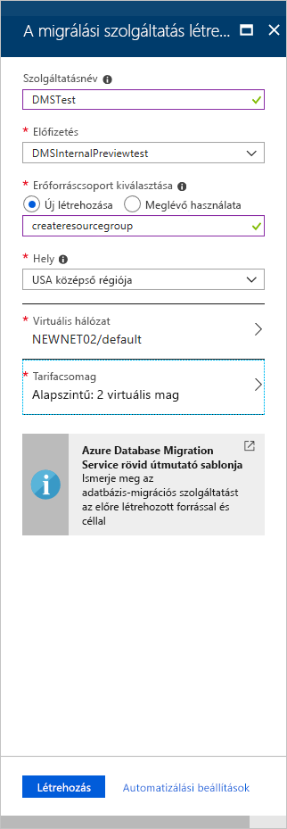

# Gyors útmutató: Az Azure Portallal létrehozhat egy Azure Database Migration Service-példányt.
Ebben a rövid útmutatóban az Azure Portal használatával létrehozhat egy Azure Database Migration Service-példányt.  A szolgáltatás létrehozása után a használatával a helyi SQL Serverből migrálhat adatokat egy Azure SQL-adatbázisba.

Ha nem rendelkezik Azure-előfizetéssel, első lépésként mindössze néhány perc alatt létrehozhat egy [ingyenes](https://azure.microsoft.com/free/) fiókot.

## Bejelentkezés az Azure Portalra
Nyissa meg a webböngészőjét, keresse fel a [Microsoft Azure Portalt](https://portal.azure.com/), majd adja meg a hitelesítő adatait a Portalra való bejelentkezéshez.

Az alapértelmezett nézet a szolgáltatási irányítópult.

## Az erőforrás-szolgáltató regisztrálása
A Database Migration Service első példányának létrehozása előtt regisztrálja a Microsoft.DataMigration erőforrás-szolgáltatót.

1. Az Azure Portalon válassza a **Minden szolgáltatás** **Előfizetések** elemét.

2. Válassza ki azt az előfizetést, amelyen az Azure Database Migration Service példányát létre szeretné hozni, majd válassza az **Erőforrás-szolgáltatók** elemet.

3. Keressen a „migration” kifejezésre, majd a **Microsoft.DataMigration** jobb oldalán válassza a **Regisztrálás** elemet.

    

## A szolgáltatás egy példányának létrehozása
1. Válassza az **+ Erőforrás létrehozása** elemet az Azure Database Migration Service egy példányának létrehozásához.

2. A piactéren keressen a „migration” kifejezésre, válassza ki az **Azure Database Migration Service** elemet, majd az **Azure Database Migration Service** képernyőn válassza a **Létrehozás** parancsot.

3. A **Migrálási szolgáltatás létrehozása** képernyőn: 

    - Válasszon ki egy olyan **Szolgáltatásnevet**, amelyet könnyen meg tud jegyezni, és alkalmas az Azure Database Migration Service-példány egyedi azonosítására.
    - Válassza ki azt az **Azure-előfizetést**, amelyben a példányt létre szeretné hozni.
    - Válasszon ki egy meglévő **erőforráscsoportot**, vagy hozzon létre egy újat.
    - Válassza ki a forráshoz vagy a célkiszolgálóhoz legközelebb eső **Helyet**.
    - Válasszon ki egy meglévő **virtuális hálózatot** (VNET), vagy hozzon létre egy újat.

        A VNET biztosítja az Azure Database Migration Service számára a forrásadatbázishoz és a célkörnyezethez való hozzáférést.

        További információt a virtuális hálózatok az Azure Portallal történő létrehozásáról a [virtuális hálózatok Azure Portallal történő létrehozását](https://aka.ms/vnet) ismertető cikkben talál.

    - Válassza az alapszintű: az 1 virtuális mag a **tarifacsomag**.

        

4. Kattintson a **Létrehozás** gombra.

    Pár pillanat múlva létrejön a használatra kész Azure Database Migration Service-példány. A Database Migration Service a következő képen látható módon jelenik meg:

    

## Az erőforrások eltávolítása
A rövid útmutató során létrehozott erőforrásokat az [Azure-erőforráscsoport](../azure-resource-manager/resource-group-overview.md) törlésével távolíthatja el. Az erőforráscsoport törléséhez keresse meg a létrehozott Azure Database Migration Service-példányt. Válassza ki az **Erőforráscsoport** nevét, majd válassza az **Erőforráscsoport törlése** elemet. A művelettel az erőforráscsoport összes elemét és magát a csoportot is törli.

## További lépések
> [!div class="nextstepaction"]
> [Helyi SQL Server migrálása az Azure SQL Database-be](tutorial-sql-server-to-azure-sql.md)