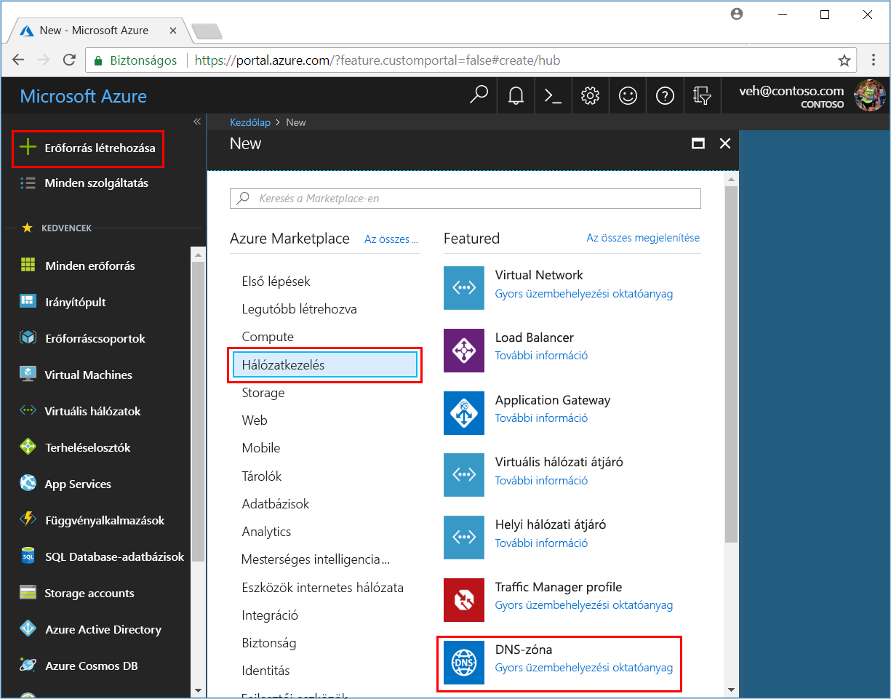
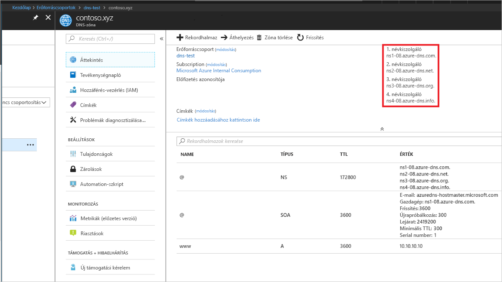

# Bevezetés az Azure DNS Azure Portallal való használatába

> [!div class="op_single_selector"]
> * [Azure Portal](dns-getstarted-portal.md)
> * [PowerShell](dns-getstarted-powershell.md)
> * [Azure CLI 1.0](dns-getstarted-cli-nodejs.md)
> * [Azure CLI 2.0](dns-getstarted-cli.md)

Ez a cikk végigvezeti az első DNS-zóna és -rekord létrehozásának lépésein az Azure Portalon. Ezek a lépések az Azure PowerShell-lel vagy a platformfüggetlen Azure CLI-vel is elvégezhetőek.

Az egyes tartományokhoz tartozó DNS-rekordok üzemeltetése DNS-zónákban történik. A tartománya Azure DNS-ben való üzemeltetésének megkezdéséhez létre kell hoznia egy DNS-zónát az adott tartománynévhez. Ezután a tartománya összes DNS-rekordja ebben a DNS-zónában jön létre. Végül a DNS-zóna interneten való közzétételéhez konfigurálnia kell a tartomány névkiszolgálóit. Az egyes lépéseket az alábbiakban ismertetjük.

## DNS-zóna létrehozása

1. Jelentkezzen be az Azure Portalra
2. A központi menüben kattintson az **Új > Hálózatkezelés >** elemre, majd kattintson a **DNS-zóna** elemre a DNS-zóna létrehozása panel megnyitásához.

    

4. A **DNS-zóna létrehozása** panelen nevezze el a DNS-zónát. Például adja meg a *contoso.com* nevet.
 
    

5. Ezután adja meg a használni kívánt erőforráscsoportot. Létrehozhat egy új erőforráscsoportot, vagy kiválaszthat egy meglévőt. Ha új erőforráscsoport létrehozását választja, a **Hely** legördülő listában adja meg az erőforráscsoport helyét. Vegye figyelembe, hogy ez a beállítás az erőforráscsoport helyére vonatkozik, és nincs hatással a DNS-zónára. A DNS-zóna helye mindig „globális”, és nem jelenik meg.

6. A **Rögzítés az irányítópulton** jelölőnégyzetet bejelölve hagyhatja, ha könnyedén meg szeretné találni az új zónát az irányítópulton. Ezt követően kattintson a **Create** (Létrehozás) gombra.

    

7. Miután a Létrehozás gombra kattint, láthatja az új zóna konfigurálását az irányítópulton.

    

8. Amikor létrejött az új zóna, a hozzá tartozó panel megnyílik az irányítópulton.

## DNS-rekord létrehozása

A következő példa végigvezeti egy új „A” rekord létrehozásának folyamatán. Más rekordtípusok és meglévő rekordok módosítása esetén lásd [a DNS-rekordok és -rekordhalmazok az Azure Portallal való kezelésével kapcsolatos](dns-operations-recordsets-portal.md) témakört. 

1. A **DNS-zóna** panel tetején válassza a **+ Rekordhalmaz** elemet a **Rekordhalmaz hozzáadása** panel megnyitásához.

    

4. A **Rekordhalmaz hozzáadása** panelen nevezze el a rekordhalmazt. Például adja neki a „**www**” nevet.

    

5. Válassza ki a létrehozni kívánt rekord típusát. Ehhez a példához válassza az **A** típust.
6. Állítsa be az **élettartamot**. Az alapértelmezett élettartam egy óra.
7. Adja hozzá a rekord IP-címét.
8. Válassza a panel alján található **OK** gombot a DNS-rekord létrehozásához.

## A rekordok megtekintése

A DNS-zóna panel alsó részén láthatja a DNS-zóna rekordjait. Meg kell jelennie az alapértelmezett NS és SOA típusú rekordoknak, amelyek minden zónában létrejönnek, valamint az összes új létrehozott rekordnak.

## A névkiszolgálók frissítése

Ha a DNS-zóna és -rekordok megfelelően be lettek állítva, konfigurálnia kell a tartománynevet az Azure DNS-névkiszolgálók használatára. Így más internetes felhasználók megkereshetik a DNS-rekordjait.

A zóna névkiszolgálói az Azure Portalon vannak megadva:

Ezeket a névkiszolgálókat a tartományregisztrálóhoz kell konfigurálni (ahol a tartománynevet vásárolta). A regisztráló felajánlja, hogy beállítja a névkiszolgálókat a tartományhoz. További információért lásd: [Tartomány delegálása az Azure DNS-be](dns-domain-delegation.md).

## Következő lépések

Az Azure DNS-sel kapcsolatos további információért lásd [az Azure DNS áttekintését biztosító](dns-overview.md) cikket.

Az Azure DNS-ben a DNS-rekordok kezelésével kapcsolatos további információért lásd [a DNS-rekordok és -rekordhalmazok az Azure Portallal való kezelésével kapcsolatos](dns-operations-recordsets-portal.md) témakört.

