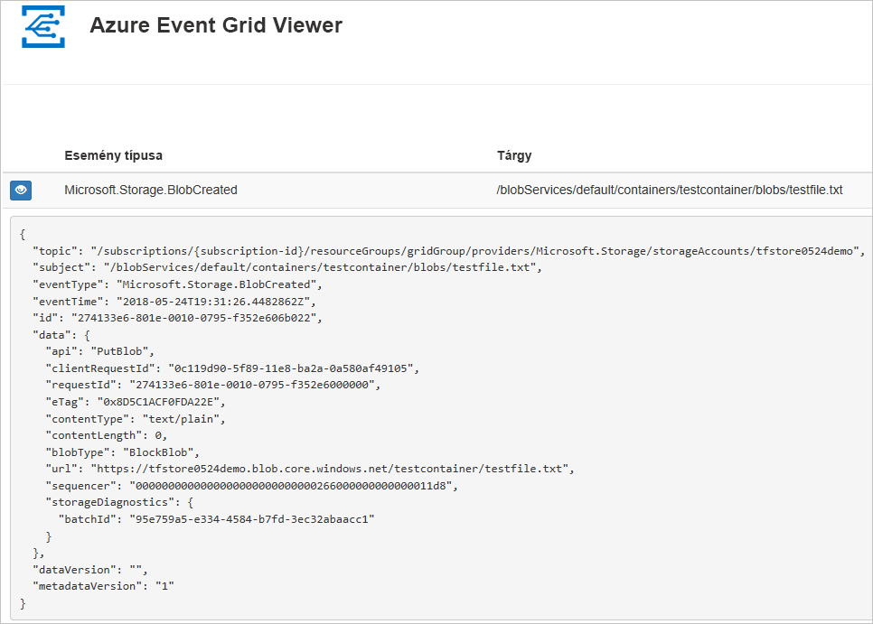
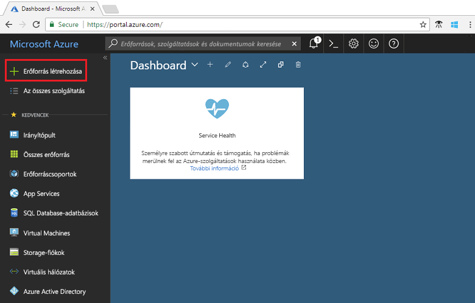
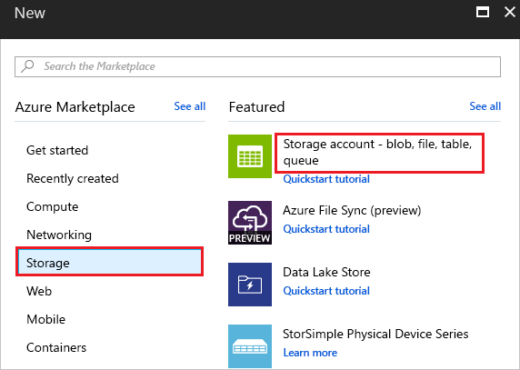
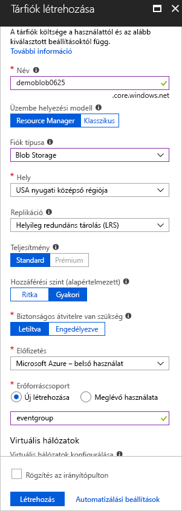
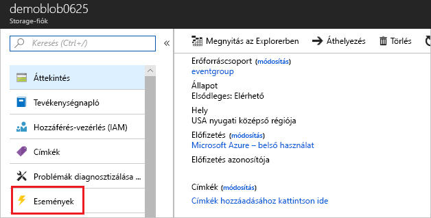
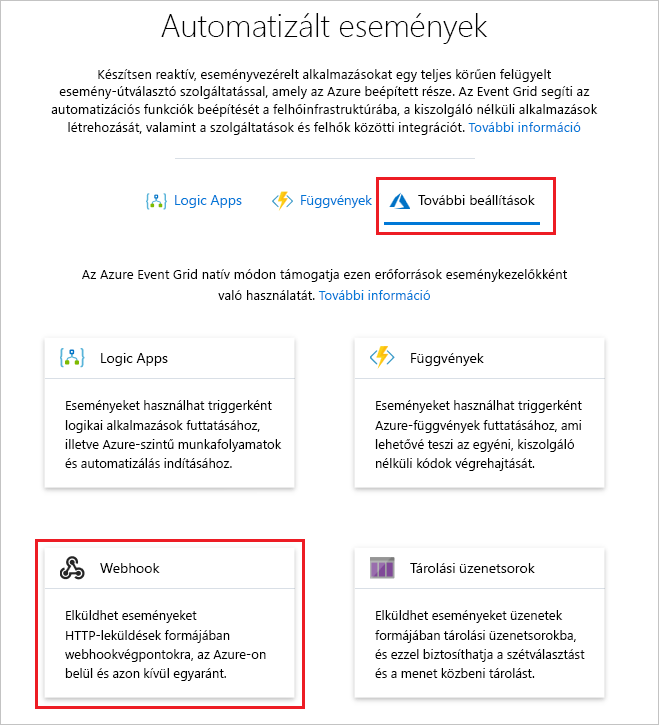
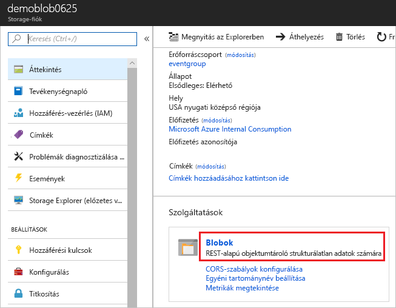
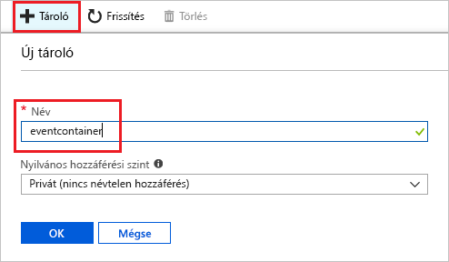
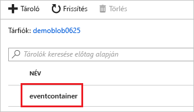
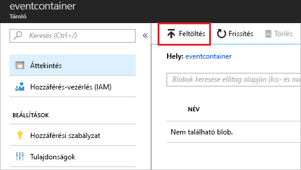

# <a name="create-and-route-blob-storage-events-with-the-azure-portal-and-event-grid"></a>Blob Storage-események létrehozása és átirányítása az Azure Portal és az Event Grid segítségével

Az Azure Event Grid egy felhőalapú eseménykezelési szolgáltatás. Ebben a cikkben létrehoz egy Blob Storage-fiókot az Azure Portallal, feliratkozik a Blob Storage-hoz tartozó eseményekre, és aktivál egy eseményt az eredmény megtekintéséhez. Általában olyan végpontoknak szoktunk eseményeket küldeni, amelyek eseményadatokat dolgoznak fel és műveleteket hajtanak végre. A cikk egyszerűsítése érdekében azonban az eseményeket egy olyan webalkalmazásnak küldjük el, amely az üzenetek gyűjtésével és megjelenítésével foglalkozik.

[!INCLUDE [quickstarts-free-trial-note.md](../../includes/quickstarts-free-trial-note.md)]

A folyamat végén látni fogja, hogy a rendszer elküldte az eseményadatokat a webalkalmazásnak.



## <a name="create-a-storage-account"></a>Tárfiók létrehozása

A Blob Storage-események használatához szüksége lesz vagy egy [Blob Storage-fiókra](../storage/common/storage-create-storage-account.md?toc=%2fazure%2fstorage%2fblobs%2ftoc.json#blob-storage-accounts), vagy egy [General Purpose v2-tárfiókra](../storage/common/storage-account-options.md#general-purpose-v2). Az általános célú **General Purpose v2- (GPv2-)** fiókok olyan tárfiókok, amelyek a Storage-szolgáltatások összes funkcióját támogatják, beleértve a blobokat, a fájlokat, az üzenetsorokat és a táblákat is. A **Blob Storage-fiók** egy speciális tárfiók a strukturálatlan adatok blobként (objektumként) való tárolására az Azure Storage-ban. A Blob Storage-fiókok olyanok, mint a meglévő általános célú tárfiókjai, és a jelenlegi rendszereivel megegyező szintű tartósságot, rendelkezésre állást, méretezhetőséget és teljesítményt nyújtanak, beleértve a 100%-os API-konzisztenciát a blokkblobokhoz és a hozzáfűző blobokhoz. A csak blokkok és hozzáfűző blobok tárolását igénylő alkalmazásokhoz javasoljuk a Blob Storage-fiókok használatát. 

1. Jelentkezzen be az [Azure portálra](https://portal.azure.com/).

1. Blob Storage létrehozásához kattintson az **Erőforrás létrehozása** elemre. 

   

1. A **Storage** elemet kiválasztva szűrje az elérhető lehetőségeket, majd válassza a **Storage-fiók – blob, fájl, táblázat, üzenetsor** lehetőséget.

   

1. Adja meg a Blob Storage értékeit, beleértve a fiók egyedi nevét. Fióktípusként válassza a **Blob Storage** lehetőséget. Helyként válassza az egyik Event Gridet támogató [helyet](overview.md). Miután végzett az értékek megadásával, válassza a **Létrehozás** lehetőséget.

   

## <a name="create-a-message-endpoint"></a>Üzenetvégpont létrehozása

A Blob Storage-eseményekre való feliratkozás előtt hozzuk létre az eseményüzenet végpontját. A végpont általában az eseményadatok alapján hajt végre műveleteket. Az útmutató egyszerűsítése érdekében egy olyan [előre létrehozott webalkalmazást](https://github.com/dbarkol/azure-event-grid-viewer) helyezünk üzembe, amely megjeleníti az esemény üzeneteit. Az üzembe helyezett megoldás egy App Service-csomagot, egy App Service-webalkalmazást és egy, a GitHubról származó forráskódot tartalmaz.

1. A megoldásnak az előfizetésébe való telepítéséhez válassza az **Üzembe helyezés az Azure-ban** lehetőséget. Az Azure Portalon adjon meg értékeket a paraméterekhez.

   <a href="https://portal.azure.com/#create/Microsoft.Template/uri/https%3A%2F%2Fraw.githubusercontent.com%2Fdbarkol%2Fazure-event-grid-viewer%2Fmaster%2Fazuredeploy.json" target="_blank"></a>

1. Az üzembe helyezés befejezése eltarthat néhány percig. A sikeres üzembe helyezést követően tekintse meg a webalkalmazást, hogy meggyőződjön annak működéséről. Egy webböngészőben navigáljon a következő helyre: `https://<your-site-name>.azurewebsites.net`.

1. A hely látható, de még nem lett közzétéve esemény.

   

[!INCLUDE [event-grid-register-provider-portal.md](../../includes/event-grid-register-provider-portal.md)]

## <a name="subscribe-to-the-blob-storage"></a>Feliratkozás a Blob Storage-ra

A témakörre való feliratkozással lehet tudatni az Event Griddel, hogy mely eseményeket kívánja nyomon követni, és hová szeretné küldeni az eseményeket.

1. A portálon válassza ki a Blob Storage-fiókját, és válassza az **Események** lehetőséget.

   

1. Ha eseményeket szeretne küldeni a megjelenítő alkalmazásba, használjon egy webhookot a végponthoz. Válassza a **További beállítások**, majd a **Webhook** elemet.

   

1. Az esemény-előfizetés előre ki van töltve a Blob Storage-fiókjához tartozó értékekkel. A webhook végponthoz adja meg a webalkalmazás URL-címét, és adja hozzá az `api/updates` elemet a kezdőlap URL-címéhez. Nevezze el az előfizetését. Ha elkészült, válassza a **Létrehozás** lehetőséget.

   

1. Tekints meg újra a webalkalmazást, ahol láthatja, hogy az fogadta az előfizetés érvényesítési eseményét. Az eseményadatok kibontásához kattintson a szem ikonra. Az Event Grid elküldi az érvényesítési eseményt, így a végpont megerősítheti, hogy eseményadatokat akar kapni. A webalkalmazás az előfizetés érvényesítéséhez szükséges kódot tartalmaz.

   

Most aktiváljunk egy eseményt, és lássuk, hogyan küldi el az üzenetet az Event Grid a végpontnak.

## <a name="send-an-event-to-your-endpoint"></a>Esemény elküldése a végpontra

A Blob Storage-hoz egy eseményt egy fájl feltöltésével aktiválhat. A fájlnak nem kell tartalommal rendelkeznie. A cikkek feltételezik, hogy van egy testfile.txt fájlja, de bármilyen fájlt használhat.

1. A Blob Storage-nál válassza a **Blobok** elemet.

   

1. Válassza a **+ Tároló** lehetőséget. Nevezze el a tárolót, és használja valamelyik hozzáférési szintet.

   

1. Válassza ki az új tárolót.

   

1. Fájl feltöltéséhez válassza a **Feltöltés** lehetőséget.

   

1. Keresse meg tallózással a tesztfájlt, és töltse fel.

1. Ön kiváltotta az eseményt, az Event Grid pedig elküldte az üzenetet a feliratkozáskor konfigurált végpontnak. Tekintse meg a webalkalmazását, és észreveheti, hogy az fogadott egy blob által létrehozott eseményt. 

  ```json
  {
    "topic": "/subscriptions/{subscription-id}/resourceGroups/eventgroup/providers/Microsoft.Storage/storageAccounts/demoblob0625",
    "subject": "/blobServices/default/containers/eventcontainer/blobs/testfile.txt",
    "eventType": "Microsoft.Storage.BlobCreated",
    "eventTime": "2018-06-25T22:50:41.1823131Z",
    "id": "89a2f9da-c01e-00bb-13d6-0c599506e4e3",
    "data": {
      "api": "PutBlockList",
      "clientRequestId": "41341a9b-e977-4a91-9000-c64125039047",
      "requestId": "89a2f9da-c01e-00bb-13d6-0c5995000000",
      "eTag": "0x8D5DAEE13C8F9ED",
      "contentType": "text/plain",
      "contentLength": 4,
      "blobType": "BlockBlob",
      "url": "https://demoblob0625.blob.core.windows.net/eventcontainer/testfile.txt",
      "sequencer": "00000000000000000000000000001C24000000000004712b",
      "storageDiagnostics": {
        "batchId": "ef633252-32fd-464b-8f5a-0d10d68885e6"
      }
    },
    "dataVersion": "",
    "metadataVersion": "1"
  }
  ```

## <a name="clean-up-resources"></a>Az erőforrások eltávolítása

Ha tovább kívánja használni az eseményt, akkor ne törölje a cikkben létrehozott erőforrásokat. Ellenkező esetben törölje a cikkben létrehozott erőforrásokat.

Válassza ki az erőforráscsoportot, majd válassza az **Erőforráscsoport törlése** elemet.

## <a name="next-steps"></a>További lépések

Most, hogy megismerte, hogyan hozhat létre egyéni témaköröket és esemény-előfizetéseket, bővebben is tájékozódhat arról, hogy miben nyújthat segítséget az Event Grid:

- [Bevezetés az Event Grid használatába](overview.md)
- [Azure Blob Storage-események átirányítása egyéni webes végpontra](../storage/blobs/storage-blob-event-quickstart.md?toc=%2fazure%2fevent-grid%2ftoc.json)
- [Virtuális gépek módosításainak monitorozása az Azure Event Grid és a Logic Apps segítségével](monitor-virtual-machine-changes-event-grid-logic-app.md)
- [Big Data típusú adatok streamelése adattárházba](event-grid-event-hubs-integration.md)
