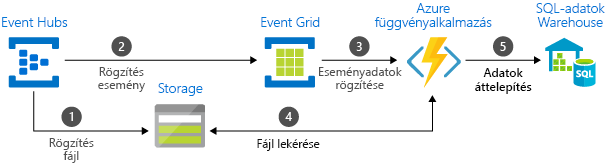

# Válassza ki az Azure üzenetkezelési szolgáltatások – Event Grid, az Event Hubs és a Service Bus közötti

Az Azure három olyan szolgáltatást kínál, amely segít kézbesíteni az események üzeneteit egy teljes megoldásban. Ezek a szolgáltatások a következők:

* [Event Grid](/azure/event-grid/)
* [Event Hubs](/azure/event-hubs/)
* [Szolgáltatásbusz](/azure/service-bus-messaging/)

Annak ellenére, hogy valamelyest hasonlítanak egymásra, minden szolgáltatás adott forgatókönyvekhez készült. Ez a cikk a szolgáltatások közötti különbséget ismerteti, és segít az alkalmazásához megfelelő szolgáltatás kiválasztásában. Az üzenetkezelési szolgáltatások sok esetben kiegészítik egymást és együtt használhatók.

## Az esemény- és üzenetszolgáltatások összehasonlítása

Az eseményeket továbbító és az üzeneteket továbbító szolgáltatások között van egy fontos különbség.

### Esemény

Az események egy állapotról vagy állapotváltozásról szóló, kis méretű értesítések. Az esemény közzétevőjének nincsenek elvárásai az esemény kezelésével kapcsolatban. Az esemény fogyasztója dönti el, hogy mit tesz az értesítéssel. Az események lehetnek különálló egységek vagy egy sorozat részei.

A különálló események az állapotváltozást jelentik, és műveletindításra lehet használni őket. A következő lépéshez a fogyasztónak csak azt kell tudnia, hogy valami történt. Az eseményadatok arra vonatkozó információt tartalmaznak, hogy mi történt, de nem tartalmazzák az eseményt kiváltó adatokat. Egy esemény például arról értesíti a fogyasztót, hogy létrejött egy fájl. Tartalmazhatja a fájl általános információit, de maga a fájl nem szerepel benne. Különálló események ideális megoldást jelentenek [kiszolgáló nélküli](http://azure.com/serverless) megoldásokat, amelyek szeretné méretezni.

A sorozatesemények állapotot jelentenek és elemezhetők. Az események időrendi sorrendben vannak és egymáshoz kapcsolódnak. A fogyasztónak az események sorba állított sorozatára van szüksége a történtek elemzéséhez.

### Üzenet

Az üzenetek felhasználható vagy máshol tárolható nyers adatok, amelyeket szolgáltatások hoznak létre. Az üzenet tartalmazza az üzenetfolyamatot kiváltó adatokat. Az üzenet közzétevőjének elvárásai vannak azzal kapcsolatban, hogy a fogyasztó hogyan kezeli az üzenetet. A két oldal között egy szerződés áll fenn. Például a közzétevő elküldi a nyers adatokat tartalmazó üzenetet, és azt várja el a fogyasztótól, hogy létrehozzon egy fájlt az adatokból, majd választ küldjön, amikor elkészült.

## A szolgáltatások összehasonlítása

| Szolgáltatás | Cél | Típus | A következő esetekben használja |
| ------- | ------- | ---- | ----------- |
| Event Grid | Reaktív programozás | Események terjesztése (különálló) | Állapotváltozásokra való reakció |
| Event Hubs | Big data folyamat | Eseménystreamelés (sorozat) | Telemetria és elosztott adatok streamelése |
| Service Bus | Nagy értékű vállalati üzenetkezelés | Üzenet | Rendelésfeldolgozás és pénzügyi tranzakciók |

### Event Grid

Az Event Grid egy háttérbeli eseménykezelési sík, amely lehetővé teszi az eseményvezérelt, reaktív programozást. Az Event Grid közzétételi-feliratkozási modellt használ. A közzétevők eseményeket bocsátanak ki, de nincsenek elvárásaik az események kezelését illetően. Az előfizetők döntik el, hogy melyik eseményeket kívánják kezelni.

Az Event Grid nagymértékben integrálva van az Azure-szolgáltatásokkal, és külső szolgáltatásokkal is integrálható. Egyszerűsíti az eseményfelhasználást és csökkenti a költségeket, mivel szükségtelenné teszi az állandó lekérdezést. Az Event Grid hatékonyan és megbízhatóan irányítja át az eseményeket az Azure-beli azon kívüli erőforrásokról. Az eseményeket elosztja a regisztrált előfizetői végpontok között. Az eseményüzenet tartalmazza azokat az információkat, amelyekre szüksége van, hogy reagálhasson a szolgáltatások és alkalmazások változásaira. Az Event Grid nem adatfolyamat, és nem kézbesíti magát a frissített objektumot.

Event Grid-események, amelyek nem lett elküldve a végpont kézbesítetlen levelek kezelése támogatja.

A következő jellemzőkkel rendelkezik:

* dinamikusan skálázható
* alacsony költség
* kiszolgáló nélküli
* legalább egyszeri kézbesítés

### Event Hubs

Az Azure Event Hubs egy big data folyamat. Megkönnyíti a telemetria- és az eseménystream-adatok rögzítését, megőrzését és visszajátszását. Az adatok számos párhuzamos forrásból származhatnak. Az Event Hubs lehetővé teszi, hogy a telemetriaadatok és az eseményadatok elérhetők legyenek különböző streamfeldolgozó infrastruktúrák és elemzési szolgáltatások számára. Elérhető adatstreamként vagy kötegelt eseménykötegként. Ez a szolgáltatás olyan megoldást biztosít, amellyel az adatok gyorsan lekérhetők valós idejű feldolgozáshoz, a tárolt nyers adatok pedig többször visszajátszhatók. Képes a streamelési adatok fájlba való rögzítésére feldolgozás és elemzés céljából.

A következő jellemzőkkel rendelkezik:

* kis késés
* másodpercenként több millió esemény fogadása és feldolgozása
* legalább egyszeri kézbesítés

### Service Bus

A Service Bus hagyományos vállalati alkalmazásokhoz készült. Ezek a vállalati alkalmazások tranzakciókat, rendezést, ismétlődésészlelést és azonnali konzisztenciát igényelnek. A Service Bus lehetővé teszi, hogy a natív felhőalkalmazások megbízható állapotváltás-kezelést biztosítsanak az üzleti folyamatokhoz. A nagy értékű üzenetek kezeléséhez, amelyek nem veszhetnek el és nem duplikálhatók, használja az Azure Service Bust. A Service Bus rendkívül biztonságos kommunikációt biztosít a hibrid felhőalapú megoldások között, és a meglévő helyszíni rendszereket felhőalapú megoldásokhoz való csatlakoztatására is használható.

A Service Bus egy közvetítőalapú üzenettovábbítási rendszer. Megbízhatóan tárolja az üzeneteket egy közvetítőben (például várólistán), amíg a fogyasztó fél készen nem áll a fogadásukra.

A következő jellemzőkkel rendelkezik:

* megbízható aszinkron üzenetkézbesítés (vállalati üzenetkezelés mint szolgáltatás), amelyhez lekérdezés szükséges
* speciális üzenetkezelési szolgáltatások, például: FIFO, kötegelés/munkamenetek, tranzakciók, kézbesíthetetlen levelek kezelése, historikus vezérlés, útválasztás és szűrés, ismétlődésészlelés
* legalább egyszeri kézbesítés
* opcionális, érkezési sorrendben történő kézbesítés

## A szolgáltatások együttes használata

Bizonyos esetekben a szolgáltatásokat párhuzamosan is használhatja adott szerepkörök betöltésére. Például egy elektronikus kereskedelmi webhely a Service Busszal feldolgozhatja a rendeléseket, az Event Hubs használatával rögzítheti a webhely telemetriaadatait, az Event Griddel pedig válaszolhat az eseményekre (például a termék kiszállítására).

Más esetekben összekapcsolhatja őket, hogy egy esemény- és adatfolyamatot alkossanak. Az Event Grid használatával válaszolhat a másik szolgáltatásokban található eseményekre. Példa az Event Grid és Event Hubs együttes használatára az adatok adattárházba történő migrálásához: [Big data típusú adatok streamelése adattárházba](event-grid-event-hubs-integration.md). A következő képen az adatstreamelés munkafolyamata látható.

## További lépések

* További információ az Azure üzenetkezelési szolgáltatásairól: [Események, adatpontok és üzenetek – Az adatainak megfelelő Azure üzenetkezelési szolgáltatás kiválasztása](https://azure.microsoft.com/blog/events-data-points-and-messages-choosing-the-right-azure-messaging-service-for-your-data/).
* Az Event Grid ismertetése: [Az Event Grid bemutatása](overview.md).
* Az Event Grid használatának első lépései: [Egyéni események létrehozása és átirányítása az Azure Event Griddel](custom-event-quickstart.md).
* Az Event Hubs használatának első lépései: [Event Hubs-névtér és -eseményközpont létrehozása az Azure Portal használatával](../event-hubs/event-hubs-create.md).
* A Service Bus használatának első lépései: [Service Bus-névtér létrehozása az Azure Portal használatával](../service-bus-messaging/service-bus-create-namespace-portal.md).
