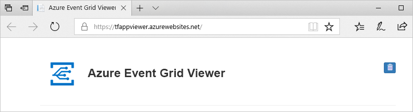

# <a name="build-your-own-disaster-recovery-for-custom-topics-in-event-grid"></a>A saját vész-helyreállítási hozhat létre egyéni témaköröket az Event Gridben

Az alkalmazás funkciói súlyos adatvesztést helyreállva vész-helyreállítási összpontosít. Ez az oktatóanyag végigvezeti a eseménykezelési architektúra beállítása helyreállítja, ha egy adott régióban az Event Grid szolgáltatás akkor kerül sérült.

Ebben az oktatóanyagban megismerheti, hogyan hozhat létre egyéni témaköröket az aktív-passzív feladatátvétel architektúra az Event Gridben lesz. Feladatátvétel által az üzenettémák és előfizetések tükrözés két régióban is, és kezeli a feladatátvétel során egy témakör akkor kerül sérült fogja elvégezni. Ebben az oktatóanyagban az architektúra minden új forgalom feladatait. Fontos, hogy ne feledje, a telepítés, események már útban nem állítható helyre, amíg a feltört régió ismét kifogástalan.

## <a name="create-a-message-endpoint"></a>Üzenetvégpont létrehozása

A feladatátvételi konfiguráció tesztelése, szüksége lesz egy végpontot, az események fogadására. A végpont nem része a feladatátvételi infrastruktúrát, de az eseménykezelő könnyebb teszteléséhez fog működni.

Egyszerűbb, tesztelés, üzembe helyezése egy [előre elkészített webalkalmazás](https://github.com/Azure-Samples/azure-event-grid-viewer) , amely az esemény üzeneteket jelenít meg. Az üzembe helyezett megoldás egy App Service-csomagot, egy App Service-webalkalmazást és egy, a GitHubról származó forráskódot tartalmaz.

1. A megoldásnak az előfizetésébe való telepítéséhez válassza az **Üzembe helyezés az Azure-ban** lehetőséget. Az Azure Portalon adjon meg értékeket a paraméterekhez.

   <a href="https://portal.azure.com/#create/Microsoft.Template/uri/https%3A%2F%2Fraw.githubusercontent.com%2FAzure-Samples%2Fazure-event-grid-viewer%2Fmaster%2Fazuredeploy.json" target="_blank"></a>

1. Az üzembe helyezés befejezése eltarthat néhány percig. A sikeres üzembe helyezést követően tekintse meg a webalkalmazást, hogy meggyőződjön annak működéséről. Egy webböngészőben navigáljon a következő helyre: `https://<your-site-name>.azurewebsites.net`.
Mindenképpen jegyezze fel az URL-címet, mert később szüksége.

1. A hely látható, de még nem lett közzétéve esemény.

   

[!INCLUDE [event-grid-register-provider-portal.md](../../includes/event-grid-register-provider-portal.md)]


## <a name="create-your-primary-and-secondary-topics"></a>Hozzon létre az elsődleges és másodlagos kapcsolatos témakörök

Először hozzon létre két Event Grid-témakör. Ezek a témakörök fog működni, mint az elsődleges és másodlagos. Alapértelmezés szerint az eseményeket az elsődleges témakör keresztül fog haladni. Ha az elsődleges régióban szolgáltatáskimaradás, a másodlagos vesz igénybe.

1. Jelentkezzen be az [Azure Portalra](https://portal.azure.com). 

1. Az Azure fő menüjéből bal felső sarkában válassza **minden szolgáltatás** > keresse meg **Event Grid** > Válasszon **Event Grid-témakörök**.

   

    Válassza ki a csillag mellett az Event Grid-témakörök a jövőben hozzá erőforrás menüben, a könnyebb elérhetőség érdekében.

1. Az Event Grid témakörök menüjében válassza **+ Hozzáadás** az elsődleges témakör létrehozásához.

    * A témakör egy logikai név és hozzáadása "-elsődleges" utótaggal kiegészítve, hogy könnyen nyomon követhető.
    * Ez a témakör régióban lesz az elsődleges régióba.

    

1. A témakör létrehozása után keresse meg, és másolja a **téma végpontja**. az URI-t később még szüksége lesz.

    

1. A témakör, amely szintén később szüksége lesz a tárelérési kulcs lekérésével. Kattintson a **hozzáférési kulcsok** az erőforrás menüben, és a kulcs 1 másolja.

    

1. A témakör panelen kattintson a **+ esemény-előfizetés** csatlakozás, az előfizetés az eseményt fogadó webhely végzett az oktatóanyaggal az Előfeltételek előfizetést létrehozni.

    * Adja meg az esemény-előfizetés logikai nevét, és adja hozzá "-elsődleges" utótaggal kiegészítve, hogy könnyen nyomon követhető.
    * Válassza ki a végpont típusa Webhook.
    * Állítsa be a végpont az eseményt fogadó esemény URL-címre, amely kell kinéznie, például: `https://<your-event-reciever>.azurewebsites.net/api/updates`

    

1. Ismételje meg a másodlagos témakör és előfizetés létrehozása ugyanezt a folyamatot. Ennek során cserélje le a "-elsődleges" utótag az "– másodlagos" könnyebb nyomon követésére. Végül ellenőrizze, hogy egy másik Azure-régióban való helyezze. Helyezheti, bárhol felhasználható, amíg javasoljuk, hogy használja a [Azure párosított régiói](../best-practices-availability-paired-regions.md). A másodlagos témakör és előfizetés és a egy másik régióban biztosítja, hogy az új események fog haladni, még akkor is, ha az elsődleges régió leáll.

Most már:

   * Egy esemény fogadó tesztelési webhelyen.
   * Az elsődleges régió elsődleges témakörében.
   * Az elsődleges témakör csatlakozik az eseményt fogadó webhely elsődleges esemény-előfizetés.
   * A másodlagos régióba másodlagos témakörében.
   * Az elsődleges témakör csatlakozik az eseményt fogadó webhely másodlagos esemény-előfizetés.

## <a name="implement-client-side-failover"></a>Ügyféloldali feladatátvétel végrehajtása

Most, hogy a témakörök és előfizetések telepítő regionálisan redundáns pár, készen áll az ügyféloldali feladatátvétel végrehajtásához. Számos különböző módon végezhető el, azonban minden feladatátvétel-megvalósítások kell egy közös funkciója: egy témakör már nem működik megfelelően, ha a többi témakör forgalmat irányítja Önt.

### <a name="basic-client-side-implementation"></a>Alapszintű ügyféloldali megvalósítása

Az alábbi mintakód egy egyszerű .net közzétevő, is minden esetben megpróbálkoznak való közzétételéhez először az elsődleges témakör. Ha nem jár sikerrel, akkor majd feladatátvétel a másodlagos témakört. Mindkét esetben akkor is ellenőrzi a health api egy GET tegye meg a témakör `https://<topic-name>.<topic-region>.eventgrid.azure.net/api/health`. Kifogástalan állapotú témakör mindig kell visszaadnia **200 OK** egy GET készült mikor a **/api/Állapotjegyzői** végpont.

```csharp
using System;
using System.Net.Http;
using System.Collections.Generic;
using Microsoft.Azure.EventGrid;
using Microsoft.Azure.EventGrid.Models;
using Newtonsoft.Json;

namespace EventGridFailoverPublisher
{
    // This captures the "Data" portion of an EventGridEvent on a custom topic
    class FailoverEventData
    {
        [JsonProperty(PropertyName = "teststatus")]
        public string TestStatus { get; set; }
    }

    class Program
    {
        static void Main(string[] args)
        {
            // TODO: Enter the endpoint each topic. You can find this topic endpoint value
            // in the "Overview" section in the "Event Grid Topics" blade in Azure Portal..
            string primaryTopic = "https://<primary-topic-name>.<primary-topic-region>.eventgrid.azure.net/api/events";
            string secondaryTopic = "https://<secondary-topic-name>.<secondary-topic-region>.eventgrid.azure.net/api/events";

            // TODO: Enter topic key for each topic. You can find this in the "Access Keys" section in the
            // "Event Grid Topics" blade in Azure Portal.
            string primaryTopicKey = "<your-primary-topic-key>";
            string secondaryTopicKey = "<your-secondary-topic-key>";

            string primaryTopicHostname = new Uri( primaryTopic).Host;
            string secondaryTopicHostname = new Uri(secondaryTopic).Host;

            Uri primaryTopicHealthProbe = new Uri("https://" + primaryTopicHostname + "/api/health");
            Uri secondaryTopicHealthProbe = new Uri("https://" + secondaryTopicHostname + "/api/health");

            var httpClient = new HttpClient();

            try
            {
                TopicCredentials topicCredentials = new TopicCredentials(primaryTopicKey);
                EventGridClient client = new EventGridClient(topicCredentials);

                client.PublishEventsAsync(primaryTopicHostname, GetEventsList()).GetAwaiter().GetResult();
                Console.Write("Published events to primary Event Grid topic.");

                HttpResponseMessage health = httpClient.GetAsync(secondaryTopicHealthProbe).Result;
                Console.Write("\n\nSecondary Topic health " + health);
            }
            catch (Microsoft.Rest.Azure.CloudException e)
            {
                TopicCredentials topicCredentials = new TopicCredentials(secondaryTopicKey);
                EventGridClient client = new EventGridClient(topicCredentials);

                client.PublishEventsAsync(secondaryTopicHostname, GetEventsList()).GetAwaiter().GetResult();
                Console.Write("Published events to secondary Event Grid topic. Reason for primary topic failure:\n\n" + e);

                HttpResponseMessage health = httpClient.GetAsync(primaryTopicHealthProbe).Result;
                Console.Write("\n\nPrimary Topic health " + health);
            }

            Console.ReadLine();
        }

        static IList<EventGridEvent> GetEventsList()
        {
            List<EventGridEvent> eventsList = new List<EventGridEvent>();

            for (int i = 0; i < 5; i++)
            {
                eventsList.Add(new EventGridEvent()
                {
                    Id = Guid.NewGuid().ToString(),
                    EventType = "Contoso.Failover.Test",
                    Data = new FailoverEventData()
                    {
                        TestStatus = "success"
                    },
                    EventTime = DateTime.Now,
                    Subject = "test" + i,
                    DataVersion = "2.0"
                });
            }

            return eventsList;
        }
    }
}
```

### <a name="try-it-out"></a>Próbálja ki!

Most, hogy az összetevők mindegyikét helyen, a feladatátvétel végrehajtására, tesztelheti. Futtassa a fenti példa a Visual Studio Code-ot, vagy a kedvenc környezet. A következő négy értékeket cserélje le a végpontok és a kulcsokat, a témakörök:

   * primaryTopic – az elsődleges témakör végpontját.
   * secondaryTopic – a másodlagos témakör végpontját.
   * primaryTopicKey – a kulcs az elsődleges témakörhöz.
   * secondaryTopicKey – a saját másodlagos témaköréhez tartozó kulcsot.

Próbálja meg futtatni az esemény-közzétevő. A vizsgálati események föld az Event Grid-megjelenítőben például alatt kell megjelennie.


Ahhoz, hogy a feladatátvétel szolgáltatás működik, módosíthatja a témakör elsődleges kulcsot, így már nem érvényes néhány karakter. Próbálja meg újra futtatni a közzétevő. Továbbra is megtekintheti az új események jelennek meg az Event Grid-megjelenítőjében, azonban ha a konzolt, látni fogja, hogy azok már folyamatban van a másodlagos témakör keresztül.

### <a name="possible-extensions"></a>A lehetséges bővítmények

Számos módon a minta saját igényei szerint bővítheti. Nagy mennyiségű forgatókönyvek esetén érdemes rendszeresen ellenőrizni a témakör health api egymástól függetlenül. Ezzel a módszerrel a témakör leáll, ha nincs szükségünk, hogy minden egyetlen közzététellel. Ha már tudja, hogy a témakör nem kifogástalan állapotú, is alapértelmezett a másodlagos témakörre való közzététel beállításait.

Hasonlóképpen érdemes feladat-visszavétel logikákat implementálhat saját különleges igényei alapján. Közzététel a legközelebbi adatközpontnak, a késés csökkentése érdekében fontos, ha az állapotfigyelő rendszeres időközönként mintavételi is api, a témakör, amely feladatátadása megtörtént. Amint azt kifogástalan újra, tudni fogja, biztonságosan közelebb adatközpontban történő feladat-visszavétel.

## <a name="next-steps"></a>További lépések

- Ismerje meg, hogyan [kapja egy http-végponton](./receive-events.md)
- Fedezze fel hogyan [-események átirányítása a hibrid kapcsolatok](./custom-event-to-hybrid-connection.md)
- Ismerje meg [vész-helyreállítási Azure DNS-ben és a Traffic Manager használatával](https://docs.microsoft.com/azure/networking/disaster-recovery-dns-traffic-manager)