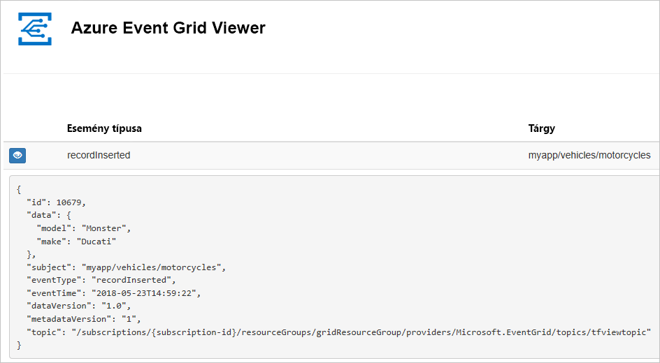
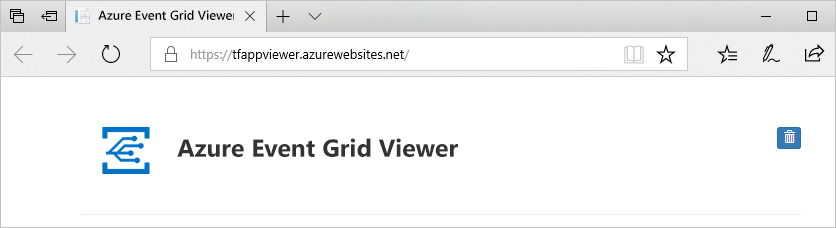
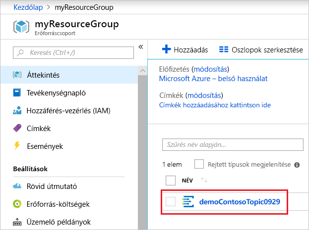
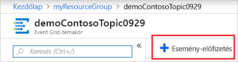
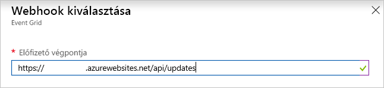
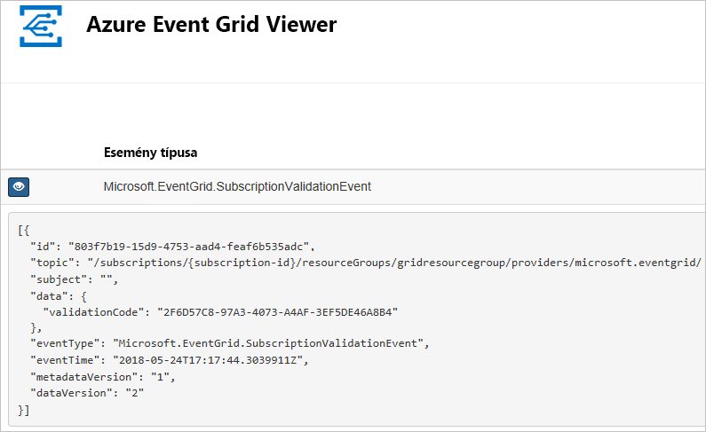

# <a name="quickstart-route-custom-events-to-web-endpoint-with-the-azure-portal-and-event-grid"></a>Gyors útmutató: Események átirányítása egyéni webes végpontra, az Azure portal és az Event Grid

Az Azure Event Grid egy felhőalapú eseménykezelési szolgáltatás. Ebben a cikkben létrehozunk egy egyéni témakört az Azure Portallal, feliratkozunk az egyéni témakörre, majd kiváltjuk az eseményt az eredmény megtekintéséhez. Általában olyan végpontoknak szoktunk eseményeket küldeni, amelyek eseményadatokat dolgoznak fel és műveleteket hajtanak végre. A cikk egyszerűsítése érdekében azonban az eseményeket egy olyan webalkalmazásnak küldjük el, amely az üzenetek gyűjtésével és megjelenítésével foglalkozik.

A folyamat végén látni fogja, hogy a rendszer elküldte az eseményadatokat a webalkalmazásnak.



[!INCLUDE [quickstarts-free-trial-note.md](../../includes/quickstarts-free-trial-note.md)]

[!INCLUDE [event-grid-register-provider-portal.md](../../includes/event-grid-register-provider-portal.md)]

## <a name="create-a-custom-topic"></a>Egyéni témakör létrehozása

Az Event Grid-témakörök egy felhasználó által meghatározott végpontot biztosítanak, amelyben közzéteheti az eseményeket. 

1. Jelentkezzen be az [Azure portálra](https://portal.azure.com/).

1. Egyéni témakör létrehozásához válassza az **Erőforrás létrehozása** elemet. 

   

1. Keressen rá az *Event Grid-témakör* kifejezésre, és válassza ki az elérhető lehetőségek közül.

   

1. Kattintson a **Létrehozás** gombra.

   

1. Adjon egy egyedi nevet az egyéni témakörnek. A témakör nevének egyedinek kell lennie, mert a nevet egy DNS-bejegyzés képviseli. Ne a képen látható nevet használja. Ehelyett hozzon létre a saját nevét – kell 3 – 50 karakter hosszúságú lehet, és tartalmaznia csak a-z, A-Z, 0-9, értékek és a "-". Adja meg az erőforráscsoport nevét. Kattintson a **Létrehozás** gombra.

   

1. Az egyéni témakör létrehozása után láthatja a sikeres műveletről szóló értesítést.

   

   Ha az üzembe helyezés nem sikerült, megtudhatja, mi okozta a hibát. Válassza az **Üzembe helyezés sikertelen** elemet.

   

   Válassza ki a hibaüzenetet.

   

   Az alábbi képen egy olyan üzembe helyezés látható, amely azért volt sikertelen, mert az egyéni témakör neve már használatban van. Ha ezt a hibát látja, próbáljon meg egy másik nevet használni az üzembe helyezéshez.

   

## <a name="create-a-message-endpoint"></a>Üzenetvégpont létrehozása

Az egyéni témakörre való feliratkozás előtt hozzuk létre az eseményüzenet végpontját. A végpont általában az eseményadatok alapján hajt végre műveleteket. Az útmutató egyszerűsítése érdekében egy olyan [előre létrehozott webalkalmazást](https://github.com/Azure-Samples/azure-event-grid-viewer) helyezünk üzembe, amely megjeleníti az esemény üzeneteit. Az üzembe helyezett megoldás egy App Service-csomagot, egy App Service-webalkalmazást és egy, a GitHubról származó forráskódot tartalmaz.

1. A megoldásnak az előfizetésébe való telepítéséhez válassza az **Üzembe helyezés az Azure-ban** lehetőséget. Az Azure Portalon adjon meg értékeket a paraméterekhez.

   <a href="https://portal.azure.com/#create/Microsoft.Template/uri/https%3A%2F%2Fraw.githubusercontent.com%2FAzure-Samples%2Fazure-event-grid-viewer%2Fmaster%2Fazuredeploy.json" target="_blank"></a>

1. Az üzembe helyezés befejezése eltarthat néhány percig. A sikeres üzembe helyezést követően tekintse meg a webalkalmazást, hogy meggyőződjön annak működéséről. Egy webböngészőben navigáljon a következő helyre: `https://<your-site-name>.azurewebsites.net`.

1. A hely látható, de még nem lett közzétéve esemény.

   

## <a name="subscribe-to-custom-topic"></a>Feliratkozás egyéni témakörre

Az Event Grid-témakörre való feliratkozással lehet tudatni az Event Griddel, hogy mely eseményeket kívánja nyomon követni, és hová szeretné küldeni az eseményeket.

1. A portálon válassza ki az egyéni témakört.

   

1. Válassza a **+ Esemény-előfizetés** lehetőséget.

   

1. Válassza ki a **Webhook** végponttípust. Adja meg az esemény-előfizetés nevét.

   

1. Válassza a **Végpont kiválasztása** lehetőséget. 

1. A webhook végponthoz adja meg a webalkalmazás URL-címét, és adja hozzá az `api/updates` elemet a kezdőlap URL-címéhez. Válassza a **Kiválasztás megerősítése** lehetőséget.

   

1. Miután végzett az esemény-előfizetés értékeinek megadásával, válassza a **Létrehozás** lehetőséget.

Tekints meg újra a webalkalmazást, ahol láthatja, hogy az fogadta az előfizetés érvényesítési eseményét. Az eseményadatok kibontásához kattintson a szem ikonra. Az Event Grid elküldi az érvényesítési eseményt, így a végpont megerősítheti, hogy eseményadatokat akar kapni. A webalkalmazás az előfizetés érvényesítéséhez szükséges kódot tartalmaz.



## <a name="send-an-event-to-your-topic"></a>Esemény elküldése a témakörbe

Most aktiváljunk egy eseményt, és lássuk, hogyan küldi el az üzenetet az Event Grid a végpontnak. Az Azure CLI vagy a PowerShell használatával küldjön teszteseményt az egyéni témakörbe. Egy alkalmazás vagy Azure-szolgáltatás általában eseményadatokat küld el.

Az első példa az Azure CLI-t használja. Ez lekéri az egyéni témakör URL-címét és kulcsát, valamint a mintául szolgáló eseményadatokat. A `<topic_name>` helyett használja az egyéni témakör nevét. Ez mintául szolgáló eseményadatokat hoz létre. A JSON `data` eleme az esemény hasznos adata. Bármilyen, megfelelően formált JSON megadható ebben a mezőben. A speciális útválasztáshoz és szűréshez használhatja a tárgy mezőt is. A CURL egy olyan segédprogram, amely HTTP-kéréseket küld.

```azurecli-interactive
endpoint=$(az eventgrid topic show --name <topic_name> -g myResourceGroup --query "endpoint" --output tsv)
key=$(az eventgrid topic key list --name <topic_name> -g myResourceGroup --query "key1" --output tsv)

event='[ {"id": "'"$RANDOM"'", "eventType": "recordInserted", "subject": "myapp/vehicles/motorcycles", "eventTime": "'`date +%Y-%m-%dT%H:%M:%S%z`'", "data":{ "make": "Ducati", "model": "Monster"},"dataVersion": "1.0"} ]'

curl -X POST -H "aeg-sas-key: $key" -d "$event" $endpoint
```

A második példa a PowerShell használatával végez hasonló lépéseket.

```azurepowershell-interactive
$endpoint = (Get-AzureRmEventGridTopic -ResourceGroupName gridResourceGroup -Name <topic-name>).Endpoint
$keys = Get-AzureRmEventGridTopicKey -ResourceGroupName gridResourceGroup -Name <topic-name>

$eventID = Get-Random 99999

#Date format should be SortableDateTimePattern (ISO 8601)
$eventDate = Get-Date -Format s

#Construct body using Hashtable
$htbody = @{
    id= $eventID
    eventType="recordInserted"
    subject="myapp/vehicles/motorcycles"
    eventTime= $eventDate   
    data= @{
        make="Ducati"
        model="Monster"
    }
    dataVersion="1.0"
}

#Use ConvertTo-Json to convert event body from Hashtable to JSON Object
#Append square brackets to the converted JSON payload since they are expected in the event's JSON payload syntax
$body = "["+(ConvertTo-Json $htbody)+"]"

Invoke-WebRequest -Uri $endpoint -Method POST -Body $body -Headers @{"aeg-sas-key" = $keys.Key1}
```

Ön kiváltotta az eseményt, az Event Grid pedig elküldte az üzenetet a feliratkozáskor konfigurált végpontnak. Tekintse meg a webalkalmazást az imént elküldött esemény megtekintéséhez.

```json
[{
  "id": "1807",
  "eventType": "recordInserted",
  "subject": "myapp/vehicles/motorcycles",
  "eventTime": "2017-08-10T21:03:07+00:00",
  "data": {
    "make": "Ducati",
    "model": "Monster"
  },
  "dataVersion": "1.0",
  "metadataVersion": "1",
  "topic": "/subscriptions/{subscription-id}/resourceGroups/{resource-group}/providers/Microsoft.EventGrid/topics/{topic}"
}]
```


## <a name="clean-up-resources"></a>Az erőforrások eltávolítása

Ha tovább kívánja használni az eseményt, akkor ne törölje a cikkben létrehozott erőforrásokat. Ellenkező esetben törölje a cikkben létrehozott erőforrásokat.

Válassza ki az erőforráscsoportot, majd válassza az **Erőforráscsoport törlése** elemet.

## <a name="next-steps"></a>További lépések

Most, hogy megismerte, hogyan hozhat létre egyéni témaköröket és esemény-előfizetéseket, bővebben is tájékozódhat arról, hogy miben nyújthat segítséget az Event Grid:

- [Bevezetés az Event Grid használatába](overview.md)
- [Azure Blob Storage-események átirányítása egyéni webes végpontra](../storage/blobs/storage-blob-event-quickstart.md?toc=%2fazure%2fevent-grid%2ftoc.json)
- [Virtuális gépek módosításainak monitorozása az Azure Event Grid és a Logic Apps segítségével](monitor-virtual-machine-changes-event-grid-logic-app.md)
- [Big Data típusú adatok streamelése adattárházba](event-grid-event-hubs-integration.md)
