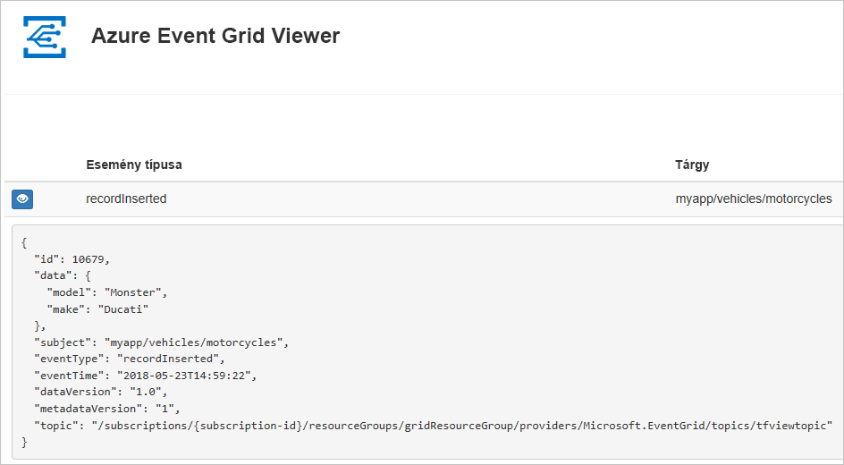

# <a name="quickstart-route-custom-events-to-web-endpoint-with-powershell-and-event-grid"></a>Gyors útmutató: Események átirányítása egyéni webes végpontra a PowerShell és az Event Grid

Az Azure Event Grid egy felhőalapú eseménykezelési szolgáltatás. Ebben a cikkben létrehozunk egy egyéni témakört az Azure PowerShell-lel, feliratkozunk a témakörre, majd kiváltjuk az eseményt az eredmény megtekintéséhez. Általában olyan végpontoknak szoktunk eseményeket küldeni, amelyek eseményadatokat dolgoznak fel és műveleteket hajtanak végre. A cikk egyszerűsítése érdekében azonban az eseményeket egy olyan webalkalmazásnak küldjük el, amely az üzenetek gyűjtésével és megjelenítésével foglalkozik.

A folyamat végén látni fogja, hogy a rendszer elküldte az eseményadatokat a webalkalmazásnak.



[!INCLUDE [updated-for-az](../../includes/updated-for-az.md)]

[!INCLUDE [quickstarts-free-trial-note.md](../../includes/quickstarts-free-trial-note.md)]

Ehhez a cikkhez az Azure PowerShell legújabb verzióját kell futtatnia. Ha telepíteni vagy frissíteni szeretne: [Az Azure PowerShell telepítése és konfigurálása](/powershell/azure/install-Az-ps).

## <a name="create-a-resource-group"></a>Hozzon létre egy erőforráscsoportot

Az Event Grid-témakörök Azure-erőforrások, amelyeket egy Azure-erőforráscsoportba kell helyezni. Az erőforráscsoport egy olyan logikai gyűjtemény, amelyben a rendszer üzembe helyezi és kezeli az Azure-erőforrásokat.

Hozzon létre egy erőforráscsoportot a [New-AzResourceGroup](/powershell/module/az.resources/new-azresourcegroup) parancsot.

A következő példában létrehozunk egy *gridResourceGroup* nevű erőforráscsoportot a *westus2* helyen.

```powershell-interactive
New-AzResourceGroup -Name gridResourceGroup -Location westus2
```

[!INCLUDE [event-grid-register-provider-powershell.md](../../includes/event-grid-register-provider-powershell.md)]

## <a name="create-a-custom-topic"></a>Egyéni témakör létrehozása

Az Event Grid-témakörök egy felhasználó által meghatározott végpontot biztosítanak, amelyben közzéteheti az eseményeket. Az alábbi példa az erőforráscsoportban létrehozza az egyéni témakört. A `<your-topic-name>` elemet a témakör egyedi nevére cserélje le. A témakör nevének egyedinek kell lennie, mert a DNS-bejegyzés része. Ezenkívül kell 3 – 50 karakter hosszúságú lehet, és tartalmaznia csak a-z, A-Z, 0-9, értékek és a "-"

```powershell-interactive
$topicname="<your-topic-name>"

New-AzEventGridTopic -ResourceGroupName gridResourceGroup -Location westus2 -Name $topicname
```

## <a name="create-a-message-endpoint"></a>Üzenetvégpont létrehozása

A témakörre való feliratkozás előtt hozzuk létre az eseményüzenet végpontját. A végpont általában az eseményadatok alapján hajt végre műveleteket. Az útmutató egyszerűsítése érdekében egy olyan [előre létrehozott webalkalmazást](https://github.com/Azure-Samples/azure-event-grid-viewer) helyezünk üzembe, amely megjeleníti az esemény üzeneteit. Az üzembe helyezett megoldás egy App Service-csomagot, egy App Service-webalkalmazást és egy, a GitHubról származó forráskódot tartalmaz.

A `<your-site-name>` elemet a webalkalmazás egyedi nevére cserélje le. A webalkalmazás nevének egyedinek kell lennie, mert a DNS-bejegyzés része.

```powershell-interactive
$sitename="<your-site-name>"

New-AzResourceGroupDeployment `
  -ResourceGroupName gridResourceGroup `
  -TemplateUri "https://raw.githubusercontent.com/Azure-Samples/azure-event-grid-viewer/master/azuredeploy.json" `
  -siteName $sitename `
  -hostingPlanName viewerhost
```

Az üzembe helyezés befejezése eltarthat néhány percig. A sikeres üzembe helyezést követően tekintse meg a webalkalmazást, hogy meggyőződjön annak működéséről. Egy webböngészőben navigáljon a következő helyre: `https://<your-site-name>.azurewebsites.net`.

A helynek megjelenített üzenetek nélkül kell megjelennie.

## <a name="subscribe-to-a-topic"></a>Feliratkozás témakörre

A témakörre való feliratkozással lehet tudatni az Event Griddel, hogy mely eseményeket kívánja nyomon követni, és hová szeretné küldeni azokat. Az alábbi példa feliratkozik a létrehozott témakörre, és az eseményértesítés végpontjaként átadja a webalkalmazásából származó URL-címet.

A webalkalmazás végpontjának az `/api/updates/` utótagot kell tartalmaznia.

```powershell-interactive
$endpoint="https://$sitename.azurewebsites.net/api/updates"

New-AzEventGridSubscription `
  -EventSubscriptionName demoViewerSub `
  -Endpoint $endpoint `
  -ResourceGroupName gridResourceGroup `
  -TopicName $topicname
```

Tekints meg újra a webalkalmazást, ahol láthatja, hogy az fogadta az előfizetés érvényesítési eseményét. Az eseményadatok kibontásához kattintson a szem ikonra. Az Event Grid elküldi az érvényesítési eseményt, így a végpont megerősítheti, hogy eseményadatokat akar kapni. A webalkalmazás az előfizetés érvényesítéséhez szükséges kódot tartalmaz.


## <a name="send-an-event-to-your-topic"></a>Esemény elküldése a témakörbe

Aktiváljunk egy eseményt, és lássuk, hogyan küldi el az üzenetet az Event Grid a végpontnak. Először szükségünk lesz a témakör URL-címére és kulcsára.

```powershell-interactive
$endpoint = (Get-AzEventGridTopic -ResourceGroupName gridResourceGroup -Name $topicname).Endpoint
$keys = Get-AzEventGridTopicKey -ResourceGroupName gridResourceGroup -Name $topicname
```

A folyamat leegyszerűsítése érdekében hozzunk létre mintául szolgáló eseményadatokat, amelyeket elküldhetünk az egyéni témakörbe. Egy alkalmazás vagy Azure-szolgáltatás általában eseményadatokat küld el. Az alábbi példában az eseményadatok összeállítása egy kivonattáblával történik (`htbody`), majd megfelelően formázott JSON hasznosadat-objektumokká (`$body`) lesznek alakítva:

```powershell-interactive
$eventID = Get-Random 99999

#Date format should be SortableDateTimePattern (ISO 8601)
$eventDate = Get-Date -Format s

#Construct body using Hashtable
$htbody = @{
    id= $eventID
    eventType="recordInserted"
    subject="myapp/vehicles/motorcycles"
    eventTime= $eventDate   
    data= @{
        make="Ducati"
        model="Monster"
    }
    dataVersion="1.0"
}

#Use ConvertTo-Json to convert event body from Hashtable to JSON Object
#Append square brackets to the converted JSON payload since they are expected in the event's JSON payload syntax
$body = "["+(ConvertTo-Json $htbody)+"]"
```

Az `$body` használatával a teljes eseményt láthatja. A JSON `data` eleme az esemény hasznos adata. Bármilyen, megfelelően formált JSON megadható ebben a mezőben. A speciális útválasztáshoz és szűréshez használhatja a tárgy mezőt is.

Most küldje el az eseményt a témakörbe.

```powershell-interactive
Invoke-WebRequest -Uri $endpoint -Method POST -Body $body -Headers @{"aeg-sas-key" = $keys.Key1}
```

Ön kiváltotta az eseményt, az Event Grid pedig elküldte az üzenetet a feliratkozáskor konfigurált végpontnak. Tekintse meg a webalkalmazást az imént elküldött esemény megtekintéséhez.

```json
[{
  "id": "1807",
  "eventType": "recordInserted",
  "subject": "myapp/vehicles/motorcycles",
  "eventTime": "2018-01-25T15:58:13",
  "data": {
    "make": "Ducati",
    "model": "Monster"
  },
  "dataVersion": "1.0",
  "metadataVersion": "1",
  "topic": "/subscriptions/{subscription-id}/resourceGroups/{resource-group}/providers/Microsoft.EventGrid/topics/{topic}"
}]
```

## <a name="clean-up-resources"></a>Az erőforrások eltávolítása

Ha tovább kívánja használni az eseményt vagy az eseménynapló alkalmazást, akkor ne törölje a cikkben létrehozott erőforrásokat. Ellenkező esetben a következő paranccsal törölheti a cikkben létrehozott erőforrásokat.

```powershell
Remove-AzResourceGroup -Name gridResourceGroup
```

## <a name="next-steps"></a>További lépések

Most, hogy megismerkedett vele, hogyan hozhat létre témaköröket és eseményfeliratkozásokat, bővebben is tájékozódhat arról, hogy miben nyújthat segítséget az Event Grid:

- [Bevezetés az Event Grid használatába](overview.md)
- [Azure Blob Storage-események átirányítása egyéni webes végpontra](../storage/blobs/storage-blob-event-quickstart.md?toc=%2fazure%2fevent-grid%2ftoc.json)
- [Virtuális gépek módosításainak monitorozása az Azure Event Grid és a Logic Apps segítségével](monitor-virtual-machine-changes-event-grid-logic-app.md)
- [Big Data típusú adatok streamelése adattárházba](event-grid-event-hubs-integration.md)
