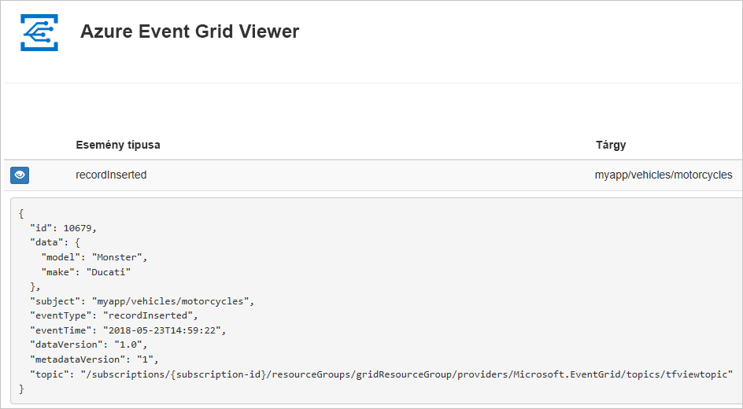
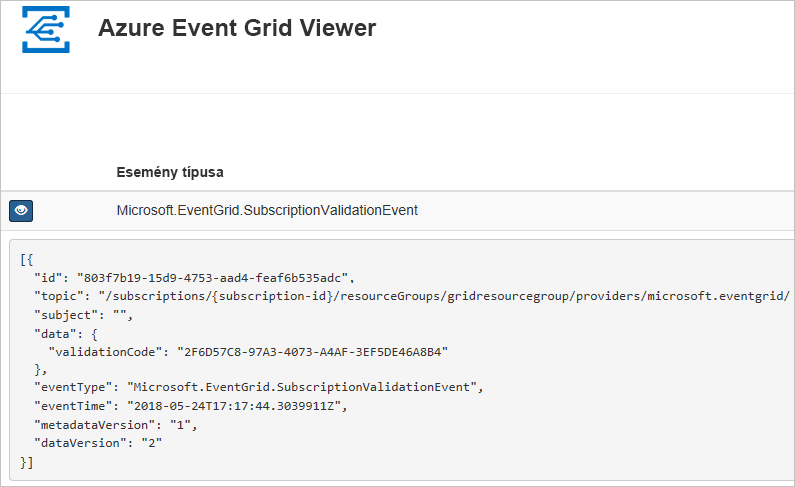

# <a name="create-and-route-custom-events-with-azure-cli-and-event-grid"></a>Egyéni események létrehozása és átirányítása az Azure CLI-vel és az Event Griddel

Az Azure Event Grid egy felhőalapú eseménykezelési szolgáltatás. Ebben a cikkben létrehozunk egy egyéni témakört az Azure CLI-vel, feliratkozunk az egyéni témakörre, majd elindítjuk az eseményt az eredmény megtekintéséhez. Általában olyan végpontoknak szoktunk eseményeket küldeni, amelyek eseményadatokat dolgoznak fel és műveleteket hajtanak végre. A cikk egyszerűsítése érdekében azonban az eseményeket egy olyan webalkalmazásnak küldjük el, amely az üzenetek gyűjtésével és megjelenítésével foglalkozik.

A folyamat végén látni fogja, hogy a rendszer elküldte az eseményadatokat a webalkalmazásnak.



[!INCLUDE [quickstarts-free-trial-note.md](../../includes/quickstarts-free-trial-note.md)]

[!INCLUDE [cloud-shell-try-it.md](../../includes/cloud-shell-try-it.md)]

Ha a CLI helyi telepítését és használatát választja, akkor ehhez a cikkhez az Azure CLI legújabb verzióját (2.0.24 vagy újabb) kell futtatnia. A verzió megkereséséhez futtassa a következőt: `az --version`. Ha telepíteni vagy frissíteni szeretne: [Az Azure CLI telepítése](/cli/azure/install-azure-cli).

Ha nem a Cloud Shellt használja, először be kell jelentkeznie az `az login` paranccsal.

## <a name="create-a-resource-group"></a>Hozzon létre egy erőforráscsoportot

Az Event Grid-témakörök Azure-erőforrások, amelyeket egy Azure-erőforráscsoportba kell helyezni. Az erőforráscsoport egy olyan logikai gyűjtemény, amelyben a rendszer üzembe helyezi és kezeli az Azure-erőforrásokat.

Hozzon létre egy erőforráscsoportot az [az group create](/cli/azure/group#az-group-create) paranccsal. 

A következő példában létrehozunk egy *gridResourceGroup* nevű erőforráscsoportot a *westus2* helyen.

```azurecli-interactive
az group create --name gridResourceGroup --location westus2
```

[!INCLUDE [event-grid-register-provider-cli.md](../../includes/event-grid-register-provider-cli.md)]

## <a name="create-a-custom-topic"></a>Egyéni témakör létrehozása

Az Event Grid-témakörök egy felhasználó által meghatározott végpontot biztosítanak, amelyben közzéteheti az eseményeket. Az alábbi példa az erőforráscsoportban létrehozza az egyéni témakört. A `<your-topic-name>` elemet a témakör egyedi nevére cserélje le. Az egyéni témakör nevének egyedinek kell lennie, mert a DNS-bejegyzés része.

```azurecli-interactive
topicname=<your-topic-name>

az eventgrid topic create --name $topicname -l westus2 -g gridResourceGroup
```

## <a name="create-a-message-endpoint"></a>Üzenetvégpont létrehozása

Az egyéni témakörre való feliratkozás előtt hozzuk létre az eseményüzenet végpontját. A végpont általában az eseményadatok alapján hajt végre műveleteket. Az útmutató egyszerűsítése érdekében egy olyan [előre létrehozott webalkalmazást](https://github.com/Azure-Samples/azure-event-grid-viewer) helyezünk üzembe, amely megjeleníti az esemény üzeneteit. Az üzembe helyezett megoldás egy App Service-csomagot, egy App Service-webalkalmazást és egy, a GitHubról származó forráskódot tartalmaz.

A `<your-site-name>` elemet a webalkalmazás egyedi nevére cserélje le. A webalkalmazás nevének egyedinek kell lennie, mert a DNS-bejegyzés része.

```azurecli-interactive
sitename=<your-site-name>

az group deployment create \
  --resource-group gridResourceGroup \
  --template-uri "https://raw.githubusercontent.com/Azure-Samples/azure-event-grid-viewer/master/azuredeploy.json" \
  --parameters siteName=$sitename hostingPlanName=viewerhost
```

Az üzembe helyezés befejezése eltarthat néhány percig. A sikeres üzembe helyezést követően tekintse meg a webalkalmazást, hogy meggyőződjön annak működéséről. Egy webböngészőben navigáljon a következő helyre: `https://<your-site-name>.azurewebsites.net`.

A helynek megjelenített üzenetek nélkül kell megjelennie.

## <a name="subscribe-to-a-custom-topic"></a>Feliratkozás egyéni témakörre

A témakörre való feliratkozással lehet tudatni az Event Griddel, hogy mely eseményeket kívánja nyomon követni, és hová szeretné küldeni azokat. Az alábbi példa feliratkozik a létrehozott egyéni témakörre, és az eseményértesítés végpontjaként átadja a webalkalmazásából származó URL-címet.

A webalkalmazás végpontjának az `/api/updates/` utótagot kell tartalmaznia.

```azurecli-interactive
endpoint=https://$sitename.azurewebsites.net/api/updates

az eventgrid event-subscription create \
  -g gridResourceGroup \
  --topic-name $topicname \
  --name demoViewerSub \
  --endpoint $endpoint
```

Tekints meg újra a webalkalmazást, ahol láthatja, hogy az fogadta az előfizetés érvényesítési eseményét. Az eseményadatok kibontásához kattintson a szem ikonra. Az Event Grid elküldi az érvényesítési eseményt, így a végpont megerősítheti, hogy eseményadatokat akar kapni. A webalkalmazás az előfizetés érvényesítéséhez szükséges kódot tartalmaz.



## <a name="send-an-event-to-your-custom-topic"></a>Esemény elküldése az egyéni témakörbe

Aktiváljunk egy eseményt, és lássuk, hogyan küldi el az üzenetet az Event Grid a végpontnak. Először szükségünk lesz az egyéni témakör URL-címére és kulcsára.

```azurecli-interactive
endpoint=$(az eventgrid topic show --name $topicname -g gridResourceGroup --query "endpoint" --output tsv)
key=$(az eventgrid topic key list --name $topicname -g gridResourceGroup --query "key1" --output tsv)
```

A folyamat leegyszerűsítése érdekében használjon mintául szolgáló eseményadatokat, amelyeket elküldhet az egyéni témakörbe. Egy alkalmazás vagy Azure-szolgáltatás általában eseményadatokat küld el. Az alábbi példa mintául szolgáló eseményadatokat hoz létre:

```azurecli-interactive
event='[ {"id": "'"$RANDOM"'", "eventType": "recordInserted", "subject": "myapp/vehicles/motorcycles", "eventTime": "'`date +%Y-%m-%dT%H:%M:%S%z`'", "data":{ "make": "Ducati", "model": "Monster"},"dataVersion": "1.0"} ]'
```

A JSON `data` eleme az esemény hasznos adata. Bármilyen, megfelelően formált JSON megadható ebben a mezőben. A speciális útválasztáshoz és szűréshez használhatja a tárgy mezőt is.

A CURL egy olyan segédprogram, amely HTTP-kéréseket küld. Ebben a cikkben a CURL használatával küldjük el az eseményt a témakörbe. 

```azurecli-interactive
curl -X POST -H "aeg-sas-key: $key" -d "$event" $endpoint
```

Ön kiváltotta az eseményt, az Event Grid pedig elküldte az üzenetet a feliratkozáskor konfigurált végpontnak. Tekintse meg a webalkalmazást az imént elküldött esemény megtekintéséhez.

```json
[{
  "id": "1807",
  "eventType": "recordInserted",
  "subject": "myapp/vehicles/motorcycles",
  "eventTime": "2017-08-10T21:03:07+00:00",
  "data": {
    "make": "Ducati",
    "model": "Monster"
  },
  "dataVersion": "1.0",
  "metadataVersion": "1",
  "topic": "/subscriptions/{subscription-id}/resourceGroups/{resource-group}/providers/Microsoft.EventGrid/topics/{topic}"
}]
```

## <a name="clean-up-resources"></a>Az erőforrások eltávolítása
Ha tovább kívánja használni az eseményt vagy az eseménynapló alkalmazást, akkor ne törölje a cikkben létrehozott erőforrásokat. Ellenkező esetben a következő paranccsal törölheti a cikkben létrehozott erőforrásokat.

```azurecli-interactive
az group delete --name gridResourceGroup
```

## <a name="next-steps"></a>További lépések

Most, hogy megismerkedett vele, hogyan hozhat létre témaköröket és eseményfeliratkozásokat, bővebben is tájékozódhat arról, hogy miben nyújthat segítséget az Event Grid:

- [Bevezetés az Event Grid használatába](overview.md)
- [Azure Blob Storage-események átirányítása egyéni webes végpontra](../storage/blobs/storage-blob-event-quickstart.md?toc=%2fazure%2fevent-grid%2ftoc.json)
- [Virtuális gépek módosításainak monitorozása az Azure Event Grid és a Logic Apps segítségével](monitor-virtual-machine-changes-event-grid-logic-app.md)
- [Big Data típusú adatok streamelése adattárházba](event-grid-event-hubs-integration.md)
