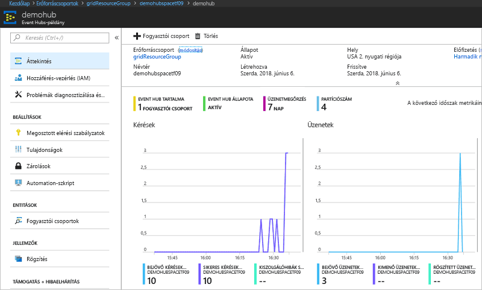

# <a name="route-custom-events-to-azure-event-hubs-with-azure-cli-and-event-grid"></a>Egyéni események átirányítása Azure Event Hubsba az Azure CLI-vel és az Event Griddel

Az Azure Event Grid egy felhőalapú eseménykezelési szolgáltatás. Az Azure Event Hubs az egyik támogatott eseménykezelő. Ebben a cikkben létrehozunk egy egyéni témakört az Azure CLI-vel, feliratkozunk a témakörre, majd elindítjuk az eseményt az eredmény megtekintéséhez. Az eseményeket az eseményközpontba küldi.

[!INCLUDE [quickstarts-free-trial-note.md](../../includes/quickstarts-free-trial-note.md)]

## <a name="create-a-resource-group"></a>Hozzon létre egy erőforráscsoportot

Az Event Grid-témakörök Azure-erőforrások, amelyeket egy Azure-erőforráscsoportba kell helyezni. Az erőforráscsoport egy olyan logikai gyűjtemény, amelyben a rendszer üzembe helyezi és kezeli az Azure-erőforrásokat.

Hozzon létre egy erőforráscsoportot az [az group create](/cli/azure/group#az_group_create) paranccsal. 

A következő példában létrehozunk egy *gridResourceGroup* nevű erőforráscsoportot a *westus2* helyen.

```azurecli-interactive
az group create --name gridResourceGroup --location westus2
```

## <a name="create-a-custom-topic"></a>Egyéni témakör létrehozása

Az Event Grid-témakörök egy felhasználó által meghatározott végpontot biztosítanak, amelyben közzéteheti az eseményeket. Az alábbi példa az erőforráscsoportban létrehozza az egyéni témakört. A `<your-topic-name>` elemet a témakör egyedi nevére cserélje le. A témakör nevének egyedinek kell lennie, mert a nevet egy DNS-bejegyzés képviseli.

```azurecli-interactive
topicname=<your-topic-name>
az eventgrid topic create --name $topicname -l westus2 -g gridResourceGroup
```

## <a name="create-event-hub"></a>Eseményközpont létrehozása

A témakörre való feliratkozás előtt hozzuk létre az eseményüzenet végpontját. Eseményközpontot hoz létre az események begyűjtéséhez.

```azurecli-interactive
namespace=<unique-namespace-name>
hubname=demohub

az eventhubs namespace create --name $namespace --resource-group gridResourceGroup
az eventhubs eventhub create --name $hubname --namespace-name $namespace --resource-group gridResourceGroup
```

## <a name="subscribe-to-a-topic"></a>Feliratkozás témakörre

A témakörre való feliratkozással lehet tudatni az Event Griddel, hogy mely eseményeket kívánja nyomon követni. Az alábbi példa feliratkozik a létrehozott témakörre, és átadja az eseményközpont erőforrás-azonosítóját a végpontnak. A végpont formátuma a következő:

`/subscriptions/<subscription-id>/resourceGroups/<resource-group-name>/providers/Microsoft.EventHub/namespaces/<namespace-name>/eventhubs/<hub-name>`

A következő szkript beszerzi az eseményközpont erőforrás-azonosítóját, és feliratkozik egy Event Grid-témakörre. A végpontot `eventhub` típusúra állítja be, és az Event Hub azonosítóját használja végpontként.

```azurecli-interactive
hubid=$(az eventhubs eventhub show --name $hubname --namespace-name $namespace --resource-group gridResourceGroup --query id --output tsv)

az eventgrid event-subscription create \
  --topic-name $topicname \
  -g gridResourceGroup \
  --name subtoeventhub \
  --endpoint-type eventhub \
  --endpoint $hubid
```

## <a name="send-an-event-to-your-topic"></a>Esemény elküldése a témakörbe

Aktiváljunk egy eseményt, és lássuk, hogyan küldi el az üzenetet az Event Grid a végpontnak. Először szükségünk lesz az egyéni témakör URL-címére és kulcsára.

```azurecli-interactive
endpoint=$(az eventgrid topic show --name $topicname -g gridResourceGroup --query "endpoint" --output tsv)
key=$(az eventgrid topic key list --name $topicname -g gridResourceGroup --query "key1" --output tsv)
```

A folyamat leegyszerűsítése érdekében használjon mintául szolgáló eseményadatokat, amelyeket elküldhet a témakörbe. Egy alkalmazás vagy Azure-szolgáltatás általában eseményadatokat küld el. A CURL egy olyan segédprogram, amely HTTP-kéréseket küld. Ebben a cikkben a CURL használatával küldjük el az eseményt a témakörbe.  Az alábbi példa három eseményt küld el az Event Grid-témakörnek:

```azurecli-interactive
for i in 1 2 3
do
   body=$(eval echo "'$(curl https://raw.githubusercontent.com/Azure/azure-docs-json-samples/master/event-grid/customevent.json)'")
   curl -X POST -H "aeg-sas-key: $key" -d "$body" $endpoint
done
```

A Portalon lépjen az eseményközponthoz, és figyelje meg, hogy az Event Grid elküldte a három eseményt az eseményközpontba.



Általában az eseményeket az eseményközpontból lekérő alkalmazást hoz létre. Az üzeneteket az eseményközpontból lekérő alkalmazások létrehozásáról lásd:

* [Üzenetek fogadása az Event Processor Hosttal .NET Standardban – első lépések](../event-hubs/event-hubs-dotnet-standard-getstarted-receive-eph.md)
* [Események fogadása az Azure Event Hubsból a Java használatával](../event-hubs/event-hubs-java-get-started-receive-eph.md)
* [Események fogadása az Event Hubsról az Apache Storm használatával](../event-hubs/event-hubs-storm-getstarted-receive.md)

## <a name="clean-up-resources"></a>Az erőforrások eltávolítása
Ha tovább kívánja használni az eseményt, akkor ne törölje a cikkben létrehozott erőforrásokat. Ellenkező esetben a következő paranccsal törölheti a cikkben létrehozott erőforrásokat.

```azurecli-interactive
az group delete --name gridResourceGroup
```

## <a name="next-steps"></a>További lépések

Most, hogy megismerkedett vele, hogyan hozhat létre témaköröket és eseményfeliratkozásokat, bővebben is tájékozódhat arról, hogy miben nyújthat segítséget az Event Grid:

- [Bevezetés az Event Grid használatába](overview.md)
- [Azure Blob Storage-események átirányítása egyéni webes végpontra](../storage/blobs/storage-blob-event-quickstart.md?toc=%2fazure%2fevent-grid%2ftoc.json)
- [Virtuális gépek módosításainak monitorozása az Azure Event Grid és a Logic Apps segítségével](monitor-virtual-machine-changes-event-grid-logic-app.md)
- [Big Data típusú adatok streamelése adattárházba](event-grid-event-hubs-integration.md)
