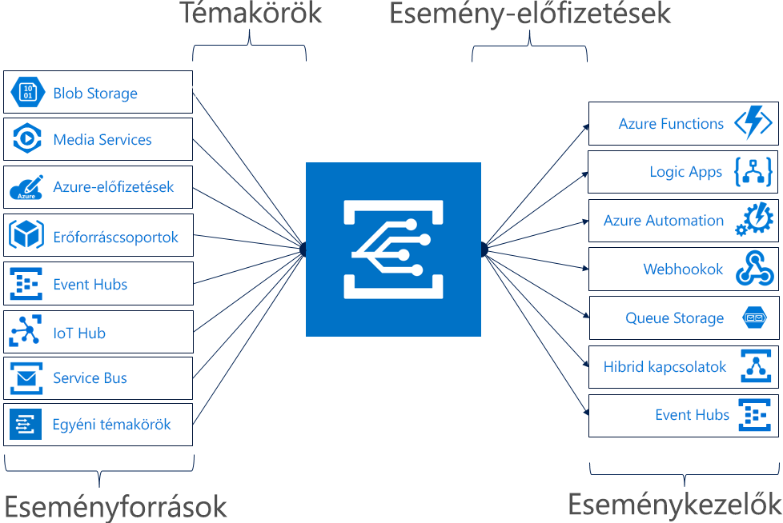

# Az Azure Event Grid bemutatása

Az Azure Event Griddel könnyen létrehozhat eseményalapú architektúrával rendelkező alkalmazásokat. Először kiválaszthatja azt az Azure-erőforrást, amelyre elő kíván fizetni, és megadhatja azt az eseménykezelőt vagy webhook-végpontot, amelyre el kívánja küldeni az eseményt. Az Event Grid beépített támogatást nyújt az Azure-szolgáltatásokból, például a tárolóblobokból és erőforráscsoportokból érkező eseményekhez. Az Event Grid egyéni témakörök használatával a saját események használatát is támogatja. 

Szűrők segítségével adott eseményeket irányíthat át különböző végpontokra, csoportos küldést végezhet több végpontra, és meggyőződhet róla, hogy az események megbízhatóan célba érnek.

Az Azure Event Grid jelenleg minden nyilvános régióban elérhető. Jelenleg nem érhető el az Azure Germany, az Azure China és az Azure Government felhőben.

Ez a cikk az Azure Event Gridről nyújt áttekintést. Az Event Grid használatának első lépései: [Egyéni események létrehozása és átirányítása az Azure Event Griddel](custom-event-quickstart.md). 

Vegye figyelembe, hogy ez az ábra azt mutatja be, hogyan csatlakoztat az Event Grid forrásokat és kezelőket, és nem a támogatott integrációk átfogó listáját ábrázolja.

## Eseményforrások

Az egyes források képességeire és a kapcsolódó cikkekre vonatkozó részletekért tekintse meg az [eseményforrásokat](event-sources.md). Jelenleg az alábbi Azure-szolgáltatások támogatják az események Event Gridbe való küldését:

* Azure-előfizetések (kezelési műveletek)
* Container Registry
* Egyéni témakörök
* Event Hubs
* IoT Hub
* Media Services
* Erőforráscsoportok (kezelési műveletek)
* Service Bus
* Storage Blob
* Általános célú v2- (GPv2-) tároló

## Eseménykezelők

Az egyes kezelők képességeire és a kapcsolódó cikkekre vonatkozó részletekért tekintse meg az [eseménykezelőket](event-handlers.md). Jelenleg az alábbi Azure-szolgáltatások támogatják az Event Gridből származó események kezelését: 

* Azure Automation
* Azure Functions
* Event Hubs
* Hibrid kapcsolatok
* Logic Apps
* Microsoft Flow
* Queue Storage
* Webhookok

## Alapelvek

Az Azure Event Grid öt fontos alapfogalma:

* **Események** – Mi történt.
* **Eseményforrások** – Ahol az esemény történt.
* **Témakörök** – A végpont, amelyre a közzétevők az eseményeket küldik.
* **Esemény-előfizetések** – Végpont vagy beépített mechanizmus az események – néha több kezelőre történő – átirányításához. Az előfizetéseket a kezelők is használják a bejövő események intelligens szűrésére.
* **Eseménykezelők** – Az eseményre reagáló alkalmazás vagy szolgáltatás.

További információ ezekről a fogalmakról: [Az Azure Event Grid alapfogalmai](concepts.md).

## Funkciók

Az Azure Event Grid néhány főbb jellemzője:

* **Egyszerűség** – Egy kattintással irányíthatja az eseményeket az Azure-erőforrásából bármely eseménykezelőre vagy végpontra.
* **Speciális szűrés** – Az eseménytípusra vagy az esemény közzétételi útvonalára is szűrhet, hogy az eseménykezelők csak a releváns eseményeket kapják meg.
* **Elosztás** – Több végpontot is előfizethet ugyanarra az eseményre, hogy az esemény másolatait annyi helyre küldje el, amennyire szükséges.
* **Megbízhatóság** – 24 órás újrapróbálkozást használhat exponenciális leállítással, hogy az események kézbesítése biztosan megtörténjen.
* **Eseményenkénti fizetés** – Csak az Event Grid használatának mennyisége alapján kell fizetnie.
* **Nagy teljesítmény** – Nagy kapacitású számítási feladatokat hozhat létre az Event Griden, amelyek események millióit támogatják másodpercenként.
* **Beépített események** – Az erőforrások által meghatározott, beépített eseményekkel gyorsan munkához láthat.
* **Egyéni események** – Az Event Griddel egyéni eseményeket irányíthat át, szűrhet és kézbesíthet megbízhatóan az alkalmazásában.

Az Event Grid, az Event Hubs és a Service Bus összehasonlítása: [Az üzenetkézbesítő Azure-szolgáltatás kiválasztása](compare-messaging-services.md).

## Mire használhatom az Event Gridet?

Az Azure Event Grid számos olyan funkciót kínál, amely nagymértékben javítja a kiszolgáló nélküli működést, a műveletek automatizálását és az integrációt: 

### Kiszolgáló nélküli alkalmazásarchitektúrák

Az Event Grid összeköti az adatforrásokat az eseménykezelőkkel. Az Event Grid használatával például azonnal aktiválható egy képelemzést futtató, kiszolgáló nélküli függvény, amikor egy új fénykép kerül egy Blob Storage-tárolóba. 

### Műveletek automatizálása

Az Event Griddel felgyorsíthatja az automatizálást és egyszerűsítheti a szabályzatok kikényszerítését. Az Event Grid például értesíteni tudja az Azure Automationt, ha létrejön egy virtuális gép vagy egy SQL Database-adatbázis. Ezek az események felhasználhatók a szolgáltatáskonfigurációk megfelelőségének automatikus ellenőrzésére, a metaadatok műveleti eszközöknek való átadására, virtuális gépek címkézésére vagy a munkaelemek regisztrációjára.

### Alkalmazásintegráció

Az Event Grid más szolgáltatásokkal kapcsolja össze alkalmazását. Létrehozhat például egy egyéni témakört, hogy az alkalmazása eseményadatait az Event Gridbe küldje, és kihasználja az általa kínált megbízható kézbesítést, fejlett átirányítást és a közvetlen Azure-integrációt. Vagy az Event Gridet a Logic Appsszel együtt használhatja tetszőleges helyen, kód írása nélkül végzett adatfeldolgozásra. 

## Mennyibe kerül az Event Grid?

Az Azure Event Grid árképzése eseményenkénti fizetésen alapul, tehát a fizetés a használat alapján történik. A havi első 100 000 művelet ingyenes. A műveletek a következőképpen vannak meghatározva: események bejövő forgalma, előfizetési kézbesítési kísérletek, kezelési hívások és tárgyutótag szerinti szűrés. A részleteket lásd az [árképzést ismertető oldalon](https://azure.microsoft.com/pricing/details/event-grid/).

## További lépések

* [Storage Blob-események útválasztása](../storage/blobs/storage-blob-event-quickstart.md?toc=%2fazure%2fevent-grid%2ftoc.json)  
  Az Event Grid használatával válaszolhat a Storage Blob-eseményekre.
* [Egyéni események: létrehozás és előfizetés](custom-event-quickstart.md)  
  Lásson azonnal munkához, és küldje el saját egyéni eseményeit egy végpontra az Azure Event Grid rövid útmutatója alapján.
* [A Logic Apps használata eseménykezelőként](monitor-virtual-machine-changes-event-grid-logic-app.md)  
  Ez az oktatóanyag bemutatja egy olyan alkalmazás létrehozását a Logic Appsszel, amely az Event Grid által leküldött eseményekre reagál.
* [Big Data típusú adatok streamelése adattárházba](event-grid-event-hubs-integration.md)  
  Ez az oktatóanyag az Azure Functions használatával streameli az adatokat az Event Hubsból az SQL Data Warehouse-ba.
* [Event Grid REST API-referencia](/rest/api/eventgrid)  
  Részletesebb műszaki információkat tartalmaz az Azure Event Griddel kapcsolatban, valamint referenciát az esemény-előfizetések kezeléséhez, átirányításához és szűréséhez.