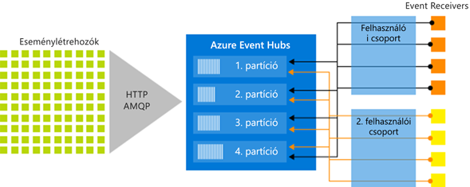

# Mi az Azure Event Hubs?

Az Azure Event Hubs egy Big Data streamplatform és eseményfeldolgozó szolgáltatás, amely másodpercenként több millió esemény fogadására és feldolgozására képes. Az Event Hubs képes az elosztott szoftverek és eszközök által generált események, adatok vagy telemetria feldolgozására és tárolására. Az eseményközpontokba elküldött adatok bármilyen valós idejű elemzési szolgáltató vagy kötegelési/tárolóadapter segítségével átalakíthatók és tárolhatók. 

Az Event Hubs többek között a következő forgatókönyvekhez használható:

- Rendellenességek észlelése (csalások/kiugró értékek)
- Alkalmazásnaplózás
- Elemzési folyamatok, például kattintássorozatoké
- Élő irányítópultok
- Adatok archiválása
- Tranzakciófeldolgozás
- Felhasználói telemetria feldolgozása
- Eszköztelemetria-stream 

## Miért érdemes az Event Hubs platformot használni?

Az adatok csak akkor képviselnek értéket, ha könnyen feldolgozhatók, és időszerű elemzések állíthatók össze az adatforrásokból. Az Event Hubs egy elosztott streamfeldolgozó platformot biztosít kis késéssel és zökkenőmentes integrációval, valamint az Azure-on belüli és kívüli adat- és elemzési szolgáltatásokkal egy teljes körű Big Data-folyamat kiépítése érdekében.

Az Event Hubs az eseményfolyamatok „bejárati ajtaja”, amelyet gyakran neveznek *eseménybetöltőnek* a megoldásarchitektúrákban. Az eseménybetöltő egy olyan összetevő vagy szolgáltatás, amely az esemény-közzétevők és az eseményfelhasználók közé ékelődve elkülöníti az eseménystream létrehozását az események felhasználásától. Az Event Hubs egységes adatstreamelési platformot biztosít időalapú megőrzési pufferrel, leválasztva az esemény-előállítókat az eseményfelhasználókról. 

A következő szakaszok az Azure Event Hubs szolgáltatás legfontosabb jellemzőit ismertetik: 

## Teljes mértékben felügyelt PaaS 

Az Event Hubs egy kevés konfigurációs vagy felügyeleti többletterhelést okozó felügyelt szolgáltatás, amely elősegíti, hogy az üzleti megoldásokra összpontosíthasson. [Az Apache Kafkához készült Event Hubs-ökoszisztéma](event-hubs-for-kafka-ecosystem-overview.md) anélkül biztosítja a PaaS Kafka előnyeit, hogy saját fürtöket kellene kezelnie, konfigurálnia vagy futtatnia.

## Valós idejű kötegelt feldolgozás támogatása

Valós időben töltheti be, pufferelheti, tárolhatja és dolgozhatja fel a streameket, hogy a gyakorlatban is használható elemzésekhez jusson. Az Event Hubs egy [particionált felhasználói modellt](event-hubs-features.md#partitions) használ, amellyel több alkalmazás dolgozhatja fel egyszerre a streamet, és a feldolgozási sebesség szabályozását is lehetővé teszi.

Az adatokat közel valós időben [rögzítheti](event-hubs-capture-overview.md) egy [Azure Blob Storage-tárolóban](https://azure.microsoft.com/services/storage/blobs/) vagy [Azure Data Lake Store-ban](https://azure.microsoft.com/services/data-lake-store/)  a hosszú idejű megőrzés vagy mikrokötegelt feldolgozás érdekében. Ezt ugyanabban a streamben érheti el, amelyet a valós idejű elemzések származtatásához is használ. A Capture beállítása gyors, a futtatása nem jár felügyeleti költségekkel, és automatikusan méretezhető az Event Hubs  [átviteli egységeivel](event-hubs-features.md#throughput-units). Az Event Hubs Capture lehetővé teszi, hogy az adatok rögzítése helyett a feldolgozásukra összpontosíthasson.

Az Azure Event Hubs az [Azure Functions](/azure/azure-functions/) szolgáltatással is integrálható egy kiszolgáló nélküli architektúra keretein belül.

## Méretezhető 

Az Event Hubs szolgáltatással megabájtokban kezdheti az adatstreameket, és onnan továbbléphet a giga- és terabájtokra. Az [automatikus feltöltési](event-hubs-auto-inflate.md) funkció az egyik lehetőség az átviteli egységek számának a használati igényeinek megfelelő módosítására. 

## Gazdag ökoszisztéma

[Az Apache Kafkához készült Event Hubs-ökoszisztéma](event-hubs-for-kafka-ecosystem-overview.md) lehetővé teszi, hogy az [Apache Kafka (1.0-s és újabb verzió)](https://kafka.apache.org/) ügyfelei és alkalmazásai fürtök kezelése nélkül kommunikálhassanak az Event Hubs szolgáltatással.
 
A különböző [nyelveken (.NET, Java, Python, Go, Node.js)](https://github.com/Azure/azure-event-hubs) elérhető sokoldalú ökoszisztéma megkönnyíti a streamek feldolgozását az Event Hubsból. Az összes támogatott ügyfélnyelv alacsony szintű integrációt biztosít.

## Az architektúra legfontosabb összetevői

Az Event Hubs üzenetstream-kezelési képességet is biztosít, de olyan tulajdonságokkal rendelkezik, amelyek eltérnek a hagyományos vállalati üzenetkezelés jellemzőitől. Az Event Hubs képességei kimondottan a nagy mennyiségre és eseményfeldolgozási forgatókönyvekre vannak optimalizálva. Az Event Hubs az alábbi [fő összetevőket](event-hubs-features.md) foglalja magába:

- **Esemény-előállítók**: Minden entitás, amely adatokat küld egy eseményközpontnak. Az esemény-közzétevők a HTTPS, az AMQP 1.0 vagy az Apache Kafka (1.0 és újabb) használatával tehetik közzé az eseményeket.
- **Partíciók**: Mindegyik felhasználó az üzenetstreamnek csak egy adott részét vagy partícióját olvassa.
- **Felhasználói csoportok**: A teljes eseményközpont egyik nézete (állapot, pozíció vagy eltolás). A felhasználói csoportok révén több felhasználó alkalmazás rendelkezhet az eseménystream külön nézetével, és a többitől függetlenül saját tempójában és saját eltolásával olvashatja a streamet.
- **Átviteli egységek**: Előre megvásárolt kapacitásegységek, amelyek az eseményközpontok átviteli kapacitását vezérlik.
- **Eseményérzékelő**: Minden entitás, amely eseményadatokat olvas egy eseményközpontból. Minden Event Hubs-felhasználó az AMQP 1.0-munkameneten keresztül csatlakozik, amelyben az események azonnal megjelennek, amint elérhetővé válnak. Minden Kafka-fogyasztó a Kafka-protokoll 1.0-s vagy újabb verziójával csatlakozik.

A következő ábrán az Event Hubs streamfeldolgozási architektúrája látható:

## További lépések

Az Event Hubs használatának első lépéseit a következő cikkek ismertetik:

* [Betöltés az Event Hubsba](event-hubs-quickstart-portal.md)
* [Az Event Hubs-szolgáltatások áttekintése](event-hubs-features.md)
* [Gyakori kérdések](event-hubs-faq.md)

