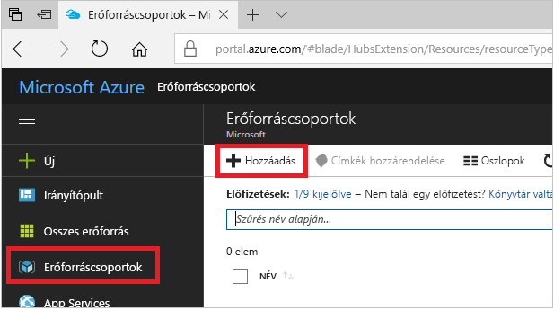
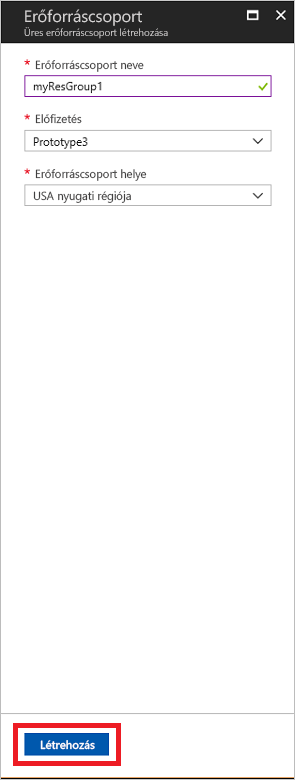
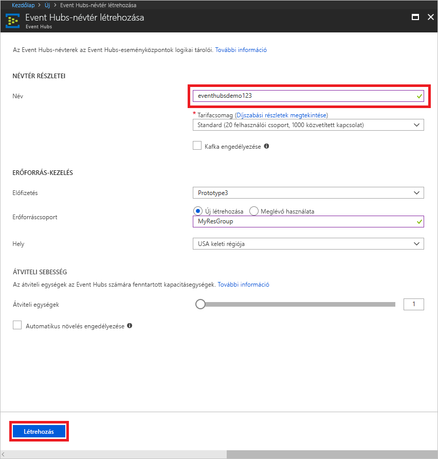
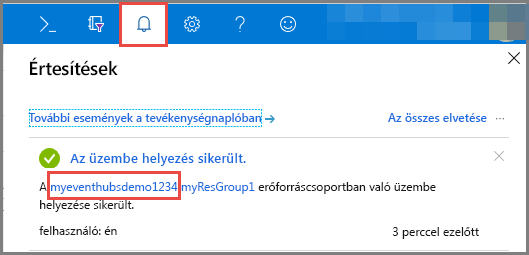
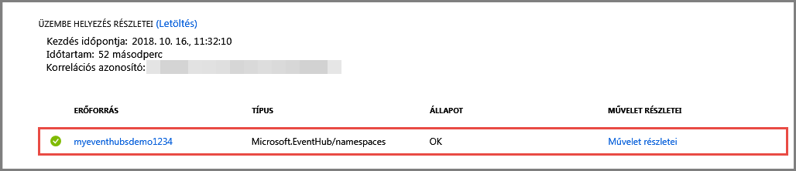
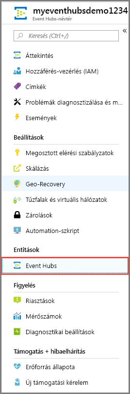
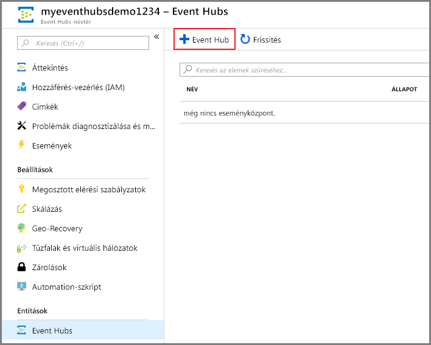
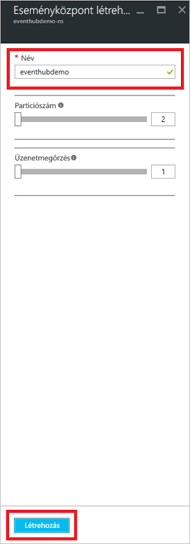

# Rövid útmutató: Eseményközpont létrehozása az Azure Portallal
Az Azure Event Hubs egy Big Data streamplatform és eseményfeldolgozó szolgáltatás, amely másodpercenként több millió esemény fogadására és feldolgozására képes. Az Event Hubs képes az elosztott szoftverek és eszközök által generált események, adatok vagy telemetria feldolgozására és tárolására. Az eseményközpontokba elküldött adatok bármilyen valós idejű elemzési szolgáltató vagy kötegelési/tárolóadapter segítségével átalakíthatók és tárolhatók. Az Event Hubs részletes áttekintéséért lásd az [Event Hubs áttekintését](event-hubs-about.md) és az [Event Hubs-szolgáltatásokat](event-hubs-features.md) ismertető cikket.

Ebben a rövid útmutatóban az [Azure Portal](https://portal.azure.com) használatával hoz létre eseményközpontot.

## Előfeltételek

A rövid útmutató elvégzéséhez győződjön meg róla, hogy rendelkezik az alábbiakkal:

- Egy Azure-előfizetés. Ha még nincs előfizetése, [hozzon létre egy ingyenes fiókot](https://azure.microsoft.com/free/), mielőtt hozzákezd.
- [Visual Studio 2017 3-as frissítés (verziószám: 15.3, 26730.01)](https://www.visualstudio.com/vs) vagy újabb.
- A [.NET Standard SDK](https://www.microsoft.com/net/download/windows) 2.0-s vagy újabb verziója.

## Hozzon létre egy erőforráscsoportot

Az erőforráscsoport Azure-erőforrások logikai gyűjteménye. Minden erőforrás üzembe helyezése és kezelése erőforráscsoportban történik. Erőforráscsoport a következő módon hozhat létre:

1. Jelentkezzen be az [Azure Portalra](https://portal.azure.com).
2. A bal oldali menüben válassza az **Erőforráscsoportok** lehetőséget. Ezután kattintson az **Add** (Hozzáadás) gombra.

   

2. Írjon be egy egyedi nevet az erőforráscsoport számára. A rendszer azonnal ellenőrzi, hogy a név elérhető-e az aktuálisan kiválasztott Azure-előfizetésben.

3. Az **Előfizetés** területen kattintson annak az Azure-előfizetésnek a nevére, amelyben létre szeretné hozni az erőforráscsoportot.

4. Válasszon egy földrajzi helyet az erőforráscsoportnak.

5. Kattintson a **Create** (Létrehozás) gombra.

   

## Event Hubs-névtér létrehozása

Egy Event Hubs-névtér egyedi hatókörkezelési tárolót biztosít, amelyre a teljes tartománynevével lehet hivatkozni, és ebben a tárolóban egy vagy több eseményközpontot is létrehozhat. Ha létre szeretne hozni egy névteret az erőforráscsoportban a portál használatával, végezze el az alábbi műveleteket:

1. Az Azure Portalon kattintson az **Erőforrás létrehozása** gombra a képernyő bal felső részén.

2. Kattintson az **Eszközök internetes hálózata**, majd az **Event Hubs** lehetőségre.

3. A **Névtér létrehozása** területen adja meg a névtér nevét. A rendszer azonnal ellenőrzi, hogy a név elérhető-e.

   

4. Miután ellenőrizte, hogy a névtér neve elérhető-e, válassza ki a tarifacsomagot (Basic vagy Standard). Valamint válassza ki azt az Azure-előfizetést, erőforráscsoportot és helyet, amellyel az erőforrást létre kívánja hozni.
 
5. A névtér létrehozásához kattintson a **Létrehozás** parancsra. Lehet, hogy néhány percet várnia kell, amíg a rendszer teljes mértékben kiépíti az erőforrásokat.
6. Válassza a **Riasztások** elemet, majd válassza ki az eseményközpont-névtér nevével rendelkező **üzemelő példányt**. 

   
6. Válassza ki az üzemelő példányban létrehozott erőforrások listájában az eseményközpont-névteret. 

   
7. Az **Event Hubs-névtér** oldalon válassza a **Megosztott elérési szabályzatok** lehetőséget, majd kattintson a **RootManageSharedAccessKey** elemre.
    
8. Kattintson a másolás gombra, hogy a **RootManageSharedAccessKey** kapcsolati sztringet a vágólapra másolja. Mentse ezt a kapcsolati sztringet egy átmeneti helyre, például a Jegyzettömbbe, mert később szüksége lesz rá.
    
## Eseményközpont létrehozása

Ha eseményközpontot szeretne létrehozni egy névtérben, végezze el a következő műveleteket:

1. Az Event Hubs-névterek oldalon kattintson az **Event Hubs** elemre.
   
    

1. Az ablak tetején kattintson a **+ Eseményközpont** elemre.
   
    
1. Adjon egy nevet az eseményközpontnak, majd kattintson a **Létrehozás** elemre.
   
    

Gratulálunk! A Portal segítségével létrehozott egy Event Hubs-névteret és egy eseményközpontot a névtéren belül. 

## További lépések

Ebben a cikkben egy erőforráscsoportot, egy Event Hubs-névteret és egy eseményközpontot hozott létre. Az események az eseményközpontokba való küldésével vagy onnan való fogadásával kapcsolatos részletes utasításokért tekintse meg a következő oktatóanyagokat:  

- **Események küldése eseményközpontba**: [.NET Core](event-hubs-dotnet-standard-getstarted-send.md), [.NET-keretrendszer](event-hubs-dotnet-framework-getstarted-send.md), [Java](event-hubs-java-get-started-send.md), [Python](event-hubs-python-get-started-send.md), [Node.js](event-hubs-node-get-started-send.md), [Go](event-hubs-go-get-started-send.md), [C](event-hubs-c-getstarted-send.md)
- **Események fogadása az event hub**: [.NET Core](event-hubs-dotnet-standard-getstarted-receive-eph.md), [.NET-keretrendszer](event-hubs-dotnet-framework-getstarted-receive-eph.md), [Java](event-hubs-java-get-started-receive-eph.md), [Python](event-hubs-python-get-started-receive.md), [Node.js ](event-hubs-node-get-started-receive.md), [Go](event-hubs-go-get-started-receive-eph.md), [Apache Storm](event-hubs-storm-getstarted-receive.md)

[Azure portal]: https://portal.azure.com/
[3]: ./media/event-hubs-quickstart-portal/sender1.png
[4]: ./media/event-hubs-quickstart-portal/receiver1.png
