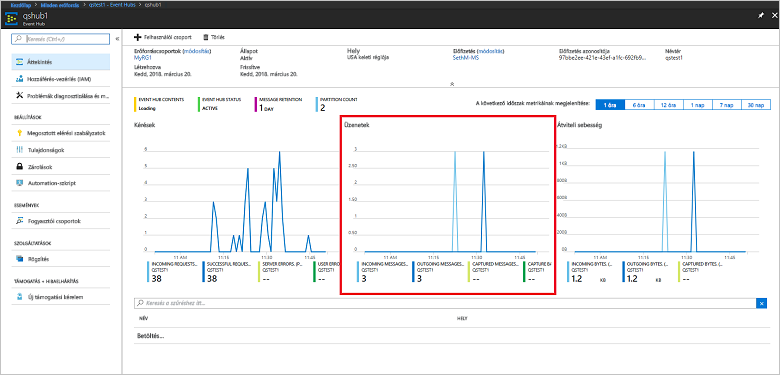

# <a name="quickstart-create-an-event-hub-using-azure-cli"></a>Rövid útmutató: Eseményközpont létrehozása az Azure CLI-vel

Az Azure Event Hubs egy kiválóan méretezhető adatstreamelési platform és feldolgozó szolgáltatás, amely másodpercenként több millió esemény fogadására és feldolgozására képes. Ez a rövid útmutató bemutatja, hogyan hozhatók létre Event Hubs-erőforrások az Azure CLI használatával, majd hogyan küldhetők, illetve fogadhatók eseménystreamek egy eseményközpontból Java-kód használatával.

A rövid útmutató elvégzéséhez szüksége lesz egy Azure-előfizetésre. Ha még nincs előfizetése, [hozzon létre egy ingyenes fiókot][], mielőtt hozzákezd.

## <a name="prerequisites"></a>Előfeltételek

[!INCLUDE [cloud-shell-try-it.md](../../includes/cloud-shell-try-it.md)]

Ha az Azure CLI helyi telepítését és használatát választja, akkor ehhez az oktatóanyaghoz az Azure CLI 2.0.4-es vagy újabb verziójára lesz szükség. Futtassa az `az --version` parancsot a verzió ellenőrzéséhez. Ha telepíteni vagy frissíteni szeretne, olvassa el [az Azure CLI telepítését]( /cli/azure/install-azure-cli) ismertető cikket.

## <a name="log-on-to-azure"></a>Bejelentkezés az Azure-ba

Az alábbi lépések nem szükségesek, ha a parancsokat a Cloud Shellben futtatja. Ha helyileg futtatja a CLI-t, az alábbi lépések elvégzésével jelentkezzen be az Azure-ba, és állítsa be az aktuális előfizetést:

Az alábbi parancs futtatásával jelentkezzen be az Azure-ba:

```azurecli-interactive
az login
```

Állítsa be az aktuális előfizetési környezetet. A `MyAzureSub` értéket cserélje le a használni kívánt Azure-előfizetés nevére:

```azurecli-interactive
az account set --subscription MyAzureSub
``` 

## <a name="provision-resources"></a>Erőforrások kiosztása

Hajtsa végre az alábbi parancsokat az Event Hubs-erőforrások üzembe helyezéséhez. Ne felejtse el lecserélni a `myResourceGroup`, a `namespaceName`, az `eventHubName` és a `storageAccountName` helyőrzőt a megfelelő értékre:

```azurecli-interactive
# Create a resource group
az group create --name myResourceGroup --location eastus

# Create an Event Hubs namespace
az eventhubs namespace create --name namespaceName --resource-group myResourceGroup -l eastus2

# Create an event hub
az eventhubs eventhub create --name eventHubName --resource-group myResourceGroup --namespace-name namespaceName

# Create a general purpose standard storage account
az storage account create --name storageAccountName --resource-group myResourceGroup --location eastus2 --sku Standard_RAGRS --encryption blob

# List the storage account access keys
az storage account keys list --resource-group myResourceGroup --account-name storageAccountName

# Get namespace connection string
az eventhubs namespace authorization-rule keys list --resource-group myResourceGroup --namespace-name namespaceName --name RootManageSharedAccessKey
```

Másolja ki és illessze be a kapcsolati sztringet egy átmeneti helyre, például a Jegyzettömbbe, mert később szüksége lesz rá.

## <a name="stream-into-event-hubs"></a>Streamelés az Event Hubsba

A következő lépés azon mintakód letöltése, amely eseményeket streamel az eseményközpontba, illetve fogadja azokat az Event Processor Host használatával. Először küldje el az üzeneteket:

Klónozza a [Event Hubs GitHub-adattárát](https://github.com/Azure/azure-event-hubs) a következő paranccsal:

```bash
git clone https://github.com/Azure/azure-event-hubs.git
```

Lépjen a **SimpleSend** mappába: `\azure-event-hubs\samples\Java\Basic\SimpleSend\src\main\java\com\microsoft\azure\eventhubs\samples\SimpleSend`. Nyissa meg a SimpleSend.java fájlt, és cserélje le a `"Your Event Hubs namaspace name"` sztringet a cikk „Event Hubs-névtér létrehozása” szakaszában beszerzett Event Hubs-névtérre.

A `"Your event hub"` kifejezést cserélje le az abban a névtérben létrehozott eseményközpont nevére, a `"Your policy name"` kifejezést pedig a névtér megosztott elérési szabályzatának nevére. Ha nem hozott létre új szabályzatot, az alapértelmezett szabályzat a **RootManageSharedAccessKey**. 

Végül cserélje le a `"Your primary SAS key"` értéket az előző lépésben található szabályzat SAS-kulcsának értékére.

### <a name="build-the-application"></a>Az alkalmazás létrehozása 

Lépjen vissza az `\azure-event-hubs\samples\Java\Basic\SimpleSend` mappába és futtassa az alábbi összeállító parancsot:

```shell
mvn clean package -DskipTests
```

### <a name="receive"></a>Fogadás

Most töltse le az Event Processor Host-mintát, amely fogadja az elküldött üzeneteket. Lépjen a **EventProcessorSample** mappába: `\azure-event-hubs\samples\Java\Basic\EventProcessorSample\src\main\java\com\microsoft\azure\eventhubs\samples\eventprocessorsample`.

Az EventProcessorSample.java fájlban cserélje le az `----EventHubsNamespaceName-----` értéket a cikk „Event Hubs-névtér létrehozása” szakaszában beszerzett Event Hubs-névtérre. 

Cserélje le a fájlban található további sztringértékeket is: Az `----EventHubName-----` kifejezést cserélje le az abban a névtérben létrehozott eseményközpont nevére, a `-----SharedAccessSignatureKeyName-----` kifejezést pedig a névtér megosztott elérési szabályzatának nevére. Ha nem hozott létre új szabályzatot, az alapértelmezett szabályzat a **RootManageSharedAccessKey**.

Cserélje le a `---SharedAccessSignatureKey----` értéket az előző lépésben található szabályzat SAS-kulcsának értékére, az `----AzureStorageConnectionString----` értéket a létrehozott tárfiók kapcsolati sztringjére, és a `----StorageContainerName----` értéket a létrehozott tárfiók tárolójának nevére. 

Végül cserélje le a `----HostNamePrefix----` elemet a tárfiók nevére.

### <a name="build-the-receiver"></a>A fogadó létrehozása 

A fogadó alkalmazás létrehozásához lépjen az `\azure-event-hubs\samples\Java\Basic\EventProcessorSample` mappába, és futtassa az alábbi parancsot:

```shell
mvn clean package -DskipTests
```

### <a name="run-the-apps"></a>Az alkalmazások futtatása

Ha a létrehozás sikeresen befejeződött, készen áll az események küldésére és fogadására. Először futtassa a **SimpleSend** alkalmazást, és figyelje meg a küldött eseményeket. A program futtatásához lépjen az `\azure-event-hubs\samples\Java\Basic\SimpleSend` mappába, és futtassa az alábbi parancsot:

```shell
java -jar ./target/simplesend-1.0.0-jar-with-dependencies.jar
```

Ezután futtassa az **EventProcessorSample** alkalmazást, és figyelje meg a fogadott eseményeket. A program futtatásához lépjen az `\azure-event-hubs\samples\Java\Basic\EventProcessorSample` mappába, és futtassa az alábbi parancsot:
   
```shell
java -jar ./target/eventprocessorsample-1.0.0-jar-with-dependencies.jar
```

A két program futtatása után megtekintheti az eseményközpont áttekintési lapját az Azure Portalon a beérkező és a kimenő üzenetek számának megismeréséhez:



## <a name="clean-up-resources"></a>Az erőforrások eltávolítása

Az alábbi paranccsal eltávolítható az erőforráscsoport, a névtér, a tárfiók és az összes kapcsolódó erőforrás. Cserélje le a `myResourceGroup` elemet a létrehozott erőforráscsoport nevére:

```azurecli
az group delete --resource-group myResourceGroup
```

## <a name="understand-the-sample-code"></a>A mintakód értelmezése

Ez a szakasz a mintakód működésének további részleteit ismerteti.

### <a name="send"></a>Küldés

A SimpleSend.java fájlban a legtöbb munka a main() metódusban történik. A kód először egy `ConnectionStringBuilder`-példányt használ a kapcsolati sztring létrehozásához a névtér nevéhez, az eseményközpont nevéhez, az SAS-kulcs nevéhez és magához az SAS-kulcshoz a felhasználó által megadott értékek felhasználásával.

```java
final ConnectionStringBuilder connStr = new ConnectionStringBuilder()
        .setNamespaceName("Your Event Hubs namespace name")
        .setEventHubName("Your event hub")
        .setSasKeyName("Your policy name")
        .setSasKey("Your primary SAS key");
```

Az esemény hasznos adatait tartalmazó Java-objektumot ezután a rendszer JSON-objektummá alakítja át:

```java
final Gson gson = new GsonBuilder().create();

final PayloadEvent payload = new PayloadEvent(1);
byte[] payloadBytes = gson.toJson(payload).getBytes(Charset.defaultCharset());
EventData sendEvent = EventData.create(payloadBytes);  
```

Az Event Hubs-ügyfél az alábbi kódsorral lesz létrehozva:

```java
final EventHubClient ehClient = EventHubClient.createSync(connStr.toString(), executorService);
```

A próba/végleges blokk ciklikus időszeleteléssel eseményt küld egy nem megadott partícióra:

```java
try {
    for (int i = 0; i < 100; i++) {

        String payload = "Message " + Integer.toString(i);
        //PayloadEvent payload = new PayloadEvent(i);
        byte[] payloadBytes = gson.toJson(payload).getBytes(Charset.defaultCharset());
        EventData sendEvent = EventData.create(payloadBytes);

        // Send - not tied to any partition
        // Event Hubs service will round-robin the events across all EventHubs partitions.
        // This is the recommended & most reliable way to send to EventHubs.
        ehClient.sendSync(sendEvent);
    }

    System.out.println(Instant.now() + ": Send Complete...");
    System.in.read();
} finally {
    ehClient.closeSync();
    executorService.shutdown();
}
```

### <a name="receive"></a>Fogadás 

A fogadási művelet az EventProcessorSample.java fájlban megy végbe. Először állandókat deklarál az Event Hubs-névtér nevének és egyéb hitelesítő adatok tárolásához:

```java
String consumerGroupName = "$Default";
String namespaceName = "----NamespaceName----";
String eventHubName = "----EventHubName----";
String sasKeyName = "----SharedAccessSignatureKeyName----";
String sasKey = "----SharedAccessSignatureKey----";
String storageConnectionString = "----AzureStorageConnectionString----";
String storageContainerName = "----StorageContainerName----";
String hostNamePrefix = "----HostNamePrefix----";
```

A SimpleSend programhoz hasonlóan a kód ezután létrehoz egy ConnectionStringBuilder-példányt a kapcsolati sztring létrehozásához:

```java
ConnectionStringBuilder eventHubConnectionString = new ConnectionStringBuilder()
    .setNamespaceName(namespaceName)
    .setEventHubName(eventHubName)
    .setSasKeyName(sasKeyName)
    .setSasKey(sasKey);
```

Az *Event Processor Host* egy osztály, amely leegyszerűsíti az események fogadását az Event Hubsból, mivel kezeli az állandó ellenőrzőpontokat és a párhuzamos fogadásokat az adott eseményközpontokból. A kód most létrehozza az `EventProcessorHost` egy példányát:

```java
EventProcessorHost host = new EventProcessorHost(
    EventProcessorHost.createHostName(hostNamePrefix),
    eventHubName,
    consumerGroupName,
    eventHubConnectionString.toString(),
    storageConnectionString,
    storageContainerName);
```

Néhány hibakezelési kód deklarálása után az alkalmazás meghatározza az `EventProcessor` osztályt, amely az `IEventProcessor` interfész megvalósítása. Ez az osztály dolgozza fel a fogadott eseményeket:

```java
public static class EventProcessor implements IEventProcessor
{
    private int checkpointBatchingCount = 0;
    ...
```

Az `onEvents()` metódus akkor lesz meghívva, ha események érkeznek az eseményközpont ezen partíciójába:

```java
@Override
public void onEvents(PartitionContext context, Iterable<EventData> events) throws Exception
{
    System.out.println("SAMPLE: Partition " + context.getPartitionId() + " got event batch");
    int eventCount = 0;
    for (EventData data : events)
    {
        try
        {
         System.out.println("SAMPLE (" + context.getPartitionId() + "," + data.getSystemProperties().getOffset() + "," +
                data.getSystemProperties().getSequenceNumber() + "): " + new String(data.getBytes(), "UTF8"));
             eventCount++;
                
         // Checkpointing persists the current position in the event stream for this partition and means that the next
         // time any host opens an event processor on this event hub+consumer group+partition combination, it will start
         // receiving at the event after this one. Checkpointing is usually not a fast operation, so there is a tradeoff
         // between checkpointing frequently (to minimize the number of events that will be reprocessed after a crash, or
         // if the partition lease is stolen) and checkpointing infrequently (to reduce the impact on event processing
         // performance). Checkpointing every five events is an arbitrary choice for this sample.
         this.checkpointBatchingCount++;
         if ((checkpointBatchingCount % 5) == 0)
         {
            System.out.println("SAMPLE: Partition " + context.getPartitionId() + " checkpointing at " +
                    data.getSystemProperties().getOffset() + "," + data.getSystemProperties().getSequenceNumber());
            // Checkpoints are created asynchronously. It is important to wait for the result of checkpointing
            // before exiting onEvents or before creating the next checkpoint, to detect errors and to ensure proper ordering.
            context.checkpoint(data).get();
         }
    }
        catch (Exception e)
        {
            System.out.println("Processing failed for an event: " + e.toString());
        }
    }
    System.out.println("SAMPLE: Partition " + context.getPartitionId() + " batch size was " + eventCount + " for host " + context.getOwner());
}
```

## <a name="next-steps"></a>További lépések

Ebben a cikkben egy Event Hubs-névteret és az eseményközpontba történő eseményküldéshez és -fogadáshoz szükséges egyéb erőforrásokat hozott létre. További információért folytassa az alábbi oktatóanyaggal:

> [!div class="nextstepaction"]
> [Event Hubs-adatstreamek adatanomáliáinak vizualizációja](event-hubs-tutorial-visualize-anomalies.md)

[hozzon létre egy ingyenes fiókot]: https://azure.microsoft.com/free/?ref=microsoft.com&utm_source=microsoft.com&utm_medium=docs&utm_campaign=visualstudio
[Install the Azure CLI]: /cli/azure/install-azure-cli
[az group create]: /cli/azure/group#az_group_create
[fully qualified domain name]: https://wikipedia.org/wiki/Fully_qualified_domain_name
