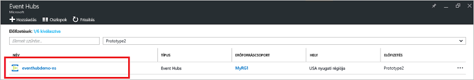
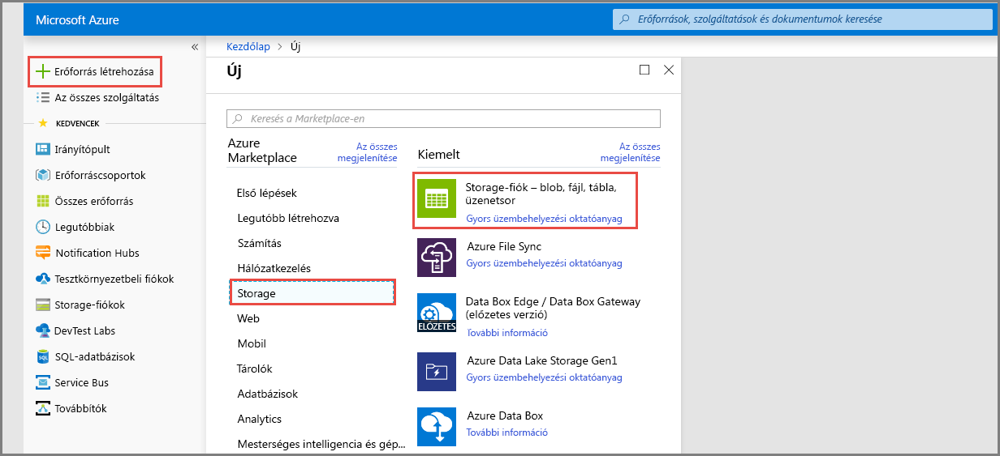
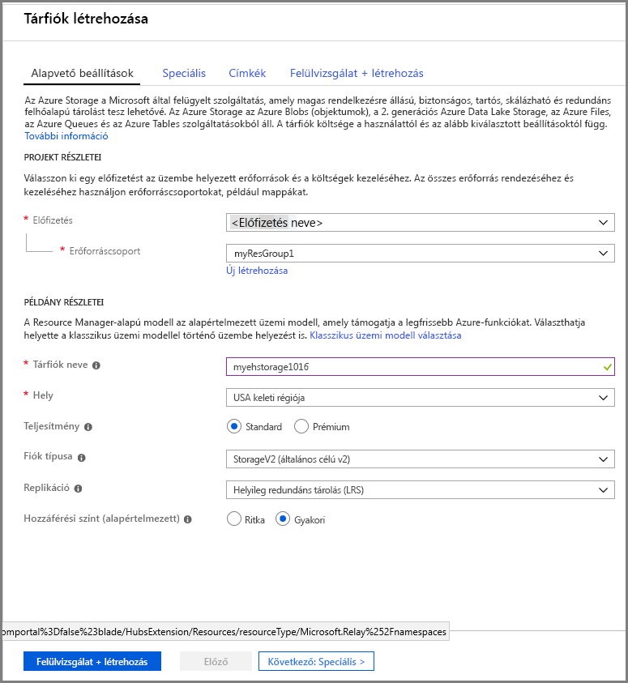
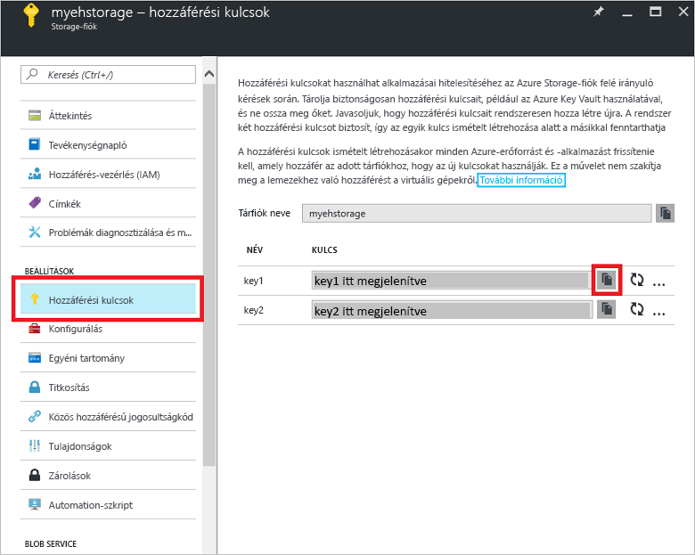

# Rövid útmutató: Eseményközpont létrehozása az Azure Portallal

Az Azure Event Hubs egy kiválóan méretezhető adatstreamelési platform és feldolgozó szolgáltatás, amely másodpercenként több millió esemény fogadására és feldolgozására képes. Ez a rövid útmutató bemutatja, hogyan hozhat létre egy eseményközpontot az [Azure Portallal](https://portal.azure.com), majd hogyan küldhet, illetve fogadhat adatokat egy eseményközpontból a .NET Standard SDK használatával.

A rövid útmutató elvégzéséhez szüksége lesz egy Azure-előfizetésre. Ha még nincs előfizetése, [hozzon létre egy ingyenes fiókot][], mielőtt hozzákezd.

## Előfeltételek

A rövid útmutató elvégzéséhez győződjön meg arról, hogy rendelkezik az alábbiakkal:

- [Visual Studio 2017 3-as frissítés (verziószám: 15.3, 26730.01)](http://www.visualstudio.com/vs) vagy újabb.
- A [.NET Standard SDK](https://www.microsoft.com/net/download/windows) 2.0-s vagy újabb verziója.

## Hozzon létre egy erőforráscsoportot

Az erőforráscsoport Azure-erőforrások logikai gyűjteménye. Minden erőforrás üzembe helyezése és kezelése erőforráscsoportban történik. Erőforráscsoport a következő módon hozhat létre:

1. A bal oldali menüben válassza az **Erőforráscsoportok** lehetőséget. Ezután kattintson az **Add** (Hozzáadás) gombra.

   ![][1]

2. Írjon be egy egyedi nevet az erőforráscsoport számára. A rendszer azonnal ellenőrzi, hogy a név elérhető-e az aktuálisan kiválasztott Azure-előfizetésben.

3. Az **Előfizetés** területen kattintson annak az Azure-előfizetésnek a nevére, amelyben létre szeretné hozni az erőforráscsoportot.

4. Válasszon egy földrajzi helyet az erőforráscsoportnak.

5. Kattintson a **Create** (Létrehozás) gombra.

   ![][2]

## Event Hubs-névtér létrehozása

Egy Event Hubs-névtér egyedi hatókörkezelési tárolót biztosít, amelyre a teljes tartománynevével lehet hivatkozni, és ebben a tárolóban egy vagy több eseményközpontot is létrehozhat. Ha létre szeretne hozni egy névteret az erőforráscsoportban a Portal használatával, tegye az alábbiakat:

1. Jelentkezzen be az [Azure Portal][], és kattintson az **Erőforrás létrehozása** gombra a képernyő bal felső részén.

2. Kattintson az **Eszközök internetes hálózata**, majd az **Event Hubs** lehetőségre.

3. A **Névtér létrehozása** területen adja meg a névtér nevét. A rendszer azonnal ellenőrzi, hogy a név elérhető-e.

   

4. Miután ellenőrizte, hogy a névtér neve elérhető-e, válassza ki a tarifacsomagot (Basic vagy Standard). Valamint válassza ki azt az Azure-előfizetést, erőforráscsoportot és helyet, amellyel az erőforrást létre kívánja hozni.
 
5. A névtér létrehozásához kattintson a **Létrehozás** parancsra. Lehet, hogy néhány percet várnia kell, amíg a rendszer teljes mértékben kiépíti az erőforrásokat.

6. A névterek listájában a Portalon kattintson az újonnan létrehozott névtérre.

7. Kattintson a **Megosztott elérési szabályzatok** lehetőségre, majd a **RootManageSharedAccessKey** elemre.
    
8. Kattintson a másolás gombra, hogy a **RootManageSharedAccessKey** kapcsolati sztringet a vágólapra másolja. Mentse ezt a kapcsolati sztringet egy átmeneti helyre, például a Jegyzettömbbe, mert később szüksége lesz rá.
    
## Eseményközpont létrehozása

Ha eseményközpontot szeretne létrehozni egy névtérben, tegye a következőket:

1. Az Event Hubs névtérlistájában kattintson az újonnan létrehozott névtérre.      
   
     

2. A névtér ablakában kattintson az **Event Hubs** elemre.
   
    

1. Az ablak tetején kattintson a **+ Eseményközpont hozzáadása** elemre.
   
    
1. Adjon egy nevet az eseményközpontnak, majd kattintson a **Létrehozás** elemre.
   
    

Gratulálunk! A Portal segítségével létrehozott egy Event Hubs-névteret és egy eseményközpontot a névtéren belül.

## Tárfiók létrehozása az Event Processor Host számára

Az Event Processor Host egy intelligens ügynök, amely leegyszerűsíti az események fogadását az Event Hubsból, mivel kezeli az állandó ellenőrzőpontokat és a párhuzamos fogadásokat. Az ellenőrzőpontok használatához az Event Processor Hostnak tárfiókra van szüksége. Az alábbi példa bemutatja, hogyan hozhat létre tárfiókot és hogyan szerezheti be a hozzáférési kulcsokat:

1. Jelentkezzen be az [Azure Portal][Azure Portal], és kattintson az **Új** gombra a képernyő bal felső részén.

2. Kattintson a **Tárolás**, majd a **Tárfiók** elemre.
   
    

3. A **Tárfiók létrehozása** területen írja be a tárfiók nevét. Válassza ki azt az Azure-előfizetést, erőforráscsoportot és helyet, amellyel az erőforrást létre kívánja hozni. Ezt követően kattintson a **Create** (Létrehozás) gombra.
   
    

4. A tárfiókok listáján kattintson az újonnan létrehozott tárfiókra.

5. A Tárfiók ablakban válassza a **Hozzáférési kulcsok** elemet. Másolja ki a **key1** értékét, mert később szüksége lesz rá.
   
    

## A minták letöltése és futtatása

A következő lépés azon mintakód futtatása, amely eseményeket küld az eseményközpontba, illetve fogadja azokat az Event Processor Host használatával. 

Először töltse le a [SampleSender](https://github.com/Azure/azure-event-hubs/tree/master/samples/DotNet/Microsoft.Azure.EventHubs/SampleSender) és a [SampleEphReceiver](https://github.com/Azure/azure-event-hubs/tree/master/samples/DotNet/Microsoft.Azure.EventHubs/SampleEphReceiver) mintát a GitHubról, vagy klónozza a következőt: [azure-event-hubs repo](https://github.com/Azure/azure-event-hubs).

### Küldő

1. Nyissa meg a Visual Studiót, a **File** (Fájl) menüben kattintson az **Open** (Megnyitás) elemre, majd válassza a **Project/Solution** (Projekt/Megoldás) lehetőséget.

2. Keresse meg a korábban letöltött **SampleSender** mintamappát, majd kattintson kétszer a SampleSender.sln fájlra a projekt betöltéséhez a Visual Studióba.

3. A Megoldáskezelőben kattintson duplán a Program.cs fájlra a Visual Studio-szerkesztőben való megnyitásához.

4. Cserélje le az `EventHubConnectionString` értéket a névtér létrehozásakor beszerzett kapcsolati szrtringre.

5. Cserélj le az `EventHubName` kifejezést az abban a névtérben létrehozott eseményközpont nevére.

6. A **Build** (Létrehozás) menüben a **Build Solution** (Megoldás létrehozása) elemre kattintva győződjön meg arról, hogy nincsenek hibák.

### Fogadó

1. Nyissa meg a Visual Studiót, a **File** (Fájl) menüben kattintson az **Open** (Megnyitás) elemre, majd válassza a **Project/Solution** (Projekt/Megoldás) lehetőséget.

2. Keresse meg az 1. lépésben letöltött **SampleEphReceiver** mintamappát, majd kattintson kétszer a SampleEphReceiver.sln fájlra a projekt betöltéséhez a Visual Studióba.

3. A Megoldáskezelőben kattintson duplán a Program.cs fájlra a Visual Studio-szerkesztőben való megnyitásához.

4. Cserélje az alábbi változóértékeket:
    1. `EventHubConnectionString`: Cserélje le a névtér létrehozásakor beszerzett kapcsolati sztringre.
    2. `EventHubName`: Cserélje le az abban a névtérben létrehozott eseményközpont nevére.
    3. `StorageContainerName`: A tároló neve. Adjon meg egy egyedi nevet, és a tároló létrejön az alkalmazás futtatásakor.
    4. `StorageAccountName`: A létrehozott tárfiók neve.
    5. `StorageAccountKey`: Az tárfiók az Azure Portalról beszerzett kulcsa.

5. A **Build** (Létrehozás) menüben a **Build Solution** (Megoldás létrehozása) elemre kattintva győződjön meg arról, hogy nincsenek hibák.

### Az alkalmazások futtatása

Először futtassa a **SampleSender** alkalmazást, és figyelje meg az elküldött 100 üzenetet. Nyomja le az **Enter** billentyűt a program leállításához.

![][3]

Ezután futtassa a **SampleEphReceiver** alkalmazást, és figyelje meg az Event Processor Hostban fogadott üzeneteket.

![][4]
 
## Az erőforrások eltávolítása

A portálon eltávolíthatja a tárfiókot, a névteret és az eseményközpontot. 

1. Az Azure Portalon kattintson a **Minden erőforrás** lehetőségre a bal oldali panelen. 
2. Kattintson a törölni kívánt tárfiókra vagy névtérre. A névtér törlésével a benne található eseményközpontok is el lesznek távolítva.
3. A képernyő felső részén található menüsávon kattintson a **Törlés** elemre. Erősítse meg a törlési szándékát. 

## További lépések

Ebben a cikkben egy Event Hubs-névteret és az eseményközpontba történő eseményküldéshez és -fogadáshoz szükséges egyéb erőforrásokat hozott létre. További információért folytassa az alábbi oktatóanyaggal:

> [!div class="nextstepaction"]
> [Event Hubs-adatstreamek adatanomáliáinak vizualizációja](event-hubs-tutorial-visualize-anomalies.md)

[hozzon létre egy ingyenes fiókot]: https://azure.microsoft.com/free/?ref=microsoft.com&utm_source=microsoft.com&utm_medium=docs&utm_campaign=visualstudio
[Azure Portal]: https://portal.azure.com/
[1]: ./media/event-hubs-quickstart-portal/resource-groups1.png
[2]: ./media/event-hubs-quickstart-portal/resource-groups2.png
[3]: ./media/event-hubs-quickstart-portal/sender1.png
[4]: ./media/event-hubs-quickstart-portal/receiver1.png
