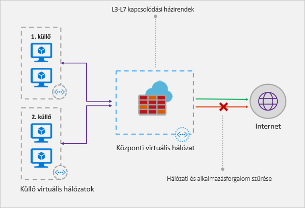

# Mi az Azure Firewall?

Az Azure Firewall egy felügyelt, felhőalapú hálózatbiztonsági szolgáltatás, amely Azure Virtual Network-erőforrásait védi. Ez egy szolgáltatásként nyújtott teljesen állapotalapú tűzfal, beépített magas rendelkezésre állással és korlátlan felhőalapú skálázhatósággal. 

Központilag hozhatja létre, érvényesítheti és naplózhatja az alkalmazás- és hálózatelérési szabályzatokat az előfizetésekre és a virtuális hálózatokra vonatkozóan. Az Azure Firewall statikus nyilvános IP-címet használ a virtuális hálózat erőforrásaihoz, így a külső tűzfalak azonosíthatják a virtuális hálózatból érkező forgalmat.  A szolgáltatás teljesen integrálva van az Azure Monitorral a naplózás és az elemzés érdekében.

## Szolgáltatások

Az Azure Firewall az alábbi szolgáltatásokat kínálja:

### Beépített magas rendelkezésre állás
A magas rendelkezésre állás be van építve a rendszerbe, így nincs szükség további terheléselosztókra, és semmit nem kell konfigurálnia.

### Korlátlan felhőalapú skálázhatóság 
Az Azure Firewall akármeddig felskálázható a változó hálózati forgalom kezeléséhez, így a költségvetést nem szükséges a csúcsforgalomhoz igazítania.

### Alkalmazások teljes tartománynevére vonatkozó szűrési szabályok

A kimenő HTTP/S-forgalom korlátozható teljes tartománynevek (FQDN) egy megadott listájára (helyettesítő karakterek is alkalmazhatók). Ehhez a szolgáltatáshoz nem szükséges SSL-lezárás.

### Hálózati forgalomra vonatkozó szűrési szabályok

Központilag hozhat létre *engedélyező* vagy *tiltó* hálózatszűrési szabályokat forrás és cél IP-cím, port és protokoll alapján. Az Azure Firewall teljes mértékben állapotalapú, így képes megkülönböztetni különböző típusú kapcsolatok érvényes csomagjait. A szabályok több előfizetésen és virtuális hálózaton érvényesíthetők és naplózhatók.

### FQDN-címkék

Az FQDN-címkékkel egyszerűen engedélyezheti a jól ismert Azure-szolgáltatások hálózati forgalmát a tűzfalon keresztül. Tegyük fel például, hogy engedélyezni kívánja a Windows Update hálózati forgalmát a tűzfalon keresztül. Létrehozhat egy alkalmazásszabályt, és hozzáadhatja a Windows Update címkéjét. A Windows Update hálózati forgalma ezután akadálytalanul áthaladhat a tűzfalon.

### Kimenő SNAT-támogatás

A rendszer a kimenő virtuális hálózati forgalomhoz tartozó minden IP-címet lefordít az Azure Firewall nyilvános IP-címére (forráshálózati címfordítás, SNAT). Azonosíthatja és engedélyezheti a virtuális hálózatból a távoli internetes célhelyekre irányuló forgalmat.

### Bejövő DNAT-támogatás

A tűzfal nyilvános IP-címére érkező bejövő hálózati forgalmat a rendszer lefordítja (Destination Network Address Translation, célhálózati címfordítás), és a virtuális hálózat magánhálózati IP-címeire szűri. 

### Azure Monitor-naplózás

Minden esemény integrálva van az Azure Monitorral, így archiválhatja a naplókat egy tárfiókba, valamint eseményközpontokba streamelheti vagy a Log Analyticsbe küldheti az eseményeket.

## Ismert problémák

Az Azure Firewall az alábbi ismert hibákkal rendelkezik:

|Probléma  |Leírás  |Kezelés  |
|---------|---------|---------|
|Ütközés az Azure Security Center (ASC) igény szerinti (JIT) szolgáltatásával|Ha a virtuális gépet a JIT használatával éri el, és az egy olyan alhálózaton található, amelynek a felhasználó által megadott útvonala alapértelmezett átjáróként az Azure Firewallra mutat, az ASC JIT szolgáltatása nem működik. Ez az aszimmetrikus útválasztás eredménye – a csomag a virtuális gép nyilvános IP-címen keresztül érkezik be (a JIT nyitotta meg a hozzáférést), a visszatérési útvonal azonban a tűzfalon keresztül vezet, amely eldobja a csomagot, mivel a tűzfalon nem lett munkamenet létrehozva.|A probléma megkerüléséhez helyezze a JIT használatával elért virtuális gépeket egy olyan külön alhálózatra, amelyen nincs felhasználó által megadott, a tűzfalra mutató útvonal.|
|A globális társviszony-létesítéssel rendelkező küllős topológia nem támogatott|A küllős modell használata, amelyben a központ és a tűzfal az egyik Azure-régióban van üzembe helyezve, a küllők pedig egy másik Azure-régióban. A központhoz globális virtuális társhálózatokkal történő csatlakozás nem támogatott.|Ez az elvárt működés. További információkért tekintse meg [az Azure-előfizetések és -szolgáltatások korlátozásait, kvótáit és megkötéseit](../azure-subscription-service-limits.md#azure-firewall-limits) ismertető témakört.|
A nem TCP/UDP-protokollokra (például ICMP) vonatkozó hálózati szűrési szabályok nem működnek az internetre irányuló forgalom esetében|A nem TCP/UDP-protokollokra vonatkozó hálózati szűrési szabályok nem működnek a nyilvános IP-címre vonatkozó forráshálózati címfordítással. A nem TCP/UDP-protokollok a küllők alhálózatai és a virtuális hálózatok között támogatottak.|Az Azure Firewall a Standard Load Balancert használja, [amely jelenleg nem támogatja a forráshálózati címfordítást az IP-protokollokon](https://docs.microsoft.com/azure/load-balancer/load-balancer-standard-overview#limitations). Jelenleg vizsgáljuk a lehetőségeket, hogy ezt a forgatókönyvet valamelyik későbbi kiadás támogathassa majd.|
|A DNAT nem működik a 80-as és 22-es port esetén.|A NAT-szabálygyűjtemény Destination Port (Célport) mezője nem tartalmazhatja a 80-as vagy a 22-es portot.|Dolgozunk a probléma mielőbbi megoldásán. Addig is használjon egy másik portot a NAT-szabályok célportjaként. A 80-as vagy a 22-es port továbbra is használható a lefordított portként (például leképezheti a nyilvános ip:81-et a magánhálózati ip:80-ra).|
|A PowerShell és a CLI nem támogatja az ICMP-t|Az Azure PowerShell és a CLI nem támogatja az ICMP-t érvényes protokollként a hálózati szabályok között.|Az ICMP továbbra is használható protokollként a portálon vagy a REST API-n keresztül. Dolgozunk azon, hogy hamarosan a PowerShellben és a CLI-ben is elérhető legyen az ICMP.|
|Az FQDN-címkék protokoll: port megadását igénylik|Az FQDN-címkékkel rendelkező alkalmazásszabályok port:protokoll definíciót igényelnek.|A port:protokoll értékként használhat **https**-t. Dolgozunk azon, hogy ez a mező FQDN-címkék használatakor választható legyen.|
|A tűzfalak áthelyezése más erőforráscsoportba vagy előfizetésbe nem támogatott.|A tűzfalak áthelyezése más erőforráscsoportba vagy előfizetésbe nem támogatott.|A funkció támogatása szerepel a terveink között. Ahhoz, hogy egy tűzfalat áthelyezzen másik erőforráscsoportba vagy előfizetésbe, először törölnie kell az aktuális példányt, és újra létre kell hoznia az új erőforráscsoportban vagy előfizetésben.|

## További lépések

- [Oktatóanyag: Azure Firewall üzembe helyezése és konfigurálása az Azure Portalon](tutorial-firewall-deploy-portal.md)
- [Azure Firewall üzembe helyezése sablon használatával](deploy-template.md)
- [Azure Firewall-tesztkörnyezet létrehozása](scripts/sample-create-firewall-test.md)

