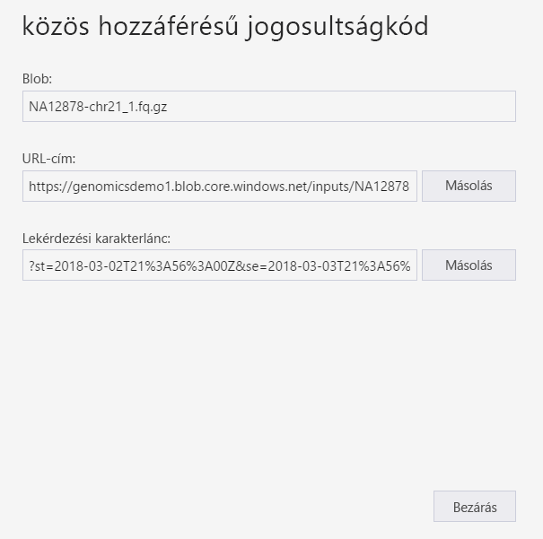
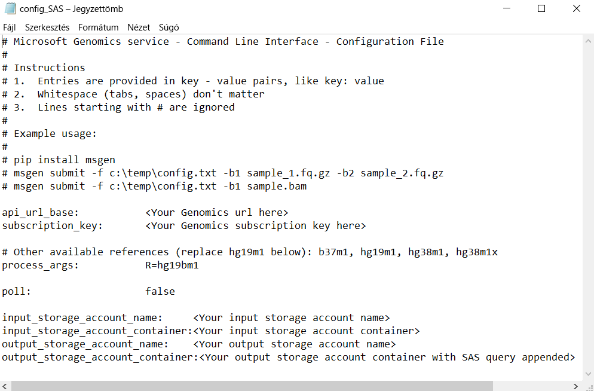

# <a name="submit-a-workflow-to-microsoft-genomics-using-a-sas-instead-of-a-storage-account-key"></a>Munkafolyamat elküldése Microsoft Genomics számára tárfiókkulcs helyett SAS használatával 

Ez a rövid útmutató azt ismerteti, hogyan lehet elküldeni egy munkafolyamatot a Microsoft Genomics szolgáltatásnak egy config.txt fájllal, amely tárfiókkulcs helyett [közös hozzáférésű jogosultságkódot (SAS)](https://docs.microsoft.com/azure/storage/common/storage-dotnet-shared-access-signature-part-1) tartalmaz. Ez a funkció hasznos lehet, ha biztonsági aggályokat vet fel, ha a tárfiókkulcs látható a config.txt fájlban. Ez a cikk feltételezi, hogy már telepítette és futtatta az `msgen` ügyfelet, és megismerkedett az Azure Storage használatával. Ha sikeresen elküldte a munkafolyamatot a rendelkezésre álló mintaadatokkal, készen áll a rövid útmutató folytatására. 

## <a name="what-is-a-sas"></a>Mi az SAS?
A [közös hozzáférésű jogosultságkód (SAS)](https://docs.microsoft.com/azure/storage/common/storage-dotnet-shared-access-signature-part-1) delegált hozzáférést biztosít a tárfiókon lévő erőforrásokhoz. Az SAS használatával a fiókkulcsok megosztása nélkül lehet hozzáférést biztosítani a tárfiókban található erőforrásokhoz. Ez a lényege a közös hozzáférésű jogosultságkód alkalmazásokban való használatának – az SAS a fiókkulcsok veszélyeztetése nélkül teszi lehetővé a tárolási erőforrások megosztását.

A Microsoft Genomicsnak elküldött SAS egy [szolgáltatásalapú SAS](https://docs.microsoft.com/rest/api/storageservices/Constructing-a-Service-SAS), amely csak a bemeneti és kimeneti fájlok tárolására használt blobhoz vagy tárolóhoz biztosít hozzáférést. 

A szolgáltatási szintű közös hozzáférésű jogosultságkód (SAS) URI-je a SAS által biztosított hozzáférés célerőforrásához tartozó URI-ból és a SAS-tokenből áll. A SAS-token az a lekérdezési sztring, amely a SAS hitelesítéséhez szükséges összes információt tartalmazza, valamint meghatározza az erőforrást, a hozzáférhető engedélyeket, az aláírás érvényességének időtartamát, a kérelmek származási helyeként támogatott IP-címet vagy címtartományt, a kérés létrehozásához támogatott protokollt, a kéréshez kapcsolódó, választható hozzáférésiszabályzat-azonosítót és magát az aláírást. 

## <a name="sas-needed-for-submitting-a-workflow-to-the-microsoft-genomics-service"></a>A Microsoft Genomics szolgáltatásnak elküldendő munkafolyamathoz szükséges SAS
A Microsoft Genomics szolgáltatásnak elküldött minden egyes munkafolyamathoz legalább két SAS-token szükséges, az egyik a bemeneti fájlhoz, a másik pedig a kimeneti tárolóhoz.

A bemeneti fájlhoz tartozó SAS-nek a következő tulajdonságokkal kell rendelkeznie:
1.  Hatókör (fiók, tároló, blob): blob
2.  Lejárat: 48 óra múlva
3.  Engedélyek: olvasás

A kimeneti tárolóhoz tartozó SAS-kódnak a következő tulajdonságokkal kell rendelkeznie:
1.  Hatókör (fiók, tároló, blob): tároló
2.  Lejárat: 48 óra múlva
3.  Engedélyek: olvasás, írás, törlés


## <a name="create-a-sas-for-the-input-files-and-the-output-container"></a>SAS létrehozása a bemeneti fájlokhoz és a kimeneti tárolóhoz
SAS-tokent kétféleképpen lehet létrehozni: az Azure Storage Explorer használatával vagy programozással.  Kódírással saját maga is összeállíthatja az SAS-t, de használhatja az Azure Storage SDK-t is a választott nyelven.


### <a name="set-up-create-a-sas-using-azure-storage-explorer"></a>Beállítás: SAS létrehozása az Azure Storage Explorerrel

Az [Azure Storage Explorer](https://azure.microsoft.com/features/storage-explorer/) az Azure Storage-ban tárolt erőforrások kezelésére szolgáló eszköz.  Az Azure Storage Explorer használatáról [itt](https://docs.microsoft.com/azure/vs-azure-tools-storage-manage-with-storage-explorer) talál további információt.

A bemeneti fájlokhoz tartozó SAS-kód hatókörének az adott bemeneti fájlra (blobra) kell kiterjednie. SAS-token létrehozásához [kövesse ezeket az utasításokat](https://docs.microsoft.com/azure/storage/blobs/storage-quickstart-blobs-storage-explorer#work-with-shared-access-signatures). Az SAS létrehozása után a lekérdezési sztringgel ellátott teljes URL-cím, illetve a lekérdezési sztring önmagában is megjelenik a képernyőn, ahonnan mindkettő másolható.

 


### <a name="set-up-create-a-sas-programattically"></a>Beállítás: SAS létrehozása programozással

A SAS Azure Storage SDK használatával történő létrehozásáról számos nyelven elérhető dokumentáció, így a [.NET](https://docs.microsoft.com/azure/storage/blobs/storage-dotnet-shared-access-signature-part-2#generate-a-shared-access-signature-uri-for-a-blob), a [Python](https://docs.microsoft.com/azure/storage/blobs/storage-python-how-to-use-blob-storage) és a [Node.js](https://docs.microsoft.com/azure/storage/blobs/storage-nodejs-how-to-use-blob-storage#work-with-shared-access-signatures) nyelveken is. 

Az SAS SDK nélküli létrehozása esetén az SAS lekérdezési sztringjét közvetlenül is össze lehet állítani, beleértve az SAS hitelesítéshez szükséges összes információt is. Ezek az [utasítások](https://docs.microsoft.com/rest/api/storageservices/constructing-a-service-sas) részletesen leírják az SAS lekérdezési sztring összetevőit és az összeállítás módját. A szükséges SAS-aláírás létrehozásához a rendszer ezeknek az [utasításoknak](https://docs.microsoft.com/rest/api/storageservices/service-sas-examples) megfelelően létrehoz egy HMAC-t a blob/tároló hitelesítési információi alapján.


## <a name="add-the-sas-to-the-configtxt-file"></a>SAS hozzáadása a config.txt fájlhoz
Ha egy SAS lekérdezési sztringgel kíván futtatni egy munkafolyamatot a Microsoft Genomics szolgáltatáson keresztül, a config.txt fájl szerkesztésével távolítsa el a kulcsokat a config.txt fájlból. Ezután az ábrán látható módon fűzze hozzá a SAS lekérdezési sztringet (amely egy `?` karakterrel kezdődik) a kimeneti tároló nevéhez. 



A Microsoft Genomics Python-ügyfélen keresztül a következő paranccsal küldheti el a munkafolyamatot. Fűzze hozzá a megfelelő SAS-lekérdezési sztringet az egyes bemeneti blobnevekhez:

```python
msgen submit -f [full path to your config file] -b1 [name of your first paired end read file, SAS query string appended] -b2 [name of your second paired end read file, SAS query string appended]
```

### <a name="if-adding-the-input-file-names-to-the-configtxt-file"></a>A bemeneti fájlnevek hozzáadása a config.txt fájlhoz
A párosított olvasás vége fájlok nevét közvetlenül is hozzáadhatja a config.txt fájlhoz, a hozzáfűzött SAS lekérdezési tokenekkel együtt, a következőképpen:


Ebben az esetben a Microsoft Genomics Python-ügyféllel küldje el a munkafolyamatot az alábbi paranccsal, a `-b1` és `-b2` parancs kihagyásával:

```python
msgen submit -f [full path to your config file] 
```

## <a name="next-steps"></a>További lépések
Ebben a cikkben fiókkulcsok helyett SAS-tokenekkel küldött el egy munkafolyamatot a Microsoft Genomics szolgáltatásba az `msgen` Python-ügyfélen keresztül. A munkafolyamatok elküldésével, illetve a Microsoft Genomics szolgáltatásban használható egyéb parancsokkal kapcsolatos további információért tekintse meg a [Gyakori kérdések](frequently-asked-questions-genomics.md) szakaszt. 
