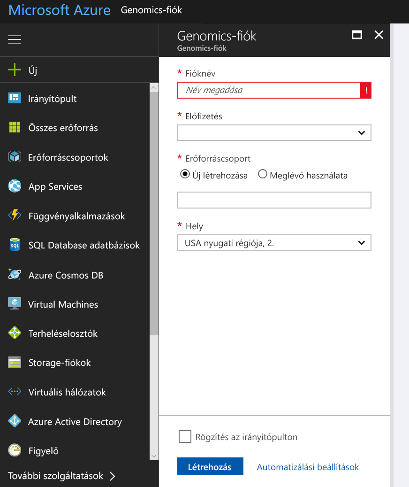
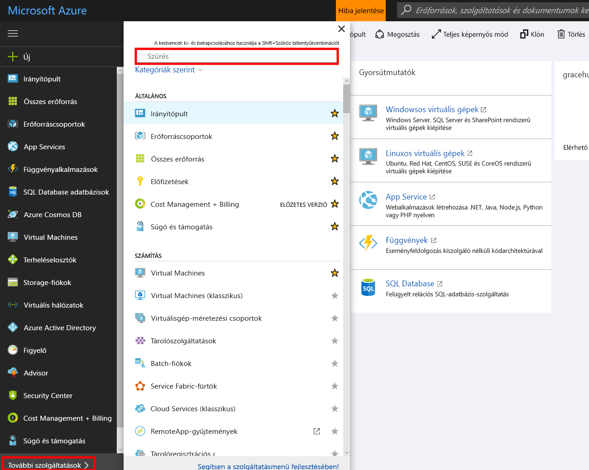
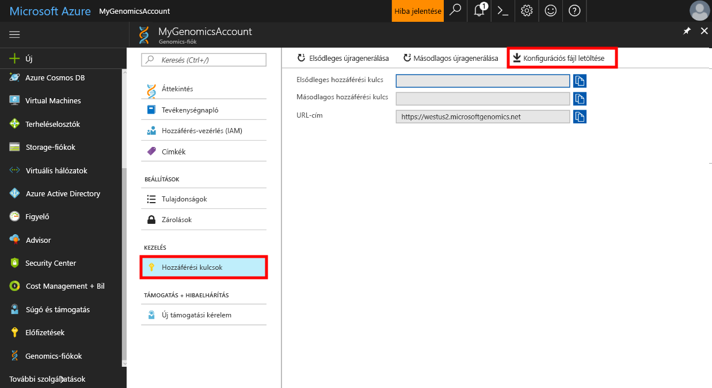

# <a name="quickstart-run-a-workflow-through-the-microsoft-genomics-service"></a>Rövid útmutató: Munkafolyamat futtatása a Microsoft Genomics szolgáltatással

A Microsoft Genomics egy méretezhető, biztonságos másodlagos elemzési szolgáltatás, amely képes a genom gyors feldolgozására, és nyersolvasásokból kiindulva rendezett beolvasásokat és változóhívásokat hoz létre. Bevezetés mindössze néhány lépésben: 
1.  Előkészületek: Hozzon létre egy Microsoft Genomics-fiókot az Azure Portalon, majd telepítse a Microsoft Genomics Python-klienst a helyi környezetben. 
2.  Bemeneti adatok feltöltése: Hozzon létre egy Microsoft Storage-fiókot az Azure Portalon, és töltse fel a bemeneti fájlokat. A bemeneti fájloknak párosított végű beolvasásokból kell állniuk (fastq- vagy bam-fájlok).
3.  Futtatás: Használja a Microsoft Genomics parancssori felületét a munkafolyamatok futtatásához a Microsoft Genomics szolgáltatásban. 

További információk a Microsoft Genomics szolgáltatásról: [Mi az a Microsoft Genomics?](overview-what-is-genomics.md)

## <a name="set-up-create-a-microsoft-genomics-account-in-the-azure-portal"></a>Előkészületek: Microsoft Genomics-fiók létrehozása az Azure Portalon

Microsoft Genomics-fiók létrehozásához lépjen az [Azure Portalra](https://portal.azure.com/#create/Microsoft.Genomics). Ha még nem rendelkezik Azure-előfizetéssel, a Microsoft Genomics-fiók létrehozása előtt hozzon létre egyet. 




Konfigurálja Genomics-fiókját az alábbi információkkal az előző képen látható módon. 

 |**Beállítás**          |  **Ajánlott érték**  | **Mező leírása** |
 |:-------------       |:-------------         |:----------            |
 |Fióknév         | MyGenomicsAccount     |Válasszon egyedi fiókazonosítót. Az érvényes nevekkel kapcsolatban lásd az [elnevezési szabályokat](https://docs.microsoft.com/azure/architecture/best-practices/naming-conventions) ismertető cikket. |
 |Előfizetés         | Az Ön előfizetésének neve|Ez az Azure-szolgáltatásokhoz tartozó számlázási egység – Az előfizetései részleteivel kapcsolatban lásd az [előfizetéseket](https://account.azure.com/Subscriptions) ismertető cikket. |      
 |Erőforráscsoport       | MyResourceGroup       |  Az erőforráscsoportok használatával több Azure-erőforrást (Storage-fiók, Genomics-fiók stb.) rendezhet egy csoportba a könnyebb kezelhetőség érdekében. További információ: [Erőforráscsoportok] (https://docs.microsoft.com/azure/azure-resource-manager/resource-group-overview#resource-groups). Az érvényes erőforráscsoport-nevekkel kapcsolatban lásd az [elnevezési szabályokat](https://docs.microsoft.com/azure/architecture/best-practices/naming-conventions) ismertető cikket. |
 |Hely                   | USA nyugati régiója, 2.                    |    A szolgáltatás a következő régiókban érhető el: az USA 2. nyugati régiója, Nyugat-Európa, és Délkelet-Ázsia |


A felső menüsávon kattintson az Értesítések parancsra az üzembehelyezési folyamat megfigyeléséhez.


## <a name="set-up-install-the-microsoft-genomics-python-client"></a>Előkészületek: A Microsoft Genomics Python-kliens telepítése

A felhasználóknak telepíteniük kell a Pythont, valamint a Microsoft Genomics Python-klienst a helyi környezetben. 

### <a name="install-python"></a>Telepítse a Pythont

A Microsoft Genomics Python-kliens a Python 2.7-es verziójával kompatibilis. Javasoljuk a 2.7.12-es vagy újabb verzió használatát. Ajánlott verzió: 2.7.14. A letöltés [itt](https://www.python.org/downloads/) található. 


### <a name="install-the-microsoft-genomics-client"></a>A Microsoft Genomics-kliens telepítése

Az `msgen` Microsoft Genomics-klienst a Python pip használatával telepítheti. Az alábbi utasítások feltételezik, hogy a Python már telepítve van a rendszer elérési útján. Ha problémát tapasztal azzal kapcsolatban, hogy a rendszer nem ismeri fel a pip-telepítést, hozzá kell adnia a Pythont és a szkripteket tartalmazó almappát a rendszer elérési útjához.


```
pip install --upgrade --no-deps msgen
pip install msgen
```


Ha nem szeretné rendszerszintű bináris fájlként telepíteni az `msgen` klienst és módosítani a rendszerszintű Python-csomagokat, használja a `–-user` jelzőt a `pip` telepítővel.
Ha a csomag alapú telepítést vagy a setup.py fájlt használja, azzal minden szükséges csomagot telepít. Egyéb esetben a msgenhez szükséges alapszintű csomagok a következők: 

 * [Azure-tároló](https://pypi.python.org/pypi/azure-storage). 
 * [Kérések](https://pypi.python.org/pypi/requests). 


Az említett csomagokat `pip`, `easy_install` vagy szabványos `setup.py` eljárásokkal is telepítheti. 


### <a name="test-the-microsoft-genomics-client"></a>A Microsoft Genomics-kliens tesztelése
A Microsoft Genomics-kliens teszteléséhez töltse le a konfigurációs fájlt a Genomics-fiókból. Lépjen be Genomics-fiókjába. Ehhez kattintson a bal felső sarokban található **Minden szolgáltatás** elemre, majd szűréssel válassza ki a Genomics-fiókokat.





Válassza ki az imént létrehozott Genomics-fiókot, lépjen a **Hozzáférési kulcsok** területre, és töltse le a konfigurációs fájlt.




Az alábbi paranccsal próbálja ki, hogy a Microsoft Genomics Python-kliens működik-e:


```
msgen list -f “<full path where you saved the config file>”
```

## <a name="create-a-microsoft-azure-storage-account"></a>Microsoft Azure Storage-fiók létrehozása 
A Microsoft Genomics szolgáltatás a bemeneteket az Azure Storage-fiókban tárolt blokkblobok formájában várja. Emellett a kimeneti fájlokat is blokkblobok formájában írja a felhasználó által meghatározott Azure Storage-fiókban lévő tárolóba. A bemenetek és kimenetek különböző tárfiókokban is lehetnek.
Ha az adatok már egy Azure Storage-fiókban vannak, csak azt kell ellenőriznie, hogy a fiók ugyanazon a helyen található-e, mint a Genomics-fiók. Ellenkező esetben a Genomics szolgáltatás futtatásakor kimenő forgalmi költségek merülhetnek fel. Ha még nem rendelkezik Microsoft Azure Storage-fiókkal, hozzon létre egyet, és töltse fel az adatokat. Az Azure Storage-fiókokkal kapcsolatban további információkat [itt](https://docs.microsoft.com/azure/storage/common/storage-create-storage-account) találhat, többek között arról, hogy mi az a tárfiók és milyen szolgáltatásokat nyújt. Microsoft Azure Storage-fiók létrehozásához lépjen az [Azure Portalra](https://portal.azure.com/#create/Microsoft.StorageAccount-ARM ).  


Konfigurálja Storage-fiókját az alábbi információkkal az előző képen látható módon. Hagyj változatlanul a tárfiókra vonatkozó legtöbb standard beállítást, csak azt adja meg, hogy a fiók blobtároló, ne pedig általános célú fiók legyen. A le- és feltöltés a blobtárolók esetében 2–5-ször gyorsabb. 


 |**Beállítás**          |  **Ajánlott érték**  | **Mező leírása** |
 |:-------------------------       |:-------------         |:----------            |
 |Name (Név)         | MyStorageAccount     |Válasszon egyedi fiókazonosítót. Az érvényes nevekkel kapcsolatban lásd az [elnevezési szabályokat](https://docs.microsoft.com/azure/architecture/best-practices/naming-conventions) ismertető cikket. |
 |Üzemi modell         | Resource Manager| Az ajánlott telepítési modell a Resource Manager. További információ: [A Resource Manager-alapú üzemi modell ismertetése](https://docs.microsoft.com/azure/azure-resource-manager/resource-manager-deployment-model) |      
 |Fióktípus       | Blob Storage       |  A le- és feltöltés a blobtárolók esetében 2–5-ször gyorsabb az általános célú fiókokhoz képest. |
 |Teljesítmény                  | Standard                   | Az alapértelmezett beállítás a standard. A standard és a prémium szintű tárfiókokkal kapcsolatos további információ: [A Microsoft Azure Storage bemutatása](https://docs.microsoft.com/azure/storage/common/storage-introduction)    |
 |Replikáció                  | Helyileg redundáns tárolás                  | A helyileg redundáns tárolással a rendszer abban a régióban lévő adatközpontba replikálja az adatokat, amelyben a tárfiókot létrehozták. További információ: [Azure Storage replikáció](https://docs.microsoft.com/azure/storage/common/storage-redundancy)    |
 |Biztonságos átvitelre van szükség                  | Letiltva                 | Ez a beállítás alapértelmezés szerint le van tiltva. További információk az adatátviteli biztonságról: [Biztonságos átvitel megkövetelése](https://docs.microsoft.com/azure/storage/common/storage-require-secure-transfer)     |
 |Hozzáférési szint                  | Gyakori                   | A Gyakori hozzáférés a tárfiókban tárolt objektumok gyakoribb elérésére utal.    |
 |Előfizetés         | Az Azure-előfizetése |Az előfizetései részleteivel kapcsolatban lásd: [Előfizetések](https://account.azure.com/Subscriptions) |      
 |Erőforráscsoport       | MyResourceGroup       |  A Genomics-fiókéval megegyező erőforráscsoportot is választhatja. Az érvényes erőforráscsoport-nevekkel kapcsolatban lásd az [elnevezési szabályokat](https://docs.microsoft.com/azure/architecture/best-practices/naming-conventions) ismertető cikket. |
 |Hely                  | USA nyugati régiója, 2.                  | A kimenő forgalmi díjak, illetve a késés mértékének csökkentése érdekében használja ugyanazt a helyet, ahol a Genomics-fiókja található. A Genomics szolgáltatás a következő régiókban érhető el: az USA 2. nyugati régiója, Nyugat-Európa, és Délkelet-Ázsia    |
 |Virtuális hálózatok                | Letiltva                   | Ez a beállítás alapértelmezés szerint le van tiltva. További információ: [Azure virtuális hálózatok](https://docs.microsoft.com/azure/storage/common/storage-network-security)    |


Ezt követően kattintson a Létrehozás gombra a tárfiók létrehozásához. A felső menüsávon kattintson az Értesítések parancsra az üzembehelyezési folyamat megfigyeléséhez, ahogy a Genomics-fiók létrehozása során is tette. 


## <a name="upload-input-data-to-your-storage-account"></a>Bemeneti adatok feltöltése a Storage-fiókba

A Microsoft Genomics szolgáltatás párosított végű beolvasásokat vár bemenetként. Feltöltheti saját adatait, vagy kipróbálhatja a szolgáltatást a nyilvánosan elérhető mintaadatokkal. Ha a nyilvánosan elérhető mintaadatokat szeretné használni, az alábbi helyen érheti el azokat:


[https://msgensampledata.blob.core.windows.net/small/chr21_1.fq.gz](https://msgensampledata.blob.core.windows.net/small/chr21_1.fq.gz)
[https://msgensampledata.blob.core.windows.net/small/chr21_2.fq.gz](https://msgensampledata.blob.core.windows.net/small/chr21_2.fq.gz)


A tárfiókban létre kell hoznia egy blobtárolót a bemeneti adatok számára, valamint egy másikat a kimeneti adatok számára.  Töltse fel a bemeneti adatokat a bemeneti blobtárolóba. Ehhez különféle eszközök állnak rendelkezésre, többek között a [Microsoft Azure Storage Explorer](https://azure.microsoft.com/features/storage-explorer/), a [blobporter](https://github.com/Azure/blobporter) és az [AzCopy](https://docs.microsoft.com/azure/storage/common/storage-use-azcopy?toc=%2fazure%2fstorage%2fblobs%2ftoc.json). 


## <a name="run-a-workflow-through-the-microsoft-genomics-service-using-the-python-client"></a>Munkafolyamat futtatása a Microsoft Genomics szolgáltatással a Python-kliens használatával | Microsoft Docs 

Ha munkafolyamatot szeretne futtatni a Microsoft Genomics szolgáltatással, a config.txt fájl szerkesztésével adja meg az adatok bemeneti és kimeneti tárolóját.
Nyissa meg a config.txt fájlt, amelyet a Genomics-fiókból töltött le. A megadandó szakaszok az előfizetési kulcs és az alsó hat elem, azaz a tárfiók neve és kulcsa, valamint a bemeneti és kimeneti tárolók neve. Ezeket az információkat a tárfiók **Hozzáférési kulcsok** szakaszában találja a portálon, illetve az Azure Storage Explorerben közvetlenül is elérheti.  


### <a name="submit-your-workflow-to-the-microsoft-genomics-service-the-microsoft-genomics-client"></a>Munkafolyamat elküldése a Microsoft Genomics szolgáltatásba a Microsoft Genomics-kliensen keresztül

A Microsoft Genomics Python-kliensen keresztül a munkafolyamatot az alábbi parancs használatával küldheti el:


```python
msgen submit -f [full path to your config file] -b1 [name of your first paired end read] -b2 [name of your second paired end read]
```


A munkafolyamatok állapotát a következő paranccsal tekintheti meg: 
```python
msgen list -f c:\temp\config.txt 
```


Ha a munkafolyamat befejeződött, az Azure Storage-fiókban megtekintheti a kimeneti fájlokat a konfigurált kimeneti tárolóban. 


## <a name="next-steps"></a>További lépések
Ebben a cikkben mintaadatokat töltött fel az Azure Storage-ba, valamint elküldött egy munkafolyamatot a Microsoft Genomics szolgáltatásba az `msgen` Python-kliensen keresztül. Ha bővebb információra van szüksége más, a Microsoft Genomics szolgáltatásban használható bemeneti fájltípusokkal kapcsolatban, tekintse meg az alábbi oldalakat: [párosított FASTQ](quickstart-input-pair-FASTQ.md) | [BAM](quickstart-input-BAM.md) | [Több FASTQ vagy BAM](quickstart-input-multiple.md) 