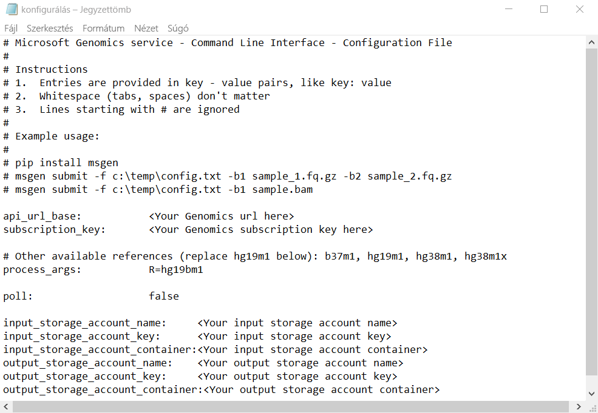

# <a name="quickstart-run-a-workflow-through-the-microsoft-genomics-service"></a>Rövid útmutató: Munkafolyamat futtatása a Microsoft Genomics szolgáltatással

Ebben a rövid útmutatóban egy Azure Blob Storage-fiókba tölti fel a bemeneti adatokat, és a Microsoft Genomics szolgáltatáson keresztül futtatja a munkafolyamatot a Python genomikai ügyfél használatával. A Microsoft Genomics egy méretezhető, biztonságos másodlagos elemzési szolgáltatás, amely képes a genom gyors feldolgozására, és nyersolvasásokból kiindulva rendezett beolvasásokat és változóhívásokat hoz létre. 

## <a name="prerequisites"></a>Előfeltételek

- Aktív előfizetéssel rendelkező Azure-fiók. [Hozzon létre egy fiókot ingyenesen](https://azure.microsoft.com/free/?ref=microsoft.com&utm_source=microsoft.com&utm_medium=docs&utm_campaign=visualstudio). 
- [Python 2.7.12 +](https://www.python.org/downloads/release/python-2714/), `pip` telepített és a `python` rendszer elérési útjában. A Microsoft Genomics ügyfél nem kompatibilis a Python 3 rendszerrel. 

## <a name="set-up-create-a-microsoft-genomics-account-in-the-azure-portal"></a>Előkészületek: Microsoft Genomics-fiók létrehozása az Azure Portalon

Microsoft Genomics-fiók létrehozásához navigáljon a Azure Portal a [genomikai fiók létrehozásához](https://portal.azure.com/#create/Microsoft.Genomics) . Ha még nem rendelkezik Azure-előfizetéssel, a Microsoft Genomics-fiók létrehozása előtt hozzon létre egyet. 


Konfigurálja Genomics-fiókját az alábbi információkkal az előző képen látható módon. 

 |**Beállítás**          |  **Ajánlott érték**  | **Mező leírása** |
 |:-------------       |:-------------         |:----------            |
 |Előfizetés         | Az Ön előfizetésének neve|Ez az Azure-szolgáltatásokhoz tartozó számlázási egység – Az előfizetései részleteivel kapcsolatban lásd az [előfizetéseket](https://account.azure.com/Subscriptions) ismertető cikket. |      
 |Erőforráscsoport       | MyResourceGroup       |  Az erőforráscsoportok használatával több Azure-erőforrást (Storage-fiók, Genomics-fiók stb.) rendezhet egy csoportba a könnyebb kezelhetőség érdekében. További információkért lásd: [Erőforráscsoportok](https://docs.microsoft.com/azure/azure-resource-manager/resource-group-overview#resource-groups). Az érvényes erőforráscsoport-nevekkel kapcsolatban lásd az [elnevezési szabályokat](/azure/architecture/best-practices/resource-naming) ismertető cikket. |
 |Fióknév         | MyGenomicsAccount     |Válasszon egyedi fiókazonosítót. Az érvényes nevekkel kapcsolatban lásd az [elnevezési szabályokat](/azure/architecture/best-practices/resource-naming) ismertető cikket. |
 |Hely                   | USA 2. nyugati régiója                    |    A szolgáltatás a következő régiókban érhető el: az USA 2. nyugati régiója, Nyugat-Európa, és Délkelet-Ázsia |

A felső menüsorban az **értesítések** lehetőségre kattintva figyelheti a telepítési folyamatot.


További információ a Microsoft Genomicsről: [Mi az Microsoft Genomics?](overview-what-is-genomics.md)

## <a name="set-up-install-the-microsoft-genomics-python-client"></a>Előkészületek: A Microsoft Genomics Python-kliens telepítése

Telepítenie kell a Pythont és a Microsoft Genomics Python-ügyfelet `msgen` a helyi környezetben. 

### <a name="install-python"></a>A Python telepítése

A Microsoft Genomics Python-ügyfél kompatibilis a Python 2.7.12 vagy újabb 2.7. xx-es verziójával. a 2.7.14 a javasolt verzió. A letöltés [itt](https://www.python.org/downloads/release/python-2714/) található. 

> [!IMPORTANT]
> A Python 3. x nem kompatibilis a Python 2.7. xx-mel.  `msgen` Python 2,7-alkalmazás. Ha fut `msgen` , ellenőrizze, hogy az aktív Python-környezet a Python 2.7. xx verzióját használja-e. Hibaüzeneteket kaphat a `msgen` Python 3. x verziójának használatakor.

### <a name="install-the-microsoft-genomics-python-client-msgen"></a>A Microsoft Genomics Python-ügyfél telepítése `msgen`

A Python használatával `pip` telepítse az Microsoft Genomics-ügyfelet `msgen` . A következő utasítások feltételezik, hogy a Python2. x már a rendszer elérési útjában van. Ha a telepítés során problémák merülnek `pip` fel, akkor a rendszer elérési útjához hozzá kell adnia a Pythont és a szkriptek almappáját.

```
pip install --upgrade --no-deps msgen
pip install msgen
```

Ha nem szeretné teljes egészében telepíteni a rendszerszintű `msgen` bináris fájlokat, és módosítani a rendszerszintű Python-csomagokat, használja a jelzőt a következővel: `–-user` `pip` .
Ha a Package-alapú telepítést vagy setup.py használja, az összes szükséges csomag telepítve lesz.

### <a name="test-msgen-python-client"></a>`msgen`Python-ügyfél tesztelése
A Microsoft Genomics-ügyfél teszteléséhez töltse le a konfigurációs fájlt a genomikai fiókjából. A Azure Portalban navigáljon a genomikai fiókjához a bal felső sarokban lévő **összes szolgáltatás** kiválasztásával, majd a genomikai fiókok keresésével és kiválasztásával.


Válassza ki az imént létrehozott genomikai fiókot, navigáljon a **hozzáférési kulcsok**elemre, és töltse le a konfigurációs fájlt.


Az alábbi paranccsal próbálja ki, hogy a Microsoft Genomics Python-kliens működik-e:

```Python
msgen list -f "<full path where you saved the config file>"
```

## <a name="create-a-microsoft-azure-storage-account"></a>Microsoft Azure Storage fiók létrehozása 
A Microsoft Genomics szolgáltatás a bemeneteket az Azure Storage-fiókban tárolt blokkblobok formájában várja. Emellett a kimeneti fájlokat is blokkblobok formájában írja a felhasználó által meghatározott Azure Storage-fiókban lévő tárolóba. A bemenetek és kimenetek különböző tárfiókokban is lehetnek.
Ha az adatok már egy Azure Storage-fiókban vannak, csak azt kell ellenőriznie, hogy a fiók ugyanazon a helyen található-e, mint a Genomics-fiók. Ellenkező esetben a Microsoft Genomics szolgáltatás futtatásakor a kimenő forgalomért járó költségek merülnek fel. Ha még nem rendelkezik Azure Storage-fiókkal, létre kell hoznia egyet, és fel kell töltenie az adatait. További információt az Azure Storage-fiókokról [itt](https://docs.microsoft.com/azure/storage/common/storage-create-storage-account)talál, beleértve a Storage-fiókokat és az általa biztosított szolgáltatásokat. Azure Storage-fiók létrehozásához navigáljon a Azure Portal a [Storage-fiók létrehozásához](https://portal.azure.com/#create/Microsoft.StorageAccount-ARM) .  


Konfigurálja a Storage-fiókját az alábbi információkkal az előző képen látható módon. Használjon egy Storage-fiókhoz a legtöbb szabványos beállítást, amely csak azt határozza meg, hogy a fiók BlobStorage, nem általános célú. A le- és feltöltés a blobtárolók esetében 2–5-ször gyorsabb.  Az alapértelmezett üzemi modell (Azure Resource Manager) ajánlott.  

 |**Beállítás**          |  **Ajánlott érték**  | **Mező leírása** |
 |:-------------------------       |:-------------         |:----------            |
 |Előfizetés         | Az Azure-előfizetése |Az előfizetései részleteivel kapcsolatban lásd: [Előfizetések](https://account.azure.com/Subscriptions) |      
 |Erőforráscsoport       | MyResourceGroup       |  A genomikai fiókkal megegyező erőforráscsoportot is kiválaszthatja. Az érvényes erőforráscsoport-nevekkel kapcsolatban lásd: [elnevezési szabályok](/azure/architecture/best-practices/resource-naming) |
 |Tárfiók neve         | MyStorageAccount     |Válasszon egyedi fiókazonosítót. Érvényes nevek: [elnevezési szabályok](/azure/architecture/best-practices/resource-naming) |
 |Hely                  | USA 2. nyugati régiója                  | Használja ugyanazt a helyet, mint a genomikai fiók helye, a kimenő forgalom költségeinek csökkentése és a késés csökkentése érdekében.  | 
 |Teljesítmény                  | Standard                   | Az alapértelmezett beállítás a standard. A standard és a Premium Storage-fiókokkal kapcsolatos további részletekért lásd: [a Microsoft Azure Storage bemutatása](https://docs.microsoft.com/azure/storage/common/storage-introduction)    |
 |Fiók altípusa       | BlobStorage       |  A le- és feltöltés a blobtárolók esetében 2–5-ször gyorsabb az általános célú fiókokhoz képest. |
 |Replikáció                  | Helyileg redundáns tárolás                  | A helyileg redundáns tárolással a rendszer abban a régióban lévő adatközpontba replikálja az adatokat, amelyben a tárfiókot létrehozták. További információ: [Azure Storage-replikáció](https://docs.microsoft.com/azure/storage/common/storage-redundancy)    |
 |Hozzáférési szint                  | Gyakori                   | A Gyakori hozzáférés a tárfiókban tárolt objektumok gyakoribb elérésére utal.    |

Ezután válassza a **felülvizsgálat + létrehozás** lehetőséget a Storage-fiók létrehozásához. A genomikai fiók létrehozása során a felső menüsorban az **értesítések** lehetőségre kattintva figyelheti a telepítési folyamatot. 

## <a name="upload-input-data-to-your-storage-account"></a>Bemeneti adatok feltöltése a Storage-fiókba

A Microsoft Genomics szolgáltatás bemeneti fájlként várja a párosított befejezési olvasási (fastq-vagy BAM-) fájlokat. Feltöltheti saját adatait, vagy kipróbálhatja a szolgáltatást a nyilvánosan elérhető mintaadatokkal. Ha a nyilvánosan elérhető mintaadatokat szeretné használni, az alábbi helyen érheti el azokat:

[https://msgensampledata.blob.core.windows.net/small/chr21_1.fq.gz](https://msgensampledata.blob.core.windows.net/small/chr21_1.fq.gz)
[https://msgensampledata.blob.core.windows.net/small/chr21_2.fq.gz](https://msgensampledata.blob.core.windows.net/small/chr21_2.fq.gz)

A tárfiókban létre kell hoznia egy blobtárolót a bemeneti adatok számára, valamint egy másikat a kimeneti adatok számára.  Töltse fel a bemeneti adatokat a bemeneti blobtárolóba. Ehhez több eszközt is használhat, beleértve a [Microsoft Azure Storage Explorer](https://azure.microsoft.com/features/storage-explorer/), a [BlobPorter](https://github.com/Azure/blobporter)vagy a [AzCopy](https://docs.microsoft.com/azure/storage/common/storage-use-azcopy?toc=%2fazure%2fstorage%2fblobs%2ftoc.json). 

## <a name="run-a-workflow-through-the-microsoft-genomics-service-using-the-msgen-python-client"></a>Munkafolyamat futtatása a Microsoft Genomics szolgáltatás segítségével a Python- `msgen` ügyféllel

Ha a Microsoft Genomics szolgáltatáson keresztül szeretne futtatni egy munkafolyamatot, szerkessze a *config.txt* fájlt, és adja meg az adatok bemeneti és kimeneti tárolóját.
Nyissa meg a genomikai fiókjából letöltött *config.txt* fájlt. A megadható fejezetek az előfizetési kulcs és az alsó hat elem, a Storage-fiók neve, a kulcs és a tároló neve mind a bemenet, mind a kimenet számára. Ezeket az információkat a Azure Portal navigálva érheti el a Storage-fiók **kulcsainak eléréséhez** , vagy közvetlenül a Azure Storage Explorer.  



Ha a GATK4-t szeretné futtatni, állítsa a paramétert a következőre: `process_name` `gatk4` .

Alapértelmezés szerint a genomikai szolgáltatás a (vagy Ha gVCF kimenetet szeretne, és nem egy VCF kimenetet (a `-emitRefConfidence` GATK 3. x és `emit-ref-confidence` a GATK 4. x verzióban), adja hozzá a `emit_ref_confidence` paramétert a *config.txthoz * , és állítsa be a (z) értékre `gvcf` az előző ábrán látható módon.  Ha vissza szeretné állítani a VCF kimenetét, távolítsa el a *config.txt* fájlból, vagy állítsa a paramétert a következőre: `emit_ref_confidence` `none` . 

`bgzip` a egy olyan eszköz, amely tömöríti a vcf vagy a gvcf fájlt, és `tabix` létrehoz egy indexet a tömörített fájlhoz. Alapértelmezés szerint a genomikai szolgáltatás futtatása `bgzip` `tabix` a ". g. vcf" kimenet után történik, de a nem futtatja ezeket az eszközöket a ". vcf" kimenetnél. A futtatáskor a szolgáltatás ". gz" (bgzip output) és ". TBI" (tabix output) fájlokat hoz létre. Az argumentum egy logikai érték, amely a ". vcf" kimenetnél alapértelmezés szerint hamis értékre van állítva, a ". g. vcf" kimenetnél pedig alapértelmezés szerint igaz. A parancssorban való használathoz adja meg `-bz` vagy `--bgzip-output` a `true` (z) (bgzip és tabix futtatása) vagy `false` . Ha ezt az argumentumot a *config.txt* fájlban szeretné használni, adja hozzá `bgzip_output: true` vagy a `bgzip_output: false` fájlt a fájlhoz.

### <a name="submit-your-workflow-to-the-microsoft-genomics-service-using-the-msgen-python-client"></a>A munkafolyamat elküldése a Microsoft Genomics szolgáltatásnak a `msgen` Python-ügyfél használatával

A Microsoft Genomics Python-kliensen keresztül a munkafolyamatot az alábbi parancs használatával küldheti el:

```python
msgen submit -f [full path to your config file] -b1 [name of your first paired end read] -b2 [name of your second paired end read]
```

A munkafolyamatok állapotát a következő paranccsal tekintheti meg: 
```python
msgen list -f c:\temp\config.txt 
```

A munkafolyamat befejezése után megtekintheti az Azure Storage-fiókban lévő kimeneti fájlokat a konfigurált kimeneti tárolóban. 

## <a name="next-steps"></a>További lépések

Ebben a cikkben a minta bemeneti adatokat feltöltötte az Azure Storage-ba, és elküldte a munkafolyamatot a Microsoft Genomics szolgáltatásnak a `msgen` Python-ügyfélen keresztül. Ha többet szeretne megtudni a Microsoft Genomics szolgáltatással használható bemeneti fájltípusokkal kapcsolatban, tekintse meg a következő lapokat: [párosított FASTQ](quickstart-input-pair-FASTQ.md)  |  [Bam](quickstart-input-BAM.md)  |  [több FASTQ vagy Bam](quickstart-input-multiple.md). Ezt az oktatóanyagot a [Azure Notebooks példán](https://aka.ms/genomicsnotebook) keresztül is felfedezheti, ha letölti a "genomikai oktatóanyag. ipynb" fájlt, és egy jegyzetfüzet-olvasóval, például a [Jupyter](https://docs.microsoft.com/azure/notebooks/tutorial-create-run-jupyter-notebook) -vel nyitja meg a fájlt, és futtatja azt.
