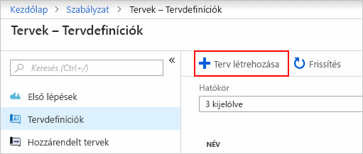
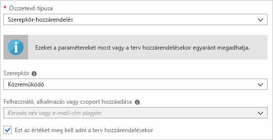
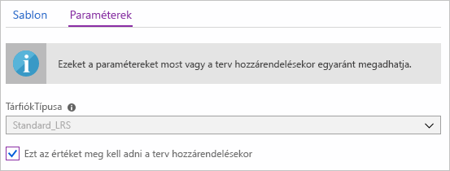
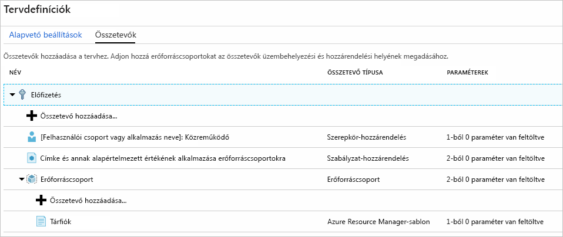
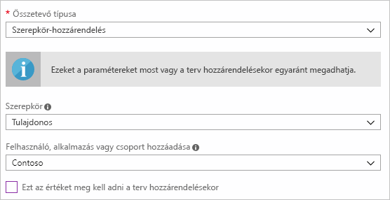
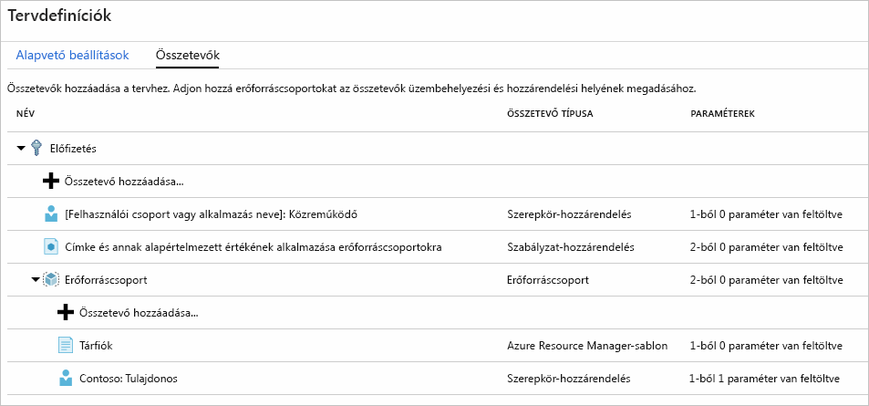
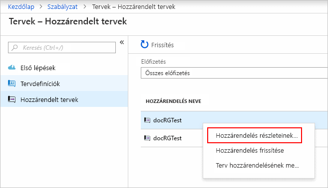

# <a name="define-and-assign-a-blueprint-in-the-portal"></a>Definiálása és hozzárendelése egy tervezet a portálon

Megismerheti, hogyan hozhat létre és rendelje hozzá a tervek, amikor fejleszthet újrahasznosítható és gyorsan üzembe helyezhető konfigurációk alapján az Azure Resource Manager sablonok, házirend, biztonsági és egyéb gyakori minták adhatja meg. Ebben az oktatóanyagban elsajátíthatja a létrehozása, közzététel és a szervezeten belül egy tervezet hozzárendelése kapcsolódó gyakori feladatok egy részének elvégzése az Azure-tervek használatával. Ezek a feladatok a következők:

> [!div class="checklist"]
> - Új terv létrehozása és különféle támogatott összetevők hozzáadása
> - Meglévő, **Vázlat** állapotú tervek módosítása
> - Terv készként való megjelölése a hozzárendeléshez a **Közzétéve** állapottal
> - Terv hozzárendelése egy meglévő előfizetéshez
> - Hozzárendelt terv állapotának és feldolgozottságának ellenőrzése
> - Egy előfizetéshez rendelt terv törlése

Ha nem rendelkezik Azure-előfizetéssel, mindössze néhány perc alatt létrehozhat egy [ingyenes fiókot](https://azure.microsoft.com/free) a virtuális gép létrehozásának megkezdése előtt.

## <a name="create-a-blueprint"></a>Terv létrehozása

A megfelelőségi szabványminták definiálásának első lépése, hogy összeállítunk egy tervet az elérhető erőforrásokból. Ebben a példában hozzon létre egy új tervezet nevű **MyBlueprint** szerepkör és a szabályzat hozzárendeléseinek az előfizetés konfigurálása. Ezután adjon hozzá egy új erőforráscsoportot, és a egy Resource Manager sablon és a szerepkör-hozzárendelést az új erőforráscsoport létrehozása.

1. Válassza ki **minden szolgáltatás** a bal oldali panelen. Keresse meg és válassza **tervezetek**.

1. Válassza ki **definíciók tervezetet** a bal oldalon, majd válassza a lap a **+ létrehozás tervezet** gombra a lap tetején.

   Vagy válassza **létrehozás** származó a **bevezetés** egyenesen eljuthat a tervrajz létrehozása lap.

   

1. Adjon meg egy **tervrajznév** például **MyBlueprint**. (Legfeljebb 48 betűket használja, és számokat, de nem szóközöket és speciális karaktereket). Hagyja **leírás tervezetet** üresen. 
   
1. Az a **definíció helye** mezőben kattintson a jobb oldalon a három pontra, válassza ki a [felügyeleti csoport](../management-groups/overview.md) vagy előfizetést, ahol szeretné menteni a tervezet, és válassza a **válassza ki a**.

1. Győződjön meg arról, hogy az adatok helyességéről. A **tervrajznév** és **definíció helye** mezők később már nem módosítható. Válassza ki **tovább: Összetevők** a lap alján, vagy a **összetevők** fülre az oldal tetején.

1. Az előfizetés szintjén a szerepkör-hozzárendelés hozzáadása: 

   a. Válassza ki a **+ Hozzáadás összetevő** sor alatt **előfizetés**. A **Hozzáadás összetevő** ablak jobb oldalán található a böngészőben nyílik meg. 
   
   b. Válassza ki **szerepkör-hozzárendelés** a **összetevőtípussal**. 
   
   c. A **szerepkör**válassza **közreműködői**. Hagyja a **felhasználó, alkalmazás vagy csoport hozzáadása** , amely azt jelzi, hogy a dinamikus paraméterek jelölőnégyzet jelölését. 
   
   d. Válassza ki **Hozzáadás** az összetevő hozzáadása a tervezethez.

   

   > [!NOTE]
   > A legtöbb összetevők paramétereket támogatja. Egy paraméter, amelyhez hozzá rendelve egy érték tervrajz létrehozása során egy *statikus paraméter*. Ha a paraméter van hozzárendelve a tervezet-hozzárendelés során van egy *dinamikus paraméterek*. További információkat a [tervparamétereket](./concepts/parameters.md) ismertető cikkben talál.

1. Az előfizetés szintjén adja hozzá a szabályzat-hozzárendelés: 

   a. Válassza ki a **+ Hozzáadás összetevő** sor alatt a szerepkör-hozzárendelési összetevője. 
   
   b. Válassza ki **szabályzat-hozzárendelés** a **összetevőtípussal**. 
   
   c. Változás **típus** való **beépített**. A **keresési**, adja meg **címke**. 
   
   d. A szűrés végrehajtásához kattintson a **Keresésen** kívülre. Válassza ki **címke és címke alapértelmezett értékének alkalmazása erőforráscsoportok**. 
   
   e. Válassza ki **Hozzáadás** az összetevő hozzáadása a tervezethez.

1. Jelölje ki a szabályzat-hozzárendelés sort **címke és címke alapértelmezett értékének alkalmazása erőforráscsoportok**. 

1. A lehívandó összetevő paramétereket biztosít a tervezetdefiníciót részeként az ablak megnyílik, és lehetővé teszi, hogy az összes hozzárendelés (statikus paraméterek) paraméterek alapján állítja be a tervezet helyett hozzárendelés (dinamikus paraméterek) alatt. Ebben a példában a tervezet-hozzárendelés során dinamikus paramétereket használja, így hagyja az alapértelmezett beállításokat, és válassza ki **Mégse**.

1. Adjon hozzá egy erőforráscsoportot az előfizetés szintjén: 

   a. Válassza ki a **+ Hozzáadás összetevő** sor alatt **előfizetés**. 
   
   b. Válassza ki **erőforráscsoport** a **összetevőtípussal**. 
   
   c. Hagyja a **összetevő megjelenített neve**, **erőforráscsoport-név**, és **hely** mezőbe üres, de győződjön meg arról, hogy a jelölőnégyzet be van-e jelölve, hogy minden paraméter tulajdonság dinamikus paraméterek. 
   
   d. Válassza ki **Hozzáadás** az összetevő hozzáadása a tervezethez.

1. Adja hozzá az erőforráscsoporthoz tartozó sablon: 

   a. Válassza ki a **+ Hozzáadás összetevő** sor alatt a **ResourceGroup** bejegyzés. 
   
   b. Válassza ki **Azure Resource Manager-sablon** a **összetevő típusa**állítsa be **összetevő megjelenített neve** való **StorageAccount**, és hagyja  **Leírás** üres. 
   
   c. A szerkesztőmező **Sablon** lapján illessze be az alábbi Resource Manager-sablont. Miután, illessze be a sablont, válassza ki a **paraméterek** lapra, és vegye figyelembe, hogy a sablon paramétereit **Tárfióktípus** és **hely** észlelt. Minden paraméter lett automatikusan észlelt, és kitölti a rendszer, de konfigurálni dinamikus paramétert. 
   
   > [!IMPORTANT]
   > Ha a sablont importál, győződjön meg arról, hogy a fájl csak a JSON, és nem tartalmaz HTML. Egy URL-címet a Githubon használt mutat, biztosíthatja, hogy kiválasztott **RAW** beolvasni a nyers JSON-fájlt, és nem a HTML-megjelenítés a Githubon burkolt be. Ha az importált sablon nem tiszta JSON, hiba történik.

   ```json
   {
       "$schema": "https://schema.management.azure.com/schemas/2015-01-01/deploymentTemplate.json#",
       "contentVersion": "1.0.0.0",
       "parameters": {
           "storageAccountType": {
               "type": "string",
               "defaultValue": "Standard_LRS",
               "allowedValues": [
                   "Standard_LRS",
                   "Standard_GRS",
                   "Standard_ZRS",
                   "Premium_LRS"
               ],
               "metadata": {
                   "description": "Storage Account type"
               }
           },
           "location": {
               "type": "string",
               "defaultValue": "[resourceGroups('ResourceGroup').location]",
               "metadata": {
                   "description": "Location for all resources."
               }
           }
       },
       "variables": {
           "storageAccountName": "[concat('store', uniquestring(resourceGroup().id))]"
       },
       "resources": [{
           "type": "Microsoft.Storage/storageAccounts",
           "name": "[variables('storageAccountName')]",
           "location": "[parameters('location')]",
           "apiVersion": "2018-07-01",
           "sku": {
               "name": "[parameters('storageAccountType')]"
           },
           "kind": "StorageV2",
           "properties": {}
       }],
       "outputs": {
           "storageAccountName": {
               "type": "string",
               "value": "[variables('storageAccountName')]"
           }
       }
   }
   ```

   d. Törölje a **Tárfióktípus** jelölőnégyzetet, és figyelje meg, hogy a legördülő listában csak a Resource Manager-sablon alapján szereplő értékeket tartalmazza-e **allowedValues**. Jelölje be a állítsa vissza egy dinamikus paraméterét. 
   
   e. Válassza ki **Hozzáadás** az összetevő hozzáadása a tervezethez.

   

1. Kész tervének az alábbi ábrán láthatóhoz kell hasonlítania. Figyelje meg, hogy minden összetevő rendelkezik  **_x_ kívüli _y_ paraméter kitöltve** a a **paraméterek** oszlop. A dinamikus paraméterek vannak beállítva minden a tervezet-hozzárendelés során.

   

1. Most, hogy minden tervezett összetevők lettek hozzáadva, válassza ki a **Piszkozat mentése** az oldal alján.

## <a name="edit-a-blueprint"></a>Terv szerkesztése

A [tervrajz létrehozása](#create-a-blueprint), nem adjon meg egy leírást, vagy a szerepkör-hozzárendelés hozzáadása az új erőforráscsoporthoz. Rögzítheti a egyaránt a következő lépésekkel:

1. Válassza ki **definíciók tervezetet** a lap bal oldalán.

1. Tervezetek listájában kattintson a jobb gombbal a korábban már létrehozott egyet, és válassza ki **szerkesztési tervezet**.

1. A **leírás tervezetet**, néhány információt nyújtanak azokról a tervezet és az azt alkotó összetevők. Ebben az esetben adja meg, például: **Ez a megoldás címke házirend- és szerepkör-hozzárendelés állítja be az előfizetés, létrehoz egy erőforráscsoport és erőforrás-sablon és a szerepkör-hozzárendelés telepíti az adott erőforráscsoport.**

1. Válassza ki **tovább: Összetevők** a lap alján, vagy a **összetevők** fülre az oldal tetején.

1. Adja hozzá az erőforráscsoporthoz tartozó szerepkör-hozzárendelés: 

   a. Válassza ki a **+ Hozzáadás összetevő** közvetlenül a sor a **ResourceGroup** bejegyzés. 
   
   b. Válassza ki **szerepkör-hozzárendelés** a **összetevőtípussal**. 
   
   c. Alatt **szerepkör**válassza **tulajdonosa**, és törölje a jelölőnégyzet jelölését a a **felhasználó, alkalmazás vagy csoport hozzáadása** mezőbe. 
   
   d. Keresse meg és válassza ki a felhasználó, alkalmazás vagy csoport hozzáadása. Az összetevő használ statikus paraméterkészlet ugyanaz a tervezet minden hozzárendelés. 
   
   e. Válassza ki **Hozzáadás** az összetevő hozzáadása a tervezethez.

   

1. Kész tervének az alábbi ábrán láthatóhoz kell hasonlítania. Figyelje meg, hogy az újonnan hozzáadott szerepkör-hozzárendelés látható **1 / 1 paraméter kitöltve**. Ez azt jelenti, hogy egy statikus paraméter.

   

1. Válassza ki **Piszkozat mentése** most, hogy frissült.

## <a name="publish-a-blueprint"></a>Terv közzététele

Most, hogy minden tervezett összetevő hozzá lett adva a tervhez, itt az idő közzétenni azt.
Közzététel a tervezet hozzá kell rendelni egy előfizetéshez elérhető teszi.

1. Válassza ki **definíciók tervezetet** a lap bal oldalán.

1. Tervezetek listájában, kattintson a jobb gombbal a korábban létrehozott egyet, és válassza ki **közzététel tervezet**.

1. A megnyíló panelen adjon meg egy **verzió** (betűket, számokat és kötőjeleket tartalmazhat, egy legfeljebb 20 karakter), mint például **v1**. Szükség esetén adjon meg szöveget a **megjegyzések módosítása**, mint például **először közzététele**.

1. Válassza ki **közzététel** az oldal alján.

## <a name="assign-a-blueprint"></a>Terv hozzárendelése

Tervrajz közzététele után egy előfizetéshez rendelhető. Az Ön által létrehozott tervezet hozzárendelése az előfizetések alatt a felügyeleti csoport hierarchiában. Ha egy előfizetést a tervezet menti, csak rendelhető előfizetéshez.

1. Válassza ki **definíciók tervezetet** a lap bal oldalán.

1. Tervezetek listájában kattintson a jobb gombbal a korábban létrehozott egy (vagy kattintson a három pontra), és válassza ki **tervezet hozzárendelése**.

1. Az a **tervezet hozzárendelése** lap a **előfizetés** legördülő listában válassza a kívánt előfizetéseket, ez a megoldás üzembe helyezése.

   Ha vannak elérhető támogatott Enterprise ajánlatok [Azure Billing](../../billing/index.md), amely egy **új létrehozása** hivatkozás alatt aktiválódik a **előfizetés** mezőbe. Kövesse az alábbi lépéseket:

   a. Válassza ki a **új létrehozása** hivatkozásra kattintva hozzon létre egy új előfizetést, ne pedig a már meglévőket.

   b. Adjon meg egy **megjelenítendő név** az új előfizetés.

   c. Válassza ki az elérhető **ajánlat** a legördülő listából.

   d. A három pontra segítségével válassza ki a [felügyeleti csoport](../management-groups/index.md) , hogy az előfizetés lesz gyermeke.

   e. Válassza ki **létrehozás** az oldal alján.

   

   > [!IMPORTANT]
   > Az új előfizetés létrehozásakor kiválasztása után azonnal **létrehozás**.

   > [!NOTE]
   > Hozzárendelés a kiválasztott előfizetések jön létre. Egy egyetlen előfizetési hozzárendelést egy későbbi időpontban való módosításokat végezheti el anélkül, hogy a kiválasztott előfizetés fennmaradó skálázódása folyamán módosítaná.

1. A **hozzárendelés neve**, adjon meg egy egyedi nevet ehhez a hozzárendeléshez.

1. A **hely**, válassza ki a régiót, a felügyelt identitás- és előfizetés központi telepítési objektum kell létrehozni. Az Azure Blueprint a hozzárendelt tervben lévő összes összetevő üzembe helyezéséhez ezt a felügyelt identitást használja. További tudnivalókért lásd [az Azure-erőforrások felügyelt identitásait](../../active-directory/managed-identities-azure-resources/overview.md).

1. Hagyja a **tervrajz-definíció verziója** listából választott **közzétett** a verziók a **v1** bejegyzés. (Az alapértelmezett érték a legutóbb közzétett verzió.)

1. A **Hozzárendelés zárolása** mezőben hagyja meg az alapértelmezett **Nem zárolandó** értéket. További információkért lásd: [tervezetek erőforrás zárolása](./concepts/resource-locking.md).

   

1. A **felügyelt identitás**, hagyja bejelölve az alapértelmezett **rendszerhez rendelt**.

1. Az előfizetés szintű szerepkör-hozzárendelés **[felhasználói csoport vagy alkalmazás neve]: Közreműködői**, keresse meg és válassza ki a felhasználó, alkalmazás vagy csoport.

1. Állítsa az előfizetési szintű szabályzat-hozzárendelés **címkenév** való **CostCenter** és a **címke értéke** való **ContosoIT**.

1. A **ResourceGroup**, adjon meg egy **neve** , **StorageAccount** és a egy **hely** , **USA keleti RÉGIÓJA 2** a a legördülő listából.

   > [!NOTE]
   > Minden egyes összetevő, amely során tervezetdefiníció hozzá az erőforráscsoporthoz tartozó, az adott összetevő behúzása összhangba kerüljenek az erőforráscsoportra vagy az objektum, amely azt fogja telepíteni. Összetevők nem fogad paramétereket, vagy nem lehetnek paraméterei hozzárendelés kell definiálni, csak a környezeti információk jelennek meg.

1. Az Azure Resource Manager-sablon **StorageAccount**válassza **Standard_GRS** számára a **Tárfióktípus** paraméter.

1. Olvassa el az információs dobozt az oldal alján, és válassza ki **hozzárendelése**.

## <a name="track-deployment-of-a-blueprint"></a>Terv üzembe helyezésének nyomon követése

Miután egy terv hozzá lett rendelve egy vagy több előfizetéshez, két dolog történik:

- A tervezet adnak hozzá a **hozzárendelt tervezetek** lapon minden egyes előfizetés esetén.
- A folyamat üzembe helyezésének összes az összetevők határozzák meg a tervezet kezdődik.

Most, hogy a tervezet van rendelve egy előfizetéshez, ellenőrizze a telepítés előrehaladását:

1. Válassza ki **hozzárendelt tervezetek** a lap bal oldalán.

1. Tervezetek listájában kattintson a jobb gombbal egy korábban már hozzárendelt, és válassza ki **hozzárendelés részleteinek megtekintése**.

   

1. Az a **hozzárendelés tervezetet** lapon, ellenőrizze, hogy az összes összetevőt sikeresen telepített és, hogy nincsenek hibák történtek az üzembe helyezés során. Ha hiba lépett fel, tekintse meg [tervezetek hibaelhárítási](./troubleshoot/general.md) lépéseit megállapítani a hiba okát.

## <a name="unassign-a-blueprint"></a>Terv hozzárendelésének megszüntetése

Ha már nincs szüksége a tervezet-hozzárendelést, távolítsa el az előfizetést. A tervezet előfordulhat, hogy vette egy újabb tervezet frissített minták, a házirendek és a tervek szerint. Az egyes tervek eltávolításakor az adott tervek keretében hozzárendelt összetevők megmaradnak. A tervek hozzárendelését az alábbi lépések szerint szüntetheti meg:

1. Válassza ki **hozzárendelt tervezetek** a lap bal oldalán.

1. Tervezetek listájában válassza ki a tervrajz hozzárendelésének megszüntetése kívánt. Válassza ki a **kijelölés megszüntetése tervezet** gombra a lap tetején.

1. Olvassa el a megerősítést kérő üzenet, majd **OK**.

## <a name="delete-a-blueprint"></a>Terv törlése

1. Válassza ki **definíciók tervezetet** a lap bal oldalán.

1. Kattintson a jobb gombbal a tervezet törlése, és válassza ki a kívánt **Delete tervezet**. Válassza ki **Igen** a megerősítő párbeszédpanelen.

> [!NOTE]
> Is ennél a módszernél a tervezet törlése törli a kijelölt tervezet összes közzétett verzióját. Egyetlen verziót törléséhez nyissa meg a tervezet, válassza ki a **közzétett verzió** lapra, válassza ki a törölni, és válassza ki a kívánt verzió **verzió törlése**. Tervrajz is, amíg az összes tervezet-hozzárendelést a tervrajz-definíció törölt nem törölhető.

## <a name="next-steps"></a>További lépések

- További információ a [életciklus tervezetet](./concepts/lifecycle.md).
- A [statikus és dinamikus paraméterek](./concepts/parameters.md) használatának elsajátítása.
- A [tervekkel kapcsolatos műveleti sorrend](./concepts/sequencing-order.md) testreszabásának elsajátítása.
- A [tervek erőforrás-zárolásának](./concepts/resource-locking.md) alkalmazásával kapcsolatos részletek.
- A [meglévő hozzárendelések frissítésének](./how-to/update-existing-assignments.md) elsajátítása.
- A tervek hozzárendelése során felmerülő problémák megoldása [általános hibaelhárítással](./troubleshoot/general.md).