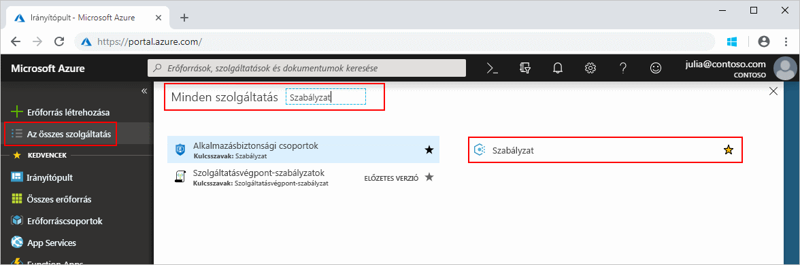
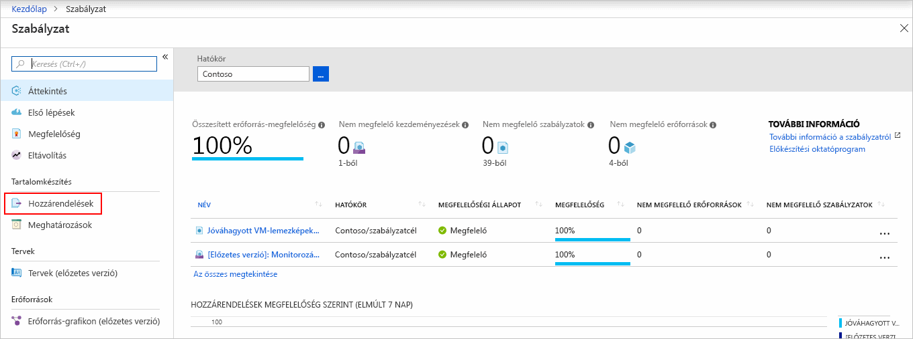
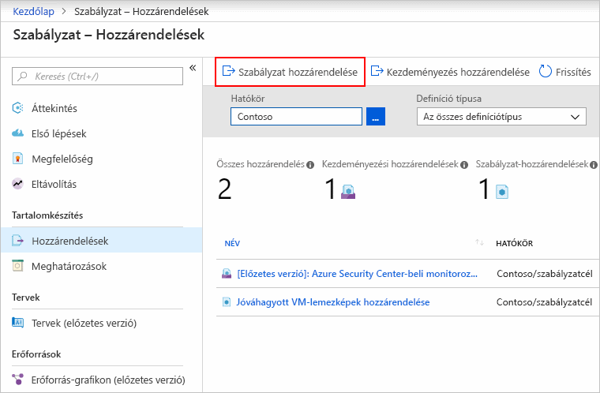
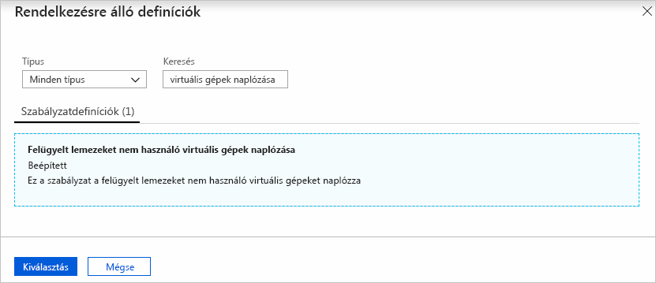
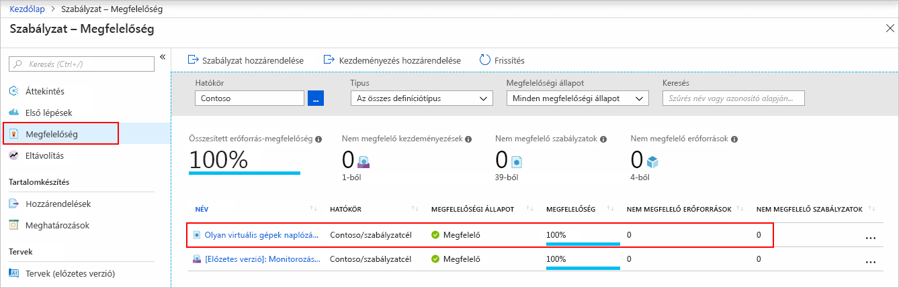
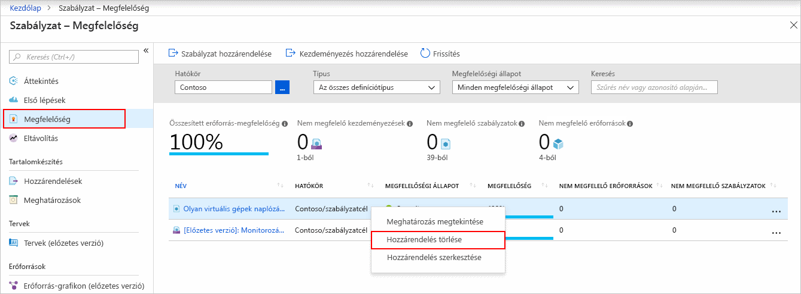

# Szabályzat-hozzárendelés létrehozása Azure környezetben a nem megfelelő erőforrások azonosításához

Az Azure-ral való megfelelőség megértéséhez szükséges első lépés a saját erőforrásai állapotának megállapítása.
Ez a rövid útmutató végigvezeti Önt a folyamaton, amellyel létrehozhat egy felügyelt lemezeket nem használó virtuális gépek azonosítására szolgáló szabályzat-hozzárendelést.

A folyamat végén sikeresen fogja azonosítani a felügyelt lemezeket nem használó virtuális gépeket. Ezek a szabályzat-hozzárendelés szempontjából *nem megfelelőnek* minősülnek.

Ha nem rendelkezik Azure-előfizetéssel, első lépésként mindössze néhány perc alatt létrehozhat egy [ingyenes](https://azure.microsoft.com/free/) fiókot.

## Szabályzat-hozzárendelés létrehozása

Ebben a rövid útmutatóban egy szabályzat-hozzárendelés létrehozása és hozzárendelése a *felügyelt lemezeket nem használó virtuális gépek naplózása* szabályzat-definíció.

1. Indítsa el az Azure Policy szolgáltatást az Azure Portalon. Ehhez kattintson a **Minden szolgáltatás** elemre, majd keresse meg és válassza ki a **Szabályzat** elemet.

   

1. Válassza ki a **Hozzárendelések** elemet az Azure Policy oldal bal oldalán. A hozzárendelés egy olyan szabályzat, amely egy adott hatókörön belül érvényes.

   

1. Válassza a **Szabályzat hozzárendelése** lehetőséget a **Szabályzat – Hozzárendelések** oldal tetején.

   

1. A **Szabályzat hozzárendelése** oldalon a **Hatókör** kiválasztásához kattintson a három pontra, majd válasszon felügyeleti csoportot vagy előfizetést. Ha szeretne, válasszon erőforráscsoportot. A hatókör határozza meg, hogy a szabályzat-hozzárendelés milyen erőforrások vagy erőforráscsoportok esetében lesz kényszerítve.  Ezután kattintson a **Kiválasztás** gombra a **Hatókör** oldal alján.

   Ebben a példában a **Contoso** előfizetést használjuk. Saját előfizetése ettől eltérhet.

1. Az erőforrások kizárhatóak a **Hatókör** alapján.  A **Kizárások** alacsonyabb szinten kezdődnek, mint a **Hatókör** szintje. A **Kizárások** nem kötelezőek, ezért egyelőre hagyja őket üresen.

1. Kattintson a **Szabályzatdefiníció** melletti három pontra az elérhető definíciók listájának megjelenítéséhez. Az Azure Policy beépített szabályzatdefiníciókat tartalmaz, amelyeket felhasználhat. Számos szabályzatdefiníció elérhető, többek között az alábbiak:

   - Címke és a hozzá tartozó érték kényszerítése
   - Címke és a hozzá tartozó érték alkalmazása
   - Az SQL Server 12.0-ás verziójának megkövetelése

   Elérhető beépített szabályzatok részleges listáját lásd: [házirend minták](./samples/index.md).

1. Keresse meg a *Felügyelt lemezeket nem használó virtuális gépek naplózása* definíciót a szabályzatdefiníciók listájában. Kattintson a szabályzatra, majd kattintson a **Kiválasztás** elemre.

   

1. A **Hozzárendelés neve** mező automatikusan kitöltődik a kiválasztott szabályzat nevével, de megadhat más nevet is. A példánkban meghagyjuk a *Felügyelt lemezeket nem használó virtuális gépek naplózása* értéket. Ha szeretné hozzáadhat egy **Leírást**. A leírás a szabályzat-hozzárendeléssel kapcsolatos információkat adja meg. A **Hozzárendelte** mező automatikusan ki lesz töltve az alapján, hogy ki van bejelentkezve. A mező kitöltése nem kötelező, megadhatók egyéni értékek.

1. A **Felügyelt identitás létrehozása** jelölőnégyzetet hagyja üresen. Ebben a mezőben _kell_ ellenőrizni kell, ha a szabályzatot vagy kezdeményezést tartalmaznak egy házirendet, az a [deployIfNotExists](./concepts/effects.md#deployifnotexists) érvénybe. Mivel nem az ebben a rövid útmutatóban használt házirendet, hagyja üresen a mezőt. További információkat a [felügyelt identitásokkal](../../active-directory/managed-identities-azure-resources/overview.md) és [a szervizelési biztonság működésével](./how-to/remediate-resources.md#how-remediation-security-works) kapcsolatos cikkben találhat.

1. Kattintson a **Hozzárendelés** gombra.

Most már készen áll a nem megfelelő erőforrások azonosítására a környezet megfelelési állapotának megismerése céljából.

## Nem megfelelő erőforrások azonosítása

Válassza ki **megfelelőségi** az oldal bal oldalán található. Keresse meg a **felügyelt lemezeket nem használó virtuális gépek naplózása** létrehozott szabályzat-hozzárendelést.

Ha vannak olyan meglévő erőforrások, amelyek nem felelnek meg az új hozzárendelésnek, azok jelennek meg **nem megfelelő erőforrások**.

Ha a meglévő erőforrások kiértékelésekor egy feltétel igaznak bizonyul, ezek az erőforrások a szabályzatnak nem megfelelőként lesznek megjelölve. A következő táblázat azt mutatja be, hogyan működnek együtt a szabályzatok különböző hatásai a feltételek kiértékelésével a megfelelőségi állapot eléréséhez. A kiértékelési logika nem jelenik meg az Azure Portalon, a megfelelőségi állapotok eredményei azonban igen. A megfelelőségi állapotok eredménye lehet megfelelő vagy nem megfelelő.

| **Erőforrás-állapot** | **Hatás** | **Szabályzat-kiértékelés** | **Megfelelőségi állapot** |
| --- | --- | --- | --- |
| Létezik | Deny, Audit, Append\*, DeployIfNotExist\*, AuditIfNotExist\* | True (Igaz) | Nem megfelelő |
| Létezik | Deny, Audit, Append\*, DeployIfNotExist\*, AuditIfNotExist\* | False (Hamis) | Megfelelő |
| Új | Naplózás, AuditIfNotExist\* | True (Igaz) | Nem megfelelő |
| Új | Naplózás, AuditIfNotExist\* | False (Hamis) | Megfelelő |

\* Az Append, a DeployIfNotExist és az AuditIfNotExist hatás esetében az IF utasításnak TRUE értéket kell visszaadnia. Emellett a létezési feltételnek FALSE értéket kell visszaadnia ahhoz, hogy a szabályzat nem megfelelőnek minősüljön. TRUE érték esetén az IF feltétel kiváltja a vonatkozó erőforrások létezési feltételének kiértékelését.

## Az erőforrások eltávolítása

A létrehozott hozzárendelést eltávolításához kövesse az alábbi lépéseket:

1. Válassza a **Megfelelőség** (vagy **Hozzárendelések**) elemet az Azure Policy oldal bal oldalán, és keresse meg a létrehozott **Felügyelt lemezeket nem használó virtuális gépek naplózása** szabályzat-hozzárendelést.

1. Kattintson a jobb gombbal a **Felügyelt lemezeket nem használó virtuális gépek naplózása** szabályzat-hozzárendelésre, és válassza a **Hozzárendelés törlése** lehetőséget.

   

## További lépések

Ebben a rövid útmutatóban egy hatókörhöz rendelt hozzá egy szabályzatdefiníciót, és kiértékelte annak megfelelőségi jelentését. A szabályzatdefiníció ellenőrzi, hogy megfelelő a hatókörben lévő összes erőforrást, és azonosítja a nem.

További információ a szabályzatok ellenőrzése, hogy az új erőforrások megfelelnek hozzárendeléséről, folytassa a következő oktatóanyagban:

> [!div class="nextstepaction"]
> [Szabályzatok létrehozása és kezelése](./tutorials/create-and-manage.md)