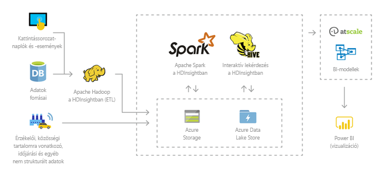
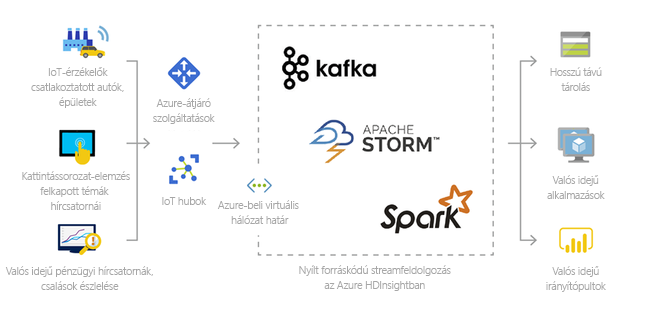
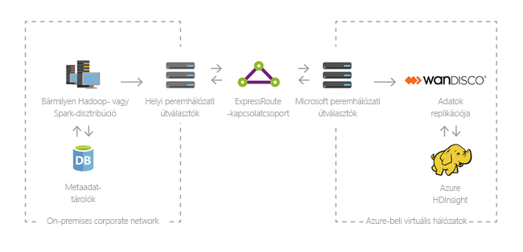

# Mi az Azure HDInsight és az Apache Hadoop-technológiák

Ebben a cikkben megismerkedhet az Azure HDInsight-alapú Apache Hadooppal. Az Azure HDInsight egy teljes mértékben felügyelt, teljes körű, nyílt forráskódú elemzési szolgáltatás vállalatok részére. Használhat olyan nyílt forráskódú keretrendszereket, mint a Hadoop, a Spark, a Hive, az LLAP, a Kafka, a Storm, az R stb. 

[!INCLUDE [hdinsight-price-change](../../../includes/hdinsight-enhancements.md)]

## Mi a HDInsight, és mik azok a Hadoop-technológiák?

Az [Apache Hadoop](https://hadoop.apache.org/) volt a big data jellegű adatkészletek fürtökön végzett elosztott feldolgozásának, tárolásának és elemzésének eredeti nyílt forráskódú keretrendszere. A Hadoop-technológiák számos kapcsolódó szoftvert és segédprogramot tartalmaznak. Ilyen például az Apache Hive, a HBase, a Spark és a Kafka.

Az Azure HDInsight a [Hortonworks Data Platform (HDP)](https://hortonworks.com/products/data-center/hdp/) által fejlesztett Hadoop-összetevők felhőalapú terjesztett változata. Az Azure HDInsight segítségével könnyen, gyorsan és költséghatékonyan dolgozható fel nagy mennyiségű adat. Használhat olyan népszerű, nyílt forráskódú keretrendszereket, mint a Hadoop, a Spark, a Hive, az LLAP, a Kafka, a Storm, az R stb. Ezekkel a keretrendszerekkel a forgatókönyvek széles körét alkalmazhatja, köztük kinyerési, átalakítási és betöltési (ETL) feladatokat, adatraktározást, gépi tanulást és az IoT-t.

A HDInsighton elérhető Hadoop-technológiák összetevőinek megtekintése: [A HDInsighttal elérhető összetevők és verziók][component-versioning]. További tudnivalók a HDInsightban használt Hadoopról [az Azure-szolgáltatások HDInsightra vonatkozó oldalán](https://azure.microsoft.com/services/hdinsight/) olvashatók.

## Mik azok a big data típusú adatok?

A big data gyűjtése egyre nagyobb mennyiségben és sebességgel, minden korábbinál többféle formátumban történik. Ezek lehetnek előzményadatok (azaz tárolt) vagy valós idejű adatok (vagyis a forrásból streamelt adatok). A big data leggyakoribb alkalmazási helyzetei: [A HDInsight használatára vonatkozó forgatókönyvek](#scenarios-for-using-hdinsight).

## Miért érdemes használni a HDInsight-alapú Hadoopot?

Ez a szakasz felsorolja az Azure HDInsight képességeit.

|Képesség  |Leírás  |
|---------|---------|
|Natív felhőalapú     |     Az Azure HDInsight segítségével optimalizált fürtöket hozhat létre az Azure-ban a következőkhöz: [Hadoop](apache-hadoop-linux-tutorial-get-started.md), [Spark](../spark/apache-spark-jupyter-spark-sql.md), [Interaktív lekérdezés (LLAP)](../interactive-query/apache-interactive-query-get-started.md), [Kafka](../kafka/apache-kafka-get-started.md), [Storm](../storm/apache-storm-tutorial-get-started-linux.md), [HBase](../hbase/apache-hbase-tutorial-get-started-linux.md) és  [ML-szolgáltatások](../r-server/r-server-get-started.md). A HDInsight egy végpontok közötti SLA-t is biztosít az összes éles környezetben futó számítási feladathoz.  |
|Alacsony költségű és méretezhető     | A HDInsight segítségével a számítási feladatok vertikális [skálázását](../hdinsight-administer-use-portal-linux.md)  felfelé vagy lefelé is elvégezheti. Csökkentheti a költségeket  [a fürtök igény szerinti létrehozása](../hdinsight-hadoop-create-linux-clusters-adf.md) és a használatalapú fizetés révén. A feladatokat adatfolyamatok létrehozásával is működtetheti. A leválasztott számítás és tárolás jobb teljesítményt és rugalmasságot biztosít. |
|Biztonságos és megfelelő    | Az [Azure Virtual Network](../hdinsight-extend-hadoop-virtual-network.md), a [titkosítás](../hdinsight-hadoop-create-linux-clusters-with-secure-transfer-storage.md) és az [Azure Active Directoryval való integráció](../domain-joined/apache-domain-joined-introduction.md) segítségével a HDInsight lehetővé teszi a vállalati adategységek védelmét. A HDInsight továbbá megfelel a legnépszerűbb iparági és kormányzati [megfelelőségi szabványoknak](https://azure.microsoft.com/overview/trusted-cloud).        |
|Figyelés    | Az Azure HDInsight az [Azure Log Analytics](../hdinsight-hadoop-oms-log-analytics-tutorial.md) integrálásával egyetlen felületen teszi lehetővé az összes fürt monitorozását.        |
|Globális rendelkezésre állás | A HDInsight több  [régióban](https://azure.microsoft.com/regions/services/)  érhető el, mint bármelyik másik big data-elemzési ajánlat. Az Azure HDInsight elérhető az Azure Governmentben, Kínában, és Németországban is, így megfelelhet a vállalati igényeknek a főbb szuverén területeken. |  
|Termelékenység     |  Az Azure HDInsight számos hatékony eszközt biztosít a Hadoop és a Spark használatához a választott fejlesztési környezetben. Ez a fejlesztési környezet lehet a [Visual Studio](apache-hadoop-visual-studio-tools-get-started.md), a [VSCode](../hdinsight-for-vscode.md), az [Eclipse](../spark/apache-spark-eclipse-tool-plugin.md) vagy az [IntelliJ](../spark/apache-spark-intellij-tool-plugin.md) a Scala, a Python, az R, a Java és a .NET támogatásához. Az adatelemzők is együttműködhetnek olyan népszerű notebookok használatával, mint a [Jupyter](../spark/apache-spark-jupyter-notebook-kernels.md) vagy a [Zeppelin](../spark/apache-spark-zeppelin-notebook.md).    |
|Bővíthetőség     |  A HDInsight-fürtöket bővítheti telepített összetevőkkel (Hue, Presto stb.) [szkriptműveletek](../hdinsight-hadoop-customize-cluster-linux.md) használatával, [élcsomópontok felvételével](../hdinsight-apps-use-edge-node.md) vagy [más big data minősítéssel rendelkező alkalmazások integrálásával](../hdinsight-apps-install-applications.md). A HDInsight [egykattintásos](https://azure.microsoft.com/services/hdinsight/partner-ecosystem/) üzembe helyezéssel biztosít zökkenőmentes integrációt a legnépszerűbb big data-megoldásokkal.|

## A HDInsight használatára vonatkozó forgatókönyvek

Az Azure HDInsight számos, a big data koncepción alapuló adatfeldolgozási forgatókönyvben alkalmazható. Ezek lehetnek előzményadatok (már összegyűjtött és tárolt adatok) vagy valós idejű adatok (közvetlenül a forrásból streamelt adatok). Az ilyen adatok feldolgozásának forgatókönyveit a következő kategóriákban lehet összegezni: 

### Kötegelt feldolgozás (ETL)

A kinyerési, átalakítási és betöltési (ETL) folyamat során a rendszer strukturálatlan és strukturált adatokat nyer ki heterogén adatforrásokból. Ezután strukturált formátumúvá alakítja azokat, majd betölti egy adattárba. Az átalakított adatok adatelemzéshez vagy adatraktározáshoz használhatók.

### Adatraktározás

A HDInsight segítségével petabájtos nagyságrendű interaktív lekérdezéseket végezhet strukturált vagy strukturálatlan adatokon. Modelleket is létrehozhat BI-eszközökhöz való csatlakoztatással. További információkért [olvassa el ezt az ügyféltörténetet](https://customers.microsoft.com/story/milliman). 

### Eszközök internetes hálózata (IoT)

A HDInsight segítségével számos eszközről fogadott streamelési adatok dolgozhatók fel valós időben. További információkért [olvassa el ezt az Azure-blogbejegyzést, amely az Azure Managed Disksben HDInsight alatt futó Apache Kafka nyilvános előzetes verzióját jelenti be](https://azure.microsoft.com/blog/announcing-public-preview-of-apache-kafka-on-hdinsight-with-azure-managed-disks/).

 

### Adatelemzés

A HDInsight segítségével olyan alkalmazásokat hozhat létre, amelyek kritikus fontosságú elemzéseket nyernek ki az adatokból. Az Azure Machine Learning segítségével ezen felül a vállalata várható trendjeiről is kaphat előrejelzéseket. További információkért [olvassa el ezt az ügyféltörténetet](https://customers.microsoft.com/story/pros).

### Hibrid

A HDInsight segítségével kiterjesztheti a meglévő helyszíni big data-infrastruktúráját az Azure-ba, hogy kihasználhassa a felhő fejlett elemzési képességeit.

## Fürttípusok a HDInsightban
A HDInsight adott fürttípusokat és fürttestreszabási képességeket is tartalmaz, például lehetővé teszi összetevők, segédprogramok és nyelvek hozzáadását. A HDInsight a következő fürttípusokat kínálja:

* **[Apache Hadoop](https://wiki.apache.org/hadoop)**: egy keretrendszer, amely HDFS-t, YARN erőforrás-kezelést, és egy egyszerű MapReduce programozási modellt használ az adatok párhuzamos feldolgozásához és elemzéséhez.

* **[Apache Spark](https://spark.apache.org/)**: egy nyílt forráskódú, párhuzamos feldolgozást végző keretrendszer, amely támogatja a memórián belüli feldolgozást a big data-elemző alkalmazások teljesítményének növelése érdekében. Lásd: [Mi a HDInsight-alapú Apache Spark?](../spark/apache-spark-overview.md).

* **[Apache HBase](https://hbase.apache.org/)**: egy Hadoopra épülő NoSQL-adatbázis, amely közvetlen hozzáférést és nagymértékű következetességet biztosít a nagy mennyiségű strukturálatlan és félig strukturált adatok számára, akár egy több milliárd sorból és több millió oszlopból álló táblázat esetén is. Lásd: [Mi a HDInsight-alapú HBase?](../hbase/apache-hbase-overview.md)

* **[ML-szolgáltatások](https://msdn.microsoft.com/microsoft-r/rserver)**: egy párhuzamos, elosztott R-folyamatok üzemeltetésére és felügyeletére használt kiszolgáló. Skálázható, elosztott elemzési módszereket kínál az adatszakértők, statisztikusok és R-programozók számára a HDInsightban. Tekintse meg az [ML-szolgáltatások használatának áttekintését a HDInsighton](../r-server/r-server-overview.md).

* **[Apache Storm](https://storm.incubator.apache.org/)**: egy elosztott, valós idejű számítási rendszer a nagy méretű adatfolyamok gyors feldolgozására. A Storm a HDInsightban felügyelt fürtként érhető el. Lásd: [Analyze real-time sensor data using Storm and Hadoop](../storm/apache-storm-sensor-data-analysis.md) (Valós idejű érzékelőadatok elemzése a Storm és a Hadoop segítségével).

* **[Apache interaktív lekérdezés – előzetes verzió (avagy Hosszú és eredményes feldolgozást!)](https://cwiki.apache.org/confluence/display/Hive/LLAP)**: memóriában történő gyorsítótárazás az interaktív és gyorsabb Hive-lekérdezésekhez. Lásd: [Az interaktív lekérdezés használata a HDInsightban](../interactive-query/apache-interactive-query-get-started.md).

* **[Apache Kafka](https://kafka.apache.org/)**: nyílt forráskódú platform streamelt adatfolyamatok és alkalmazások létrehozásához. A Kafka egy Üzenetsor funkciót is biztosít, amelynek segítségével közzétehet adatstreameket vagy feliratkozhat rájuk. Lásd: [A HDInsight alatt futó Apache Kafka bemutatása](../kafka/apache-kafka-introduction.md).

## Nyílt forráskódú összetevők a HDInsightban

Az Azure HDInsight lehetővé teszi fürtök létrehozását olyan nyílt forráskódú keretrendszerekkel, mint a Hadoop, a Spark, a Hive, az LLAP, a Kafka, a Storm, a HBase és az R. Ezekhez a fürtökhöz alapértelmezés szerint tartoznak más, a fürtön jelenlévő nyílt forráskódú összetevők is, például a következők: [Ambari](https://github.com/apache/ambari/blob/trunk/ambari-server/docs/api/v1/index.md), [Avro](https://avro.apache.org/docs/current/spec.html), [Hive](https://hive.apache.org), [HCatalog](https://cwiki.apache.org/confluence/display/Hive/HCatalog/), [Mahout](https://mahout.apache.org/), [MapReduce](https://wiki.apache.org/hadoop/MapReduce), [YARN](https://hadoop.apache.org/docs/current/hadoop-yarn/hadoop-yarn-site/YARN.html), [Phoenix](https://phoenix.apache.org/), [Pig](https://pig.apache.org/), [Sqoop](https://sqoop.apache.org/), [Tez](https://tez.apache.org/), [Oozie](https://oozie.apache.org/), [ZooKeeper](https://zookeeper.apache.org/).  

## Programozási nyelvek a HDInsightban
A HDInsight-fürtök, például többek közt a Spark, a HBase, a Kafka, és a Hadoop, számos programozási nyelvet támogatnak. Egyes programozási nyelvek nincsenek alapértelmezés szerint telepítve. Alapértelmezés szerint nem telepített könyvtárak, modulok vagy csomagok esetén [használjon szkriptműveletet az összetevő telepítéséhez](../hdinsight-hadoop-script-actions-linux.md).

|Programozási nyelv  |Információ  |
|---------|---------|
|Alapértelmezés szerint támogatott programozási nyelvek     | Alapértelmezés szerint a HDInsight-fürtök a következőket támogatják:<ul><li>Java</li><li>Python</li></ul> [Szkriptműveletek](../hdinsight-hadoop-script-actions-linux.md) használatával további nyelveket is telepíthet.       |
|JVM (Java virtuális gép) nyelvek     | A Java-alapú virtuális gépeken (JVM) a Javán kívül számos más nyelv is futtatható. Előfordulhat azonban, hogy egyes nyelvek futtatásához további összetevőket is telepítenie kell a fürtön. A HDInsight-fürtök az alábbi JVM-alapú nyelveket támogatják: <ul><li>Clojure</li><li>Jython (Python a Javához)</li><li>Scala</li></ul>     |
|Hadoop-specifikus nyelvek     | A HDInsight-fürtök az alábbi, a Hadoop-technológiákra jellemző nyelveket támogatják: <ul><li>Pig Latin a Pig-feladatokhoz</li><li>HiveQL a Hive-feladatokhoz és a SparkSQL-hez</li></ul>        |
 

## A HDInsight fejlesztői eszközei 
A HDInsight fejlesztői eszközei (köztük az IntelliJ, az Eclipse, a Visual Studio Code és a Visual Studio) használatával HDInsight-adatlekérdezéseket és feladatokat szerkeszthet és küldhet be Azure-ral zökkenőmentesen együttműködve.

* [Az IntelliJ-hez készült Azure-eszközkészlet](https://docs.microsoft.com/azure/hdinsight/spark/apache-spark-intellij-tool-plugin)

* [Az Eclipse-hez készült Azure-eszközkészlet](https://docs.microsoft.com/azure/hdinsight/spark/apache-spark-eclipse-tool-plugin)

* [A VS Code-hoz készült Azure HDInsight-eszközök](https://docs.microsoft.com/azure/hdinsight/hdinsight-for-vscode?branch=pr-en-us-22999)

* [A Visual Studióhoz készült Azure Data Lake-eszközök](https://docs.microsoft.com/azure/hdinsight/hadoop/apache-hadoop-visual-studio-tools-get-started)

## Üzleti intelligencia a HDInsighton
A jól ismert üzletiintelligencia- (BI-) eszközök a Power Query beépülő modul vagy a Microsoft Hive ODBC-illesztő segítségével kérik le, elemzik és jelentik a HDInsight rendszerébe integrált adatokat:

* [Az Apache Spark BI adatvizualizációs eszközeinek használata az Azure HDInsighttal](../spark/apache-spark-use-bi-tools.md)

* [Hive-adatok vizualizálása a Microsoft Power BI segítségével az Azure HDInsightban](apache-hadoop-connect-hive-power-bi.md) 

* [Interaktív lekérdezéses Hive-adatok vizualizálása a Microsoft Power BI segítségével az Azure HDInsightban](../interactive-query/apache-hadoop-connect-hive-power-bi-directquery.md)

* [Az Excel csatlakozása a Hadoophoz a Power Queryvel](apache-hadoop-connect-excel-power-query.md) (Windows rendszert igényel) 

* [Az Excel és a Hadoop csatlakoztatása a Microsoft Hive ODBC-illesztővel](apache-hadoop-connect-excel-hive-odbc-driver.md) (Windows rendszert igényel) 

* [Az SQL Server Analysis Services használata a HDInsighttal](https://msdn.microsoft.com/library/dn749857.aspx)

* [Az SQL Server Reporting Services használata a HDInsighttal](https://msdn.microsoft.com/library/dn749856.aspx)

## További lépések

Ebből a cikkből megismerte az Azure HDInsightot, továbbá hogy a HDInsight hogyan biztosítja a Hadoopot és egyéb fürttípusokat az Azure-ban. A következő cikkből megtudhatja, hogyan hozhat létre Apache Hadoop-fürtöket a HDInsightban.

> [!div class="nextstepaction"]
> [Hadoop-fürtök létrehozása a HDInsightban](apache-hadoop-linux-create-cluster-get-started-portal.md)

[component-versioning]: ../hdinsight-component-versioning.md
[zookeeper]: https://zookeeper.apache.org/
