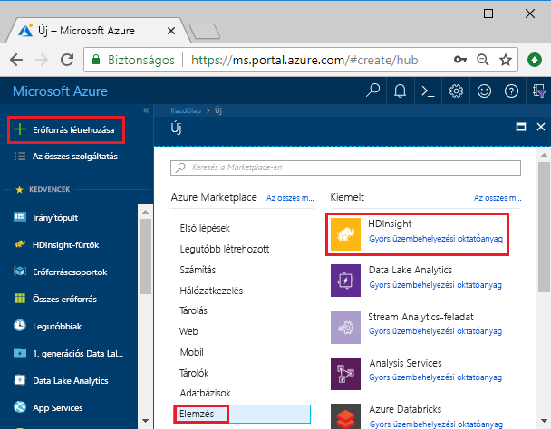
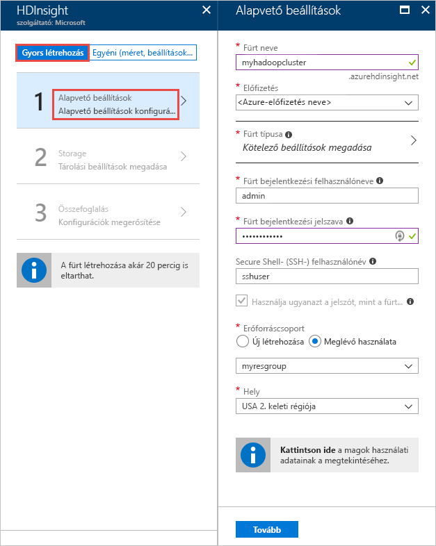
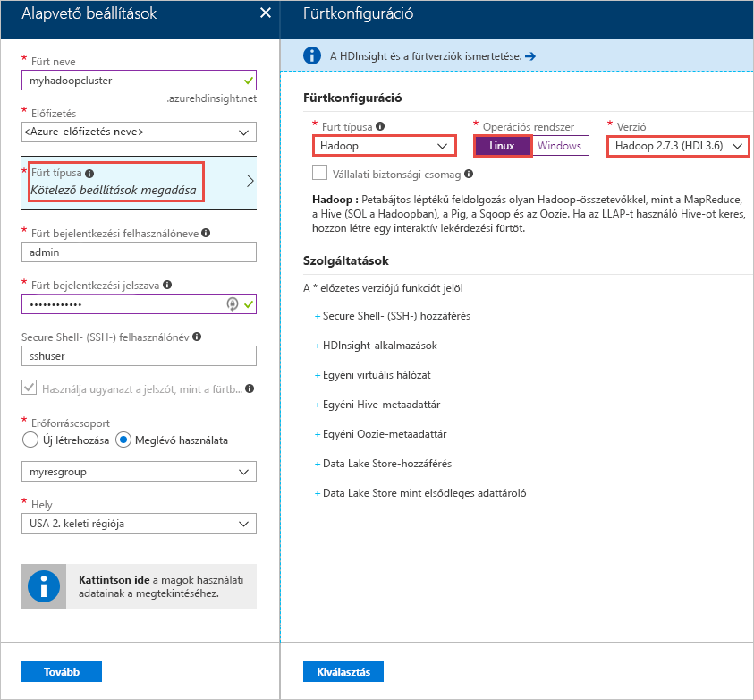
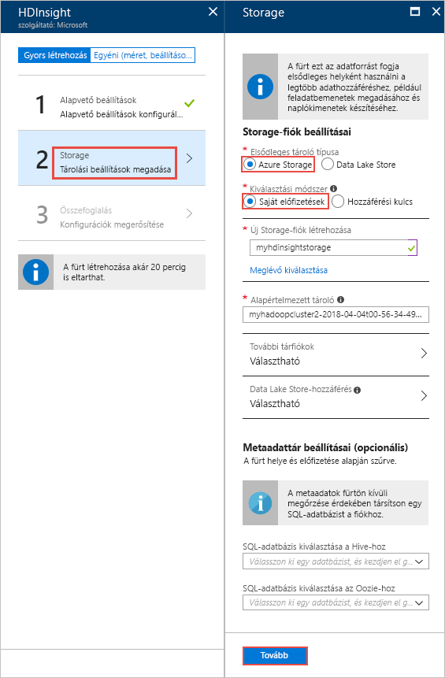
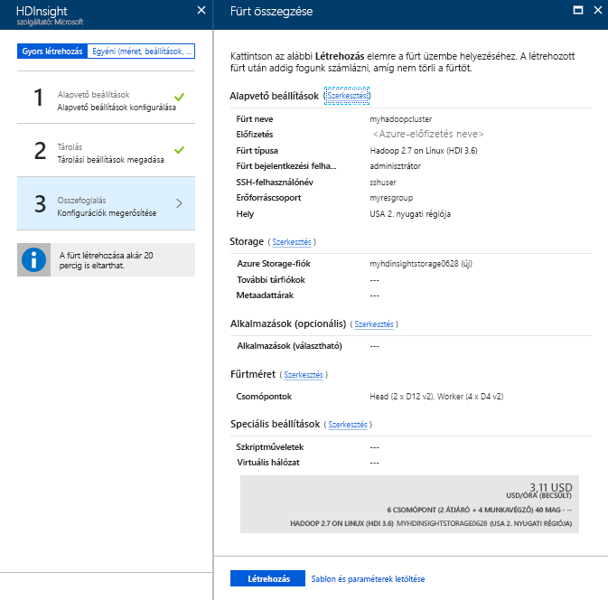

# Gyors útmutató: Az Apache Hadoop-fürt létrehozása az Azure HDInsight az Azure portal használatával

Ebből a cikkből megismerheti, hogyan hozhat létre [Apache Hadoop](https://hadoop.apache.org/) a HDInsight az Azure portal használatával, és futtassa az Apache Hive-feladatok a HDInsight-fürtök. A legtöbb Hadoop-feladat kötegelt feladat. Létrehoz fog hozni egy fürtöt, futtat néhány feladatot, majd törölni fogja a fürtöt. Ebben a cikkben mind a három feladatot elvégzi.

Ebben a rövid útmutatóban egy HDInsight Hadoop-fürtöt hoz létre az Azure Portal használatával. Az [Azure Resource Manager-sablonok](apache-hadoop-linux-tutorial-get-started.md) használatával is létrehozhat fürtöket.

A HDInsight jelenleg [7 különböző fürttípussal érhető el](./apache-hadoop-introduction.md#cluster-types-in-hdinsight). Minden egyes fürttípus más és más összetevőket támogat. A Hive-ot minden fürttípus támogatja. A HDInsight támogatott összetevők listáját lásd: [a HDInsight által biztosított az Apache Hadoop-fürtverziók újdonságai?](../hdinsight-component-versioning.md)  

Ha nem rendelkezik Azure-előfizetéssel, [hozzon létre egy ingyenes fiókot](https://azure.microsoft.com/free/) a feladatok megkezdése előtt.

## Apache Hadoop-fürt létrehozása

Ebben a szakaszban egy Hadoop-fürtöt hozhat létre a HDInsightban az Azure Portal használatával. 

1. Jelentkezzen be az [Azure Portal](https://portal.azure.com) webhelyre.

1. Az Azure Portalon válassza az **Erőforrás létrehozása** > **Adatok + analitika** > **HDInsight** elemet. 

    

2. A **HDInsight** > **Gyors létrehozás** > **Alapvető beállítások** területen adja meg az értékeket az alábbi képernyőfelvételen javasolt módon:

    

    Adja meg vagy válassza ki a következő értékeket:
    
    |Tulajdonság  |Leírás  |
    |---------|---------|
    |**Fürt neve**     | Adja meg a Hadoop-fürt nevét. Mivel a HDInsightban az összes fürt ugyanazt a DNS-névteret használja, a névnek egyedinek kell lennie. A név legfeljebb 59 karakter hosszúságú lehet, és csak betűket, számokat, illetve kötőjelet tartalmazhat. A név első és utolsó karaktere nem lehet kötőjel. |
    |**Előfizetés**     |  Válassza ki az Azure-előfizetését. |
    |**Fürt típusa**     | Ezt egyelőre hagyja ki. Ezt a bemenetet az eljárást következő lépésében adja meg.|
    |**A fürt bejelentkezési felhasználóneve és jelszava**     | Az alapértelmezett bejelentkezési név az **admin**. A jelszónak legalább 10 karakterből kell állnia, és tartalmaznia kell legalább egy számot, egy nagybetűs és egy kisbetűs, illetve egy nem alfanumerikus karaktert (ami nem lehet ' " ` \)). Győződjön meg róla, hogy **ne adjon meg** gyakori jelszót, mint például a következő: Pass@word1.|
    |**SSH-felhasználónév** | Az alapértelmezett felhasználónév az **sshuser**.  SSH-felhasználónévként más nevet is megadhat. |
    | **Használja ugyanazt a jelszót, mint a fürtbe való bejelentkezésekor** | Jelölje be ezt a jelölőnégyzetet, ha ugyanazt a jelszót kívánja használni az SSH-felhasználóhoz, mint amelyet a fürt bejelentkezési fiókjához adott meg.|
    |**Erőforráscsoport**     | Hozzon létre egy erőforráscsoportot, vagy válasszon ki egy már meglévőt.  Az erőforráscsoport az Azure összetevőit tartalmazó tároló.  Ebben az esetben az erőforráscsoport a HDInsight-fürtöt és a függő Azure Storage-fiókot tartalmazza. |
    |**Hely**     | Válassza ki, melyik Azure-helyen kívánja létrehozni a fürtöt.  A legjobb teljesítmény érdekében válassza az Önhöz legközelebb eső helyet. |
        
3. Válassza a **Fürt típusa** lehetőséget, majd adja meg a bemeneteket az alábbi képernyőképen látható módon:

    

    Válassza ki a következő értékeket:
    
    |Tulajdonság  |Leírás  |
    |---------|---------|
    |**Fürt típusa**     | Válassza a **Hadoop** lehetőséget. |
    |**Operációs rendszer**     | Válassza ki **Linux** |
    |**Verzió**     | Válassza a **Hadoop 2.7.3 (HDI 3.6)** lehetőséget.|

    Kattintson a **Kiválasztás**, majd a **Tovább** elemre.

4. A **Tárolás** lapon adja meg a bemeneteket az alábbi képernyőképen látható módon:

    

    Válassza ki a következő értékeket:
    
    |Tulajdonság  |Leírás  |
    |---------|---------|
    |**Elsődleges tároló típusa**     | Ehhez a cikkhez válassza az **Azure Storage** lehetőséget, hogy az Azure Storage Blobot használja alapértelmezett tárfiókként. Az Azure Data Lake Storage-ot is használhatja alapértelmezett tárolóként. |
    |**Kiválasztási módszer**     |  Ehhez a cikkhez válassza a **Saját előfizetések** lehetőséget az Azure-előfizetésében lévő egyik tárfiók használatához. Ha más előfizetések tárfiókját szeretné használni, válassza a **Hozzáférési kulcs** lehetőséget, majd adja meg a fiók hozzáférési kulcsát. |
    |**Új tárfiók létrehozása**     | Adja meg a tárfiók nevét.|

    Fogadja el az összes többi alapértelmezett értéket, majd válassza a **Tovább** lehetőséget.

5. Az **Összegzés** lapon ellenőrizze a korábbi lépésekben kiválasztott értékeket.

    
      
4. Kattintson a **Létrehozás** gombra. A portál irányítópultján egy új csempe jelenik meg **Üzembe helyezés beküldése a HDInsighthoz** címmel. Egy fürt létrehozása nagyjából 20 percet vesz igénybe.

    

4. A fürt létrehozása után megjelenik a fürt áttekintési oldala az Azure Portalon.
   
        
    
    Minden egyes fürt egy [Azure Storage-fióktól](../hdinsight-hadoop-use-blob-storage.md) vagy egy [Azure Data Lake-fióktól](../hdinsight-hadoop-use-data-lake-store.md) függ. Ez az alapértelmezett tárfiók. A HDInsight-fürtnek és az alapértelmezett tárfióknak ugyanabban az Azure-régióban kell lennie. A fürtök törlésével a tárfiók nem törlődik.

    > [!NOTE]  
    > Egyéb fürtlétrehozási módszerekhez és az oktatóanyagban használt tulajdonságok megértéséhez tekintse meg a [Create HDInsight clusters](../hdinsight-hadoop-provision-linux-clusters.md) (HDInsight-fürtök létrehozása) című témakört.       

## Az Apache Hive-lekérdezések futtatása

Az [Apache Hive](hdinsight-use-hive.md) a HDInsight legnépszerűbb összetevője. Számos módon futtathat Hive-feladatokat a HDInsightban. Ebben az oktatóanyagban a portál Ambari Hive nézetét használjuk. A Hive-feladatok egyéb küldési módjaiért lásd: [Use Hive in HDInsight](hdinsight-use-hive.md) (A Hive használata a HDInsightban).

1. Az Ambari megnyitásához az előző képernyőkép szerint válassza a **Fürt irányítópultja** elemet.  Vagy keresse fel a **https://&lt;FürtNeve>.azurehdinsight.net** webhelyet, ahol a &lt;FürtNeve> az a fürt, amelyet az előző szakaszban az Ambari megnyitásához hozott létre.

    

2. Adja meg a fürt létrehozásakor megadott Hadoop-felhasználónevet és -jelszót. Az alapértelmezett felhasználónév az **admin**.

3. Nyissa meg a **Hive View** nézetet az alábbi képernyőfelvételen látható módon:
   
    

4. A **QUERY** (Lekérdezés) lapon másolja be a következő HiveQL-kifejezést a munkalapra:
   
        SHOW TABLES;

         

5. Válassza a **Végrehajtás** lehetőséget. A **QUERY** (Lekérdezés) lap alatt megjelenik a **RESULTS** (Eredmények) lap, amelyen a feladat információi láthatók. 
   
    A lekérdezés befejeztével a **QUERY** (Lekérdezés) lapon megjelennek a művelet eredményei. Látni fog egy **hivesampletable** nevű táblát. Ezzel a Hive mintatáblával az összes HDInsight-fürt rendelkezik.
   
    

6. Ismételje meg a 4. és az 5. lépést az alábbi lekérdezés futtatásához:
   
        SELECT * FROM hivesampletable;
   
7. A lekérdezés eredményeit mentheti is. Válassza a jobb oldalon lévő menügombot, és adja meg, hogy letölti az eredményeket CSV-fájlként, vagy a fürthöz társított tárfiókban szeretné tárolni őket.

    

Egy Hive-feladat befejezése után [exportálhatja az eredményeket az Azure SQL-adatbázisba vagy az SQL Server-adatbázisba](apache-hadoop-use-sqoop-mac-linux.md), valamint az [Excel segítségével meg is jelenítheti az eredményeket](apache-hadoop-connect-excel-power-query.md). Hive HDInsight használatával kapcsolatos további információkért lásd: [használata az Apache Hive és a HiveQL Apache hadooppal a HDInsight Apache log4j mintafájl elemzéséhez](hdinsight-use-hive.md).

## Hibaelhárítás

Ha problémába ütközik a HDInsight-fürtök létrehozása során, tekintse meg [a hozzáférés-vezérlésre vonatkozó követelményeket](../hdinsight-hadoop-create-linux-clusters-portal.md).

## Az erőforrások eltávolítása
Az oktatóanyag befejezése után érdemes törölni a fürtöt. A HDInsight az Azure Storage szolgáltatásban tárolja az adatokat, így biztonságosan törölhet olyan fürtöket, amelyek nincsenek használatban. Ráadásul a HDInsight-fürtök akkor is díjkötelesek, amikor éppen nincsenek használatban. Mivel a fürt költsége a sokszorosa a tároló költségeinek, gazdaságossági szempontból is ésszerű törölni a használaton kívüli fürtöket. 

> [!NOTE]  
> Ha *azonnal* továbblép a következő oktatóanyagra, amelyben megismerheti, hogyan futtathat ETL-műveleteket a Hadoop használatával a HDInsighton, érdemes lehet futva hagyni a fürtöt. Ennek az oka az oktatóanyagban kell újra létrehozni egy Hadoop-fürtöt. Ha azonban nem azonnal folytatja a következő oktatóanyaggal, most törölnie kell a fürtöt.
> 
>  

**A fürt és/vagy az alapértelmezett tárfiók törlése**

1. Térjen vissza ahhoz a böngészőlaphoz, amelyen meg van nyitva az Azure Portal. A portálon a fürt áttekintési lapja lesz látható. Ha csak a fürtöt szeretné törölni, de meg szeretné tartani az alapértelmezett tárfiókot, válassza a **Törlés** lehetőséget.

    

2. Ha a fürtöt és az alapértelmezett tárfiókot is törölni kívánja, válassza ki az erőforráscsoport nevét (amely az előző képernyőképen ki van emelve) az erőforráscsoport lapjának megnyitásához.

3. Válassza az **Erőforráscsoport törlése** lehetőséget a fürtöt és az alapértelmezett tárfiókot tartalmazó erőforráscsoport törléséhez. Vegye figyelembe, hogy az erőforráscsoport törlése a tárfiókot is törli. Ha szeretné megtartani a tárfiókot, csak a fürtöt törölje.

## További lépések

Ebben az oktatóanyagban megtanulhatta, hogyan hozhat létre Linux-alapú HDInsight-fürtöt egy Resource Manager-sablonnal, és hogyan hajthat végre alapszintű Hive-lekérdezéseket. A következő cikkben megtudhatja, hogyan végezheti el az adatok kinyerési, átalakítási és betöltési (ETL) műveleteit a Hadoop használatával a HDInsighton.

> [!div class="nextstepaction"]
>[A kinyerési, átalakítási és az Apache Hive használata a HDInsight adatok betöltése](../hdinsight-analyze-flight-delay-data-linux.md)
