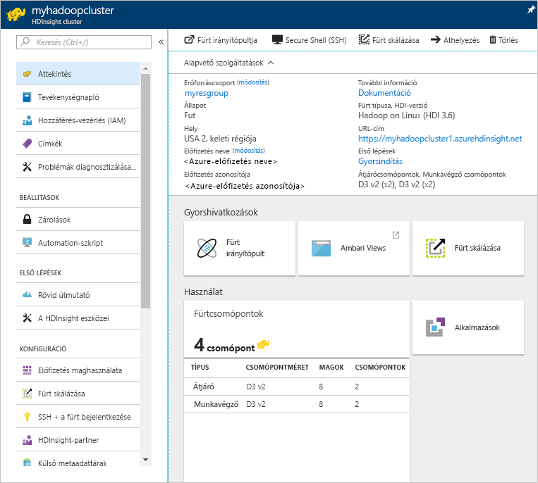

# Hadoop oktatóanyag: A Hadoop első lépései a HDInsightban

Megtanulhatja, hogyan hozhat létre [Hadoop](http://hadoop.apache.org/)-fürtöket, és hogyan futtathat Hive-feladatokat a HDInsightban. Az [Apache Hive](https://hive.apache.org/) a Hadoop ökoszisztémájának legnépszerűbb összetevője. A HDInsight jelenleg [7 különböző fürttípussal érhető el](apache-hadoop-introduction.md#overview). Minden egyes fürttípus más és más összetevőket támogat. A Hive-ot minden fürttípus támogatja. A HDInsightban támogatott összetevők listáját lásd: [What's new in the Hadoop cluster versions provided by HDInsight?](../hdinsight-component-versioning.md) (A HDInsight által biztosított Hadoop-fürtverziók újdonságai).  

[!INCLUDE [delete-cluster-warning](../../../includes/hdinsight-delete-cluster-warning.md)]

## Előfeltételek
Az oktatóanyag elindításának feltétele:

* **Azure-előfizetés**: egy ingyenes egy hónapos próbafiók létrehozásához keresse fel az [azure.microsoft.com/free](https://azure.microsoft.com/free) webhelyet.

## Fürt létrehozása

A legtöbb Hadoop-feladat kötegelt feladat. Létrehoz fog hozni egy fürtöt, futtat néhány feladatot, majd törölni fogja a fürtöt. Ebben a szakaszban egy Hadoop-fürtöt hozhat létre a HDInsightban egy [Azure Resource Manager-sablonnal](../../azure-resource-manager/resource-group-template-deploy.md). Nem kell a Resource Manager-sablonok használatára vonatkozó tapasztalattal rendelkeznie az oktatóanyag követéséhez. Egyéb fürtlétrehozási módszerekhez és az oktatóanyagban használt tulajdonságok megértéséhez tekintse meg a [Create HDInsight clusters](../hdinsight-hadoop-provision-linux-clusters.md) (HDInsight-fürtök létrehozása) című témakört. Az oldal tetején található választóval adja meg a fürtlétrehozási beállításokat.

Az oktatóanyagban használt Resource Manager-sablon a [GitHubon](https://azure.microsoft.com/resources/templates/101-hdinsight-linux-ssh-password/) található. 

1. Az alábbi képre kattintva jelentkezzen be az Azure-ba, és nyissa meg a Resource Manager-sablont az Azure Portalon. 
   
    
2. Adja meg vagy válassza ki a következő értékeket:
   
    .
   
    * **Előfizetés**: Válassza ki az Azure-előfizetést.
    * **Erőforráscsoport**: Hozzon létre egy erőforráscsoportot, vagy válasszon ki egy már meglévőt.  Az erőforráscsoport az Azure összetevőit tartalmazó tároló.  Ebben az esetben az erőforráscsoport a HDInsight-fürtöt és a függő Azure Storage-fiókot tartalmazza. 
    * **Hely**: Válassza ki, melyik Azure-helyen kívánja létrehozni a fürtöt.  A legjobb teljesítmény érdekében válassza az Önhöz legközelebb eső helyet. 
    * **Fürt típusa**: Válassza a **hadoop** lehetőséget ehhez az oktatóanyaghoz.
    * **Fürt neve**: Adja meg a Hadoop-fürt nevét.
    * **A fürt bejelentkezési neve és jelszava**: Az alapértelmezett bejelentkezési név az **admin**.
    * **SSH-felhasználónév és jelszó**: Az alapértelmezett felhasználónév az **sshuser**.  Ezt át lehet nevezni. 
     
    Egyes tulajdonságok szoftveresen kötöttek a sablonban.  Ezeket az értéteket a sablonból konfigurálhatja.

    * **Hely**: A fürt és a függő tárfiók helye megegyezik az erőforráscsoport helyével.
    * **Fürt verziója**: 3.6
    * **Operációs rendszer típusa**: Linux
    * **Munkavégző csomópontok száma**: 2

     Minden egyes fürt egy [Azure Storage-fióktól](../hdinsight-hadoop-use-blob-storage.md) vagy egy [Azure Data Lake-fióktól](../hdinsight-hadoop-use-data-lake-store.md) függ. Ez az alapértelmezett tárfiók. A HDInsight-fürtnek és az alapértelmezett tárfióknak ugyanabban az Azure-régióban kell lennie. A fürtök törlésével a tárfiók nem törlődik. 
     
     További magyarázat ezekről a tulajdonságokról: [Hadoop-fürtök létrehozása a HDInsightban](../hdinsight-hadoop-provision-linux-clusters.md).

3. Válassza az **Elfogadom a fenti feltételeket** és a **Rögzítés az irányítópulton** lehetőséget, majd kattintson a **Vásárlás** elemre. A portál irányítópultján egy új csempe jelenik meg **Sablon üzemelő példányának üzembe helyezése** címmel. Egy fürt létrehozása nagyjából 20 percet vesz igénybe. A fürt létrejötte után a csempe felirata átvált az Ön által megadott erőforráscsoport-névre. A portál pedig automatikusan megnyitja az erőforráscsoportot. A panelen a fürt és az alapértelmezett tároló is megjelenik.
   
    .

4. A fürt nevére kattintva a fürt megnyílik.

   

## Hive-lekérdezések futtatása
Az [Apache Hive](hdinsight-use-hive.md) a HDInsight legnépszerűbb összetevője. Számos módon futtathat Hive-feladatokat a HDInsightban. Ebben az oktatóanyagban a portál Ambari Hive nézetét használjuk. A Hive-feladatok egyéb küldési módjaiért lásd: [Use Hive in HDInsight](hdinsight-use-hive.md) (A Hive használata a HDInsightban).

1. Az előző képernyőkép szerint kattintson a **Fürt irányítópultja**, majd a **HDInsight-fürt irányítópultja** elemre.  Keresse fel a **https://&lt;FürtNeve>.azurehdinsight.net** webhelyet, ahol a &lt;FürtNeve> az a fürt, amelyet az előző szakaszban az Ambari megnyitásához hozott létre.
2. Adja meg az előző szakaszban létrehozott Hadoop-felhasználónevet és -jelszót. Az alapértelmezett felhasználónév az **admin**.
3. Nyissa meg a **Hive View** nézetet az alábbi képernyőfelvételen látható módon:
   
    .
4. A lap **Query Editor** (Lekérdezésszerkesztő) szakaszában másolja be a következő HiveQL-kifejezést a munkalapra:
   
        SHOW TABLES;
   
   > [!NOTE]
   > A pontosvessző megadása a Hive-nál kötelező.       
   > 
   > 
5. Kattintson az **Execute** (Végrehajtás) parancsra. A lekérdezésszerkesztő alatt egy **Query Process Results** (Lekérdezési folyamat eredményei) című szakasznak kell megjelennie, amelyben a feladat információi láthatók. 
   
    A lekérdezés befejeztével a **Query Process Results** (Lekérdezési folyamat eredményei) szakaszban a művelet eredményei jelennek meg. Látni fog egy **hivesampletable** nevű táblát. Ezzel a Hive mintatáblával az összes HDInsight-fürt rendelkezik.
   
    .
6. Ismételje meg a 4. és az 5. lépést az alábbi lekérdezés futtatásához:
   
        SELECT * FROM hivesampletable;
   
   > [!TIP]
   > Tekintse meg az **Save results** (Eredmények mentése) legördülő menüt a **Query Process Results** (Lekérdezési folyamat eredményei) szakaszban, melynek segítségével az eredményeket letöltheti vagy CSV-fájlként mentheti a HDInsight-tárolóba.
   > 
   > 
7. A **History** (Előzmények) lehetőségre kattintva megkapja a feladatok listáját.

Egy Hive-feladat befejezése után [exportálhatja az eredményeket az Azure SQL Database adatbázisba vagy az SQL Server-adatbázisba](apache-hadoop-use-sqoop-mac-linux.md), valamint az [Excel segítségével meg is jelenítheti az eredményeket](apache-hadoop-connect-excel-power-query.md). A Hive HDInsight rendszeren belüli használatával kapcsolatos további információkért lásd: [Use Hive and HiveQL with Hadoop in HDInsight to analyze a sample Apache log4j file](hdinsight-use-hive.md) (A Hive és a HiveQL együttes használata a HDInsight Hadoop eszközével egy Apache log4j mintafájl elemzéséhez).

## Az oktatóanyag tartalmának törlése
Az oktatóanyag befejezése után érdemes törölni a fürtöt. A HDInsight az Azure Storage szolgáltatásban tárolja az adatokat, így biztonságosan törölhet olyan fürtöket, amelyek nincsenek használatban. Ráadásul a HDInsight-fürtök akkor is díjkötelesek, amikor éppen nincsenek használatban. Mivel a fürt költsége a sokszorosa a tároló költségeinek, gazdaságossági szempontból is ésszerű törölni a használaton kívüli fürtöket. 

> [!NOTE]
> Az [Azure Data Factory](../hdinsight-hadoop-create-linux-clusters-adf.md) segítségével igény szerint hozhat létre HDInsight-fürtöket, és konfigurálhat egy TimeToLive-beállítást a fürtök automatikus törléséhez. 
> 
> 

**A fürt és/vagy az alapértelmezett tárfiók törlése**

1. Jelentkezzen be az [Azure Portalra](https://portal.azure.com).
2. A portál irányítópultján kattintson arra a csempére, amelynek a neve megegyezik a fürt létrehozásakor használt erőforráscsoport-névvel.
3. Kattintson a **Törlés** gombra a fürtöt és az alapértelmezett tárfiókot tartalmazó erőforráscsoport törléséhez, vagy kattintson az **Erőforrások** csempén a fürt nevére, majd kattintson a **Törlés** elemre. Vegye figyelembe, hogy az erőforráscsoport törlése a tárfiókot is törli. Ha szeretné megtartani a tárfiókot, csak a fürtöt törölje.

## Hibaelhárítás

Ha problémába ütközik a HDInsight-fürtök létrehozása során, tekintse meg [a hozzáférés-vezérlésre vonatkozó követelményeket](../hdinsight-administer-use-portal-linux.md#create-clusters).

## További lépések
Ebben az oktatóprogramban megtanulhatta, hogyan hozhat létre Linux-alapú HDInsight-fürtöt egy Resource Manager-sablonnal, és hogyan hajthat végre alapszintű Hive-lekérdezéseket.

A HDInsight használatával történő adatelemzésről az alábbi cikkekben talál további információt:

* További információ a Hive és a HDInsight együttes használatáról, például a Hive-lekérdezések Visual Studióból történő végrehajtásáról: [A Hive használata a HDInsighttal](hdinsight-use-hive.md).
* További információ az adatok átalakítására szolgáló Pig nyelvről: [A Pig használata a HDInsighttal](hdinsight-use-pig.md).
* További információ a Hadoopon adatokat feldolgozó programok írására szolgáló MapReduce módszerről: [A MapReduce használata a HDInsighttal](hdinsight-use-mapreduce.md).
* A HDInsight-adatok elemzésére szolgáló HDInsight Tools for Visual Studio szolgáltatással kapcsolatos további információkért lásd: [Get started using Visual Studio Hadoop tools for HDInsight](apache-hadoop-visual-studio-tools-get-started.md) (A HDInsight Visual Studio Hadoop-eszközeinek használatára vonatkozó első lépések).

Ha készen áll dolgozni a saját adataival, és szeretne többet megtudni a HDInsight adattárolási módszereiről, illetve arról, hogyan kerülnek az adatok a HDInsightba, tekintse meg a következő cikkeket:

* További információt az Azure Storage HDInsight általi használatáról [az Azure Storage és a HDInsight együttes használatát](../hdinsight-hadoop-use-blob-storage.md) ismertető cikkben talál.
* További információ a HDInsightba való adatfeltöltésről: [Adatok feltöltése a HDInsightba](../hdinsight-upload-data.md).

A HDInsight-fürtök létréhozásával vagy kezelésével kapcsolatos további információkért lásd a következő cikkeket:

* Információk a Linux-alapú HDInsight-fürtök kezeléséhez: [Manage HDInsight clusters using Ambari](../hdinsight-hadoop-manage-ambari.md) (HDInsight-fürtök kezelése az Ambari segítségével).
* További információ a HDInsight-fürtök létrehozásakor kiválasztható beállításokról: [Creating HDInsight on Linux using custom options](../hdinsight-hadoop-provision-linux-clusters.md) (HDInsight létrehozása Linux rendszeren egyéni beállításokkal).
* Ha már ismeri a Linux és a Hadoop használatát, de szeretne konkrét részleteket megtudni a HDInsight-alapú Hadoopról, akkor tekintse meg a következő témakört: [Working with HDInsight on Linux](../hdinsight-hadoop-linux-information.md) (A HDInsight használata Linux rendszeren). Ez a cikk többek között az alábbi információkat tartalmazza:
  
  * a fürtön tárolt szolgáltatások, például az Ambari és a WebHCat URL-címét;
  * a Hadoop-fájlok és- példák helyét a helyi fájlrendszerben;
  * az Azure Storage (WASB) alapértelmezett adattárként történő használatát a HDFS helyett.

[1]: ../HDInsight/apache-hadoop-visual-studio-tools-get-started.md

[hdinsight-provision]: hdinsight-provision-linux-clusters.md
[hdinsight-upload-data]: hdinsight-upload-data.md
[hdinsight-use-hive]: hdinsight-use-hive.md
[hdinsight-use-pig]: hdinsight-use-pig.md

