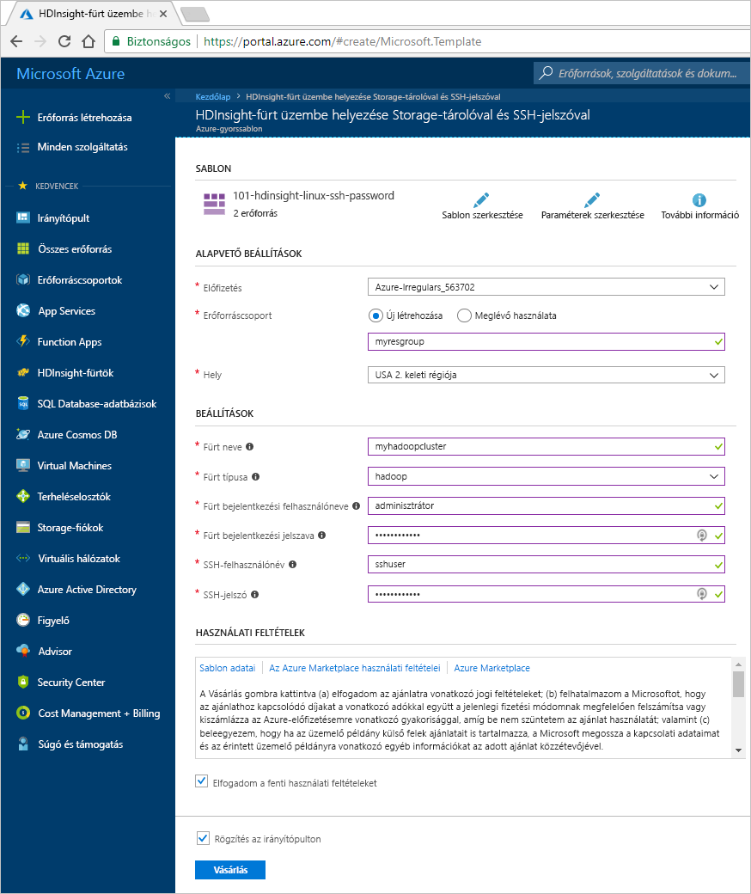
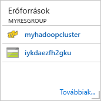
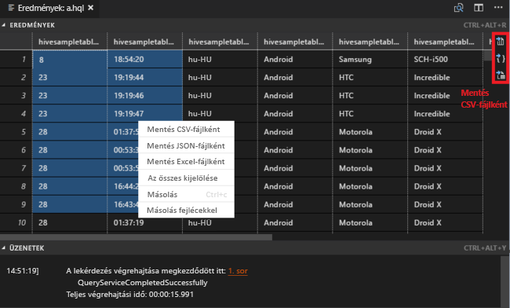
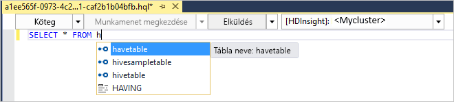
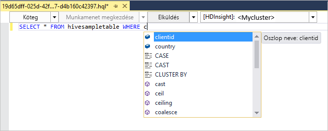
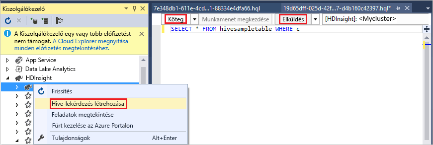
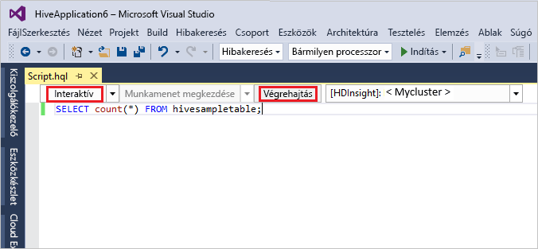
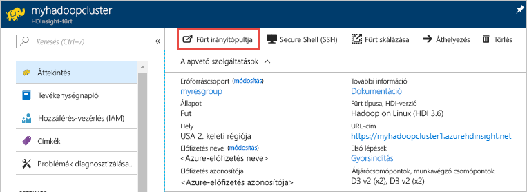
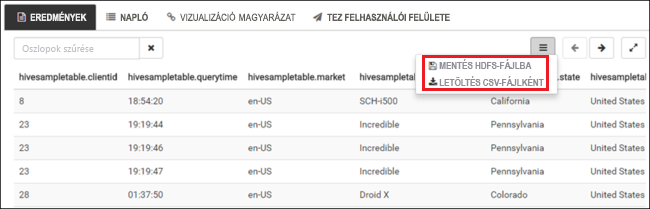
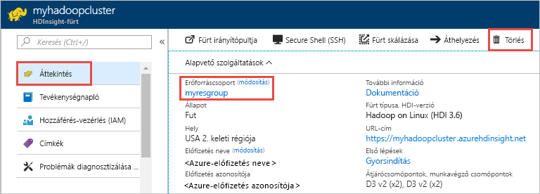

# <a name="quickstart-get-started-with-hadoop-and-hive-in-azure-hdinsight-using-resource-manager-template"></a>Gyors útmutató: A Hadoop és a Hive Azure HDInsightban való használatának első lépései Resource Manager-sablonnal

Ebben a cikkben megtanulhatja, hogyan hozhat létre [Hadoop](http://hadoop.apache.org/)-fürtöket a HDInsightban Resource Manager-sablonok használatával, és hogyan futtathat Hive-feladatokat a HDInsightban. A legtöbb Hadoop-feladat kötegelt feladat. Létrehoz fog hozni egy fürtöt, futtat néhány feladatot, majd törölni fogja a fürtöt. Ebben a cikkben mind a három feladatot elvégzi.

Ebben a rövid útmutatóban egy HDInsight Hadoop-fürtöt fog létrehozni egy Azure Resource Manager-sablon használatával. Az [Azure Portal](apache-hadoop-linux-create-cluster-get-started-portal.md) használatával is létrehozhat fürtöket.

A HDInsight jelenleg [7 különböző fürttípussal érhető el](./apache-hadoop-introduction.md#cluster-types-in-hdinsight). Minden egyes fürttípus más és más összetevőket támogat. A Hive-ot minden fürttípus támogatja. A HDInsightban támogatott összetevők listáját lásd: [What's new in the Hadoop cluster versions provided by HDInsight?](../hdinsight-component-versioning.md) (A HDInsight által biztosított Hadoop-fürtverziók újdonságai).  

Ha nem rendelkezik Azure-előfizetéssel, [hozzon létre egy ingyenes fiókot](https://azure.microsoft.com/free/) a feladatok megkezdése előtt.

<a name="create-cluster"></a>
## <a name="create-a-hadoop-cluster"></a>Hadoop-fürt létrehozása

Ebben a szakaszban egy Hadoop-fürtöt hozhat létre a HDInsightban egy Azure Resource Manager-sablonnal. Nem kell a Resource Manager-sablonok használatára vonatkozó tapasztalattal rendelkeznie a cikk lépéseinek követéséhez. 

1. Az alábbi **Üzembe helyezés az Azure-ban** gombra kattintva jelentkezzen be az Azure-ba, és nyissa meg a Resource Manager-sablont az Azure Portalon. 
   
    <a href="https://portal.azure.com/#create/Microsoft.Template/uri/https%3A%2F%2Fraw.githubusercontent.com%2FAzure%2Fazure-quickstart-templates%2Fmaster%2F101-hdinsight-linux-ssh-password%2Fazuredeploy.json" target="_blank"></a>

2. Adja meg vagy válassza ki az értékeket az alábbi képernyőképen látható módon:

    > [!NOTE]
    > A megadott értékeknek egyedinek kell lenniük, és követniük kell az elnevezési irányelveket. A sablon nem végez érvényességi ellenőrzéseket. Ha a megadott értékek már használatban vannak, vagy nem felelnek meg az irányelveknek, a sablon elküldését követően egy hibaüzenetet fog kapni.       
    > 
    >
    
    

    Adja meg vagy válassza ki a következő értékeket:
    
    |Tulajdonság  |Leírás  |
    |---------|---------|
    |**Előfizetés**     |  Válassza ki az Azure-előfizetését. |
    |**Erőforráscsoport**     | Hozzon létre egy erőforráscsoportot, vagy válasszon ki egy már meglévőt.  Az erőforráscsoport az Azure összetevőit tartalmazó tároló.  Ebben az esetben az erőforráscsoport a HDInsight-fürtöt és a függő Azure Storage-fiókot tartalmazza. |
    |**Hely**     | Válassza ki, melyik Azure-helyen kívánja létrehozni a fürtöt.  A legjobb teljesítmény érdekében válassza az Önhöz legközelebb eső helyet. |
    |**Fürt típusa**     | Válassza a **Hadoop** lehetőséget. |
    |**Fürt neve**     | Adja meg a Hadoop-fürt nevét. Mivel a HDInsightban az összes fürt ugyanazt a DNS-névteret használja, a névnek egyedinek kell lennie. A név legfeljebb 59 karakter hosszúságú lehet, és csak betűket, számokat, illetve kötőjelet tartalmazhat. A név első és utolsó karaktere nem lehet kötőjel. |
    |**A fürt bejelentkezési neve és jelszava**     | Az alapértelmezett bejelentkezési név az **admin**. A jelszónak legalább 10 karakterből kell állnia, és tartalmaznia kell legalább egy számot, egy nagybetűs és egy kisbetűs, illetve egy nem alfanumerikus karaktert (ami nem lehet ' " ` \)). Győződjön meg róla, hogy **ne adjon meg** gyakori jelszót, mint például a következő: Pass@word1.|
    |**SSH-felhasználónév és jelszó**     | Az alapértelmezett felhasználónév az **sshuser**.  Az SSH-felhasználónevet át lehet nevezni.  Az SSH-felhasználói jelszóra ugyanazon követelmények vonatkoznak, mint a fürt bejelentkezési jelszavára.|
       
    Egyes tulajdonságok szoftveresen kötöttek a sablonban.  Ezeket az értéteket a sablonból konfigurálhatja. További magyarázat ezekről a tulajdonságokról: [Hadoop-fürtök létrehozása a HDInsightban](../hdinsight-hadoop-provision-linux-clusters.md).

3. Jelölje be az **Elfogadom a fenti feltételeket** és a **Rögzítés az irányítópulton** lehetőséget, majd válassza a **Vásárlás** lehetőséget. A portál irányítópultján egy új csempe jelenik meg **Üzembe helyezés beküldése** címmel. Egy fürt létrehozása nagyjából 20 percet vesz igénybe.

    

4. A fürt létrejötte után a csempe felirata átvált az Ön által megadott erőforráscsoport-névre. A csempe az erőforráscsoporton belül létrejött HDInsight-fürtöt is felsorolja. 
   
    
    
5. A csempe a fürthöz tartozó alapértelmezett tárterületet is felsorolja. Minden egyes fürt egy [Azure Storage-fióktól](../hdinsight-hadoop-use-blob-storage.md) vagy egy [Azure Data Lake-fióktól](../hdinsight-hadoop-use-data-lake-store.md) függ. Ez az alapértelmezett tárfiók. A HDInsight-fürtnek és az alapértelmezett tárfióknak ugyanabban az Azure-régióban kell lennie. A fürtök törlésével a tárfiók nem törlődik.
    

> [!NOTE]
> Egyéb fürtlétrehozási módszerekhez és az oktatóanyagban használt tulajdonságok megértéséhez tekintse meg a [Create HDInsight clusters](../hdinsight-hadoop-provision-linux-clusters.md) (HDInsight-fürtök létrehozása) című témakört.       
> 
>

## <a name="use-vscode-to-run-hive-queries"></a>Hive-lekérdezések futtatása a VSCode használatával

A HDInsight Tools használata VSCode-ban: [Azure HDInsight Tools használata a Visual Studio Code-hoz](../hdinsight-for-vscode.md).

### <a name="submit-interactive-hive-queries"></a>Interaktív Hive-lekérdezések küldése

A HDInsight Tools for VSCode segítségével küldhet interaktív Hive-lekérdezéseket HDInsight interaktív lekérdezési fürtökre.

1. Ha még nem tette, hozzon létre egy új munkamappát és egy új Hive-szkriptfájlt.

2. Csatlakozzon az Azure-fiókhoz, majd konfigurálja az alapértelmezett fürtöt, ha még nem tette.

3. Másolja ki és illessze be az alábbi kódot a Hive-fájlba, majd mentse el.

    ```hiveql
    SELECT * FROM hivesampletable;
    ```
4. Kattintson jobb gombbal a szkriptszerkesztőre, majd válassza a **HDInsight: Hive Interactive (Interaktív Hive)** lehetőséget a lekérdezés küldéséhez. Az eszközök segítségével a helyi menüt használva egy kódblokkot is beküldhet az egész szkriptfájl helyett. A lekérdezés eredményei hamarosan megjelennek egy új lapon.

   

    - **RESULTS** (EREDMÉNYEK) panel: A teljes eredményt elmentheti CSV-, JSON- vagy Excel-fájlban a helyi útvonalon, de kijelölhet csupán pár sort is.

    - **MESSAGES** (ÜZENETEK) panel: A **sor** számának kiválasztásakor a futó szkript első sorához ugrik.

Az interaktív lekérdezés futtatása lényegesen kevesebb időt vesz igénybe, mint [egy Hive-os kötegelt feladat futtatása](#submit-hive-batch-scripts).

### <a name="submit-hive-batch-scripts"></a>Hive-os kötegelt szkriptek küldése

1. Ha még nem tette, hozzon létre egy új munkamappát és egy új Hive-szkriptfájlt.

2. Csatlakozzon az Azure-fiókhoz, majd konfigurálja az alapértelmezett fürtöt, ha még nem tette.

3. Másolja ki és illessze be az alábbi kódot a Hive-fájlba, majd mentse el.

    ```hiveql
    SELECT * FROM hivesampletable;
    ```
4. Kattintson jobb gombbal a szkriptszerkesztőre, majd válassza a **HDInsight: Hive Batch (Kötegelt Hive)** lehetőséget egy Hive-feladat küldéséhez. 

5. Válassza ki a küldés célpontjául szolgáló fürtöt.  

    Egy Hive-feladat elküldése után a küldés sikerességére vonatkozó információk és a feladatazonosító megjelenik az **OUTPUT** (KIMENET) panelen. A Hive-feladat megnyitja a **WEB BROWSER** (WEBBÖNGÉSZŐ) felületet is, itt jelennek a valós idejű feladatnaplók és a feladat állapota.

   

Az [interaktív Hive-lekérdezés küldése](#submit-interactive-hive-queries) lényegesen kevesebb időt vesz igénybe, mint egy kötegelt feladat küldése.

## <a name="use-visualstudio-to-run-hive-queries"></a>Hive-lekérdezések futtatása a Visual Studio használatával

A HDInsight Tools Visual Studióban való használatáról [a Data Lake Tools for Visual Studio használatát ismertető cikkben olvashat](./apache-hadoop-visual-studio-tools-get-started.md).

### <a name="run-hive-queries"></a>Hive-lekérdezések futtatása

Hive-lekérdezések létrehozására és futtatására két lehetősége van:

* Alkalmi lekérdezések létrehozása
* Hive alkalmazás létrehozása

Alkalmi lekérdezések létrehozása és futtatása:

1. A **Server Explorerben** válassza az **Azure** > **HDInsight-fürtök** elemet.

2. Kattintson a jobb gombbal a fürtre, ahol futtatni szeretné a lekérdezést, majd kattintson a **Write a Hive Query** (Hive-lekérdezés írása) parancsra.  

3. Adja meg a Hive-lekérdezéseket. 

    A Hive szerkesztője támogatja az IntelliSense-t. A Data Lake Tools for Visual Studio támogatja a távoli metaadatok betöltését a Hive-szkript szerkesztésekor. Amikor például a **SELECT * FROM** parancsot írja be, az IntelliSense listázza az összes javasolt táblanevet. Amikor megad egy táblanevet, az IntelliSense listázza az oszlopneveket. Az eszközök a legtöbb Hive DML-utasítást, -segédlekérdezést és beépített UDF-et támogatják.
   
    
   
    
   
   > [!NOTE]
   > Az IntelliSense csak a HDInsight eszköztáron kijelölt fürt metaadatait javasolja.
   > 
   
4. Kattintson a **Submit** (Küldés) vagy a **Submit (Advanced)** (Küldés (Speciális)) elemre. 
   
    

   A speciális küldési lehetőséggel konfigurálja a szkript **Job Name** (Feladat neve), **Arguments** (Argumentumok), **Additional Configurations** (További konfigurációk) és **Status Directory** (Állapot könyvtár) elemeit:

    

   Interaktív Hive-lekérdezések futtatása

   * Az **interaktív** beállítás kiválasztásához kattintson a lefelé mutató nyílra. 
   
   * Kattintson az **Execute** (Végrehajtás) parancsra.

   

Hive-megoldás létrehozása és futtatása:

1. A **File** (Fájl) menüben válassza a **New** (Új), majd a **Project** (Projekt) parancsot.
2. A bal oldali panelen válassza ki a **HDInsight** elemet. A középső panelen válassza a **Hive Application** (Hive-alkalmazás) elemet. Adja meg a tulajdonságokat, majd kattintson az **OK** gombra.
   
    
3. A **Solution Explorerben** (Megoldáskezelőben) kattintson duplán a **Script.hql** fájlra a szkript megnyitásához.
4. Adja meg a Hive-lekérdezéseket, és küldje be azokat. (Tekintse meg a fenti 3. és 4. lépést)  


## <a name="run-hive-queries"></a>Hive-lekérdezések futtatása

Az [Apache Hive](hdinsight-use-hive.md) a HDInsight legnépszerűbb összetevője. Számos módon futtathat Hive-feladatokat a HDInsightban. Ebben az oktatóanyagban a portál Ambari Hive nézetét használjuk. A Hive-feladatok egyéb küldési módjaiért lásd: [Use Hive in HDInsight](hdinsight-use-hive.md) (A Hive használata a HDInsightban).

1. Az Ambari megnyitásához az előző képernyőkép szerint válassza a **Fürt irányítópultja** elemet.  Vagy keresse fel a **https://&lt;FürtNeve>.azurehdinsight.net** webhelyet, ahol a &lt;FürtNeve> az a fürt, amelyet az előző szakaszban az Ambari megnyitásához hozott létre.

    

2. Adja meg a fürt létrehozásakor megadott Hadoop-felhasználónevet és -jelszót. Az alapértelmezett felhasználónév az **admin**.

3. Nyissa meg a **Hive View** nézetet az alábbi képernyőfelvételen látható módon:
   
    

4. A **QUERY** (Lekérdezés) lapon másolja be a következő HiveQL-kifejezést a munkalapra:
   
        SHOW TABLES;

    
   
   > [!NOTE]
   > A pontosvessző megadása a Hive-nál kötelező.       
   > 
   > 

5. Válassza a **Végrehajtás** lehetőséget. A **QUERY** (Lekérdezés) lap alatt megjelenik a **RESULTS** (Eredmények) lap, amelyen a feladat információi láthatók. 
   
    A lekérdezés befejeztével a **QUERY** (Lekérdezés) lapon megjelennek a művelet eredményei. Látni fog egy **hivesampletable** nevű táblát. Ezzel a Hive mintatáblával az összes HDInsight-fürt rendelkezik.
   
    

6. Ismételje meg a 4. és az 5. lépést az alábbi lekérdezés futtatásához:
   
        SELECT * FROM hivesampletable;
   
7. A lekérdezés eredményeit mentheti is. Válassza a jobb oldalon lévő menügombot, és adja meg, hogy letölti az eredményeket CSV-fájlként, vagy a fürthöz társított tárfiókban szeretné tárolni őket.

    

Egy Hive-feladat befejezése után [exportálhatja az eredményeket az Azure SQL Database adatbázisba vagy az SQL Server-adatbázisba](apache-hadoop-use-sqoop-mac-linux.md), valamint az [Excel segítségével meg is jelenítheti az eredményeket](apache-hadoop-connect-excel-power-query.md). A Hive HDInsight rendszeren belüli használatával kapcsolatos további információkért lásd: [Use Hive and HiveQL with Hadoop in HDInsight to analyze a sample Apache log4j file](hdinsight-use-hive.md) (A Hive és a HiveQL együttes használata a HDInsight Hadoop eszközével egy Apache log4j mintafájl elemzéséhez).

## <a name="troubleshoot"></a>Hibaelhárítás

Ha problémába ütközik a HDInsight-fürtök létrehozása során, tekintse meg [a hozzáférés-vezérlésre vonatkozó követelményeket](../hdinsight-administer-use-portal-linux.md#create-clusters).

## <a name="clean-up-resources"></a>Az erőforrások eltávolítása
A cikk befejezése után érdemes törölni a fürtöt. A HDInsight az Azure Storage szolgáltatásban tárolja az adatokat, így biztonságosan törölhet olyan fürtöket, amelyek nincsenek használatban. Ráadásul a HDInsight-fürtök akkor is díjkötelesek, amikor éppen nincsenek használatban. Mivel a fürt költsége a sokszorosa a tároló költségeinek, gazdaságossági szempontból is ésszerű törölni a használaton kívüli fürtöket. 

> [!NOTE]
> Ha *azonnal* továbblép a következő oktatóanyagra, amelyben megismerheti, hogyan futtathat ETL-műveleteket a Hadoop használatával a HDInsighton, érdemes lehet futva hagyni a fürtöt. Ez azért van, mert az oktatóanyagban ismét létre kell hoznia egy Hadoop-fürtöt. Ha azonban nem azonnal folytatja a következő oktatóanyaggal, most törölnie kell a fürtöt.
> 
> 

**A fürt és/vagy az alapértelmezett tárfiók törlése**

1. Térjen vissza ahhoz a böngészőlaphoz, amelyen meg van nyitva az Azure Portal. A portálon a fürt áttekintési lapja lesz látható. Ha csak a fürtöt szeretné törölni, de meg szeretné tartani az alapértelmezett tárfiókot, válassza a **Törlés** lehetőséget.

    

2. Ha a fürtöt és az alapértelmezett tárfiókot is törölni kívánja, válassza ki az erőforráscsoport nevét (amely az előző képernyőképen ki van emelve) az erőforráscsoport lapjának megnyitásához.

3. Válassza az **Erőforráscsoport törlése** lehetőséget a fürtöt és az alapértelmezett tárfiókot tartalmazó erőforráscsoport törléséhez. Vegye figyelembe, hogy az erőforráscsoport törlése a tárfiókot is törli. Ha szeretné megtartani a tárfiókot, csak a fürtöt törölje.

## <a name="next-steps"></a>További lépések
Ebben a cikkben megtanulhatta, hogyan hozhat létre Linux-alapú HDInsight-fürtöt egy Resource Manager-sablonnal, és hogyan hajthat végre alapszintű Hive-lekérdezéseket. A következő cikkben megtudhatja, hogyan végezheti el az adatok kinyerési, átalakítási és betöltési (ETL) műveleteit a Hadoop használatával a HDInsighton.

> [!div class="nextstepaction"]
>[Adatok kinyerése, átalakítása és betöltése az Apache Hive használatával a HDInsighton ](../hdinsight-analyze-flight-delay-data-linux.md)

Ha készen áll dolgozni a saját adataival, és szeretne többet megtudni a HDInsight adattárolási módszereiről, illetve arról, hogyan kerülnek az adatok a HDInsightba, tekintse meg a következő cikkeket:

* További információt az Azure Storage HDInsight általi használatáról [az Azure Storage és a HDInsight együttes használatát](../hdinsight-hadoop-use-blob-storage.md) ismertető cikkben talál.
* További információ a HDInsightba való adatfeltöltésről: [Adatok feltöltése a HDInsightba](../hdinsight-upload-data.md).

A HDInsight használatával történő adatelemzésről az alábbi cikkekben talál további információt:

* További információ a Hive és a HDInsight együttes használatáról, például a Hive-lekérdezések Visual Studióból történő végrehajtásáról: [A Hive használata a HDInsighttal](hdinsight-use-hive.md).
* További információ az adatok átalakítására szolgáló Pig nyelvről: [A Pig használata a HDInsighttal](hdinsight-use-pig.md).
* További információ a Hadoopon adatokat feldolgozó programok írására szolgáló MapReduce módszerről: [A MapReduce használata a HDInsighttal](hdinsight-use-mapreduce.md).
* A HDInsight-adatok elemzésére szolgáló HDInsight Tools for Visual Studio szolgáltatással kapcsolatos további információkért lásd: [Get started using Visual Studio Hadoop tools for HDInsight](apache-hadoop-visual-studio-tools-get-started.md) (A HDInsight Visual Studio Hadoop-eszközeinek használatára vonatkozó első lépések).
* A HDInsight-adatok elemzésére szolgáló HDInsight Tools for VSCode szolgáltatással kapcsolatos további információkat [az Azure HDInsight Tools for Visual Studio Code használatát ismertető cikkben találja](../hdinsight-for-vscode.md).


A HDInsight-fürtök létréhozásával vagy kezelésével kapcsolatos további információkért lásd a következő cikkeket:

* Információk a Linux-alapú HDInsight-fürtök kezeléséhez: [Manage HDInsight clusters using Ambari](../hdinsight-hadoop-manage-ambari.md) (HDInsight-fürtök kezelése az Ambari segítségével).
* További információ a HDInsight-fürtök létrehozásakor kiválasztható beállításokról: [Creating HDInsight on Linux using custom options](../hdinsight-hadoop-provision-linux-clusters.md) (HDInsight létrehozása Linux rendszeren egyéni beállításokkal).


[1]: ../HDInsight/apache-hadoop-visual-studio-tools-get-started.md

[hdinsight-provision]: hdinsight-provision-linux-clusters.md
[hdinsight-upload-data]: hdinsight-upload-data.md
[hdinsight-use-hive]: hdinsight-use-hive.md
[hdinsight-use-pig]: hdinsight-use-pig.md


