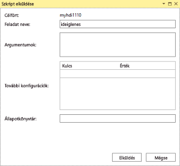
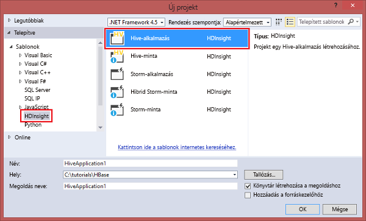

# Kapcsolódás az Azure HDInsighthoz és Hive-lekérdezések futtatása a Data Lake Tools for Visual Studio használatával

A cikk azt ismerteti, hogyan használhatók a Data Lake Tools for Visual Studio (más néven Azure Data Lake and Stream Analytics Tools for Visual Studio) Hadoop-fürtök [Azure HDInsightbeli](../hdinsight-hadoop-introduction.md) csatlakoztatásához, illetve Hive-lekérdezések elküldéséhez. 

További információ a HDInsight használatáról: [A HDInsight bemutatása](../hdinsight-hadoop-introduction.md) és [HDInsight – első lépések](apache-hadoop-linux-tutorial-get-started.md). 

További információ a Storm-fürtökhöz való csatlakozásról: [C#-topológiák fejlesztése HDInsighton futó Apache Stormra a Visual Studióval](../storm/apache-storm-develop-csharp-visual-studio-topology.md).

A Data Lake Tools for Visual Studio mind az Azure Data Lake Analytics, mind a HDInsight eléréséhez használható. A Data Lake Tools eszközökkel kapcsolatos információkért lásd: [U-SQL-szkriptek fejlesztése Data Lake Tools for Visual Studio használatával](../../data-lake-analytics/data-lake-analytics-data-lake-tools-get-started.md).

## Előfeltételek

Az oktatóanyag elvégzéséhez és a Data Lake Tools for Visual Studio használatához a következőkre van szüksége:

* Egy Azure-beli HDInsight-fürt. A HDInsight-fürt létrehozásáról [a Hadoop Azure HDInsightbeli használatának első lépéseivel](apache-hadoop-linux-tutorial-get-started.md) foglalkozó témakörben talál további információt. Az interaktív Hive-lekérdezések futtatásához szüksége van egy [HDInsight interaktív lekérdezési](../interactive-query/apache-interactive-query-get-started.md) fürtre.
* Olyan számítógép, amelyre telepítve van a Visual Studio 2017, 2015 vagy 2013.
    
    > [!NOTE]
    > A Data Lake Tools for Visual Studio jelenleg csak angol nyelven érhető el.
    > 
    > 

## A Data Lake Tools for Visual Studio telepítése vagy frissítése

### A Data Lake Tools telepítése

A Data Lake Tools alapértelmezés szerint a Visual Studio 2017-tel együtt települ. A Visual Studio korábbi verziói esetén a Data Lake Tools a [Webplatform-telepítő](https://www.microsoft.com/web/downloads/platform.aspx) használatával telepíthető. Válassza ki a Data Lake Tools azon verzióját, amely megfelel a Visual Studio verziójának. 

### A Visual Studio telepítése

Ha nincs telepítve a Visual Studio, a legújabb Visual Studio Community és Azure SDK-eszközöket a [Webplatform-telepítővel](https://www.microsoft.com/web/downloads/platform.aspx) telepítheti:

### Az eszközök frissítése

1. Nyissa meg a Visual Studiót.
2. A **Tools** (Eszközök) menüben válassza az **Extensions and updates** (Bővítmények és frissítések) lehetőséget.
3. Bontsa ki az **Updates** (Frissítések) elemet, és válassza ki az **Azure Data Lake and Stream Analytics Tools** eszközt (ha telepítve van).

> [!NOTE]
>
> Csak a Data Lake Tools 2.3.0.0-s és újabb verziói támogatják az interaktív lekérdezési fürtökhöz való csatlakozást és az interaktív Hive-lekérdezések futtatását.

## Csatlakozás Azure-előfizetésekhez
A Data Lake Tools for Visual Studio használatával csatlakozhat a HDInsight-fürtökhöz, alapvető felügyeleti műveleteket végezhet, és Hive-lekérdezéseket futtathat.

> [!NOTE]
> Az általános Hadoop fürthöz való csatlakozással kapcsolatos információkat a [Hive-lekérdezések írása és elküldése a Visual Studio eszközzel](http://blogs.msdn.com/b/xiaoyong/archive/2015/05/04/how-to-write-and-submit-hive-queries-using-visual-studio.aspx) témakörben találja.
> 
> 

Csatlakozás az Azure-előfizetéshez:

1. Nyissa meg a Visual Studiót.
2. A **View** (Nézet) menüben válassza a **Server Explorer** (Kiszolgálókezelő) lehetőséget.
3. A Server Explorerben bontsa ki az **Azure** elemet, majd bontsa ki a **HDInsight** elemet.
   
   > [!NOTE]
   > A **HDInsight Task List** (HDInsight-feladatlista) ablaknak nyitva kell lennie. Ha nem látja, kattintson az **Other Windows** (Egyéb ablakok) elemre a **View** (Nézet) menüben, majd kattintson a **HDInsight Task List Window** (HDInsight-feladatlista ablak) parancsra.  
   > 
   > 
4. Írja be az Azure-előfizetés hitelesítő adatait, majd kattintson a **Sign In** (Bejelentkezés) gombra. Hitelesítésre csak akkor van szükség, ha még soha nem csatlakozott az Azure-előfizetéshez a Visual Studióból ezen a számítógépen.
5. A Server Explorerben megjelenik a meglévő HDInsight-fürtök listája. Ha nincsenek fürtjei, létrehozhat egyet az Azure Portal, az Azure PowerShell vagy a HDInsight SDK használatával. További információ: [HDInsight-fürtök létrehozása](../hdinsight-hadoop-provision-linux-clusters.md).
   
   
6. Bontson ki egy HDInsight-fürtöt. Megjelenik a **Hive Databases** (Hive-adatbázisok), egy alapértelmezett tárfiók, a társított tárfiókok és a **Hadoop-szolgáltatásnapló**. Ennél jobban is kibonthatja az elemeket.

Miután csatlakozott az Azure-előfizetéshez, végrehajthatja a következő feladatokat.

Csatlakozás az Azure Portalhoz a Visual Studióból:

1. A Server Explorerben válassza az **Azure** > **HDInsight** elemet.
2. Kattintson a jobb gombbal egy HDInsight-fürtre, majd kattintson a **Manage Cluster in Azure portal** (Fürt kezelése az Azure Portalon) parancsra.

Kérdezés és visszajelzés a Visual Studióból:

1. A **Tools** (Eszközök) menüben válassza a **HDInsight** lehetőséget.
2. Ha kérdése van, válassza az **MSDN Forum** fórumot. Ha visszajelzést szeretne küldeni, válassza a **Give Feedback** (Visszajelzés küldése) lehetőséget.

## Kapcsolt erőforrások vizsgálata
A Server Explorerben láthatja az alapértelmezett tárfiókot és az összes kapcsolt tárfiókot. Ha kibontja az alapértelmezett tárfiókot, láthatja a tárfiókon lévő tárolókat. Az alapértelmezett tárfiók és az alapértelmezett tároló meg van jelölve. Bármely tárolóra a jobb gombbal kattintva megtekintheti azok tartalmát.

Egy tároló megnyitása után a következő gombokkal tölthet fel, törölhet vagy tölthet le blobokat:

## Interaktív Hive-lekérdezések futtatása
Az [Apache Hive](http://hive.apache.org) egy Hadoop-alapú adattárház-infrastruktúra. A Hive adatösszegzéseket, lekérdezéseket és elemzéseket biztosít. A Data Lake Tools for Visual Studio segítségével Hive-lekérdezéseket futtathat a Visual Studióból. További információ a Hive-ról: [A Hive használata a HDInsightban](hdinsight-use-hive.md).

Az [interaktív lekérdezés](../interactive-query/apache-interactive-query-get-started.md) az Apache Hive 2.1-en futó [Hive LLAP](https://cwiki.apache.org/confluence/display/Hive/LLAP) funkcióit használja. Az interaktív lekérdezés interaktivitást biztosít a nagy tárolt adathalmazokon végzett összetett, adattárház-jellegű lekérdezésekhez. A Hive-lekérdezések futtatása sokkal gyorsabb az interaktív lekérdezésekben, mint a hagyományos Hive-alapú kötegelt feladatokban. További információk: [Hive-alapú kötegelt feladatok futtatása](#run-hive-batch-jobs).

> [!NOTE]
>
> Interaktív Hive-lekérdezéseket csak akkor futtathat, ha kapcsolódik egy [HDInsight interaktív lekérdezési](../interactive-query/apache-interactive-query-get-started.md) fürthöz.

A Data Lake Tools for Visual Studio segítségével a Hive-feladatok tartalmát is megtekintheti. A Data Lake Tools for Visual Studio begyűjti és a felszínre hozza bizonyos Hive-feladatok YARN-naplóit.

### A **hivesampletable** megtekintése
Az összes HDInsight-fürt tartalmaz egy hivesampletable nevű Hive-mintatáblát. A Hive-tábla határozza meg, hogyan listázhatja a Hive-táblákat, hogyan tekintheti meg a táblasémákat, és hogyan listázhatja a Hive-táblában lévő sorokat.

A Hive-táblák listázása és a Hive-táblaséma megtekintése:

1. A táblaséma megtekintéséhez a **Server Explorerben** válassza az **Azure** > **HDInsight** elemet. Válassza ki a fürtöt, majd a **Hive Databases** (Hive-adatbázisok) > **Default (Alapértelmezett)** > **hivesampletable** lehetőséget.
2. Kattintson a jobb gombbal a **hivesampletable** elemre, majd kattintson a **View Top 100 Rows** (Első 100 sor megtekintése) parancsra a sorok listázásához. Ez a következő Hive-lekérdezés Hive ODBC-illesztővel végzett futtatásával egyenlő:
   
     `SELECT * FROM hivesampletable LIMIT 100`
   
   Testreszabhatja a sorok számát.
   
   

### Hive táblák létrehozása
Hive-tábla létrehozásához használhatja a grafikus felhasználói felületet vagy a Hive-lekérdezéseket. A Hive-lekérdezésekkel kapcsolatban információért lásd: [Run Hive queries](#run.queries) (Hive-lekérdezések futtatása).

Hive-tábla létrehozása:

1. A **Server Explorerben** válassza az **Azure** > **HDInsight-fürtök** elemet. Válassza ki a HDInsight-fürtöt, majd a **Hive Databases** (Hive-adatbázisok) lehetőséget.
2. Kattintson a jobb gombbal a **default** (alapértelmezett) elemre, majd válassza a **Create Table** (Tábla létrehozása) lehetőséget.
3. Konfigurálja a táblát.  
4. Kattintson a **Create Table** (Tábla létrehozása) parancsra az új Hive-tábla létrehozására szolgáló feladat elküldéséhez.
   
    

### Hive-lekérdezések érvényesítése és futtatása
Hive-lekérdezések létrehozására és futtatására két lehetősége van:

* Alkalmi lekérdezések létrehozása
* Hive alkalmazás létrehozása

Alkalmi lekérdezések létrehozása, érvényesítése és futtatása:

1. A **Server Explorerben** válassza az **Azure** > **HDInsight-fürtök** elemet.
2. Kattintson a jobb gombbal a fürtre, ahol futtatni szeretné a lekérdezést, majd kattintson a **Write a Hive Query** (Hive-lekérdezés írása) parancsra.  
3. Adja meg a Hive-lekérdezéseket. 

    A Hive szerkesztője támogatja az IntelliSense-t. A Data Lake Tools for Visual Studio támogatja a távoli metaadatok betöltését a Hive-szkript szerkesztésekor. Amikor például a **SELECT * FROM** parancsot írja be, az IntelliSense listázza az összes javasolt táblanevet. Amikor megad egy táblanevet, az IntelliSense listázza az oszlopneveket. Az eszközök a legtöbb Hive DML-utasítást, -segédlekérdezést és beépített UDF-et támogatják.
   
    
   
    
   
   > [!NOTE]
   > Az IntelliSense csak a HDInsight eszköztáron kijelölt fürt metaadatait javasolja.
   > 
   
4. (Választható) Kattintson a **Validate Script** (Szkript érvényesítése) gombra a szkript szintaxishibáinak kereséséhez.
   
    
5. Kattintson a **Submit** (Küldés) vagy a **Submit (Advanced)** (Küldés (Speciális)) elemre. A speciális küldési lehetőséggel konfigurálja a szkript **Job Name** (Feladat neve), **Arguments** (Argumentumok), **Additional Configurations** (További konfigurációk) és **Status Directory** (Állapot könyvtár) elemeit:
   
    
   
    A feladat elküldése után megjelenik a **Hive Job Summary** (Hive-feladat összegzése) ablak.
   
    
6. A **Refresh** (Frissítés) gombbal frissítheti az állapotot, amíg a feladat állapota **Completed** (Befejezve) állapotúvá nem válik.
7. Kattintson az alul lévő hivatkozásokra a **Job Query** (Feladatlekérdezés), **Job Output** (Feladatkimenet), **Job log** (Feladatnapló) vagy **Yarn log** (Yarn-napló) megtekintéséhez.

Hive-megoldás létrehozása és futtatása:

1. A **File** (Fájl) menüben válassza a **New** (Új), majd a **Project** (Projekt) parancsot.
2. A bal oldali panelen válassza ki a **HDInsight** elemet. A középső panelen válassza a **Hive Application** (Hive-alkalmazás) elemet. Adja meg a tulajdonságokat, majd kattintson az **OK** gombra.
   
    
3. A **Solution Explorerben** (Megoldáskezelőben) kattintson duplán a **Script.hql** fájlra a szkript megnyitásához.
4. A Hive-szkript érvényesítéséhez kattintson a **Validate Script** (Szkript érvényesítése) gombra, vagy kattintson a jobb gombbal a szkriptre a Hive szerkesztőben, majd kattintson a **Validate Script** (Szkript érvényesítése) parancsra a helyi menüben.

### Hive-feladatok megtekintése
Megtekintheti a Hive-feladatok feladatlekérdezéseit, feladatkiemenetét, feladatnaplóit és Yarn naplóit. További információkért tekintse meg az előző képernyőképet.

Az eszköz legújabb kiadásával láthatja, mi van a Hive-feladatokban, ha begyűjti és felszínre hozza a Yarn-naplókat. A YARN-naplók segíthetnek a teljesítménnyel kapcsolatos problémák vizsgálatában. További információ arról, hogy a HDInsight hogyan gyűjti be a YARN-naplókat: [HDInsight alkalmazásnaplók elérése programozási környezetből](../hdinsight-hadoop-access-yarn-app-logs.md).

Hive-feladatok megtekintése:

1. A **Server Explorerben** bontsa ki az **Azure** elemet, majd bontsa ki a **HDInsight** elemet.
2. Kattintson a jobb gombbal egy HDInsight-fürtre, majd kattintson a **View Jobs** (Feladatok megtekintése) parancsra. Ekkor megjelenik azon Hive-feladatok listája, amelyek a fürtön futottak.  
3. Válasszon ki egy feladatot. A **Hive Job Summary** (Hive-feladat összegzése) ablakban válassza a következők egyikét:
    - **Job Query** (Feladat lekérdezése)
    - **Job Output** (Feladat kimenete)
    - **Job Log** (Feladatnapló)  
    - **Yarn log** (Yarn-napló)
   
    

### Gyorsabb Hive-végrehajtás HiveServer2-n keresztül
> [!NOTE]
> Ez a funkció csak a HDInsight 3.2-es vagy újabb verziójában futó fürtökön működik.
 
A Data Lake Tools for Visual Studio használata Hive-feladatok [WebHCat](https://cwiki.apache.org/confluence/display/Hive/WebHCat) (más néven Templeton) eszközön keresztül végzett küldéséhez. A Hive-feladatok küldésének ezen módszerével hosszú időbe telt a feladatrészletek és a hibainformációk visszaadása.

Ezen teljesítményprobléma megoldása érdekében a Data Lake Tools for Visual Studio közvetlenül a fürtön futtatja a Hive-feladatokat a HiveServer2-n keresztül, kihagyva az RDP/SSH protokollt.

A jobb teljesítmény mellett a Hive on Apache Tez grafikonjai és a feladat részletei is megtekinthetők.

A HDInsight 3.2-es vagy újabb verziójában szereplő fürtben megjelenik egy **Execute via HiveServer2** (Végrehajtás HiveServer-2-n keresztül) feliratú gomb:

A naplók valós időben, streamelve láthatók. Emellett megtekintheti a feladatgrafikonokat is, ha a Hive-lekérdezést a Tezben futtatja.

### A lekérdezések HiveServer2-n keresztüli végrehajtása és a lekérdezések WebHCaten keresztüli elküldése közötti különbségek

Bár a lekérdezések HiveServer2-n keresztül végzett végrehajtásának számos előnye van a teljesítmény szempontjából, vannak korlátozásai is. A korlátozások némelyike miatt ez a módszer nem megfelelő az éles használathoz. 

Az alábbi táblázat a lekérdezések HiveServer2-n végzett végrehajtása és a lekérdezések WebHCaten keresztüli elküldése közötti különbségeket mutatja:

|  | Végrehajtás HiveServer2-n keresztül | Küldés WebHCaten keresztül |
| --- | --- | --- |
| Lekérdezések végrehajtása |Kiküszöböli a WebHCat többletterhelését (amely elindítja a „TempletonControllerJob” nevű MapReduce-feladatot). |Amikor a WebHCaten keresztül hajtja végre a lekérdezést, a WebHCat elindít egy MapReduce-feladatot, amely további késleltetést okoz. |
| Stream naplók vissza |Közel valós időben. |A feladatvégrehajtási naplók csak a feladat elvégzése után érhetők el. |
| Feladatelőzmények megtekintése |Ha egy lekérdezést a HiveServer2-n keresztül futtat, a feladatelőzményei (feladatnapló, feladatkimenet) nem maradnak meg. A Yarn felhasználói felületén korlátozott információkkal megtekintheti az alkalmazást. |Ha egy lekérdezést a WebHCaten keresztül futtat, a feladatelőzményei (feladatnapló, feladatkimenet) megmaradnak. A feladatelőzményeket megtekintheti a Visual Studio, a HDInsight SDK vagy a PowerShell használatával. |
| Ablak bezárása |A HiveServer2-n keresztül történő végrehajtás *szinkron* módon történik. Ha bezárja az ablakokat, akkor megszakítja a lekérdezés végrehajtását. |A WebHCaten keresztül történő elküldés *aszinkron* módon történik. Elküldheti a lekérdezést a WebHCaten keresztül, és bezárhatja a Visual Studiót. Bármikor visszatérhet és megtekintheti az eredményeket. |

### Tez Hive feladat teljesítménye ábra
A Data Lake Tools for Visual Studióban megjelennek a Tez végrehajtómotor által elvégzett Hive-feladatok teljesítménygrafikonjai. További információ a Tez engedélyezéséről: [A Hive használata a HDInsightban](hdinsight-use-hive.md). 

Miután elküldött egy Hive-feladatot a Visual Studióban, a Visual Studio megjeleníti a grafikont a feladat elvégzésekor. Elképzelhető, hogy a **Refresh** (Frissítés) gombra kell kattintania a legfrissebb feladatállapot megtekintéséhez.

> [!NOTE]
> Ez a funkció a fürtben csak a HDInsight 3.2.4.593-as vagy újabb verziójában érhető el. A szolgáltatás csak a befejezett feladatok esetében működik. A funkció használatához a feladatot a WebHCaten keresztül kell elküldenie. Az alábbi kép akkor jelenik meg, ha a lekérdezést a HiveServer2-n keresztül hajtja végre: 
> 
> 

A Hive-lekérdezés jobb megértése érdekében ez a kiadás a Hive-operátor nézettel bővült. A feladatgrafikon csúcspontjaira duplán kattintva láthatja a csúcsponton belüli összes operátort. Egy adott operátorra mutatva megtekintheti az operátor részleteit.

### Feladat-végrehajtási nézet a Hive on Tez feladatokhoz
A Hive on Tez feladatokhoz készült feladat-végrehajtási nézettel strukturált és vizualizált információkhoz juthat a Hive-feladatokról. További feladatrészleteket is lekérhet. Teljesítményproblémák esetén a nézet segítségével részletesebb információkat szerezhet a problémáról. Például információhoz juthat arról, hogy az egyes feladatok hogyan működnek, és részletes információt kaphat mindegyik feladatról (adatírás/-olvasás, ütemezés/kezdő/záró idő stb.). A megjelenített információk alapján pedig finomhangolhatja a feladatkonfigurációkat vagy a rendszerarchitektúrát.

## Hive-os kötegelt feladatok futtatása
A Hive-szkriptek HDInsight-fürtökön való tesztelése (az interaktív lekérdezési fürt kivételével) időigényes lehet. Ez a folyamat több percig, vagy akár tovább is eltarthat. A Data Lake Tools for Visual Studio képes helyben érvényesíteni a Hive-szkripteket anélkül, hogy egy élő fürthöz csatlakozna. Az interaktív lekérdezések futtatásával kapcsolatban lásd [az interaktív Hive-lekérdezések futtatásáról](#run-interactive-hive-queries) szóló cikket.

A Data Lake Tools for Visual Studio segítségével megtekintheti, mi található a Hive-feladatokban, mivel begyűjtheti és a felszínre hozhatja bizonyos Hive-feladatok YARN-naplóit.

A Hive-os kötegelt feladatok futtatásával kapcsolatos részleteket lásd [az interaktív Hive-lekérdezések futtatásáról](#run-interactive-hive-queries) szóló részben. Az ott található információk az időigényesebb Hive-os kötegelt feladatok futtatására vonatkoznak.

## Pig-parancsfájlok futtatása
A Data Lake Tools for Visual Studio támogatja a Pig-szkriptek létrehozását és HDInsight-fürtökbe való elküldését. Első lépésként hozzon létre egy Pig-projektet egy sablonból. Ezután küldje el a szkriptet a HDInsight-fürtökre.

## Visszajelzés és ismert problémák
* A HiveServer2-eredmények jelenleg sima szöveges formátumban jelennek meg, ami nem ideális. A Microsoft már dolgozik a probléma megoldásán.
* Kijavítottunk egy hibát, amelynek következtében a null értékekkel induló eredmények nem jelentek meg. Ha elakad ennél a hibánál, lépjen kapcsolatba a támogatási csapattal.
* A Visual Studio által létrehozott HQL-szkript kódolása a felhasználó helyi régióbeállításaitól függ. A szkript nem fut megfelelően, ha a felhasználó bináris fájlként tölti fel a szkriptet a fürtbe.

## További lépések
Ebben a cikkben megtanulta, hogyan csatlakozhat a HDInsight-fürtökhöz a Visual Studióból a Data Lake Tools for Visual Studio csomaggal. Emellett azt is megtanulta, hogyan futtathat Hive-lekérdezéseket. További információval a következő cikkek szolgálnak:

* [A Hadoop Hive használata a HDInsightban](hdinsight-use-hive.md)
* [A Hadoop első lépései a HDInsightban](apache-hadoop-linux-tutorial-get-started.md)
* [Hadoop-feladatok elküldése a HDInsightban](submit-apache-hadoop-jobs-programmatically.md)
* [Twitter-adatok elemzése a Hadooppal a HDInsightban](../hdinsight-analyze-twitter-data.md)

