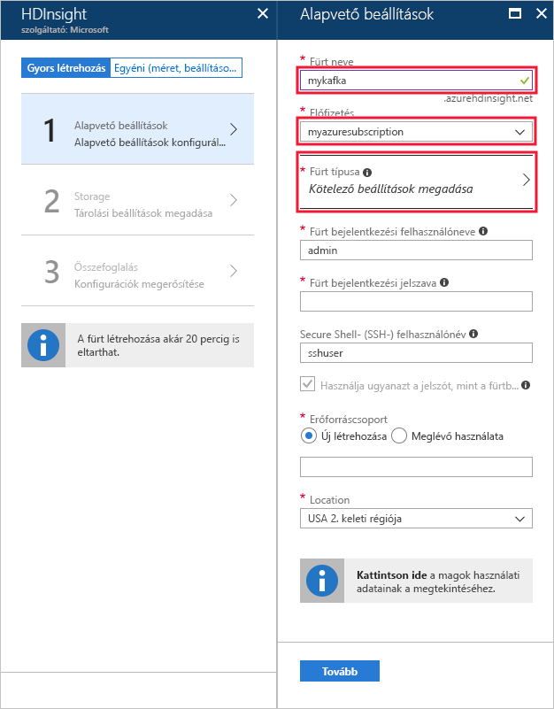
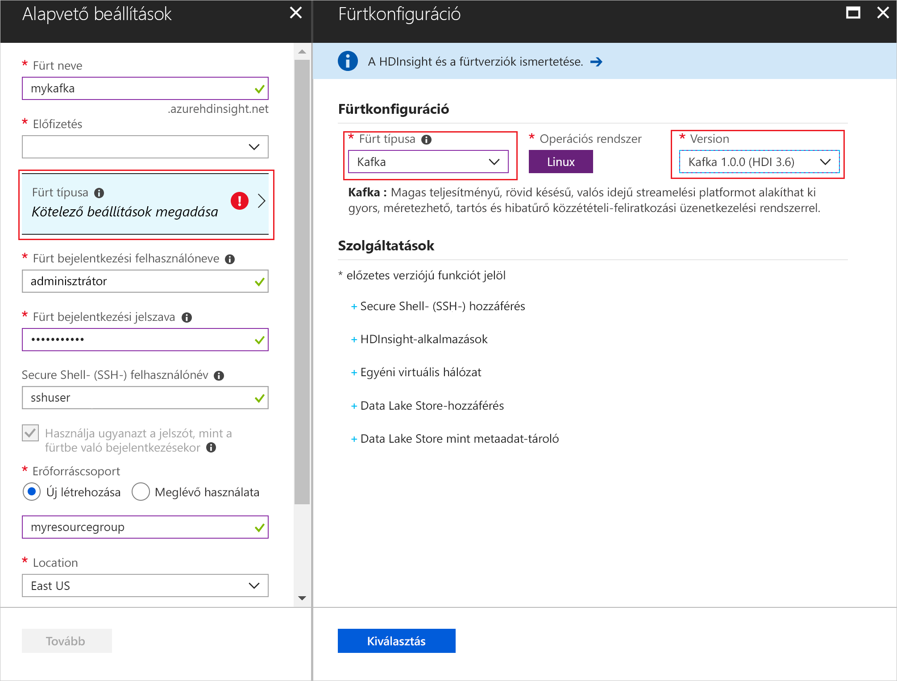
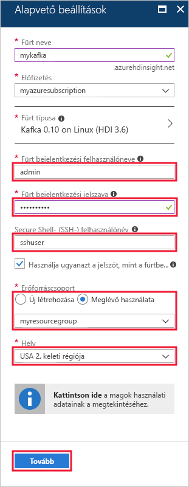
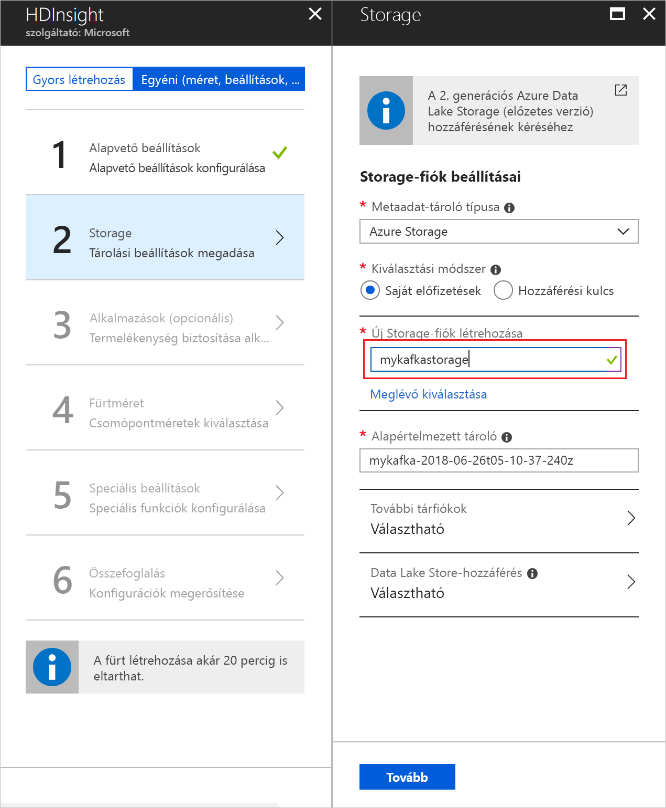
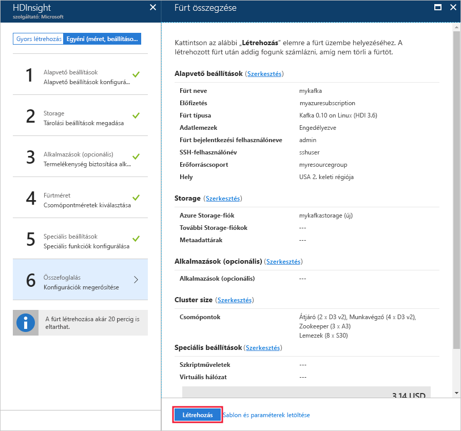

# <a name="quickstart-create-a-kafka-on-hdinsight-cluster"></a>Rövid útmutató: Kafka on HDInsight-fürt létrehozása

A Kafka egy nyílt forráskódú, elosztott adatstreamelési platform. Sokszor használják üzenetközvetítőként, mivel a közzétételi-feliratkozási üzenetsorokhoz hasonló funkciókat kínál. 

Ebben a rövid útmutatóban megismerheti, hogyan hozhat létre [Apache Kafka](https://kafka.apache.org)-fürtöt az Azure Portal használatával. Azt is megtudhatja, hogyan küldhet és fogadhat üzeneteket a mellékelt segédprogramokkal a Kafka segítségével.

[!INCLUDE [delete-cluster-warning](../../../includes/hdinsight-delete-cluster-warning.md)]

> [!IMPORTANT]
> A Kafka API csak az ugyanazon virtuális hálózaton belüli erőforrások számára érhető el. Ebben a rövid útmutatóban közvetlenül éri el a fürtöt SSH-val. Ha más szolgáltatásokat, hálózatokat vagy virtuális gépeket szeretne csatlakoztatni a Kafkához, először létre kell hoznia egy virtuális hálózatot, majd létre kell hoznia a hálózaton belüli erőforrásokat.
>
> További információ: [Csatlakozás a Kafkához virtuális hálózattal](apache-kafka-connect-vpn-gateway.md).

## <a name="prerequisites"></a>Előfeltételek

* Azure-előfizetés. Ha nem rendelkezik Azure-előfizetéssel, mindössze néhány perc alatt létrehozhat egy [ingyenes fiókot](https://azure.microsoft.com/free/?WT.mc_id=A261C142F) a virtuális gép létrehozásának megkezdése előtt.

* Egy SSH-ügyfél. A jelen dokumentum lépései SSH használatával csatlakoznak a fürthöz.

    Az `ssh` parancs alapértelmezés szerint a Linux, Unix és macOS rendszerek része. Windows 10 rendszeren a következő módszerek egyikével telepítse az `ssh` parancsot:

    * Az [Azure Cloud Shell](https://docs.microsoft.com/azure/cloud-shell/quickstart) használata. A Cloud Shell tartalmazza az `ssh` parancsot, és úgy konfigurálható, hogy a Basht vagy a PowerShellt használja a felületkörnyezetként.

    * [A Linux Windows alrendszerének telepítése](https://docs.microsoft.com/windows/wsl/install-win10). A Microsoft Store-ban elérhető Linux-disztribúciók tartalmazzák az `ssh` parancsot.

    > [!IMPORTANT]
    > A dokumentum lépései azt feltételezik, hogy a fent említett egyik SSH-ügyfelet használja. Ha más SSH-ügyfelet használ, és problémákba ütközik, tekintse át az SSH-ügyfél dokumentációját.
    >
    > További információ: [SSH használata a HDInsighttal](../hdinsight-hadoop-linux-use-ssh-unix.md).

## <a name="create-a-kafka-cluster"></a>Kafka-fürt létrehozása

Egy Kafka HDInsight-fürt létrehozásához kövesse az alábbi lépéseket:

1. Az [Azure Portalon](https://portal.azure.com) válassza az **+ Erőforrás létrehozása**, **Data + Analytics**, majd a **HDInsight** elemet.
   
    

2. Az **Alapvető beállítások** képernyőn adja meg vagy válassza ki a következő információkat:

    | Beállítás | Érték |
    | --- | --- |
    | Fürt neve | A HDInsight-fürt egyedi neve. |
    | Előfizetés | Válassza ki előfizetését. |
    
    Válassza ki a __Fürt típusát__ a **Fürtkonfiguráció** megjelenítéséhez.

    

3. A __Fürtkonfigurációban__ válassza ki a következő értékeket:

    | Beállítás | Érték |
    | --- | --- |
    | Fürt típusa | Kafka |
    | Verzió | Kafka 0.10.0 (HDI 3.6) |

    A **Kiválasztás** gombbal mentse a fürttípus beállításait, majd lépjen vissza az __Alapvető beállításokra__.

    

4. Az __Alapvető beállítások__ képernyőn adja meg vagy válassza ki a következő információkat:

    | Beállítás | Érték |
    | --- | --- |
    | Fürt bejelentkezési felhasználóneve | A fürtön futtatott webszolgáltatások vagy REST API-k eléréséhez használt bejelentkezési név. Tartsa meg az alapértelmezett értéket (admin). |
    | Fürt bejelentkezési jelszava | A fürtön futtatott webszolgáltatások vagy REST API-k eléréséhez használt jelszó. |
    | Secure Shell- (SSH-) felhasználónév | A fürt SSH-kapcsolaton keresztüli elérésekor használt bejelentkezési adatok. Alapértelmezés szerint a jelszó megegyezik a fürt bejelentkezési jelszavával. |
    | Erőforráscsoport | Az erőforráscsoport, amelyben a fürt létre lesz hozva. |
    | Hely | Az Azure-régió, amelyben a fürt létre lesz hozva. |

    > [!TIP]
    > Minden egyes Azure-régió (hely) _tartalék tartományokat_ biztosít. A tartalék tartomány az alapul szolgáló hardver logikai csoportosítása egy Azure-adatközpontban. Mindegyik tartalék tartomány közös áramforrással és hálózati kapcsolóval rendelkezik. A HDInsight-fürtön belül a csomópontokat implementáló virtuális gépek és felügyelt lemezek ezek között a tartalék tartományok között vannak elosztva. Ez az architektúra csökkenti a fizikai hardverhibák lehetséges hatását.
    >
    > Az adatok magas rendelkezésre állásának biztosításához válasszon egy olyan régiót (helyet), amely __három tartalék tartományt__ tartalmaz. Az adott régióban található tartalék tartományok számáról további információkat a [Linux rendszerű virtuális gépek rendelkezésre állása](../../virtual-machines/windows/manage-availability.md#use-managed-disks-for-vms-in-an-availability-set) dokumentumban talál.

    

    Kattintson a __Tovább__ gombra az alapszintű konfiguráció befejezéséhez.

5. A **Tárolás** panelen válasszon ki vagy hozzon létre egy Storage-fiókot. A jelen dokumentumban leírt lépésekben a többi mező alapértelmezett értékét ne módosítsa. Kattintson a __Tovább__ gombra a tárolókonfiguráció mentéséhez.

    

6. Az __Alkalmazások (opcionális)__ területen kattintson a __Tovább__ gombra az alapértelmezett beállítások használatával való folytatáshoz.

7. A __Fürtméret__ lapon kattintson a __Tovább__ gombra az alapértelmezett beállítások használatával való folytatáshoz.

    > [!IMPORTANT]
    > A Kafka on HDInsight platform rendelkezésre állásának biztosításához a __feldolgozó csomópontok száma__ bejegyzés értékének legalább 3-nak kell lennie. Az alapértelmezett érték a 4.
    
    > [!TIP]
    > A **lemezek száma feldolgozó csomópontonként** bejegyzés a HDInsighton futó Kafka skálázhatóságát konfigurálja. A Kafka on HDInsight a fürt virtuális gépeinek helyi lemezén tárolja az adatokat. Mivel a Kafka nagy ki- és bemenő adatforgalmat kezel, az [Azure Managed Disks](../../virtual-machines/windows/managed-disks-overview.md) szolgáltatás gondoskodik a magas átviteli sebességről és csomópontonként több tárhelyről. A felügyelt lemez típusa __Standard__ (HDD) vagy __Prémium__ (SSD) lehet. A lemez típusa a feldolgozó csomópontok (Kafka-közvetítők) által használt virtuálisgép-mérettől függ. A DS és GS sorozatbeli virtuális gépek automatikusan prémium lemezeket használnak. Minden más virtuálisgép-típus standard lemezeket használ.

    

8. A __Speciális beállítások__ lapon kattintson a __Tovább__ gombra az alapértelmezett beállítások használatával való folytatáshoz.

9. Az **Összegzés** lapon tekintse át a fürt konfigurációját. A __Szerkesztés__ hivatkozásai használatával módosítsa a hibás beállításokat. Végül kattintson a__Létrehozás__ gombra a fürt létrehozásához.
   
    
   
    > [!NOTE]
    > A fürt létrehozása 20 percig is eltarthat.

## <a name="connect-to-the-cluster"></a>Csatlakozás a fürthöz

1. A Kafka-fürt elsődleges átjárócsomópontjához való csatlakozáshoz használja a következő parancsot. Cserélje le az `sshuser` elemet az SSH-felhasználónévre. Cserélje le a `mykafka` elemet a Kafka-fürt nevére.

    ```bash
    ssh sshuser@mykafka-ssh.azurehdinsight.net
    ```

2. Amikor első alkalommal csatlakozik a fürthöz, az SSH-ügyfél olyan figyelmeztetést jeleníthet meg, amely szerint a gazdaszámítógép nem hitelesíthető. Amikor a rendszer kéri, írja be a __yes__ (igen) szót, majd nyomja majd nyomja le az __Enter__ billentyűt, hogy a gazdaszámítógépet felvegye az SSH-ügyfél megbízható kiszolgálókat tartalmazó listájába.

3. Ha a rendszer kéri, adja meg az SSH-felhasználó jelszavát.

Miután csatlakozott, az alábbi szöveghez hasonló információkat lát:

```text
Authorized uses only. All activity may be monitored and reported.
Welcome to Ubuntu 16.04.4 LTS (GNU/Linux 4.13.0-1011-azure x86_64)

 * Documentation:  https://help.ubuntu.com
 * Management:     https://landscape.canonical.com
 * Support:        https://ubuntu.com/advantage

  Get cloud support with Ubuntu Advantage Cloud Guest:
    http://www.ubuntu.com/business/services/cloud

83 packages can be updated.
37 updates are security updates.


Welcome to Kafka on HDInsight.

Last login: Thu Mar 29 13:25:27 2018 from 108.252.109.241
ssuhuser@hn0-mykafk:~$
```

## <a id="getkafkainfo"></a>A Zookeeper és a közvetítő gazdagép információinak lekérése

A Kafka használata során ismernie kell a *Zookeeper-* és a *Közvetítő* gazdagépeket. A Kafka API és a Kafkában elérhető számos segédprogram használja ezeket a gazdagépeket.

Ebben a szakaszban a fürtön lévő Ambari REST API-ból szerzi be a gazdagép információit.

1. Egy, a fürthöz csatlakozó SSH-kapcsolaton használja a következő parancsot a `jq` segédprogram telepítéséhez. A segédprogram JSON-dokumentumok elemzésére használható, és hasznos a gazdagép adatainak lekéréséhez:
   
    ```bash
    sudo apt -y install jq
    ```

2. A környezeti változók fürtnévként történő beállítását az alábbi paranccsal végezheti el:

    ```bash
    read -p "Enter the Kafka on HDInsight cluster name: " CLUSTERNAME
    ```

    Ha a rendszer kéri, írja be a Kafka-fürt nevét.

3. A környezeti változók Zookeeper-gazdagépadatokkal történő beállítását az alábbi paranccsal végezheti el:

    ```bash
    export KAFKAZKHOSTS=`curl -sS -u admin -G https://$CLUSTERNAME.azurehdinsight.net/api/v1/clusters/$CLUSTERNAME/services/ZOOKEEPER/components/ZOOKEEPER_SERVER | jq -r '["\(.host_components[].HostRoles.host_name):2181"] | join(",")' | cut -d',' -f1,2`
    ```

    Ha a rendszer kéri, adja meg a fürt bejelentkezési fiókjának a jelszavát (nem az SSH-fiókét).

    > [!NOTE]
    > Ez a parancs lekéri az összes Zookeeper-gazdagépet, majd csak az első két bejegyzést adja vissza. Ez azért van, mert hasznos lehet a redundancia, ha az egyik gazdagép esetleg nem érhető el.

4. A környezeti változók helyes beállításának ellenőrzését az alábbi paranccsal végezheti el:

    ```bash
     echo '$KAFKAZKHOSTS='$KAFKAZKHOSTS
    ```

    Ez a parancs az alábbi szöveghez hasonló információt ad vissza:

    `zk0-kafka.eahjefxxp1netdbyklgqj5y1ud.ex.internal.cloudapp.net:2181,zk2-kafka.eahjefxxp1netdbyklgqj5y1ud.ex.internal.cloudapp.net:2181`

5. A környezeti változók Kafka közvetítőgazdagép-adatokkal történő beállítását az alábbi paranccsal végezheti el:

    ```bash
    export KAFKABROKERS=`curl -sS -u admin -G https://$CLUSTERNAME.azurehdinsight.net/api/v1/clusters/$CLUSTERNAME/services/KAFKA/components/KAFKA_BROKER | jq -r '["\(.host_components[].HostRoles.host_name):9092"] | join(",")' | cut -d',' -f1,2`
    ```

    Ha a rendszer kéri, adja meg a fürt bejelentkezési fiókjának a jelszavát (nem az SSH-fiókét).

6. A környezeti változók helyes beállításának ellenőrzését az alábbi paranccsal végezheti el:

    ```bash   
    echo '$KAFKABROKERS='$KAFKABROKERS
    ```

    Ez a parancs az alábbi szöveghez hasonló információt ad vissza:
   
    `wn1-kafka.eahjefxxp1netdbyklgqj5y1ud.cx.internal.cloudapp.net:9092,wn0-kafka.eahjefxxp1netdbyklgqj5y1ud.cx.internal.cloudapp.net:9092`

## <a name="manage-kafka-topics"></a>Kafka-témakörök kezelése

A Kafka *témakörökben* tárolja az adatstreameket. A `kafka-topics.sh` segédprogrammal kezelheti a témaköröket.

* **Egy témakör létrehozásához** használja az alábbi parancsot az SSH-kapcsolatban:

    ```bash
    /usr/hdp/current/kafka-broker/bin/kafka-topics.sh --create --replication-factor 3 --partitions 8 --topic test --zookeeper $KAFKAZKHOSTS
    ```

    Ez a parancs a `$KAFKAZKHOSTS`-ban tárolt gazdagépadatok használatával kapcsolódik a Zookeeperhez, majd létrehoz egy **test** nevű Kafka-témakört. 

    * A témakörben tárolt adatok nyolc partícióban vannak elosztva.

    * Mindegyik partíció három feldolgozó csomópontra van replikálva a fürtben.

        > [!IMPORTANT]
        > Ha olyan Azure-régióban hozta létre a fürtöt, amely három tartalék tartományt biztosít, használjon 3-as replikációs tényezőt. Ellenkező esetben használjon 4-es replikációs tényezőt.
        
        A három tartalék tartományt tartalmazó régiókban a 3-as replikációs tényező lehetővé teszi, hogy a replikákat el lehessen osztani a tartalék tartományok között. A két tartalék tartományt tartalmazó régiókban a négyes replikációs tényező egyenlően osztja el a replikákat a tartományok között.
        
        Az adott régióban található tartalék tartományok számáról további információkat a [Linux rendszerű virtuális gépek rendelkezésre állása](../../virtual-machines/windows/manage-availability.md#use-managed-disks-for-vms-in-an-availability-set) dokumentumban talál.

        > [!IMPORTANT] 
        > A Kafka nem észleli a tartalék Azure-tartományokat. Témakörök számára történő partícióreplikák létrehozásakor lehetséges, hogy a Kafka nem a magas rendelkezésre állásnak megfelelően osztja ki a replikákat.

        A magas rendelkezésre állás biztosításához használja a [Kafka vissza-egyensúlyozási eszközét](https://github.com/hdinsight/hdinsight-kafka-tools). Ezt az eszközt egy SSH-kapcsolatból kell futtatni a Kafka-fürt fő csomópontjához.

        A Kafka-adatok lehető legmagasabb rendelkezésre állása érdekében egyensúlyozza újra a témaköre partícióreplikáit a következő esetekben:

        * Új témakör vagy partíció létrehozásakor

        * Fürt vertikális felskálázásakor

* **A témakörök listázásához** használja az alábbi parancsot:

    ```bash
    /usr/hdp/current/kafka-broker/bin/kafka-topics.sh --list --zookeeper $KAFKAZKHOSTS
    ```

    Ez a parancs listázza a Kafka-fürtön elérhető témaköröket.

* **Egy témakör törléséhez** használja az alábbi parancsot:

    ```bash
    /usr/hdp/current/kafka-broker/bin/kafka-topics.sh --delete --topic topicname --zookeeper $KAFKAZKHOSTS
    ```

    Ez a parancs törli a `topicname` nevű témakört.

    > [!WARNING]
    > Ha törli a korábban létrehozott `test` témakört, akkor újra létre kell hoznia. A dokumentum későbbi lépései használni fogják.

A `kafka-topics.sh` segédprogrammal elérhető parancsokkal kapcsolatos további információért használja a következő parancsot:

```bash
/usr/hdp/current/kafka-broker/bin/kafka-topics.sh
```

## <a name="produce-and-consume-records"></a>Rekordok létrehozása és felhasználása

A Kafka témakörökben tárolja a *rekordokat*. A rekordokat *előállítók* hozzák létre, és *fogyasztók* használják fel. A létrehozók és a feldolgozók a *Kafka-közvetítő* szolgáltatással kommunikálnak. A HDInsight-fürt mindegyik feldolgozó csomópontja egy Kafka-közvetítő gazdagép.

Kövesse az alábbi lépéseket a rekordoknak a korábban létrehozott test témakörben való tárolására, majd a beolvasásukra egy fogyasztó használatával:

1. Ha rekordokat szeretne írni a témakörbe, használja az SSH-kapcsolat `kafka-console-producer.sh` segédprogramját:
   
    ```bash
    /usr/hdp/current/kafka-broker/bin/kafka-console-producer.sh --broker-list $KAFKABROKERS --topic test
    ```
   
    A parancs kiadása után egy üres sor jelenik meg.

2. Írjon be egy szöveges üzenetet az üres sorba, majd nyomja le az Enter billentyűt. Írjon be így még néhány szöveges üzenetet, majd a **Ctrl + C** billentyűparancs használatával térjen vissza a szokásos parancssorhoz. A rendszer minden sort külön rekordként küld el a Kafka-témakörbe.

3. Ha rekordokat szeretne olvasni a témakörből, használja az SSH-kapcsolat `kafka-console-consumer.sh` segédprogramját:
   
    ```bash
    /usr/hdp/current/kafka-broker/bin/kafka-console-consumer.sh --bootstrap-server $KAFKABROKERS --topic test --from-beginning
    ```
   
    A parancs lekéri a rekordokat a témakörből, majd megjeleníti őket. A `--from-beginning` használata arra utasítja a fogyasztót, hogy a stream elejétől kezdje a műveletet, így az összes rekord lekérése megtörténik.

    > [!NOTE]
    > Ha a Kafka régebbi verzióját használja, cserélje le a `--bootstrap-server $KAFKABROKERS` előtagot a következőre: `--zookeeper $KAFKAZKHOSTS`.

4. Használja a __Ctrl + C__ billentyűparancsot a fogyasztó leállításához.

Szoftveresen is létrehozhat előállítókat és fogyasztókat. Az API használatára vonatkozó példákért tekintse meg a [Kafka Producer és Consumer API-k HDInsighttal történő használatát](apache-kafka-producer-consumer-api.md) ismertető dokumentumot.

## <a name="clean-up-resources"></a>Az erőforrások eltávolítása

A jelen rövid útmutató által létrehozott erőforrások törléséhez törölheti az erőforráscsoportot. Az erőforráscsoport törlésekor a kapcsolódó HDInsight-fürt, valamint az esetlegesen az erőforráscsoporthoz társított egyéb erőforrások is törlődnek.

Az erőforráscsoport eltávolítása az Azure Portallal:

1. Az Azure Portalon bontsa ki a bal oldalon a szolgáltatásmenüt, és válassza az __Erőforráscsoportok__ lehetőséget az erőforráscsoportok listájának megjelenítéséhez.
2. Keresse meg a törölni kívánt erőforráscsoportot, és kattintson a jobb gombbal a lista jobb oldalán lévő __Továbbiak__ gombra (...).
3. Válassza az __Erőforráscsoport törlése__ elemet, és erősítse meg a választását.

> [!WARNING]
> A HDInsight-fürt számlázása a fürt létrehozásakor kezdődik és a fürt törlésekor fejeződik be. A számlázás percalapú, ezért mindig érdemes törölni a fürtöt, ha az már nincs használatban.
> 
> A Kafka on HDInsight-fürt törlése a Kafkában tárolt összes adatot is törli.

## <a name="next-steps"></a>További lépések

> [!div class="nextstepaction"]
> [Az Apache Spark használata a Kafkával](../hdinsight-apache-kafka-spark-structured-streaming.md)

