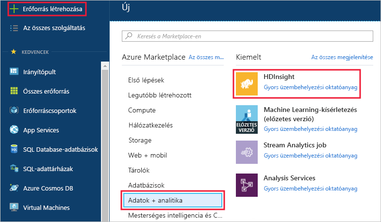
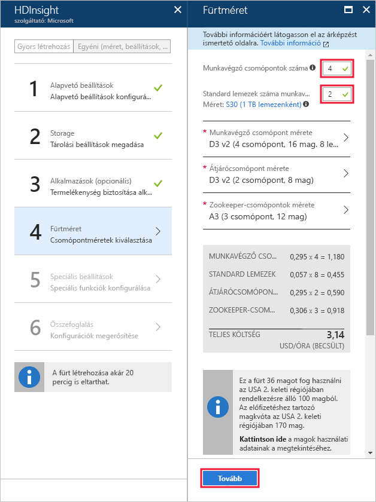

# <a name="start-with-apache-kafka-preview-on-hdinsight"></a>Az Apache Kafka (előzetes verzió) használatának első lépései a HDInsightban

Ebből a cikkből megtudhatja, hogyan hozhat létre és használhat [Apache Kafka](https://kafka.apache.org)-fürtöt az Azure HDInsightban. A Kafka egy, a HDInsighthoz is elérhető, nyílt forráskódú elosztott adatstreamelési platform. Sokszor használják üzenetközvetítőként, mivel a közzétételi-feliratkozási üzenetsorokhoz hasonló funkcionalitást kínál.

> [!NOTE]
> Jelenleg a Kafka két verziója érhető el a HDInsighttal: a 0.9.0 (HDInsight 3.4) és a 0.10.0 (HDInsight 3.5 és 3.6). A dokumentum lépései azt feltételezik, hogy a Kafkát a HDInsight 3.6-os verzióján használja.

[!INCLUDE [delete-cluster-warning](../../../includes/hdinsight-delete-cluster-warning.md)]

## <a name="create-a-kafka-cluster"></a>Kafka-fürt létrehozása

Egy Kafka HDInsight-fürtön történő létrehozásához kövesse az alábbi lépéseket:

1. Az [Azure Portalon](https://portal.azure.com) válassza az **+ ÚJ**, **Intelligencia és analitika**, majd a **HDInsight** elemet.
   
    

2. Az **Alapvető beállítások** képernyőn adja meg a következő információkat:

    * **Fürt neve**: A HDInsight-fürt neve.
    * **Előfizetés**: Válassza ki a használni kívánt előfizetést.
    * **Fürt bejelentkezési felhasználóneve** és **Fürt bejelentkezési jelszava**: A fürt HTTPS-kapcsolaton keresztüli elérésekor használt bejelentkezési adatok. Ezekkel a hitelesítő adatokkal érheti el az olyan szolgáltatásokat, mint az Ambari webes felület vagy a REST API.
    * **SSH-felhasználónév**: A fürt SSH-kapcsolaton keresztüli elérésekor használt bejelentkezési adatok. Alapértelmezés szerint a jelszó megegyezik a fürt bejelentkezési jelszavával.
    * **Erőforráscsoport**: Az az erőforráscsoport, amelyben a fürt létre lesz hozva.
    * **Hely**: Az az Azure-régió, amelyben a fürt létre lesz hozva.

        > [!IMPORTANT]
        > Az adatok Magas rendelkezésre állásának biztosításához javasoljuk egy __három tartalék tartományt__ tartalmazó hely (régió) kiválasztását. További információkért lásd az [Adatok magas rendelkezésre állása](#data-high-availability) szakaszt.
   
 

3. Válassza ki a **Fürt típusát**, majd állítsa be a következő értékeket a **Fürtkonfiguráció** panelen:
   
    * **Fürt típusa**: Kafka

    * **Verzió**: Kafka 0.10.0 (HDI 3.6)

    * **Fürt szintje**: Standard
     
 Végül mentse a beállításokat a **Kiválasztás** gomb használatával.
     
 

4. A fürt típusának kijelölése után erősítse meg a beállítást a __Kiválasztás__ gombbal. Ezután kattintson a __Tovább__ gombra az alapszintű konfiguráció befejezéséhez.

5. A **Tárolás** panelen válasszon ki vagy hozzon létre egy Storage-fiókot. A jelen dokumentumban leírt lépésekben a többi mező alapértelmezett értékét ne módosítsa. Kattintson a __Tovább__ gombra a tárolókonfiguráció mentéséhez.

    

6. Az __Alkalmazások (opcionális)__ területen kattintson a __Tovább__ gombra a folytatáshoz. Az alábbi példához nem szükséges alkalmazás.

7. A __Fürtméret__ lapon kattintson a __Tovább__ gombra a folytatáshoz.

    > [!WARNING]
    > A HDInsightban futó Kafka platform rendelkezésre állásának biztosításához fürtjének legalább három feldolgozó csomópontot kell tartalmaznia. További információkért lásd az [Adatok magas rendelkezésre állása](#data-high-availability) szakaszt.

    

    > [!IMPORTANT]
    > A **lemezek száma feldolgozó csomópontonként** bejegyzés a HDInsighton futó Kafka skálázhatóságát szabályozza. A HDInsight-beli Kafka a fürt virtuális gépeinek helyi lemezét használja. Mivel a Kafka nagy ki- és bemenő adatforgalmat kezel, az [Azure Managed Disks](../../virtual-machines/windows/managed-disks-overview.md) szolgáltatás gondoskodik a magas átviteli sebességről és csomópontonként több tárhelyről. A felügyelt lemez típusa __Standard__ (HDD) vagy __Prémium__ (SSD) lehet. Prémium lemezeket DS és GS sorozatbeli virtuális gépek használnak. Minden más virtuálisgép-típus standard lemezeket használ.

8. A __Speciális beállítások__ lapon kattintson a __Tovább__ gombra a folytatáshoz.

9. Az **Összegzés** lapon tekintse át a fürt konfigurációját. A __Szerkesztés__ hivatkozásai használatával módosítsa a hibás beállításokat. Végül kattintson a__Létrehozás__ gombra a fürt létrehozásához.
   
    
   
    > [!NOTE]
    > A fürt létrehozása 20 percig is eltarthat.

## <a name="connect-to-the-cluster"></a>Csatlakozás a fürthöz

> [!IMPORTANT]
> Az alábbi lépések végrehajtásakor SSH-ügyfelet kell használnia. További információ: [SSH használata a HDInsighttal](../hdinsight-hadoop-linux-use-ssh-unix.md).

Az ügyfélről SSH használatával csatlakozhat a fürthöz:

```ssh SSHUSER@CLUSTERNAME-ssh.azurehdinsight.net```

Cserélje le az **SSHUSER** elemet a fürt létrehozásakor megadott SSH-felhasználónévre. Cserélje le a **CLUSTERNAME** elemet a fürt nevére.

Ha a rendszer kéri, írja be az SSH-fiókhoz használt jelszót.

További információk: [Az SSH használata HDInsighttal](../hdinsight-hadoop-linux-use-ssh-unix.md).

## <a id="getkafkainfo"></a>A Zookeeper és a közvetítő gazdagép információinak lekérése

A Kafka használata során két gazdagép értékeit kell ismernie: a *Zookeeper*-gazdagépekét és a *Közvetítő* gazdagépekét. A Kafka API és a Kafkában elérhető számos segédprogram használja ezeket a gazdagépeket.

Az alábbi lépésekkel létrehozhatja a gazdagép adatait tartalmazó környezeti változókat. A jelen dokumentumban lévő lépésekben használjuk ezeket a környezeti változókat.

1. Egy, a fürthöz csatlakozó SSH-kapcsolaton használja a következő parancsot a `jq` segédprogram telepítéséhez. A segédprogram JSON-dokumentumok elemzését végzi, és hasznos szerepet tölt be a közvetítő gazdagép adatainak lekérésében:
   
    ```bash
    sudo apt -y install jq
    ```

2. A következő parancsokkal állíthatja be a környezeti változókat az Ambariból lekért adatokkal:

    ```bash
    CLUSTERNAME='your cluster name'
    PASSWORD='your cluster password'
    export KAFKAZKHOSTS=`curl -sS -u admin:$PASSWORD -G https://$CLUSTERNAME.azurehdinsight.net/api/v1/clusters/$CLUSTERNAME/services/ZOOKEEPER/components/ZOOKEEPER_SERVER | jq -r '["\(.host_components[].HostRoles.host_name):2181"] | join(",")' | cut -d',' -f1,2`

    export KAFKABROKERS=`curl -sS -u admin:$PASSWORD -G https://$CLUSTERNAME.azurehdinsight.net/api/v1/clusters/$CLUSTERNAME/services/KAFKA/components/KAFKA_BROKER | jq -r '["\(.host_components[].HostRoles.host_name):9092"] | join(",")' | cut -d',' -f1,2`

    echo '$KAFKAZKHOSTS='$KAFKAZKHOSTS
    echo '$KAFKABROKERS='$KAFKABROKERS
    ```

    > [!IMPORTANT]
    > A `CLUSTERNAME=` értékét állítsa a Kafka-fürt nevére. A `PASSWORD=` értékét állítsa a fürt létrehozásakor használt bejelentkezési (rendszergazdai) jelszavára.

    A következő szöveg egy példa a `$KAFKAZKHOSTS` tartalmára:
   
    `zk0-kafka.eahjefxxp1netdbyklgqj5y1ud.ex.internal.cloudapp.net:2181,zk2-kafka.eahjefxxp1netdbyklgqj5y1ud.ex.internal.cloudapp.net:2181`
   
    A következő szöveg egy példa a `$KAFKABROKERS` tartalmára:
   
    `wn1-kafka.eahjefxxp1netdbyklgqj5y1ud.cx.internal.cloudapp.net:9092,wn0-kafka.eahjefxxp1netdbyklgqj5y1ud.cx.internal.cloudapp.net:9092`

    > [!NOTE]
    > A `cut` paranccsal a gazdagépek listáját két gazdagép bejegyzésre szűkítheti. A Kafka-fogyasztók vagy -előállítók létrehozásakor nem kell megadnia a gazdagépek teljes listáját.
   
    > [!WARNING]
    > Ne bízzon abban, hogy az ebben a munkamenetben visszaadott adatok mindig pontosak lesznek. A fürt átméretezésekor új közvetítők lesznek hozzáadva vagy eltávolítva. Ha hiba esetén egy fürt lecserélődik, a fürt gazdaneve változhat.
    >
    > A Zookeeper- és a közvetítő gazdagépek adatait rövid idővel a felhasználásuk előtt érdemes lekérni, hogy biztosan érvényes információkkal rendelkezzen.

## <a name="create-a-topic"></a>Üzenettémakör létrehozása

A Kafka *témaköröknek* nevezett kategóriákban tárolja az adatstreameket. Témakör létrehozásához használja a Kafkához biztosított szkripet egy fürt átjárócsomójával létesített SSH-kapcsolatból:

```bash
/usr/hdp/current/kafka-broker/bin/kafka-topics.sh --create --replication-factor 3 --partitions 8 --topic test --zookeeper $KAFKAZKHOSTS
```

Ez a parancs a `$KAFKAZKHOSTS`-ban tárolt állomásadatok használatával kapcsolódik a Zookeeperhez, majd létrehoz egy **test** nevű Kafka-témakört. A témakör létrehozását a témakörök listázására szolgáló alábbi szkripttel ellenőrizheti:

```bash
/usr/hdp/current/kafka-broker/bin/kafka-topics.sh --list --zookeeper $KAFKAZKHOSTS
```

A parancs kimenete listázza a Kafka-témaköröket, és tartalmazza a **test** témakört.

## <a name="produce-and-consume-records"></a>Rekordok létrehozása és felhasználása

A Kafka témakörökben tárolja a *rekordokat*. A rekordokat *előállítók* hozzák létre, és *fogyasztók* használják fel. Az előállítók *Kafka-közvetítőktől* kérik le a rekordokat. A HDInsight-fürt mindegyik feldolgozó csomópontja egy Kafka-közvetítő.

Kövesse az alábbi lépéseket a rekordoknak a korábban létrehozott test témakörben való eltárolására, majd a beolvasásukra egy fogyasztó használatával:

1. A Kafkához biztosított szkript használatával írja a rekordokat a témakörbe az SSH-munkamenetben:
   
    ```bash
    /usr/hdp/current/kafka-broker/bin/kafka-console-producer.sh --broker-list $KAFKABROKERS --topic test
    ```
   
    A parancs után a rendszer nem lép vissza a parancssorhoz. Ezért írjon inkább néhány szöveges üzenetet, majd a **Ctrl + C** billentyűparancs használatával állítsa le a témakörbe történő küldést. A rendszer minden sort külön rekordként küld el.

2. A Kafkához biztosított szkript használatával olvassa be rekordokat a témakörből:
   
    ```bash
    /usr/hdp/current/kafka-broker/bin/kafka-console-consumer.sh --bootstrap-server $KAFKABROKERS --topic test --from-beginning
    ```
   
    A parancs lekéri a rekordokat a témakörből, majd megjeleníti őket. A `--from-beginning` használata arra utasítja a fogyasztót, hogy a stream elejétől kezdje a műveletet, így az összes rekord lekérése megtörténik.

3. Használja a __Ctrl + C__ billentyűparancsot a fogyasztó leállításához.

## <a name="producer-and-consumer-api"></a>Előállítói és fogyasztói API

Szoftveresen is létrehozhat és felhasználhat rekordokat a [Kafka API-k](http://kafka.apache.org/documentation#api) használatával. Java-előállítók és -fogyasztók létrehozásához hajtsa végre az alábbi lépéseket a fejlesztési környezetében.

> [!IMPORTANT]
> A fejlesztési környezetben a következő összetevőket kell telepítenie:
>
> * [Java JDK 8](http://www.oracle.com/technetwork/java/javase/downloads/index.html) vagy azzal egyenértékű, például az OpenJDK.
>
> * [Apache Maven](http://maven.apache.org/)
>
> * Egy SSH-ügyfél és az `scp` parancs. További információ: [SSH használata a HDInsighttal](../hdinsight-hadoop-linux-use-ssh-unix.md).

1. A példákat a [https://github.com/Azure-Samples/hdinsight-kafka-java-get-started](https://github.com/Azure-Samples/hdinsight-kafka-java-get-started) címről töltheti le. Az előállítói/fogyasztói példához használja a `Producer-Consumer` könyvtárban található projektet. Ez a példa az alábbi osztályokat tartalmazza:
   
    * **Run** – elindítja a fogyasztót vagy az előállítót.

    * **Producer** – 1 000 000 rekordot tárol a témakörben.

    * **Consumer** – rekordokat olvas be a témakörből.

2. Egy jar-csomag létrehozásához lépjen a `Producer-Consumer` könyvtár helyére, majd használja az alábbi parancsot:

    ```
    mvn clean package
    ```

    A parancs létrehozza a `target` nevű könyvtárat, amely a `kafka-producer-consumer-1.0-SNAPSHOT.jar` nevű fájlt tartalmazza.

3. Az alábbi parancsokkal másolja a `kafka-producer-consumer-1.0-SNAPSHOT.jar` fájlt a HDInsight-fürtbe:
   
    ```bash
    scp ./target/kafka-producer-consumer-1.0-SNAPSHOT.jar SSHUSER@CLUSTERNAME-ssh.azurehdinsight.net:kafka-producer-consumer.jar
    ```
   
    Cserélje le az **SSHUSER** elemet a fürt SSH-felhasználójára, illetve a **CLUSTERNAME** elemet a fürt nevére. Ha a rendszer kéri, adja meg az SSH-felhasználó jelszavát.

4. Amint az `scp` parancs végez a fájl másolásával, csatlakozzon a fürthöz SSH használatával. Az alábbi paranccsal írhat rekordokat a próbatémakörhöz:

    ```bash
    java -jar kafka-producer-consumer.jar producer $KAFKABROKERS
    ```

5. A folyamat befejeződését követően használja az alábbi parancsot a témakörből történő olvasáshoz:
   
    ```bash
    java -jar kafka-producer-consumer.jar consumer $KAFKABROKERS
    ```
   
    A rendszer megjeleníti a beolvasott rekordokat a rekordok számával együtt. Kicsivel több mint 1 000 000 naplózást láthat, mivel számos rekordot elküldött a témakörbe az egyik korábbi lépés szkriptjének használatával.

6. Használja a __Ctrl + C__ billentyűparancsot a fogyasztóból történő kilépéshez.

### <a name="multiple-consumers"></a>Több fogyasztó

A Kafka-fogyasztók egy fogyasztói csoportot használnak a rekordok olvasásakor. Ugyanazon csoport használata több fogyasztó esetén a terhelés szempontjából kiegyensúlyozott olvasást eredményez a témakörökből történő olvasáskor. A csoport mindegyik fogyasztója a rekordok egy részét kapja meg. Ha szeretné látni, hogy hogyan zajlik a folyamat, kövesse az alábbi lépéseket:

1. Nyisson meg egy új, a fürttel létesített SSH-munkamenetet, így már kettővel fog rendelkezni. Az egyes munkamenetekben használja az alábbi parancsot egy ugyanazon csoportazonosítóval rendelkező fogyasztó elindításához:
   
    ```bash
    java -jar kafka-producer-consumer.jar consumer $KAFKABROKERS mygroup
    ```

    Ez a parancs elindít egy fogyasztót a `mygroup` csoportazonosítóval.

    > [!NOTE]
    > Ehhez az SSH-munkamenethez használja [A Zookeeper és a közvetítő gazdagép információinak lekérése](#getkafkainfo) című szakaszban található parancsokat a `$KAFKABROKERS` beállításához.

2. Figyelje, ahogy az egyes munkamenetek számlálják a témakörtől fogadott rekordokat. A két munkamenet által számlált értéknek meg kell egyeznie a korábban egy fogyasztótól kapott értékkel.

Az ugyanazon csoportban található ügyfelek általi felhasználás kezelése a témakör partícióinak használatával történik. A korábban létrehozott `test` témakör nyolc partícióval rendelkezik. Ha megnyit nyolc SSH-munkamenetet, és mindegyikben elindít egy fogyasztót, az egyes fogyasztók a témakör egyetlen partíciójából fognak rekordokat olvasni.

> [!IMPORTANT]
> A fogyasztói csoportban található fogyasztói példányok száma nem haladhatja meg a partíciók számát. Ebben a példában egy fogyasztói csoport legfeljebb nyolc fogyasztót tartalmazhat, mivel a témakörben ennyi partíció található. Emellett lehet több, legfeljebb nyolc fogyasztóval rendelkező fogyasztói csoportja is.

A Kafkában tárolt rekordok mentése a partíción belüli fogadásuk sorrendje szerint történik. Ha a rekordokat az érkezési sorrendben szeretné kézbesíteni *egy partíción belül*, hozzon létre egy fogyasztói csoportot, amelyben a fogyasztói példányok száma egyezik a partíciók számával. Ha a rekordokat az érkezési sorrendben szeretné kézbesíteni *a témakörön belül*, hozzon létre egy olyan fogyasztói csoportot, amely csak egyetlen fogyasztói példánnyal rendelkezik.

## <a name="streaming-api"></a>Streamelési API

A streamelési API a Kafka 0.10.0-s verziójában vált elérhetővé, a korábbi verziók az Apache Sparkot vagy Stormot használnak a streamfeldolgozáshoz.

1. Ha még nem tette meg, töltse le a példákat a [https://github.com/Azure-Samples/hdinsight-kafka-java-get-started](https://github.com/Azure-Samples/hdinsight-kafka-java-get-started) címről a fejlesztési környezetbe. A streamelési példához használja a `streaming` könyvtárban található projektet.
   
    Ez a projekt csak a `Stream` osztályt tartalmazza, amely rekordokat olvas be a korábban létrehozott `test` témakörből. Számlálja a beolvasott szavakat, és minden szót és számlált értéket a `wordcounts` témakörbe küld el. A `wordcounts` témakört a jelen szakasznak egy későbbi lépésében hozza majd létre.

2. A fejlesztési környezet parancssorában lépjen a `Streaming` könyvtár helyére, majd használja az alábbi parancsot egy JAR-csomag létrehozásához:

    ```bash
    mvn clean package
    ```

    A parancs létrehozza a `target` nevű könyvtárat, amely a `kafka-streaming-1.0-SNAPSHOT.jar` nevű fájlt tartalmazza.

3. Az alábbi parancsokkal másolja a `kafka-streaming-1.0-SNAPSHOT.jar` fájlt a HDInsight-fürtbe:
   
    ```bash
    scp ./target/kafka-streaming-1.0-SNAPSHOT.jar SSHUSER@CLUSTERNAME-ssh.azurehdinsight.net:kafka-streaming.jar
    ```
   
    Cserélje le az **SSHUSER** elemet a fürt SSH-felhasználójára, illetve a **CLUSTERNAME** elemet a fürt nevére. Ha a rendszer kéri, adja meg az SSH-felhasználó jelszavát.

4. Amint az `scp` parancs befejezi a fájl másolását, kapcsolódjon a fürthöz SSH használatával, majd használja az alábbi parancsot a `wordcounts` témakör létrehozásához:

    ```bash
    /usr/hdp/current/kafka-broker/bin/kafka-topics.sh --create --replication-factor 3 --partitions 8 --topic wordcounts --zookeeper $KAFKAZKHOSTS
    ```

5. Ezután indítsa el a streamelési folyamatot az alábbi paranccsal:
   
    ```bash
    java -jar kafka-streaming.jar $KAFKABROKERS $KAFKAZKHOSTS 2>/dev/null &
    ```
   
    A parancs elindítja a streamelési folyamatot a háttérben.

6. Üzeneteknek a `test` témakörbe történő küldéséhez használja az alábbi parancsot. Az üzeneteket a streamelési példa dolgozza fel:
   
    ```bash
    java -jar kafka-producer-consumer.jar producer $KAFKABROKERS &>/dev/null &
    ```

7. A streamelési folyamat által a `wordcounts` témakörbe írt kimenet megtekintéséhez használja az alábbi parancsot:
   
    ```bash
    /usr/hdp/current/kafka-broker/bin/kafka-console-consumer.sh --bootstrap-server $KAFKABROKERS --topic wordcounts --from-beginning --formatter kafka.tools.DefaultMessageFormatter --property print.key=true --property key.deserializer=org.apache.kafka.common.serialization.StringDeserializer --property value.deserializer=org.apache.kafka.common.serialization.LongDeserializer
    ```
   
    > [!NOTE]
    > Az adatok megtekintéséhez utasítsa a fogyasztót a kulcs létrehozására, illetve a deszerializálót a kulcs és az érték felhasználására. A kulcsnév a szó, a számot pedig a kulcsérték tartalmazza.
   
    A kimenet az alábbi szöveghez hasonló:
   
        dwarfs  13635
        ago     13664
        snow    13636
        dwarfs  13636
        ago     13665
        a       13803
        ago     13666
        a       13804
        ago     13667
        ago     13668
        jumped  13640
        jumped  13641
        a       13805
        snow    13637
   
    > [!NOTE]
    > A szám nő minden egyes szó beolvasott szóval.

7. Használja a __Ctrl + C__ billentyűparancsot a fogyasztóból történő kilépéshez, majd az `fg` paranccsal hozza az előtérbe a háttérben futó streamelési feladatot. Használja a __Ctrl + C__ billentyűparancsot a feladatból való kilépéshez.

## <a name="data-high-availability"></a>Adatok magas rendelkezésre állása

Minden egyes Azure-régió (hely) _tartalék tartományokat_ biztosít. A tartalék tartomány az alapul szolgáló hardver logikai csoportosítása egy Azure-adatközpontban. Mindegyik tartalék tartomány közös áramforrással és hálózati kapcsolóval rendelkezik. A HDInsight-fürtön belül a csomópontokat implementáló virtuális gépek és felügyelt lemezek ezek között a tartalék tartományok között vannak elosztva. Ez az architektúra csökkenti a fizikai hardverhibák lehetséges hatását.

Az adott régióban található tartalék tartományok számáról további információkat a [Linux rendszerű virtuális gépek rendelkezésre állása](../../virtual-machines/windows/manage-availability.md#use-managed-disks-for-vms-in-an-availability-set) dokumentumban talál.

> [!IMPORTANT]
> Javasoljuk, hogy olyan Azure-régiót használjon, amely három tartalék tartományt tartalmaz, és használjon 3-as replikációs tényezőt.

Ha kénytelen olyan régiót használni, amely csak két tartalék tartomány tartalmaz, használjon 4-es replikációs tényezőt, hogy egyenletesen ossza el a replikákat a két tartalék tartományban.

### <a name="kafka-and-fault-domains"></a>A Kafka és a tartalék tartományok

A Kafka nem kezeli a tartalék tartományokat. Témakörök számára történő partícióreplikák létrehozásakor lehetséges, hogy a Kafka nem a magas rendelkezésre állásnak megfelelően osztja ki a replikákat. A magas rendelkezésre állás biztosításához használja a [Kafka vissza-egyensúlyozási eszközét](https://github.com/hdinsight/hdinsight-kafka-tools). Ezt az eszközt egy SSH-munkamenetből kell futtatni a Kafka-fürt főcsomópontjához.

A Kafka-adatok lehető legmagasabb rendelkezésre állásának biztosításához a következő időpontokban kell újra egyensúlyoznia a partícióreplikákat a témaköréhez:

* Új témakör vagy partíció létrehozásakor

* Fürt vertikális felskálázásakor

## <a name="delete-the-cluster"></a>A fürt törlése

[!INCLUDE [delete-cluster-warning](../../../includes/hdinsight-delete-cluster-warning.md)]

## <a name="troubleshoot"></a>Hibaelhárítás

Ha problémába ütközik a HDInsight-fürtök létrehozása során, tekintse meg [a hozzáférés-vezérlésre vonatkozó követelményeket](../hdinsight-administer-use-portal-linux.md#create-clusters).

## <a name="next-steps"></a>Következő lépések

A jelen dokumentumban megismerkedett az Apache Kafka HDInsightban való használatának az alapjaival. Az alábbiak további információt biztosítanak a Kafka használatával kapcsolatban:

* [Kafka-naplók elemzése](apache-kafka-log-analytics-operations-management.md)
* [Adatreplikálás Kafka-fürtök között](apache-kafka-mirroring.md)
* [Az Apache Spark stream (DStream) használata a Kafkával a HDInsighton](../hdinsight-apache-spark-with-kafka.md)
* [Az Apache Spark strukturált stream használata a Kafkával a HDInsighton](../hdinsight-apache-kafka-spark-structured-streaming.md)
* [Az Apache Storm használata a HDInsighton futó Kafkával](../hdinsight-apache-storm-with-kafka.md)
* [Csatlakozás a Kafkához Azure Virtual Networkön keresztül](apache-kafka-connect-vpn-gateway.md)
