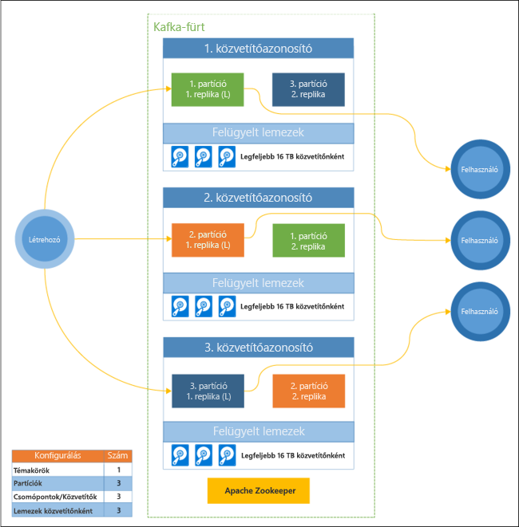

# Mi az a HDInsight-alapú Apache Kafka?

Az [Apache Kafka](https://kafka.apache.org) egy nyílt forráskódú elosztott streamelési platform streamadatfolyamatok és -alkalmazások létrehozásához. A Kafka az üzenetsorokhoz hasonló üzenetközvetítő funkciót is biztosít, amellyel adatstreameket tehet közzé, illetve feliratkozhat rájuk. 

A HDInsight-alapú Kafka jellegzetességei:

* Egy felügyelt szolgáltatás, amely egyszerűsített konfigurációs folyamatot biztosít. Ennek eredménye egy, a Microsoft által tesztelt és támogatott konfiguráció.

* A Microsoft 99,9%-os szolgáltatói szerződést (SLA) nyújt a Kafka üzemidejével kapcsolatban. További információkért lásd [a HDInsight szolgáltatói szerződésével kapcsolatos információkat ismertető](https://azure.microsoft.com/support/legal/sla/hdinsight/v1_0/) dokumentumot.

* A Kafka az Azure Managed Disks szolgáltatást használja háttértárként. A Managed Disks akár 16 TB tárhelyet biztosíthat Kafka-közvetítőnként. További tudnivalók a felügyelt lemezek HDInsight-alapú Kafkával való konfigurálásáról: [A HDInsight-alapú Kafka méretezhetőségének javítása](apache-kafka-scalability.md).

    További tudnivalók a felügyelt lemezekről: [Azure Managed Disks](../../virtual-machines/windows/managed-disks-overview.md).

* A Kafkát egy egydimenziós állványnézettel tervezték. Az Azure az állványokat két dimenzióra osztja: a frissítési tartományokra (UD) és a tartalék tartományokra (FD). A Microsoft biztosítja azokat az eszközöket, amelyek kiegyensúlyozhatják a Kafka-partíciókat és -replikákat a frissítési és tartalék tartományok között. 

    További információ: [Magas rendelkezésre állás a HDInsight-alapú Kafkában](apache-kafka-high-availability.md).

* A HDInsight lehetővé teszi a feldolgozó csomópontok (amelyeken a Kafka-közvetítő fut) számának a fürt létrehozását követő módosítását. A méretezés elvégezhető az Azure Portal, az Azure PowerShell vagy egyéb Azure-kezelőfelületek segítségével. A Kafka esetében érdemes kiegyenlíteni a partíciók replikáit a méretezési műveleteket követően. A partíciók kiegyenlítése lehetővé teszi, hogy a Kafka kihasználja a feldolgozó csomópontok új mennyiségét.

    További információ: [Magas rendelkezésre állás a HDInsight-alapú Kafkában](apache-kafka-high-availability.md).

* A HDInsight-alapú Kafka az Azure Log Analytics használatával monitorozható. A Log Analytics megjeleníti a virtuális gépek szintadatait, például a lemezek és hálózati adapterek metrikáit és a Kafka JMX-metrikáit.

    További információ: [A HDInsight-alapú Kafka naplóinak elemzése](apache-kafka-log-analytics-operations-management.md).

### A HDInsight-alapú Kafka architektúrája

Az alábbi ábra egy tipikus Kafka-konfigurációt mutat be, amely felhasználói csoportok, particionálás és replikálás használatával biztosítja az események párhuzamos olvasását hibatűréssel:

A Kafka-fürt állapotát az Apache ZooKeeper felügyeli. A ZooKeeper egyidejű, rugalmas és kis késleltetésű tranzakciókhoz készült. 

A Kafka a rekordokat (adatokat) **témakörökben** tárolja. A rekordokat **előállítók** hozzák létre, és **fogyasztók** használják fel. Az előállítók Kafka-**közvetítőknek** adják tovább a rekordokat. A HDInsight-fürt mindegyik feldolgozó csomópontja egy Kafka-közvetítő. 

A témakörök particionálják a rekordokat a közvetítők között. A rekordok felhasználásakor partíciónként legfeljebb egy fogyasztó használható, az adatok párhuzamos feldolgozása érdekében.

A partíciók csomópontok közötti duplikálásához a rendszer replikációt alkalmaz, amely védelmet nyújt a csomópontok (közvetítők) leállásával szemben. Az ábrán *(L)* jelöléssel rendelkező partíció az adott partíció vezetője. Az előállítói forgalmat a csomópontok vezetőjéhez irányítja a rendszer a ZooKeeper által kezelt állapot segítségével.

## Miért érdemes a HDInsight alatt futó Kafkát használni?

Néhány gyakori feladat és minta, amelyek a HDInsight-alapú Kafkával elvégezhetők:

* **Kafka-adatok replikálása**: A Kafka biztosítja a MirrorMaker eszközt, amely replikálja az adatokat a Kafka-fürtök között.

    A MirrorMaker használatával kapcsolatban lásd: [Kafka-témakörök replikálása a HDInsight-alapú Kafka esetében](apache-kafka-mirroring.md).

* **Közzétételi-feliratkozási üzenetkezelési minta**: A Kafka egy előállítói API-t biztosít a rekordok Kafka-témakörökbe való közzétételéhez. A fogyasztói API-ra a témakörökre való feliratkozáskor van szükség.

    További információ: [A HDInsight-alapú Kafka használatának első lépései](apache-kafka-get-started.md).

* **Streamfeldolgozás**: A Kafkát gyakran használják valós idejű streamfeldolgozásra az Apache Stormmal vagy Sparkkal. A Kafka 0.10.0.0 (HDInsight 3.5-ös és 3.6-os verzió) egy olyan streamelési API-t vezetett be, amely lehetővé teszi a streammegoldások Storm vagy Spark nélküli fejlesztését.

    További információ: [A HDInsight-alapú Kafka használatának első lépései](apache-kafka-get-started.md).

* **Horizontális skálázhatóság**: a Kafka szétosztja a streameket a HDInsight-fürtben található csomópontok között. A fogyasztói folyamatok társíthatók az egyes partíciókkal, így biztosítható a terheléselosztás a rekordok használatakor.

    További információ: [A HDInsight-alapú Kafka használatának első lépései](apache-kafka-get-started.md).

* **Érkezési sorrendben történő kézbesítés**: a stream minden egyes partíción belül érkezési sorrendben tárolja a rekordokat. Partíciónként egy fogyasztói folyamat társításával garantálhatja, hogy a rekordok feldolgozása érkezési sorrendben történjen.

    További információ: [A HDInsight-alapú Kafka használatának első lépései](apache-kafka-get-started.md).

## Használati esetek

* **Üzenetkezelés**: sokszor használják a Kafkát üzenetközvetítőként, mivel támogatja a közzétételi-feliratkozási üzenetmintát.

* **Tevékenységkövetés**: mivel a Kafka lehetővé teszi a rekordok érkezési sorrend szerinti naplózását, használható tevékenységek nyomon követésére és ismételt létrehozására. Ilyen tevékenységek például a felhasználók műveletei egy webhelyen vagy egy alkalmazásban.

* **Összesítés**: streamfeldolgozással összesítheti a különböző streamek információit, hogy működési adatokká egyesítse és központosítsa az információt.

* **Átalakítás**: streamfeldolgozás használatával egyesítheti és bővítheti az adatokat több bemeneti témakörből egy vagy több kimeneti témakörbe.

## További lépések

A HDInsighton futó Apache Kafka használatának megismeréséhez tekintse meg a következő hivatkozásokat:

* [Gyors útmutató: A Kafka létrehozása a HDInsighton](apache-kafka-get-started.md)

* [Oktatóanyag: Az Apache Spark használata a HDInsighton futó Kafkával](../hdinsight-apache-spark-with-kafka.md)

* [Oktatóanyag: Az Apache Storm használata a HDInsighton futó Kafkával](../hdinsight-apache-storm-with-kafka.md)
