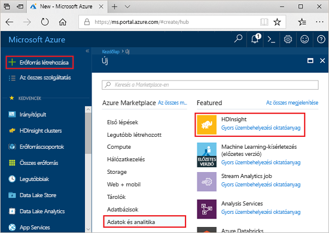
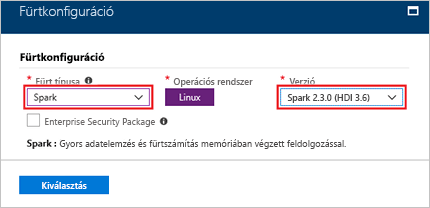
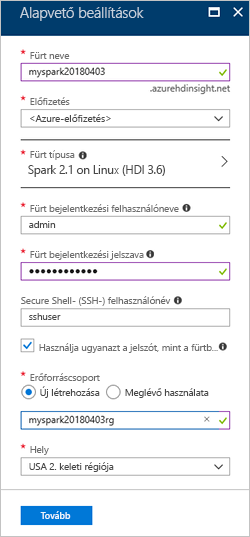
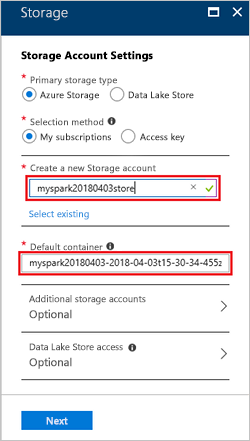
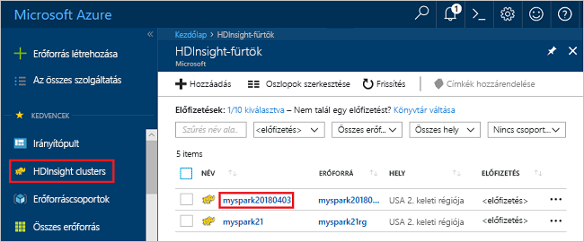
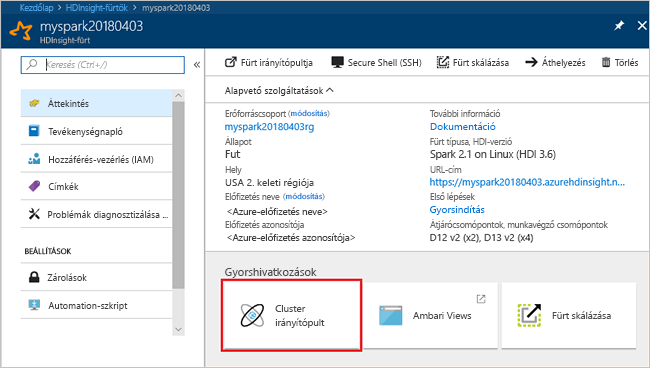
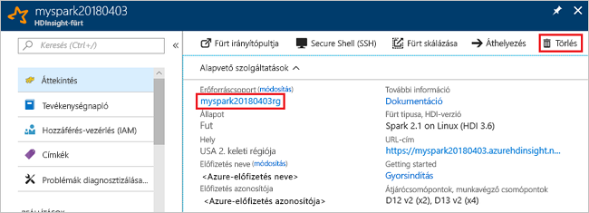

# <a name="quickstart-create-an-apache-spark-cluster-in-hdinsight-using-the-azure-portal"></a>Gyors útmutató: Apache Spark-fürt létrehozása HDInsight az Azure portal használatával
Megtudhatja, hogyan hozhat létre Apache Spark-fürtöt az Azure HDInsightban, és hogyan futtathat Spark SQL-lekérdezéseket a Hive-táblákon. Az Apache Spark a memóriában végzett feldolgozás segítségével teszi lehetővé a gyors adatelemzést és fürtszámítást. A Spark on HDInsight további információkért lásd: [áttekintése: Az Apache Spark on Azure HDInsight](apache-spark-overview.md).

Ebben a rövid útmutatóban egy HDInsight Spark-fürtöt hoz létre az Azure Portal használatával. A fürt Azure Storage-blobokat használ fürttárolóként. A Data Lake Storage Gen2 használatával további információkért lásd: [a rövid útmutató: A HDInsight-fürtök beállítása](../../storage/data-lake-storage/quickstart-create-connect-hdi-cluster.md).

> [!IMPORTANT]  
> A HDInsight-fürtök számlázása percenként történik, akár használja őket, akár nem. Mindig törölje a fürtöt, ha már nem használja. További információkért lásd a cikk [Az erőforrások eltávolítása](#clean-up-resources) című szakaszát.

Ha nem rendelkezik Azure-előfizetéssel, [hozzon létre egy ingyenes fiókot](https://azure.microsoft.com/free/) a feladatok megkezdése előtt.

## <a name="create-an-hdinsight-spark-cluster"></a>HDInsight Spark-fürt létrehozása

1. Az Azure Portalon válassza ki a **erőforrás létrehozása** > **Analytics** > **HDInsight**. 

    
2. Az **Alapvető beállítások** területen adja meg a következő értékeket:
     
    |Tulajdonság  |Leírás  |
    |---------|---------|
    |**Fürt neve**     | Adjon nevet a HDInsight Spark-fürtnek. A rövid útmutatóhoz használt fürt neve: **myspark20180403**.|
    |**Előfizetés**     | Válassza ki a legördülő menüből a fürthöz használt Azure-előfizetést. A rövid útmutatóhoz használt előfizetés: **&lt;Azure-előfizetés**. |
    |**Fürt típusa**| Bontsa ki az elemet, majd a fürt típusaként válassza a **Spark** lehetőséget, és adja meg a Spark-fürt verzióját. <br/>  |
    |**Fürt bejelentkezési felhasználóneve**| Adja meg a fürt bejelentkezési felhasználónevét.  Az alapértelmezett név az *admin*. Ezt a fiókot a Jupyter notebookba történő bejelentkezéshez fogja használni a rövid útmutató későbbi részében. |
    |**Fürt bejelentkezési jelszava**| Adja meg a fürt bejelentkezési jelszavát. |
    |**Secure Shell (SSH-) felhasználónév**| Adja meg az SSH-felhasználónevet. A rövid útmutatóhoz használt SSH-felhasználónév: **sshuser**. Alapértelmezés szerint ennek a fióknak ugyanaz a jelszava, mint a *fürt bejelentkezési felhasználónevéhez* tartozó fióknak. |
    |**Erőforráscsoport**     | Adja meg, hogy új erőforráscsoportot kíván-e létrehozni, vagy egy meglévőt szeretne használni. Az erőforráscsoport egy tároló, amely Azure-megoldásokhoz kapcsolódó erőforrásokat tárol. A rövid útmutatóhoz használt erőforráscsoport neve: **myspark20180403rg**. |
    |**Hely**     | Válasszon egy helyet az erőforráscsoportnak. A sablon ezt a helyet használja a fürt létrehozásához, valamint az alapértelmezett fürttárolóhoz. A rövid útmutatóhoz használt hely az **USA 2. keleti régiója**. |

    

    A **Storage** oldalára történő továbblépéshez kattintson a **Tovább** gombra.
3. A **Storage** területen adja meg a következő értékeket:

    - **Storage-fiók kiválasztása**: válassza az **Új létrehozása** elemet, majd adjon nevet az új tárfióknak. A rövid útmutatóhoz használt tárfiók neve: **myspark20180403store**.

    

    > [!NOTE]  
    > A képernyőfelvételen a **Meglévő kiválasztása** elem látható. A hivatkozás az **Új létrehozása** és a **Meglévő kiválasztása** elemek között vált.

    Az **Alapértelmezett tároló** alapértelmezett névvel rendelkezik.  A nevet tetszés szerint meg lehet változtatni.

    Az **Összefoglalás** oldalra történő továbblépéshez kattintson a **Tovább** gombra. 


3. Az **Összefoglalás** oldalon kattintson a **Létrehozás** gombra. A fürt létrehozása nagyjából 20 percet vesz igénybe. A következő munkamenetre csak a fürt létrehozását követően lehet továbblépni.

Ha problémába ütközik a HDInsight-fürtök létrehozása során, előfordulhat, hogy nem rendelkezik a szükséges engedélyekkel. További információért tekintse meg [a hozzáférés-vezérlésre vonatkozó követelményeket](../hdinsight-hadoop-create-linux-clusters-portal.md).

## <a name="create-a-jupyter-notebook"></a>Jupyter notebook létrehozása

A Jupyter Notebook egy interaktív notebook-környezet, amely számos programozási nyelvet támogat. A notebook lehetővé teszi az adatai használatát, a kódok és markdown-szövegek egyesítését, valamint egyszerű vizualizációk elvégzését. 

1. Nyissa meg az [Azure Portalt](https://portal.azure.com).
2. Válassza a **HDInsight-fürtök** lehetőséget, majd a létrehozott fürtöt.

    

3. A portálon válassza a **Fürt irányítópultja** lehetőséget, majd a **Jupyter Notebook** elemet. Ha a rendszer kéri, adja meg a fürthöz tartozó bejelentkezési hitelesítő adatokat.

   

4. Új notebook létrehozásához válassza a **New** > **PySpark** (Új > PySpark) lehetőséget. 

   

   Az új notebook létrejött, és Untitled(Untitled.pynb) néven nyílt meg.


## <a name="run-spark-sql-statements"></a>Spark SQL-utasítások futtatása

Az SQL az adatok lekérdezéséhez és meghatározásához leggyakrabban és legszélesebb körben használt nyelv. A Spark SQL az Apache Spark bővítményeként működik a strukturált adatok ismerős SQL-szintaxissal való feldolgozásához.

1. Ellenőrizze, hogy a kernel készen áll-e. A kernel akkor áll készen, ha a neve mellett a notebookban egy üres kör látható. A teli kör azt jelenti, hogy a kernel foglalt.

    

    A notebook első indításakor a kernel a háttérben elvégez néhány feladatot. Várja meg, hogy a kernel elkészüljön. 
2. Illessze be a következő kódot egy üres cellába, majd nyomja le a **SHIFT + ENTER** billentyűkombinációt annak futtatásához. A parancs felsorolja a fürtön található Hive-táblákat:

    ```PySpark
    %%sql
    SHOW TABLES
    ```
    Ha a Jupyter notebookot HDInsight Spark-fürttel használja, egy előre beállított `sqlContext` elemet kap, amelyet Hive-lekérdezések Spark SQL-lel végzett futtatásához használhat. A `%%sql` megadja a Jupyter notebook számára, hogy az előre beállított `sqlContext` elemet használja a Hive-lekérdezés futtatásához. A lekérdezés lekérdezi az első 10 sort egy Hive-táblából (**hivesampletable**), amely alapértelmezés szerint minden HDInsight-fürtben megtalálható. Az eredmények lekérdezése körülbelül 30 másodpercet vesz igénybe. A kimenet a következőképpen fog kinézni: 

    

    Minden alkalommal, amikor a Jupyterben lekérdezést futtat, a webböngésző ablakának címsorában **(Foglalt)** állapot jelenik meg a notebook neve mellett. A jobb felső sarokban lévő **PySpark** felirat mellett ekkor egy teli kör is megjelenik.
    
2. Futtasson egy másik lekérdezést a `hivesampletable` adatainak megtekintéséhez.

    ```PySpark
    %%sql
    SELECT * FROM hivesampletable LIMIT 10
    ```
    
    A képernyő frissül, és megjeleníti a lekérdezés kimenetét.

    

2. A notebook **File** (Fájl) menüjében kattintson a **Close and Halt** (Bezárás és leállítás) elemre. A notebook leállítása felszabadítja a fürt erőforrásait.

## <a name="clean-up-resources"></a>Az erőforrások eltávolítása
A HDInsight az Azure Storage vagy az Azure Data Lake Storage tárhelyein tárolja az adatokat, így a nem használt fürtök biztonságosan törölhetők. Ráadásul a HDInsight-fürtök akkor is díjkötelesek, amikor éppen nincsenek használatban. Mivel a fürt költsége a sokszorosa a tároló költségeinek, gazdaságossági szempontból is ésszerű törölni a használaton kívüli fürtöket. Ha azt tervezi, hogy rögtön elvégzi a [További lépések](#next-steps) szakaszban található oktatóanyagot is, akkor érdemes lehet megtartani a fürtöt.

Lépjen vissza az Azure Portalra és válassza a **Törlés** lehetőséget.



Az erőforráscsoport nevét kiválasztva is megnyílik az erőforráscsoport oldala, ahol kiválaszthatja az **Erőforráscsoport törlése** elemet. Az erőforráscsoport törlésekor a rendszer a HDInsight Spark-fürtöt és az alapértelmezett tárfiókot is törli.

## <a name="next-steps"></a>További lépések 

Ebből a rövid útmutatóból megtudhatta, hogyan hozható létre egy HDInsight Spark-fürt, illetve hogyan futtatható egy alapszintű Spark SQL-lekérdezés. Folytassa a következő oktatóanyaggal, amelyben megtudhatja, hogyan használhatja a HDInsight Spark-fürtöt interaktív lekérdezések mintaadatokon való futtatására.

> [!div class="nextstepaction"]
>[Az Apache Spark interaktív lekérdezések futtatása](./apache-spark-load-data-run-query.md)

