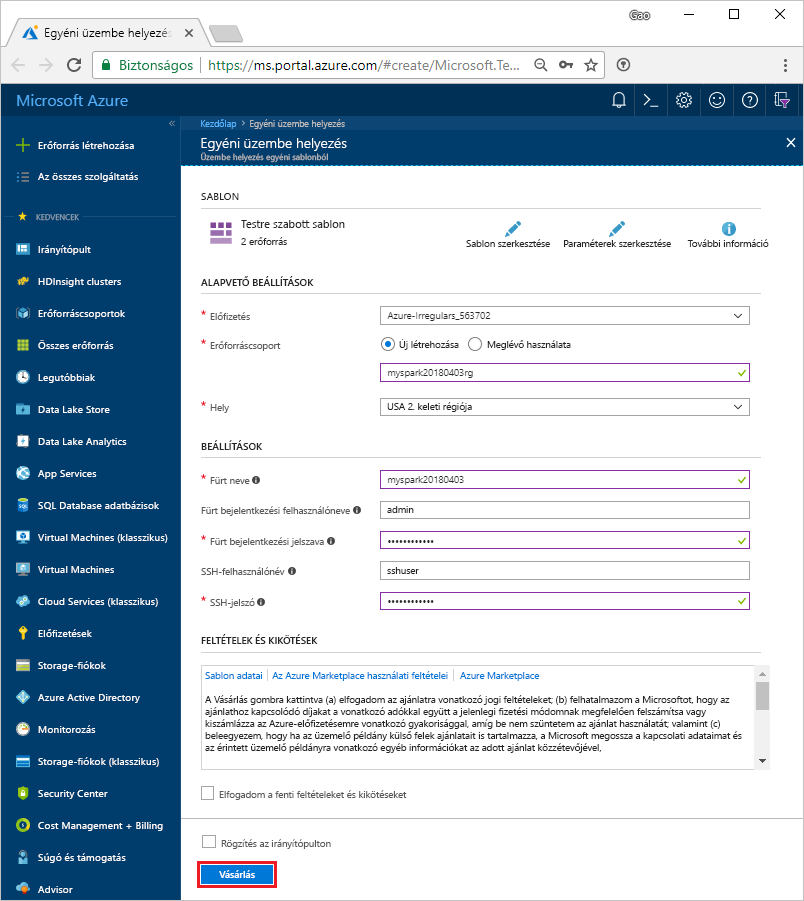

# <a name="quickstart-create-an-apache-spark-cluster-in-hdinsight-using-template"></a>Gyors útmutató: Hozzon létre egy Apache Spark-fürt a HDInsight-sablon használatával

Ismerje meg, hogyan hozhat létre egy [Apache Spark](https://spark.apache.org/) , és hogyan futtathat Spark SQL-lekérdezéseket az Azure HDInsight-fürt [Apache Hive](https://hive.apache.org/) táblákat. Az Apache Spark a memóriában végzett feldolgozás segítségével teszi lehetővé a gyors adatelemzést és fürtszámítást. A Spark on HDInsight további információkért lásd: [áttekintése: Az Apache Spark on Azure HDInsight](apache-spark-overview.md).

Ebben a rövid útmutatóban egy HDInsight Spark-fürtöt fog létrehozni egy Azure Resource Manager-sablon használatával. A fürt Azure Storage-blobokat használ fürttárolóként. A Data Lake Storage Gen2 használatával további információkért lásd: [a rövid útmutató: A HDInsight-fürtök beállítása](../../storage/data-lake-storage/quickstart-create-connect-hdi-cluster.md).

> [!IMPORTANT]  
> A HDInsight-fürtök számlázása percenként történik, akár használja őket, akár nem. Mindig törölje a fürtöt, ha már nem használja. További információkért lásd a cikk [Az erőforrások eltávolítása](#clean-up-resources) című szakaszát.

Ha nem rendelkezik Azure-előfizetéssel, [hozzon létre egy ingyenes fiókot](https://azure.microsoft.com/free/) a feladatok megkezdése előtt.

## <a name="create-an-hdinsight-spark-cluster"></a>HDInsight Spark-fürt létrehozása

Hozzon létre egy HDInsight Spark-fürtöt az Azure Resource Manager-sablon használatával. A sablonban található [GitHub](https://azure.microsoft.com/resources/templates/101-hdinsight-spark-linux/). A JSON-szintaxist és a fürt tulajdonságait: [Microsoft.HDInsight/clusters](/azure/templates/microsoft.hdinsight/clusters).

1. Az alábbi hivatkozásra kattintva megnyithatja a sablont az Azure Portalon egy új böngészőlapon:

    <a href="https://portal.azure.com/#create/Microsoft.Template/uri/https%3A%2F%2Fraw.githubusercontent.com%2FAzure%2Fazure-quickstart-templates%2Fmaster%2F101-hdinsight-spark-linux%2Fazuredeploy.json" target="_blank">Üzembe helyezés az Azure-ban</a>

2. Írja be a következő értékeket:

    | Tulajdonság | Érték |
    |---|---|
    |**Előfizetés**|Válassza ki a fürt létrehozásához használt Azure-előfizetést. A rövid útmutatóhoz használt előfizetés: **&lt;Azure-előfizetés neve>**. |
    | **Erőforráscsoport**|Hozzon létre egy erőforráscsoportot, vagy válasszon ki egy meglévőt. Az erőforráscsoport kezeli a projektek Azure-erőforrásait. A rövid útmutatóhoz használt új erőforráscsoport neve: **myspark20180403rg**.|
    | **Hely**|Válasszon egy helyet az erőforráscsoportnak. A sablon ezt a helyet használja a fürt létrehozásához, valamint az alapértelmezett fürttárolóhoz. A rövid útmutatóhoz használt hely az **USA 2. keleti régiója**.|
    | **ClusterName**|Adjon nevet a létrehozni kívánt HDInsight-fürtnek. A rövid útmutatóhoz használt új fürt neve: **myspark20180403**.|
    | **A fürt bejelentkezési neve és jelszava**|Az alapértelmezett bejelentkezési név az admin. Válasszon egy jelszót a fürtre való bejelentkezéshez. A rövid útmutatóhoz használt bejelentkezési név: **admin**.|
    | **SSH-felhasználónév és -jelszó**|Válasszon egy jelszót az SSH-felhasználónak. A rövid útmutatóhoz használt SSH-felhasználónév: **sshuser**.|

    

3. Jelölje be az **Elfogadom a fenti feltételeket** és a **Rögzítés az irányítópulton** lehetőséget, majd válassza a **Vásárlás** lehetőséget. Egy új csempe jelenik meg **Deploying Template deployment** (Üzembe helyezés – Sablon telepítése) címmel. A fürt létrehozása nagyjából 20 percet vesz igénybe. A következő munkamenetre csak a fürt létrehozását követően lehet továbblépni.

Ha problémába ütközik a HDInsight-fürtök létrehozása során, előfordulhat, hogy nem rendelkezik a szükséges engedélyekkel. További információért tekintse meg [a hozzáférés-vezérlésre vonatkozó követelményeket](../hdinsight-hadoop-create-linux-clusters-portal.md).

## <a name="install-intellijeclipse-for-spark-application"></a>Az IntelliJ/Eclipse for Spark alkalmazás telepítése
Az IntelliJ vagy Eclipse beépülő modul az Azure-eszközkészlet használata nyelven írt Spark-alkalmazások fejlesztéséhez [Scala](https://www.scala-lang.org/), majd küldheti el ezeket az Azure HDInsight Spark-fürt közvetlenül az IntelliJ vagy Eclipse integrált fejlesztői környezet (a IDE-VEL). További információ: [IntelliJ használata Spark-alkalmazások létrehozásához/leadásához](./apache-spark-intellij-tool-plugin.md) és [Eclipse használata Spark-alkalmazások létrehozásához/leadásához](./apache-spark-eclipse-tool-plugin.md).

## <a name="install-vscode-for-pysparkhive-applications"></a>VSCode telepítése PySpark-/hive-alkalmazásokhoz
Megtudhatja, hogyan használhat Azure HDInsight-eszközöket a Visual Studio Code (VSCode) alkalmazáshoz, hogy Hive batch-feladatokat, interaktív Hive-lekérdezéseket, PySpark-köteget és PySpark interaktív szkripteket hozzon létre és adjon le. Az Azure HDInsight-eszközök a VSCode által támogatott platformokon telepíthetők. Ezek közé tartozik a Windows, a Linux és a macOS. További információ: [VSCode használata PySpark-alkalmazások létrehozásához/leadásához](../hdinsight-for-vscode.md).

## <a name="create-a-jupyter-notebook"></a>Jupyter notebook létrehozása

[Jupyter Notebook](https://jupyter.org/) van egy interaktív notebook-környezet, amely számos programozási nyelvet. A notebook lehetővé teszi az adatai használatát, a kódok és markdown-szövegek egyesítését, valamint egyszerű vizualizációk elvégzését.

1. Nyissa meg az [Azure Portalt](https://portal.azure.com).
2. Válassza a **HDInsight-fürtök** lehetőséget, majd a létrehozott fürtöt.

    

3. A portál **Fürt irányítópultjai** szakaszában kattintson a **Jupyter Notebook** elemre. Ha a rendszer kéri, adja meg a fürthöz tartozó bejelentkezési hitelesítő adatokat.

   

4. Új notebook létrehozásához válassza a **New** > **PySpark** (Új > PySpark) lehetőséget.

   

   Az új notebook létrejött, és Untitled(Untitled.pynb) néven nyílt meg.


## <a name="run-spark-sql-statements"></a>Spark SQL-utasítások futtatása

Az SQL az adatok lekérdezésére és átalakítására leggyakrabban és legszélesebb körben használt nyelv. A Spark SQL az Apache Spark bővítményeként működik a strukturált adatok ismerős SQL-szintaxissal való feldolgozásához.

1. Ellenőrizze, hogy a kernel készen áll-e. A kernel akkor áll készen, ha a neve mellett a notebookban egy üres kör látható. A teli kör azt jelenti, hogy a kernel foglalt.

    

    A notebook első indításakor a kernel a háttérben elvégez néhány feladatot. Várja meg, hogy a kernel elkészüljön.
2. Illessze be a következő kódot egy üres cellába, majd nyomja le a **SHIFT + ENTER** billentyűkombinációt annak futtatásához. A parancs felsorolja a fürtön található Hive-táblákat:

    ```sql
    %%sql
    SHOW TABLES
    ```
    Ha a Jupyter-notebookot HDInsight Spark-fürttel használja, egy előre beállított `spark`-munkamenetet kap, amelyet a Hive-lekérdezések a Spark SQL-lel végzett futtatásához használhat. A `%%sql` megadja a Jupyter-notebook számára, hogy az előre beállított `spark`-munkamenetet használja a Hive-lekérdezés futtatásához. A lekérdezés lekérdezi az első 10 sort egy Hive-táblából (**hivesampletable**), amely alapértelmezés szerint minden HDInsight-fürtben megtalálható. Az első alkalommal, amikor beküldi a lekérdezést, a Jupyter létrehoz egy Spark-alkalmazást a notebookhoz. Ez körülbelül 30 másodpercet vesz igénybe. Miután a Spark-alkalmazás létrejött, a lekérdezés körülbelül egy másodperc alatt lefut, és előállítja az eredményeket. A kimenet a következőképpen fog kinézni:

    

    Minden alkalommal, amikor a Jupyterben lekérdezést futtat, a webböngésző ablakának címsorában **(Foglalt)** állapot jelenik meg a notebook neve mellett. A jobb felső sarokban lévő **PySpark** felirat mellett ekkor egy teli kör is megjelenik.

2. Futtasson egy másik lekérdezést a `hivesampletable` adatainak megtekintéséhez.

    ```sql
    %%sql
    SELECT * FROM hivesampletable LIMIT 10
    ```
    
    A képernyő frissül, és megjeleníti a lekérdezés kimenetét.

    

2. A notebook **File** (Fájl) menüjében kattintson a **Close and Halt** (Bezárás és leállítás) elemre. A notebook leállítása felszabadítja a fürt erőforrásait, beleértve a Spark-alkalmazást.

## <a name="clean-up-resources"></a>Az erőforrások eltávolítása
A HDInsight az Azure Storage vagy az Azure Data Lake Store tárhelyein tárolja az adatokat és a Jupyter-notebookokat, így a nem használt fürtök biztonságosan törölhetők. Ráadásul a HDInsight-fürtök akkor is díjkötelesek, amikor éppen nincsenek használatban. Mivel a fürt költsége a sokszorosa a tároló költségeinek, gazdaságossági szempontból is ésszerű törölni a használaton kívüli fürtöket. Ha azt tervezi, hogy rögtön elvégzi a [További lépések](#next-steps) szakaszban található oktatóanyagot is, akkor érdemes lehet megtartani a fürtöt.

Lépjen vissza az Azure Portalra és válassza a **Törlés** lehetőséget.


Az erőforráscsoport nevét kiválasztva is megnyílik az erőforráscsoport oldala, ahol kiválaszthatja az **Erőforráscsoport törlése** elemet. Az erőforráscsoport törlésekor a rendszer a HDInsight Spark-fürtöt és az alapértelmezett tárfiókot is törli.

## <a name="next-steps"></a>További lépések

Ebből a rövid útmutatóból megtudhatta, hogyan hozható létre egy HDInsight Spark-fürt, illetve hogyan futtatható egy alapszintű Spark SQL-lekérdezés. Folytassa a következő oktatóanyaggal, amelyben megtudhatja, hogyan használhatja a HDInsight Spark-fürtöt interaktív lekérdezések mintaadatokon való futtatására.

> [!div class="nextstepaction"]
>[Az Apache Spark interaktív lekérdezések futtatása](./apache-spark-load-data-run-query.md)


