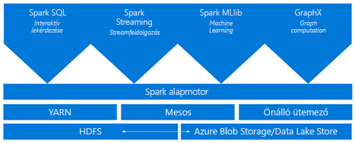
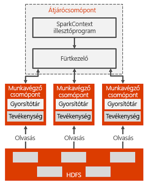

# Mi az az Azure HDInsight-alapú Apache Spark?

*Az Apache Spark* van egy párhuzamos feldolgozást végző keretrendszer, amely támogatja a memórián belüli feldolgozást a big data elemző alkalmazások teljesítményének növelése érdekében. Az Azure HDInsight-alapú Apache Spark az Apache Spark felhőbeli megvalósítása, a Microsoft terméke. A HDInsight segítségével leegyszerűsíthető a Spark-fürtök létrehozása és konfigurálása az Azure-ban. A HDInsight-alapú Spark-fürtök kompatibilisek az Azure Storage és az Azure Data Lake Store szolgáltatásokkal is. A HDInsight-alapú Spark-fürtök segítségével tehát elvégezheti az Azure-ban tárolt adatok feldolgozását. Az összetevők és a verzióinformációk: [Apache Hadoop-összetevők és verziók az Azure HDInsight](../hdinsight-component-versioning.md).

## Mi a Spark?

a Spark alapelemeket nyújt a memórián belüli fürtszámításhoz. A Spark-feladatokkal az adatok betölthetők és gyorsítótárazhatók a memóriába, majd ismétlődő jelleggel lekérdezhetők. A memóriában történő feldolgozás sokkal gyorsabb, mint a lemezalapú alkalmazások, így például a Hadoop esetében, amely az adatok megosztását HDFS-en keresztül végzi. A Spark a Scala programozási nyelvbe is integrálható, így a helyi gyűjteményekhez hasonlóan módosíthatja az elosztott adatkészleteket. Nem kell mindent térképként rendszerezni és csökkenteni a műveletek számát.

A HDInsight-alapú Spark-fürtök teljes körűen felügyelt Spark szolgáltatást nyújtanak. A HDInsight-alapú Spark-fürt létrehozásának előnyeit ez a lista foglalja össze.

| Szolgáltatás | Leírás |
| --- | --- |
| Könnyű létrehozás |Az Azure Portal, az Azure PowerShell vagy a HDInsight .NET SDK használatával percek alatt létrehozható egy új Spark-fürt a HDInsight platformon. Lásd: [Spark-fürt a HDInsightban – első lépések](apache-spark-jupyter-spark-sql.md) |
| Könnyű használat |A HDInsight-alapú Spark-fürt tartalmazza a Jupyter és a Zeppelin notebookokat. Ezeket a notebookokat interaktív adatfeldolgozásra és -vizualizációra használhatja.|
| REST API-k |A HDInsight Spark-fürtök tartalmazzák [Apache Livy](https://github.com/cloudera/hue/tree/master/apps/spark/java#welcome-to-livy-the-rest-spark-server), egy REST API-alapú Spark-feladatkiszolgálót távoli feladatokat küldhet és felügyelhet. |
| Az Azure Data Lake Store támogatása | A HDInsight-alapú Spark-fürtök az Azure Data Lake Store-t elsődleges vagy kiegészítő tárterületként is használhatják. További információk a Data Lake Store-ról: [Áttekintés: Azure Data Lake Store](../../data-lake-store/data-lake-store-overview.md). |
| Integráció az Azure-szolgáltatásokkal |A HDInsight-alapú Spark-fürt Azure Event Hubs-összekötőt is tartalmaz. Streamelési alkalmazásokat mellett az Event Hubs használatával hozhat létre [Apache Kafka](http://kafka.apache.org/), amely már elérhető a Spark részeként. |
| ML Server-támogatás | Az ML Server HDInsighton belüli támogatását az **ML-szolgáltatási** fürttípus biztosítja. Az ML-szolgáltatások fürtjei elosztott R-számítások futtatására állíthatók be a Spark-fürtre jellemző sebesség mellett. További információ: [ML Server HDInsighton belül – első lépések](../r-server/r-server-get-started.md). |
| Integráció külső integrált fejlesztői környezetekkel (IDE) | A HDInsight számos olyan IDE beépülő modult biztosít, amely alkalmazások létrehozásához és egy HDInsight Spark-fürt számára történő elküldéséhez bizonyulhat hasznosnak. További információ: [Az IntelliJ IDEA-hoz készült Azure-eszközkészlet használata](apache-spark-intellij-tool-plugin.md), [A VSCode-hoz készült HDInsight használata](../hdinsight-for-vscode.md) és [Az Eclipse-hez készült Azure eszközkészlet használata](apache-spark-eclipse-tool-plugin.md).|
| Egyidejű lekérdezések |A HDInsight-alapú Spark-fürtök támogatják az egyidejű lekérdezéseket. E képesség révén lehetővé válik, hogy az egyetlen, illetve a több felhasználótól és alkalmazástól származó több lekérdezés ugyanazokat a fürterőforrásokat használja. |
| Gyorsítótárazás SSD meghajtókon |Az adatok gyorsítótárazása történhet a memóriában vagy a fürtcsomópontokhoz kapcsolt SSD meghajtókon is. A memóriában történő gyorsítótárazás biztosítja a legjobb lekérdezési teljesítményt, ugyanakkor drága lehet. Az SSD-meghajtókon történő gyorsítótárazással viszont úgy javítható hatékonyan a lekérdezési teljesítmény, hogy ahhoz nincs szükség a memória teljes adatkészletéhez igazodó méretű fürt létrehozására. |
| Integráció BI-eszközökkel |A HDInsight-alapú Spark-fürtök összekötőket biztosítanak az olyan adatelemző BI-eszközök számára, mint a [Power BI](http://www.powerbi.com/). |
| Előre betöltött Anaconda-könyvtárak |A HDInsight-alapú Spark-fürtök előre telepített Anaconda-könyvtárakkal rendelkeznek. Az [Anaconda](http://docs.continuum.io/anaconda/) közel 200 könyvtárat biztosít például a Machine Learning szolgáltatáshoz, az adatok elemzéséhez vagy a megjelenítéshez. |
| Méretezhetőség | A HDInsight segítségével módosítható a fürtcsomópontok száma. A Spark-fürtök ezenkívül adatvesztés nélkül törölhetők, hiszen minden adatot az Azure Storage vagy a Data Lake Store tárol. |
| SLA |A HDInsight-alapú Spark-fürtökhöz a hét minden napján 24 órás ügyfélszolgálat, valamint az SLA által garantált 99,9%-os üzemidő jár. |

A HDInsight Apache Spark-fürtök tartalmazzák a következő összetevőket, a fürtökön alapértelmezés szerint elérhető.

* [Spark mag](https://spark.apache.org/docs/1.5.1/). A következőket tartalmazza: Spark mag, Spark SQL, Spark streamelési API-k, GraphX és MLlib.
* [Anaconda](http://docs.continuum.io/anaconda/)
* [Az Apache Livy](https://github.com/cloudera/hue/tree/master/apps/spark/java#welcome-to-livy-the-rest-spark-server)
* [Jupyter notebook](https://jupyter.org)
* [Az Apache Zeppelin-jegyzetfüzet](http://zeppelin-project.org/)

A HDInsight-alapú Spark-fürtök [ODBC-illesztőt](https://go.microsoft.com/fwlink/?LinkId=616229) is biztosítanak a HDInsight-alapú Spark-fürtökhöz olyan BI-eszközökből történő csatlakozáshoz, mint a Microsoft Power BI.

## Spark-fürtarchitektúra

A Spark összetevőinek szerepét legegyszerűbben a Spark HDInsight-fürtökön történő futtatásán keresztül érhetjük meg.

A Spark-alkalmazások független folyamatkészletekként futnak a fürtön, koordinálásukat az (illesztőprogramnak is nevezett) főprogram SparkContext objektuma végzi.

A SparkContext objektum különböző típusú fürtkezelőkhöz csatlakoztatható, amelyek az erőforrások lefoglalását végzik az egyes alkalmazásokban. Ezek olyan fürtkezelők tartalmaznak [Apache Mesos](http://mesos.apache.org/), [Apache Hadoop YARN](https://hadoop.apache.org/docs/current/hadoop-yarn/hadoop-yarn-site/YARN.html), vagy a Spark-kezelőt. A HDInsightban a Spark a YARN fürtkezelő segítségével fut. A csatlakoztatást követően a Spark beszerzi a fürt feldolgozó csomópontjainak végrehajtóit. E folyamatok számítások futtatását és adatok tárolását végzik az alkalmazás számára. Ezt követően a Spark elküldi az alkalmazás kódját a végrehajtóknak. A kódot a SparkContext objektum számára átadott JAR- vagy Python-fájlok határozzák meg. Végül a SparkContext objektum elküldi futtatásra a feladatokat a végrehajtóknak.

A SparkContext objektum futtatja a felhasználó fő funkcióját, és végrehajtja a különféle párhuzamos műveleteket a feldolgozó csomópontokon. Ezután a SparkContext objektum összegyűjti a műveletek eredményeit. A feldolgozó csomópontok adatokat írnak a Hadoop elosztott fájlrendszerbe (HDFS-ből), és adatokat olvasnak onnan. A feldolgozó csomópontok a memóriában lévő átalakított adatokat is gyorsítótárazzák rugalmas elosztott adatkészletekként (RDD-kként).

A SparkContext objektum csatlakozik a Spark-főkiszolgálóhoz, és a feladata az alkalmazások átalakítása irányított gráfokká (DAG) az egyes feladatokhoz, amelyek a feldolgozó csomópontok végrehajtó folyamatain belül lesznek végrehajtva. Mindegyik alkalmazás saját végrehajtó folyamatokkal rendelkezik, amelyek az alkalmazás teljes időtartamáig működnek, és több szálon futtatnak feladatokat.

## Spark in HDInsight – Használati esetek

A HDInsight-alapú Spark-fürtök a következő főbb forgatókönyvek megvalósítását teszik lehetővé:

- Interaktív adatelemzés és BI

    A HDInsight-alapú Apache Spark az Azure Storage vagy az Azure Data Lake Store tárhelyein tárolja az adatokat. Az üzleti szakértők és a legfontosabb döntéshozók ezen adatok alapján elemzéseket végezhetnek és jelentéseket állíthatnak elő, illetve a Microsoft Power BI használatával az elemzett adatokból interaktív jelentéseket készíthetnek. Az elemzők a fürtbeli tárolón található strukturálatlan, illetve részben strukturált adatokból kiindulva, notebookok használatával sémát adhatnak meg, majd a Microsoft PowerBI használatával adatmodelleket építhetnek fel. A HDInsight-alapú Spark-fürtök számos olyan külső BI-eszközt is támogatnak, mint például a Tableau, így leegyszerűsítik az adatelemzők, az üzleti szakértők és a fő döntéshozók munkáját.

    [Oktatóanyag: A Power BI használata Spark-adatok megjelenítése](apache-spark-use-bi-tools.md)
- Spark Machine Learning

    Az Apache Spark tartalmazza a Sparkra épülő [MLlib](http://spark.apache.org/mllib/) Machine Learning-könyvtárat, amelyet egy HDInsight-alapú Spark-fürtből használhat. A HDInsight-alapú Spark-fürt tartalmazza a Python által terjesztett, számos gépi tanulási csomaggal rendelkező Anaconda rendszert. Ha ehhez hozzáveszi a Jupyter és Zeppelin notebookok beépített támogatását is, a gépi tanulási alkalmazásokhoz megfelelő környezetet kap.

    [Oktatóanyag: HVAC-adatok épület-hőmérsékletek előrejelzése](apache-spark-ipython-notebook-machine-learning.md) [oktatóanyag: Élelmiszervizsgálati eredmények előrejelzése](apache-spark-machine-learning-mllib-ipython.md)    
- Spark-alapú streamelés és valós idejű adatelemzés

    A HDInsight-alapú Spark széles körű támogatást nyújt a valós idejű elemzési megoldások kiépítéséhez. Amíg a Spark számos adatforrást (például Kafka, Flume, Twitter, ZeroMQ vagy TCP-szoftvercsatornák) támogató összekötőkkel rendelkezik, a Spark on HDInsight az Azure Event Hubs eseményközpontokból származó adatok magas szintű feldolgozását is támogatja. Az Event Hubs az Azure legnépszerűbb várólista-szolgáltatása. Az azonnal használható Event Hubs-támogatással a HDInsight-alapú Spark-fürtök ideális platformot nyújtanak a valós idejű elemzési folyamatok kiépítéséhez.

## Hogyan kezdjek hozzá?

Használhatja a következő cikkekben talál további információt az Apache Spark on HDInsight:

- [Rövid útmutató: a HDInsight egy Apache Spark-fürt létrehozása és interaktív lekérdezés futtatása a Jupyter használatával](./apache-spark-jupyter-spark-sql.md)
- [Oktatóanyag: a Jupyter használatával egy Apache Spark-feladat futtatása](./apache-spark-load-data-run-query.md)
- [Oktatóanyag: Adatok elemzése BI-eszközökkel](./apache-spark-use-bi-tools.md)
- [Oktatóanyag: machine learning Apache Spark használatával](./apache-spark-ipython-notebook-machine-learning.md)
- [Oktatóanyag: Scala Maven-alkalmazás létrehozása az IntelliJ használatával](./apache-spark-create-standalone-application.md)

## További lépések

Ebben az áttekintésben néhány alapszintű információt ismertetünk az Azure HDInsight-alapú Apache Sparkról. Folytassa a következő cikkel, amelyből megtudhatja, hogyan hozhat létre HDInsight Spark-fürtöt és futtathat Spark SQL-lekérdezéseket:

- [A HDInsight egy Apache Spark-fürt létrehozása](./apache-spark-jupyter-spark-sql.md)
