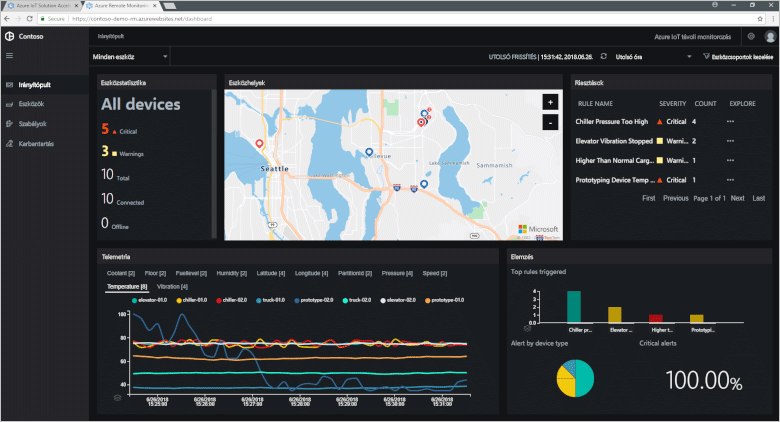

# Mik az Azure IoT-megoldásgyorsítók?

A felhőalapú IoT-megoldások általában egyéni kódokat és számos felhőszolgáltatást használnak az eszközkapcsolatok kezeléséhez, az adatok feldolgozásához, elemzéséhez és bemutatásához.

Az IoT-megoldásgyorsítók az IoT-megoldások teljes körű, átfogó, üzembe helyezésre kész gyűjteményei, amelyek olyan gyakori IoT-forgatókönyveket valósítanak meg, mint a távoli monitorozás, a csatlakoztatott gyár és a prediktív karbantartás. A megoldásgyorsítók üzembe helyezésekor az üzemelő példány magában foglalja az összes szükséges felhőalapú szolgáltatást és minden szükséges alkalmazáskódot.

A megoldásgyorsítók az Ön saját IoT-megoldásainak kiindulópontjaiként szolgálnak. Az összes megoldásgyorsító forráskódja nyílt, és elérhető a GitHubban. A megoldásgyorsítókat letöltheti és saját igényei szerint [testre szabhatja](iot-accelerators-remote-monitoring-customize.md).

A megoldásgyorsítókat tanulási eszközként is használhatja, mielőtt létrehozná saját egyéni IoT-megoldását. A megoldásgyorsítók bevált gyakorlatokat alkalmaznak a felhőalapú IoT-megoldásokhoz, amelyeket követhet.

Az összes megoldásgyorsító alkalmazáskódja tartalmaz egy irányítópultot, amely lehetővé teszi az alkalmazásgyorsító kezelését. Az irányítópultot például használhatja a csatlakoztatott eszközök telemetriájának megtekintéséhez, új eszközök létrehozásához vagy a csatlakoztatott eszközök belső vezérlőprogramjának frissítéséhez is:

## Támogatott IoT-forgatókönyvek

Jelenleg négy megoldásgyorsítót helyezhet üzembe:

### Távoli monitorozás

Ezt a megoldásgyorsítót a távoli eszközök telemetriájának összegyűjtéséhez, illetve az eszközök kezeléséhez használhatja. A példaeszközök közé tartoznak az ügyfelei telephelyein felszerelt hűtőrendszerek vagy a távoli szivattyútelepeken üzembe helyezett szelepek.

### Csatlakoztatott gyár

Ezt a megoldásgyorsítót az [OPC Unified Architecture](https://opcfoundation.org/about/opc-technologies/opc-ua/) felülettel rendelkező ipari objektumok telemetriai adatainak gyűjtéséhez és az objektumok irányításához használhatja. Az ipari objektumok lehetnek például a gyártósoron található összeszerelő- és tesztelőállomások.

### Prediktív karbantartás

Ezt a megoldásgyorsítót a távoli eszközök meghibásodásának előrejelzéséhez használhatja, hogy a várt meghibásodás előtt elvégezhesse a karbantartást. Ez a megoldásgyorsító gépi tanulási algoritmusokkal vizsgálja az eszköz telemetriai adatait, és előrejelzi a meghibásodást. A példaeszközök lehetnek például repülőgép-hajtóművek vagy liftek.

### Eszközszimuláció

Ezt a megoldásgyorsítót több, valósághű telemetriát előállító szimulált eszköz futtatására használhatja. Ez a megoldásgyorsító más megoldásgyorsítók viselkedésének vagy saját IoT-megoldásainak tesztelésére is használható.

## Tervezési alapelvek

Minden megoldásgyorsító ugyanazon tervezési elvek és célok figyelembevételével készült. Tervezésük során fontos volt:

* A **méretezhetőség**, így több millió csatlakoztatott eszközt csatlakoztathat és felügyelhet.
* A **bővíthetőség**, hogy saját elvárásainak megfelelően testre szabhassa megoldásgyorsítóit.
* Az **érthetőség**, hogy könnyedén megérthesse a működésüket és a megvalósításukat.
* A **modularitás**, hogy lecserélhessen egyes alkalmazásokat.
* A **biztonság**, amely az Azure biztonsági eszközeit a beépített csatlakozási és eszközbiztonsági funkciókkal kombinálja.

## Architektúra és nyelvek

Az eredeti megoldásgyorsítók a .NET és model-view-controller (MVC) architektúra használatával készültek. A Microsoft új mikroszolgáltatási architektúra használatára frissíti a megoldásgyorsítókat. Az egyes mikroszolgáltatások [Java](https://github.com/Azure/azure-iot-pcs-remote-monitoring-java)- és [.NET](https://github.com/Azure/azure-iot-pcs-remote-monitoring-dotnet)-alapú verziói is elérhetők a GitHubon. Az alábbi táblázat ismerteti a megoldásgyorsítók jelenlegi állapotát:

| Megoldásgyorsító   | Architektúra  | Nyelvek     |
| ---------------------- | ------------- | ------------- |
| Távoli monitorozás      | Mikroszolgáltatások | Java és .NET |
| Prediktív karbantartás | MVC           | .NET          |
| Csatlakoztatott gyár      | MVC           | .NET          |

További információk a mikroszolgáltatás-architektúrákról: [.NET-alkalmazás architektúrája](https://www.microsoft.com/net/learn/architecture) és [Mikroszolgáltatások: egy felhőben zajló alkalmazásforradalom](https://azure.microsoft.com/blog/microservices-an-application-revolution-powered-by-the-cloud/).

## Üzembe helyezési beállítások

A mikroszolgáltatás-alapú megoldásgyorsítókat a következő konfigurációkban helyezheti üzembe:

* **Standard:** Bővített infrastruktúra üzembe helyezése éles környezet fejlesztéséhez. Az Azure Container Service üzembe helyezi a mikroszolgáltatásokat több Azure-beli virtuális gépen. A Kubernetes koordinálja az egyes mikroszolgáltatásokat üzemeltető Docker-tárolókat.
* **Alapszintű**: Csökkentett költségű verzió bemutató célokra vagy az üzembe helyezés teszteléséhez. Mindegyik mikroszolgáltatás üzembe helyezhető egy Azure-beli virtuális gépen.
* **Helyi:** Helyi gépen történő üzembe helyezés tesztelés és fejlesztés céljából. Ez a módszer egy helyi Docker-tárolóban helyezi üzembe a mikroszolgáltatásokat, és csatlakozik az IoT Hub, Azure Cosmos DB és Azure Storage szolgáltatásokhoz a felhőben.

A megoldásgyorsítók futtatásának költsége az [alapul szolgáló Azure-szolgáltatások árának](https://azure.microsoft.com/pricing) összesített értékével egyenlő. Az igénybe vett Azure-szolgáltatások részleteit az üzembehelyezési beállítások kiválasztásakor tekintheti meg.

## További lépések

Egy IoT-megoldás kipróbáláshoz tekintse meg a [Távoli felhőalapú monitorozási megoldás üzembe helyezéséről](quickstart-remote-monitoring-deploy.md) szóló rövid útmutatót.
