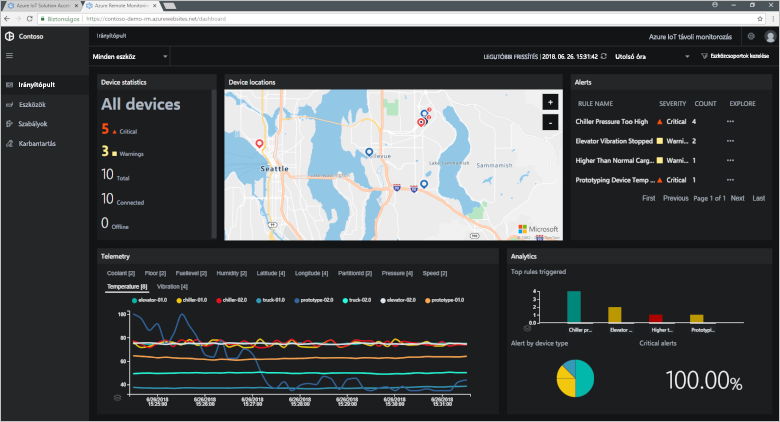
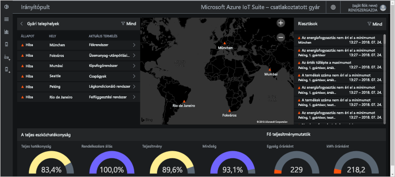
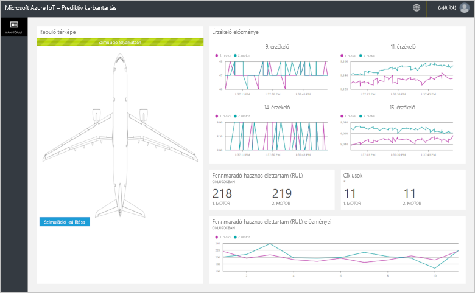
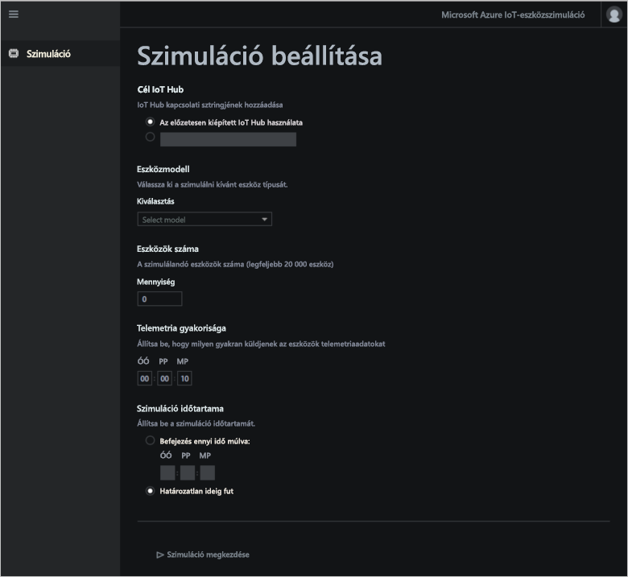

# Mik az Azure IoT-megoldásgyorsítók?

A felhőalapú IoT-megoldások általában használja egyéni kód és a cloud services kezeléséhez eszközkapcsolat, az adatfeldolgozás és elemzési és bemutató.

Az IoT-megoldásgyorsítók olyan általános IoT-forgatókönyveket megvalósító teljes, üzembe kész IoT-megoldások. A forgatókönyvek között megtalálható a távoli megfigyelés, a csatlakoztatott gyár, a prediktív karbantartási és a eszközszimuláció. A megoldásgyorsítók üzembe helyezésekor az üzemelő példány magában foglalja az összes szükséges felhőalapú szolgáltatást és minden szükséges alkalmazáskódot.

A megoldásgyorsítók az Ön saját IoT-megoldásainak kiindulópontjaiként szolgálnak. Az összes megoldásgyorsító forráskódja nyílt, és elérhető a GitHubban. A megoldásgyorsítókat letöltheti és saját igényei szerint testre szabhatja.

A megoldásgyorsítókat tanulási eszközként is használhatja, mielőtt létrehozná saját egyéni IoT-megoldását. A megoldásgyorsítók bevált gyakorlatokat alkalmaznak a felhőalapú IoT-megoldásokhoz, amelyeket követhet.

Az összes megoldásgyorsító alkalmazáskódja tartalmaz egy olyan webalkalmazást, amely lehetővé teszi az alkalmazásgyorsító kezelését.

## Támogatott IoT-forgatókönyvek

Jelenleg négy megoldásgyorsítót helyezhet üzembe:

### Távoli monitorozás

Használja a [távoli figyelési megoldásgyorsító](iot-accelerators-remote-monitoring-sample-walkthrough.md) távoli eszközök telemetriai adatok összegyűjtése, és vezérelheti őket. A példaeszközök közé tartoznak az ügyfelei telephelyein felszerelt hűtőrendszerek vagy a távoli szivattyútelepeken üzembe helyezett szelepek.

A távoli monitorozási irányítópultot használhatja a csatlakoztatott eszközök telemetriájának megtekintéséhez, új eszközök létrehozásához vagy a csatlakoztatott eszközök belső vezérlőprogramjának frissítéséhez is:

### Csatlakoztatott gyár

Használja a [Okosgyár-megoldásgyorsító](iot-accelerators-connected-factory-sample-walkthrough.md) a telemetriai adatok gyűjtése az ipari eszközök egy [OPC egyesített architektúra](https://opcfoundation.org/about/opc-technologies/opc-ua/) felületet, és megadhatja őket. Az ipari objektumok lehetnek például a gyártósoron található összeszerelő- és tesztelőállomások.

A csatlakoztatott gyár irányítópultjának használatával a következő ipari eszközöket monitorozhatja és kezelheti:

### Prediktív karbantartás

Használja a [prediktív karbantartási megoldásgyorsító](iot-accelerators-predictive-walkthrough.md) előre, amikor egy távoli eszközön várható sikertelen lesz, így is végrehajthasson karbantartás előtt az eszközt nem sikerül. Ez a megoldásgyorsító gépi tanulási algoritmusokkal vizsgálja az eszköz telemetriai adatait, és előrejelzi a meghibásodást. A példaeszközök lehetnek például repülőgép-hajtóművek vagy liftek.

A prediktív karbantartási irányítópult a következő prediktív karbantartási elemzések megtekintésére használható:

### Eszközszimuláció

Használja a [Eszközszimuláció megoldásgyorsító](iot-accelerators-device-simulation-overview.md) futtatni szimulált eszközök hoznak létre valószerű telemetriai adatokat. Ez a megoldásgyorsító más megoldásgyorsítók viselkedésének vagy saját IoT-megoldásainak tesztelésére is használható.

Az eszközszimulációs webalkalmazás a következő szimulációk konfigurálására és futtatására használható:

## Tervezési alapelvek

Minden megoldásgyorsító ugyanazon tervezési elvek és célok figyelembevételével készült. Tervezésük során fontos volt:

* A **méretezhetőség**, így több millió csatlakoztatott eszközt csatlakoztathat és felügyelhet.
* A **bővíthetőség**, hogy saját elvárásainak megfelelően testre szabhassa megoldásgyorsítóit.
* Az **érthetőség**, hogy könnyedén megérthesse a működésüket és a megvalósításukat.
* A **modularitás**, hogy lecserélhessen egyes alkalmazásokat.
* A **biztonság**, amely az Azure biztonsági eszközeit a beépített csatlakozási és eszközbiztonsági funkciókkal kombinálja.

## Architektúra és nyelvek

Az eredeti megoldásgyorsítók a .NET és model-view-controller (MVC) architektúra használatával készültek. A Microsoft új mikroszolgáltatási architektúra használatára frissíti a megoldásgyorsítókat. Az alábbi táblázat ismerteti a megoldásgyorsítók jelenlegi állapotát, illetve tartalmazza a megfelelő GitHub-adattárakra mutató hivatkozásokat:

| Megoldásgyorsító   | Architektúra  | Nyelvek     |
| ---------------------- | ------------- | ------------- |
| Távoli monitorozás      | Mikroszolgáltatások | [Java](https://github.com/Azure/azure-iot-pcs-remote-monitoring-java) és [.NET](https://github.com/Azure/azure-iot-pcs-remote-monitoring-dotnet) |
| Prediktív karbantartás | MVC           | [.NET](https://github.com/Azure/azure-iot-predictive-maintenance)          |
| Csatlakoztatott gyár      | MVC           | [.NET](https://github.com/Azure/azure-iot-connected-factory)          |
| Eszközszimuláció      | Mikroszolgáltatások | [.NET](https://github.com/Azure/device-simulation-dotnet)          |

A mikroszolgáltatási architektúra kapcsolatos további információkért lásd: [bemutatása az Azure IoT-referenciaarchitektúra](iot-accelerators-architecture-overview.md).

## Üzembe helyezési beállítások

A megoldásgyorsítókat a [Microsoft Azure IoT-megoldásgyorsítók](https://www.azureiotsolutions.com/Accelerators#) webhelyéről vagy a parancssorból helyezheti üzembe.

A távoli monitorozási megoldásgyorsítót a következő konfigurációkban helyezheti üzembe:

* **Standard:** Bővített infrastruktúra üzembe helyezése éles környezet fejlesztéséhez. Az Azure Container Service üzembe helyezi a mikroszolgáltatásokat több Azure-beli virtuális gépek. A Kubernetes koordinálja az egyes mikroszolgáltatásokat üzemeltető Docker-tárolókat.
* **Alapszintű:** Csökkentett költségű verzió bemutató célokra vagy a telepítés tesztelésére. Mindegyik mikroszolgáltatás üzembe helyezhető egy Azure-beli virtuális gépen.
* **Helyi:** Teszteléshez és fejlesztéshez telepítése helyi számítógépre. Ez a módszer egy helyi Docker-tárolóban helyezi üzembe a mikroszolgáltatásokat, és csatlakozik az IoT Hub, Azure Cosmos DB és Azure Storage szolgáltatásokhoz a felhőben.

Megoldásgyorsítók költségének a kombinált [költsége a mögöttes Azure-szolgáltatásokat futtató](https://azure.microsoft.com/pricing). Az igénybe vett Azure-szolgáltatások részleteit az üzembehelyezési beállítások kiválasztásakor tekintheti meg.

## További lépések

Az IoT-megoldásgyorsítók valamelyikének kipróbálásához tekintse meg a következő rövid útmutatókat:

* [Távoli monitorozási megoldás kipróbálása](quickstart-remote-monitoring-deploy.md)
* [Csatlakoztatottgyár-megoldás kipróbálása](quickstart-connected-factory-deploy.md)
* [Prediktív karbantartási megoldás kipróbálása](quickstart-predictive-maintenance-deploy.md)
* [Eszközszimulációs megoldás kipróbálása](quickstart-device-simulation-deploy.md)
