# Gyors útmutató: Próbálja ki a felhőalapú megoldást ipari IoT-eszközök kezelése

Ez a rövid útmutató bemutatja, hogyan helyezheti üzembe az Azure IoT megoldásgyorsítóját a csatlakoztatott gyárhoz, és futtathatja egy ipari IoT-eszközök számára készült, felhőalapú monitorozási és felügyeleti szimulációban. Amikor üzembe helyezi a csatlakoztatott gyár megoldásgyorsítóját, az előre fel lesz töltve olyan szimulált erőforrásokkal, amelyekkel végighaladhat egy általános ipari IoT-forgatókönyvön. A megoldáshoz több szimulált gyár csatlakozik, amelyek jelentést készítenek a teljes eszközhatékonyság (overall equipment efficiency, OEE) és a fő teljesítménymutatók (KPI) kiszámításához szükséges adatértékekről. Ez a rövid útmutató bemutatja, hogyan használhatja a megoldás irányítópultját a következőkre:

* Gyárakra, gyártósorokra, állomásokra vonatkozó OEE- és KPI-értékek monitorozása.
* Az eszközök által létrehozott telemetriaadatok elemzése.
* Válasz a riasztásokra.

A rövid útmutató elvégzéséhez szüksége lesz egy Azure-előfizetésre.

Ha nem rendelkezik Azure-előfizetéssel, mindössze néhány perc alatt létrehozhat egy [ingyenes fiókot](https://azure.microsoft.com/free/?WT.mc_id=A261C142F) a virtuális gép létrehozásának megkezdése előtt.

## A megoldás üzembe helyezése

Amikor üzembe helyezi a megoldásgyorsítót az Azure-előfizetéshez, néhány konfigurációs beállítást meg kell adnia.

Navigáljon a [Microsoft Azure IoT-megoldásgyorsítókhoz](https://www.azureiotsolutions.com), és jelentkezzen be az Azure-fiók hitelesítő adataival.

Kattintson a **Csatlakoztatott gyár** csempére. A **Csatlakoztatott gyár** oldalon kattintson a **Kipróbálom most** elemre:

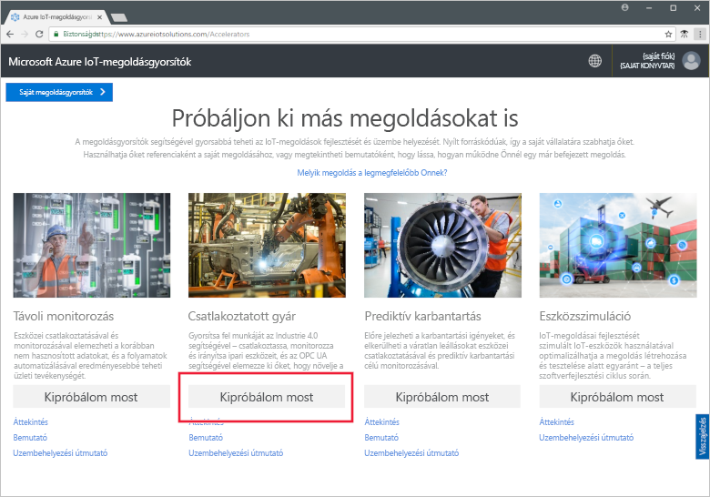

A **Create Connected Factory solution** (Csatlakoztatottgyár-megoldás létrehozása) oldalon adjon meg egy egyedi **Megoldásnevet** a csatlakoztatott gyár megoldásgyorsítójához. Ez a név az Azure-erőforráscsoport neve, amely tartalmazza a megoldásgyorsító összes erőforrását. Ez a rövid útmutató a **MyDemoConnectedFactory** nevet használja.

Válassza ki a megoldásgyorsító üzembe helyezéséhez használni kívánt **Előfizetést** és **Régiót**. Általában az Önhöz legközelebbi régiót érdemes választani. Ebben a rövid útmutatóban a **Visual Studio Enterprise** és az **USA keleti régiója** értékeket választjuk. Mindehhez [globális rendszergazdának vagy felhasználónak](iot-accelerators-permissions.md) kell lennie az előfizetésben.

Kattintson a **létrehozás** üzembe helyezés megkezdéséhez. A folyamat legalább öt percig tart:

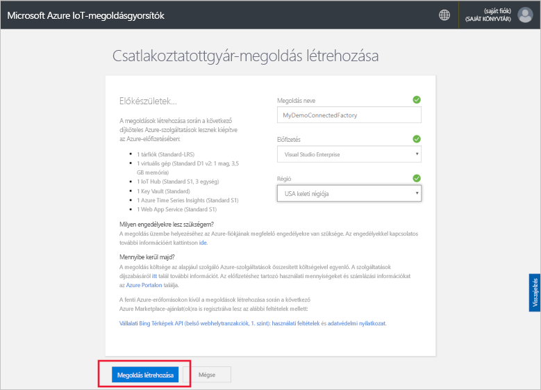

## Bejelentkezés a megoldásba

Ha az üzembe helyezés befejeződött az Azure-előfizetésen, a megoldás csempéjén egy zöld pipa és a **Kész** felirat jelenik meg. Ezután bejelentkezhet a csatlakoztatott gyár megoldásgyorsítójának irányítópultjába.

A **Kiépített megoldások** lapon kattintson az új Csatlakoztatott gyár megoldásgyorsítóra:

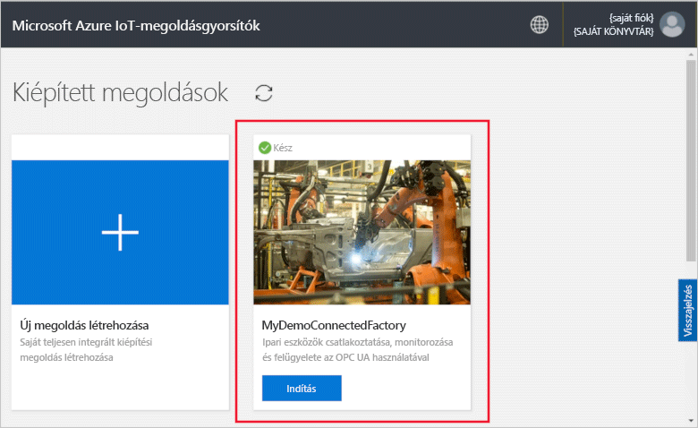

Az Okosgyár-megoldásgyorsító az oldal jelenik meg a vonatkozó információkat is megtekintheti. Válasszon **nyissa meg a megoldásgyorsító** az Okosgyár-megoldásgyorsító megtekintése:

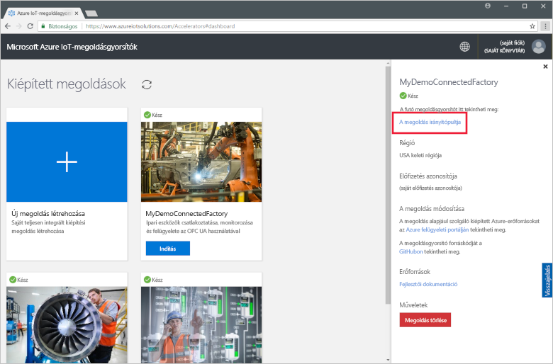

Kattintson az **Elfogadás** gombra az engedélykérések elfogadásához. Ekkor a böngészőben megjelenik a Csatlakoztatott gyár megoldásgyorsítójának irányítópultja. Több szimulált gyárat, gyártósort és állomást láthat.

## Az irányítópult megtekintése

Az alapértelmezett nézet az *irányítópult*. A portál más területeire az oldal bal oldali menüjével navigálhat:

Az ipari IoT-eszközöket az irányítópulton keresztül kezelheti. A csatlakoztatott gyár hierarchiaként mutatja be a globális gyárkonfigurációt. A hierarchia legfelső szintjén található az egy vagy több gyárat tartalmazó vállalat. Minden gyár tartalmaz gyártósorokat, az egyes gyártósorok pedig állomásokból állnak. Minden szinten megtekintheti az OEE-ket és KPI-ket, új csomópontokat tehet közzé a telemetriához, és válaszolhat a riasztásokra.

Az irányítópulton a következőket tekintheti meg:

## A teljes eszközhatékonyság

A **Teljes eszközhatékonyság** panel a teljes vállalat vagy a megtekintett gyár/gyártósor/állomás OEE-értékeit jeleníti meg. Az érték az állomásnézettől a vállalati szintig összesítve van. Az OEE értéke és annak összetevői részletesebben is elemezhetők.

[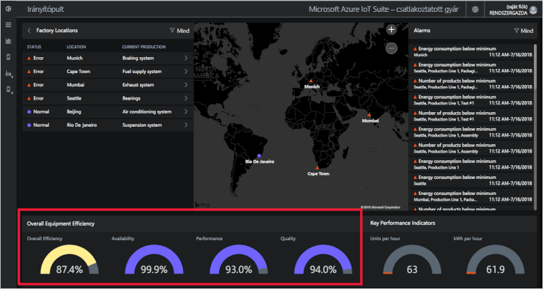](./media/quickstart-connected-factory-deploy/oee-expanded.png#lightbox)

Az OEE a gyártási folyamat hatékonyságát osztályozza a gyártáshoz kapcsolódó működési paraméterek alapján. OEE egy iparági szabvány mérőszám szorzata a rendelkezésre állás, teljesítmény és minőség besorolásainak: OEE = rendelkezésre állás x teljesítmény x minőség.

A hierarchiaadatok bármely szintjén részletesebben elemezheti az OEE-t. Kattintson az OEE, a rendelkezésre állás, a teljesítmény vagy a minőség százalékos értékének tárcsájára. Megjelenik egy helyi panel, amely vizualizációkat jelenít meg az adatokról különböző időskálákon:

[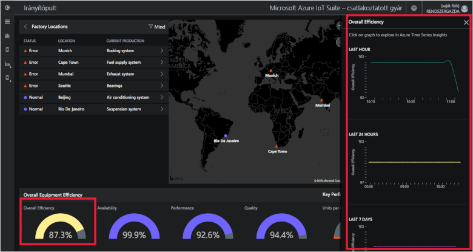](./media/quickstart-connected-factory-deploy/oeedetail-expanded.png#lightbox)

A diagramokra kattintva megtekintheti az adatok részletes elemzését.

### Fő teljesítménymutatók

A **Fő teljesítménymutatók** panel a teljes vállalat vagy a megtekintett gyár/gyártósor/állomás által óránként előállított egységeket és felhasznált energiát (kWh) mutatja. Az értékek az állomásnézettől a vállalati szintig összesítve vannak.

[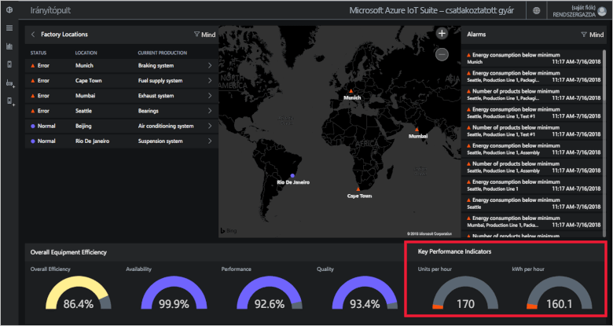](./media/quickstart-connected-factory-deploy/kpis-expanded.png#lightbox)

A hierarchiaadatok bármely szintjén részletesebben elemezheti a KPI-ket. Kattintson az OEE, a rendelkezésre állás, a teljesítmény vagy a minőség százalékos értékének tárcsájára. Megjelenik egy helyi panel, amely vizualizációkat jelenít meg az adatokról különböző időskálákon:

[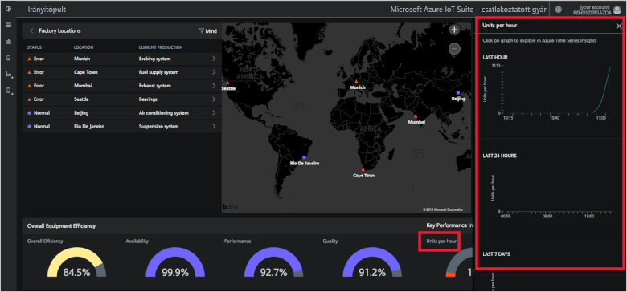](./media/quickstart-connected-factory-deploy/kpidetail-expanded.png#lightbox)

A diagramokra kattintva megtekintheti az adatok részletes elemzését.

### Gyári telephelyek

A **Gyári telephelyek** panelt, amelyen ellenőrizhető a megoldás állapota, helye és aktuális termelési konfigurációja. A megoldásgyorsító első futtatásakor az irányítópulton a szimulált gyárak láthatók. Minden gyártósor-szimuláció három valós OPC UA-kiszolgálót tartalmaz, amelyek szimulált feladatokat futtatnak és adatokat osztanak meg. Az OPC UA architektúráról a [Csatlakoztatott gyár – GYIK](iot-accelerators-faq-cf.md) fejezetben talál további információt:

A megoldáshierarchiában navigálva az egyes szinteken megtekintheti az OEE-értékeket és KPI-ket:

1. A **Gyári telephelyek** panelen kattintson a **Mumbai** elemre. Megjelennek a helyszín gyártósorai.

1. Kattintson a **Production Line 1** (1. gyártósor) elemre. Megjelennek a gyártósor állomásai.

1. Kattintson a **Packaging** (Csomagolás) elemre. Megjelennek az állomáson közzétett OPC UA-csomópontok.

1. Kattintson az **EnergyConsumption** (Energiafogyasztás) elemre. Több diagram jelenik meg, amelyek különböző időskálákra vetítve ábrázolják az értékeket. A diagramokra kattintva megtekintheti az adatok részletes elemzését.

[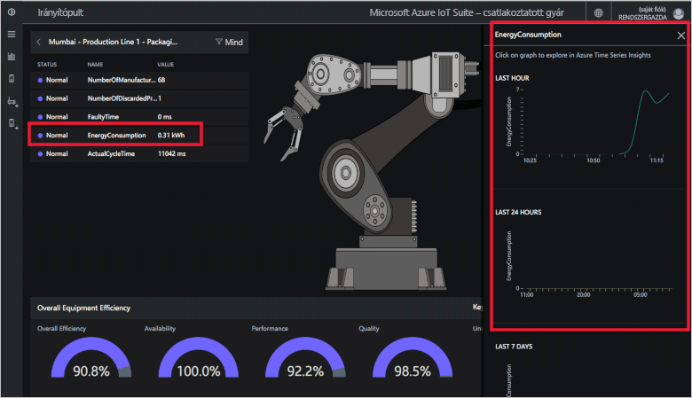](./media/quickstart-connected-factory-deploy/explorelocations-expanded.png#lightbox)

### Térkép

Ha előfizetésével hozzá tud férni a [Bing Térképek API](iot-accelerators-faq-cf.md)-hoz, a *Factories* (Gyárak) térkép a megoldás részét képező összes üzem földrajzi helyét és állapotát megjeleníti. Az adott hely részleteit a térképen megjelenített helyekre kattintva tárhatja fel.

[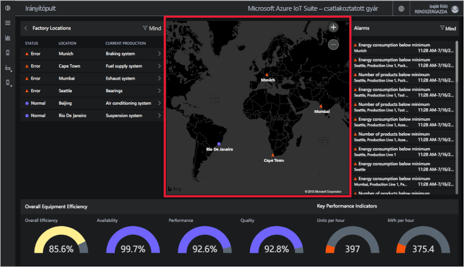](./media/quickstart-connected-factory-deploy/map-expanded.png#lightbox)

### Riasztások

A **Riasztások** panel olyan riasztásokat jelenít meg, amelyek arra figyelmeztetnek, ha egy jelentett érték vagy egy kiszámított OEE/KPI meghalad egy küszöbértéket. A panel a hierarchia összes szintjére vonatkozó riasztásokat megjeleníti, az állomásszinttől egészen a vállalati szintig. Az összes riasztás tartalmazza a riasztás leírását, dátumát, időpontját, helyszínét és az előfordulásainak számát:

[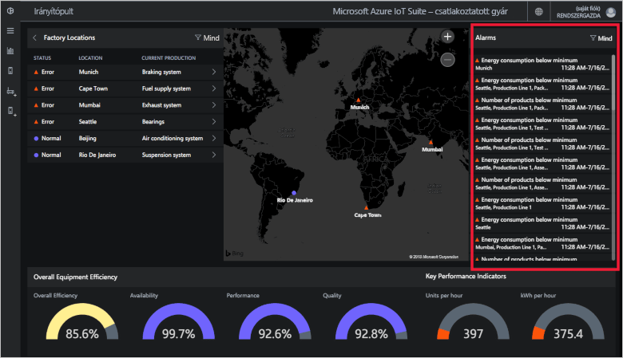](./media/quickstart-connected-factory-deploy/alarms-expanded.png#lightbox)

Az irányítópulton elemezheti a riasztást kiváltó adatokat. Ha Ön rendszergazda, a riasztásokon a következő alapértelmezett műveleteket hajthatja végre:

* Lezárhatja a riasztást.
* Nyugtázhatja a riasztást.

Kattintson az egyik riasztásra, majd a **Művelet kiválasztása** legördülő listából válassza a **Riasztás nyugtázása** lehetőséget, majd kattintson az **Alkalmaz** gombra:

[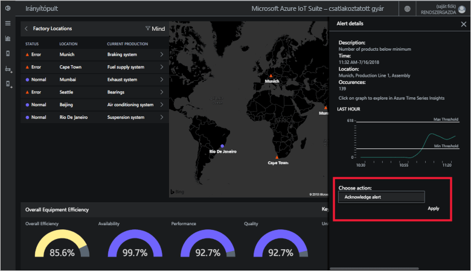](./media/quickstart-connected-factory-deploy/acknowledge-expanded.png#lightbox)

A riasztás adatainak további elemzéséhez kattintson a diagramra a riasztások panelén.

Ezek a riasztások a megoldásgyorsító egy konfigurációs fájljában megadott szabályok alapján jönnek létre. Ezek a szabályok riasztásokat hoznak létre, ha az OEE- vagy KPI-értékek, vagy az OPC UA-csomópont értékei meghaladnak egy küszöbértéket. Beállíthatja ezt a küszöbértéket.

## Az erőforrások eltávolítása

Ha tovább szeretne ismerkedni az eszközzel, hagyja üzembe helyezve a Csatlakoztatott gyár megoldásgyorsítóját.

Ha már nincs szüksége a megoldásgyorsítóra, törölje a [Kiépített megoldások](https://www.azureiotsolutions.com/Accelerators#dashboard) lapról. Ehhez jelölje ki, majd kattintson a **Megoldás törlése** gombra:

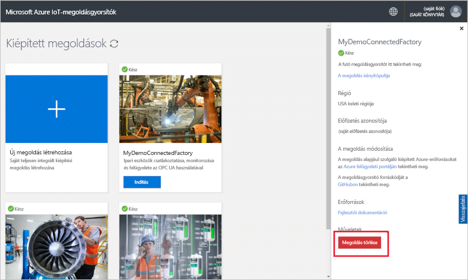

## További lépések

Ebben a rövid útmutatóban üzembe helyezett egy megoldásgyorsítót a csatlakoztatott gyárhoz, és megtudta, hogyan navigálhat a gyárak, a gyártósorok és az állomások között. Azt is láthatta, hogyan tekintheti meg az OEE- és KPI-értékeket a hierarchiában, és hogyan reagálhat a riasztásokra.

A következő útmutató azt mutatja be, hogyan kezelheti ipari IoT-eszközeit az irányítópult további funkciói segítségével:

> [!div class="nextstepaction"]
> [A csatlakoztatott gyár irányítópultjának használata](iot-accelerators-connected-factory-dashboard.md)