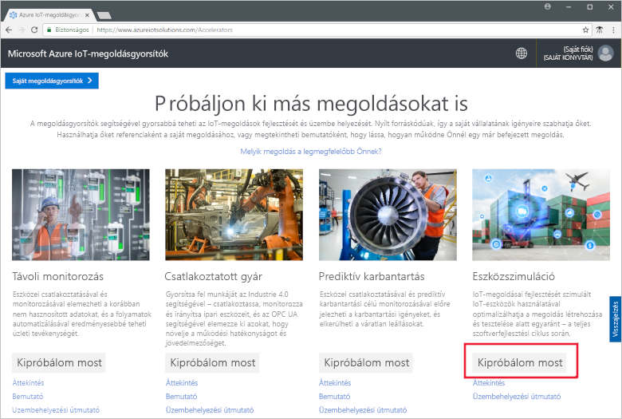
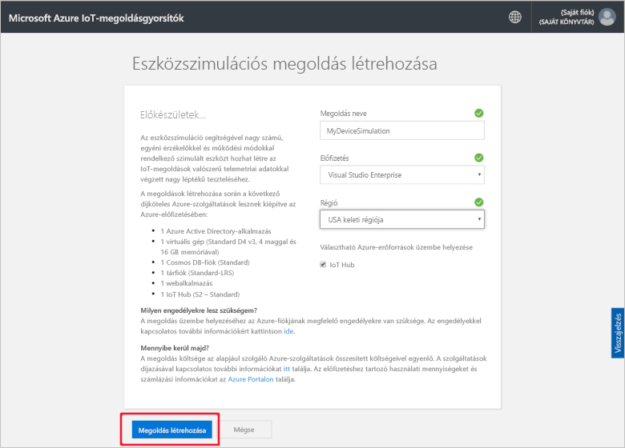
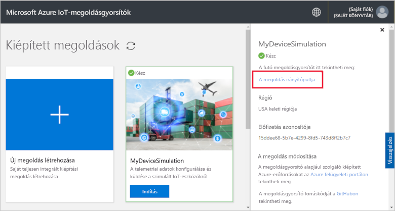
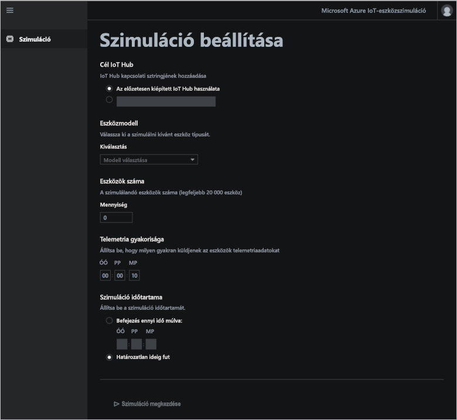
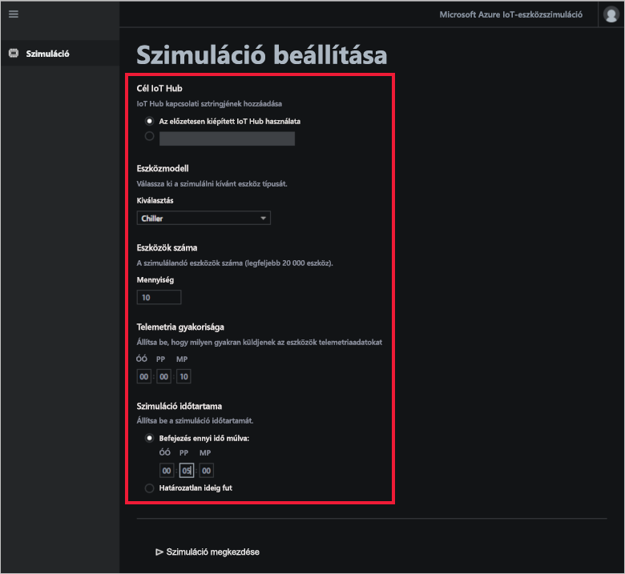
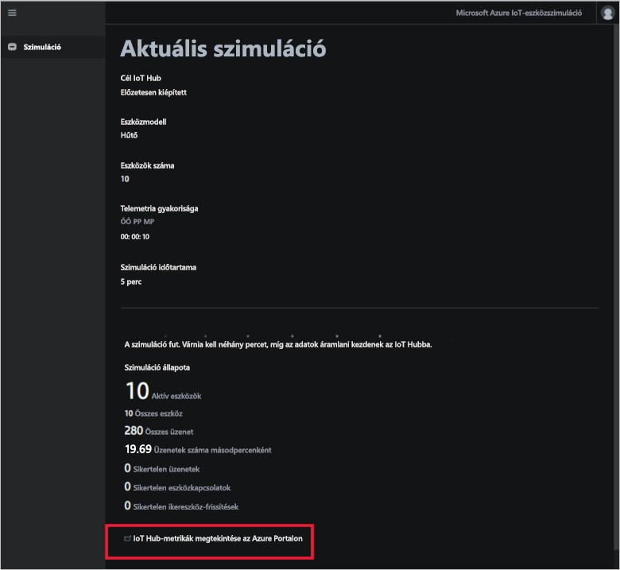
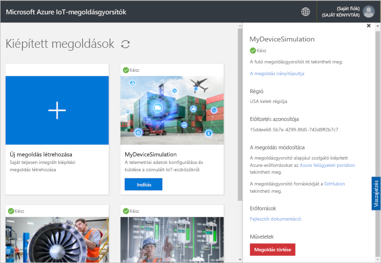

# Rövid útmutató: Felhőalapú eszközszimulációs megoldás üzembe helyezése és futtatása

Ez a rövid útmutató bemutatja hogyan helyezheti üzembe az Azure IoT eszközszimulációs megoldásgyorsítót az IoT-megoldás teszteléséhez. A megoldásgyorsító telepítését követően a **Szimuláció** lapon hozhat létre és futtathat szimulációkat.

A rövid útmutató elvégzéséhez szüksége lesz egy Azure-előfizetésre.

Ha nem rendelkezik Azure-előfizetéssel, mindössze néhány perc alatt létrehozhat egy [ingyenes fiókot](https://azure.microsoft.com/free/?WT.mc_id=A261C142F) a virtuális gép létrehozásának megkezdése előtt.

## A megoldás üzembe helyezése

Amikor üzembe helyezi a megoldásgyorsítót az Azure-előfizetéshez, néhány konfigurációs beállítást meg kell adnia.

Jelentkezzen be az [azureiotsolutions.com](https://www.azureiotsolutions.com/Accelerators) webhelyen az Azure-fiók hitelesítő adataival.

Kattintson a **Kipróbálom most** elemre az **Eszközszimuláció** csempén.

Az **Eszközszimulációs megoldás létrehozása** oldalon adjon meg egy egyedi **Megoldásnevet**. Jegyezze fel a megoldás nevét, mivel ez annak az Azure-erőforráscsoportnak is a neve, amely a megoldás összes erőforrását tartalmazza.

Válassza ki a megoldásgyorsító üzembe helyezéséhez használni kívánt **Előfizetést** és **Régiót**. Általában az Önhöz legközelebbi régiót érdemes választani. Mindehhez [globális rendszergazdának vagy felhasználónak](iot-accelerators-permissions.md) kell lennie az előfizetésben.

Az Eszközszimulációs megoldással együtt használandó IoT Hub üzembe helyezéséhez jelölje be a jelölőnégyzetet. Később bármikor módosíthatja a szimulációja által használt IoT Hubot.

Kattintson a **Megoldás létrehozása** gombra a megoldás kiépítésének elkezdéséhez. A folyamat legalább öt percig tart:

## Bejelentkezés a megoldásba

Ha a kiépítési folyamat befejeződött, bejelentkezhet az Eszközszimulációs megoldásgyorsító irányítópultjára.

A **Kiépített megoldások** lapon kattintson az új Eszközszimulációs megoldásgyorsítóra:

A megjelenő panelen megtekintheti az Eszközszimulációs megoldásgyorsítóra vonatkozó adatokat. Válassza ki a **Megoldások irányítópultja** elemet az Eszközszimulációs megoldásgyorsító megjelenítéséhez:

Kattintson az **Elfogadás** gombra az engedélykérések elfogadásához. Ekkor a böngészőben megjelenik az Eszközszimulációs megoldásgyorsító irányítópultja:

## A szimuláció konfigurálása

Az irányítópultról konfigurálhatja és futtathatja a szimulációt. A szimuláció konfigurálásához használja a következő táblázatban található értékeket:

| Beállítás             | Érték                       |
| ------------------- | --------------------------- |
| Cél IoT Hub      | Használja az előzetesen kiépített IoT Hub-ot |
| Eszközmodell        | Hűtő                     |
| Eszközök száma   | 10                          |
| Telemetria gyakorisága | 10 másodperc                  |
| Szimuláció időtartama | 5 perc                   |

## A szimuláció futtatása

Kattintson a **Szimuláció megkezdése** gombra. A szimuláció az Ön által megadott ideig fut. A **Szimuláció leállítása** gombra kattintva bármikor leállíthatja a szimulációt. A szimuláció az éppen aktuális futtatás statisztikáit jeleníti meg. Kattintson az **IoT Hub-mérőszámok megtekintése az Azure Portalon** lehetőségre az IoT Hub által jelentett mérőszámok megtekintéséhez:

A megoldásgyorsító egy kiépített példányából egyszerre csak egy szimulációt futtathat.

## Az erőforrások eltávolítása

Ha tovább szeretne ismerkedni az eszközzel, hagyja üzembe helyezve az Eszközszimulációs megoldásgyorsítót.

Ha már nincs szüksége a megoldásgyorsítóra, törölje a [Kiépített megoldások](https://www.azureiotsolutions.com/Accelerators#dashboard) lapról. Ehhez jelölje ki, majd kattintson a **Megoldás törlése** gombra:

## További lépések

Ebben a rövid útmutatóban telepítette az Eszközszimulációs megoldásgyorsítót, és futtatott egy IoT-eszközszimulációt.

A meglévő IoT Hub-központok szimulációkban való használatáról további információt a következő használati útmutatóban talál:

> [!div class="nextstepaction"]
> [Meglévő IoT Hub használata az Eszközszimulációs megoldásgyorsítóval](iot-accelerators-device-simulation-choose-hub.md)
