# Rövid útmutató: Távoli felhőalapú monitorozási megoldás kipróbálása

Ez a rövid útmutató bemutatja az Azure IoT távoli monitorozási megoldásgyorsító üzembe helyezését. Ebben a felhőalapú megoldásban a **Dashboard** (Irányítópult) lap segítségével jelenítheti meg a szimulált eszközöket egy térképen, és a **Maintenance** (Karbantartás) lapon válaszolhat a szimulált hűtőeszköz nyomással kapcsolatos riasztásaira. A megoldásgyorsítót saját megvalósítása kiindulópontjaként vagy képzési eszközként is használhatja.

A kezdeti üzembe helyezés a Contoso nevű vállalat számára konfigurálja a megoldásgyorsítót. A Contoso operátoraként különféle fizikai környezetekben található, különböző típusú eszközöket (például hűtőeszközöket) felügyel. A hűtőeszköz a hőmérsékletre, a páratartalomra és a nyomásra vonatkozó telemetriai adatokat küld a távoli monitorozási megoldásgyorsítónak.

Ez a rövid útmutató üzembe helyezi a megoldás-gyorsító **alapszintű** verzióját tesztelési és demonstrációs célokra, ami lecsökkenti a költségeket. További információ az üzembe helyezhető különböző verziókról: [alapszintű és standard központi telepítések](iot-accelerators-remote-monitoring-deploy-cli.md#basic-and-standard-deployments).

A rövid útmutató elvégzéséhez szüksége lesz egy Azure-előfizetésre.

Ha nem rendelkezik Azure-előfizetéssel, hozzon létre egy [ingyenes fiókot](https://azure.microsoft.com/free/?WT.mc_id=A261C142F), mielőtt hozzákezd.

## A megoldás üzembe helyezése

Amikor üzembe helyezi a megoldásgyorsítót az Azure-előfizetéshez, néhány konfigurációs beállítást meg kell adnia.

Jelentkezzen be az [azureiotsolutions.com](https://www.azureiotsolutions.com/Accelerators) webhelyen az Azure-fiók hitelesítő adataival.

Kattintson a **távoli figyelés** csempére. A **távoli figyelés** lapon kattintson a **kipróbálás most**lehetőségre:

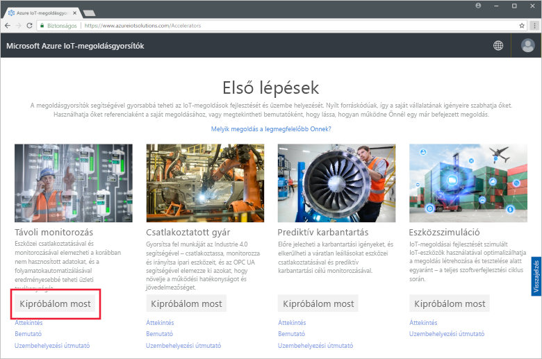

Válassza a **C#-szolgáltatások** lehetőséget a **telepítési lehetőségek**közül. A Java és a C# implementáció ugyanazokkal a szolgáltatásokkal rendelkezik.

Adjon meg egy egyedi **megoldásnevet** a távoli monitorozási megoldásgyorsítóhoz. Ebben a rövid útmutatóban a mi **contoso-RM-** t hívjuk.

Válassza ki a megoldásgyorsító üzembe helyezéséhez használni kívánt **Előfizetést** és **Régiót**. Általában az Önhöz legközelebbi régiót érdemes választani. Ebben a rövid útmutatóban az **USA keleti**régióját fogjuk használni.
A **Visual Studio Enterprise**lehetőség közül választhat, de [globális rendszergazdának vagy felhasználónak](iot-accelerators-permissions.md) kell lennie.

A telepítés megkezdéséhez kattintson a **Létrehozás**gombra. A folyamat legalább öt percig tart:

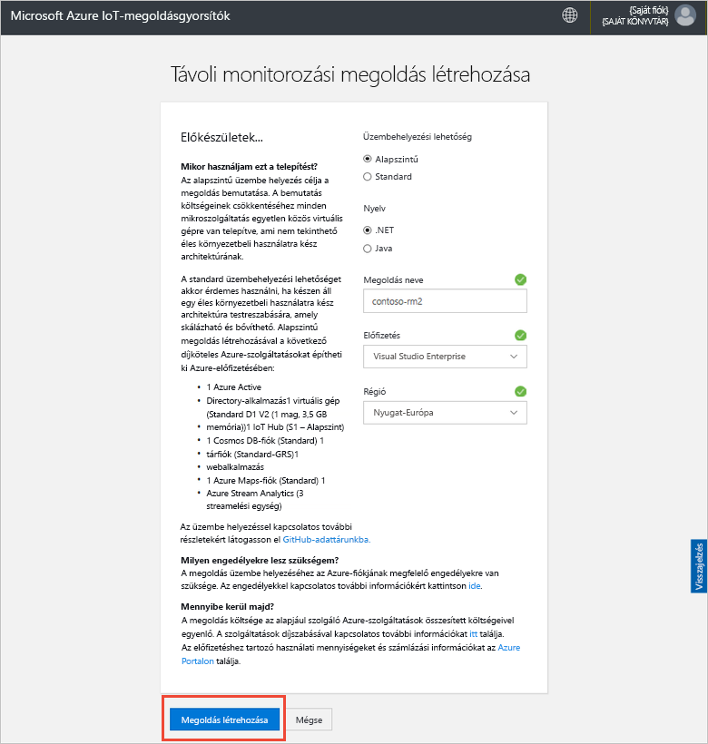

## Bejelentkezés a megoldásba

Ha az üzembe helyezés befejeződött az Azure-előfizetésen, a megoldás csempéjén egy zöld pipa és a **Kész** felirat jelenik meg. Ezután bejelentkezhet a távoli monitorozási megoldásgyorsító irányítópultjába.

A **Kiépített megoldások** lapon kattintson az új távoli monitorozási megoldásgyorsítóra:

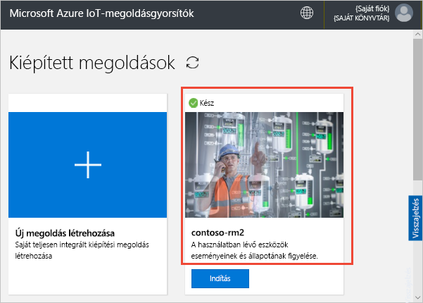

A megjelenő panelen megtekintheti a távoli monitorozási megoldásgyorsítóra vonatkozó információkat. A távoli figyelési megoldás gyorssegédének megtekintéséhez válassza **az Ugrás a megoldás-gyorsító** számára lehetőséget:

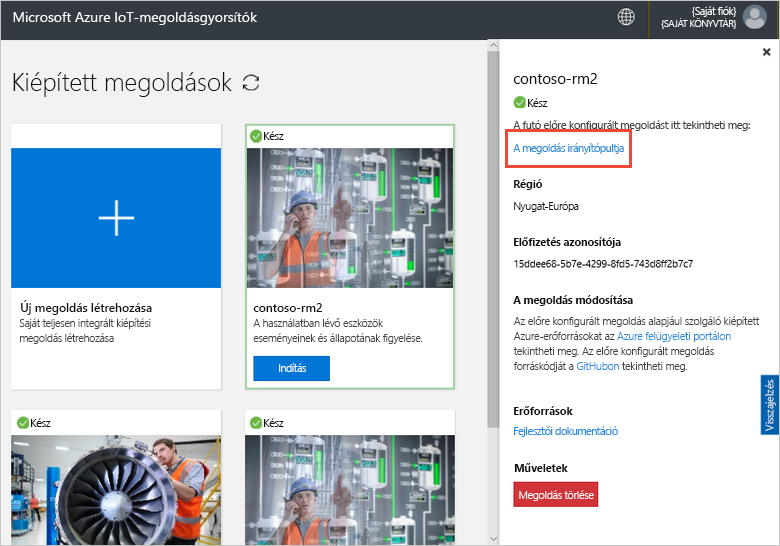

Kattintson az **Elfogadás** gombra az engedélykérések elfogadásához. Ekkor a böngészőben megjelenik a távoli monitorozási megoldásgyorsító irányítópultja:

[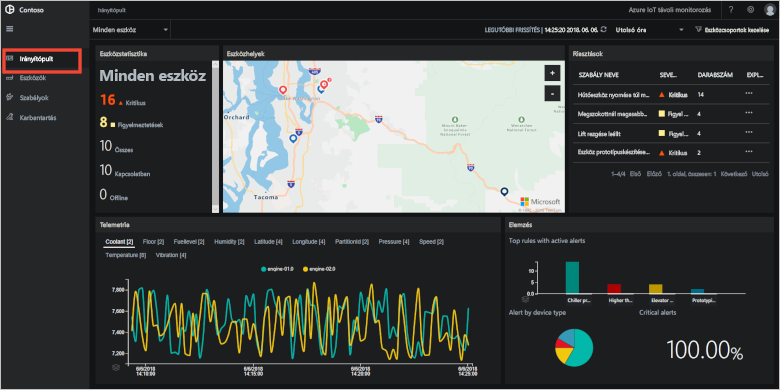](./media/quickstart-remote-monitoring-deploy/solutiondashboard-expanded.png#lightbox)

## Eszközök megtekintése

A megoldás irányítópultja a következő információkat jeleníti meg a Contoso szimulált eszközeiről:

* Az **Eszközstatisztika** panel a riasztások összegző információit és az eszközök teljes számát jeleníti meg. Az alapértelmezett üzemelő példányban a Contoso 10, különböző típusú szimulált eszközzel rendelkezik.

* Az **Eszközhelyek** panel az eszközök fizikai helyét jeleníti meg. A gombostű színe jelzi, ha egy eszköz riasztást váltott ki.

* A **Riasztások** panel az eszközöktől érkező riasztások részleteit tartalmazza.

* A **Telemetria** panel az eszközök telemetriai adatait jeleníti meg. A különböző telemetriastreameket a fent található telemetriatípusokra kattintva tekintheti meg.

* Az **Elemzések** panel az eszközöktől érkező riasztásokra vonatkozó egyesített információkat tartalmaz.

## Válasz egy riasztásra

A Contoso operátoraként a megoldás irányítópultjáról monitorozhatja az eszközöket. Az **eszközök statisztikáinak** panelje azt mutatja, hogy volt néhány kritikus riasztás, a **riasztások** panelje pedig azt, hogy ezek nagy része egy hűtőeszköztől érkezett. A Contoso hűtőeszközei esetében a 250 PSI-t meghaladó belső nyomás azt jelzi, hogy az eszköz nem működik megfelelően.

### A probléma azonosítása

Az **irányítópult****Alerts** (Riasztások) paneljén a **Chiller pressure too high** (Hűtőeszköz nyomása túl magas) riasztás látható. A hűtő piros színű gombostűvel van jelölve a térképen (lehetséges, hogy pásztáznia és nagyítania kell a megjelenítéséhez):

[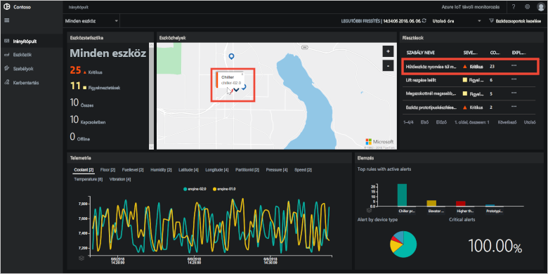](./media/quickstart-remote-monitoring-deploy/dashboardalarm-expanded.png#lightbox)

A **riasztások** paneljén kattintson a **Chiller pressure too high** (Hűtőeszköz nyomása túl magas) szabály mellett található **vizsgálati** oszlop **...** gombjára. Ezzel továbblép a **karbantartási** lapra, ahol megtekintheti a riasztást kiváltó szabály részleteit.

A **Chiller pressure too high** (Hűtőeszköz nyomása túl magas) karbantartási lap megjeleníti a riasztást kiváltó szabály részleteit. A lap azt is megjeleníti, hogy mikor aktiválódtak a riasztások, és melyik eszköz váltotta ki őket:

[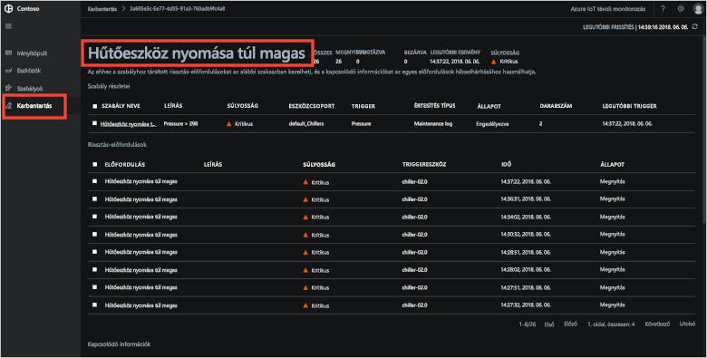](./media/quickstart-remote-monitoring-deploy/maintenancealarmlist-expanded.png#lightbox)

Ezzel sikeresen azonosította a riasztást kiváltó problémát és az érintett eszközt. Operátorként a következő lépés a riasztás nyugtázása és a hiba kijavítása.

### A probléma megoldása

Ha jelezni szeretné más operátorok felé, hogy már foglalkozik a riasztással, válassza ki, és módosítsa az **Alert status** (Riasztási állapot) értékét **Acknowledged** (Nyugtázva) állapotra:

[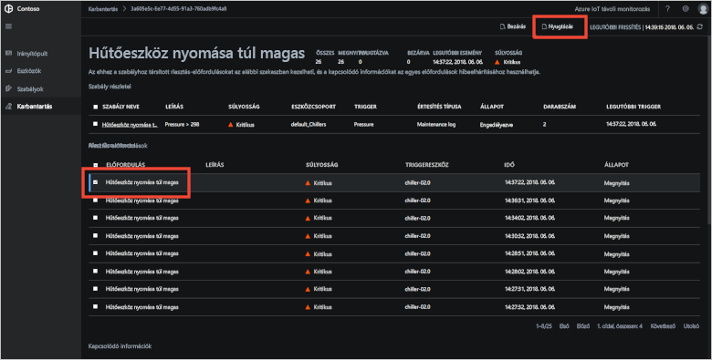](./media/quickstart-remote-monitoring-deploy/maintenanceacknowledge-expanded.png#lightbox)

Az állapotoszlop **Acknowledged** (Nyugtázva) értékre módosul.

Ha műveletet szeretne végrehajtani a hűtőeszközön, görgessen le a **Related information** (Kapcsolódó információk) menüponthoz, válassza ki a hűtőeszközt a **riasztott eszközök** listájából, majd válassza a **Jobs** (Feladatok) lehetőséget:

[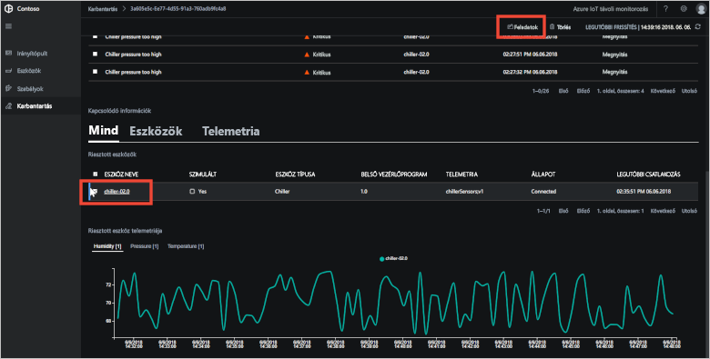](./media/quickstart-remote-monitoring-deploy/maintenanceschedule-expanded.png#lightbox)

A **feladatok** paneljén válassza a **Run method** (Metódus futtatása) elemet, majd az **EmergencyValveRelease** metódust. Adja hozzá a **ChillerPressureRelease** feladatnevet, és kattintson az **Apply** (Alkalmaz) elemre. Ezek a beállítások egy olyan feladatot hoznak létre, amelyet a rendszer azonnal végrehajt.

A feladat állapotának megtekintéséhez lépjen vissza a **karbantartási** lapra, és a **feladatok** nézetében tekintse meg a feladatok listáját. Előfordulhat, hogy néhány másodpercig várnia kell, amíg meg nem jelenik a feladatok futtatása:

[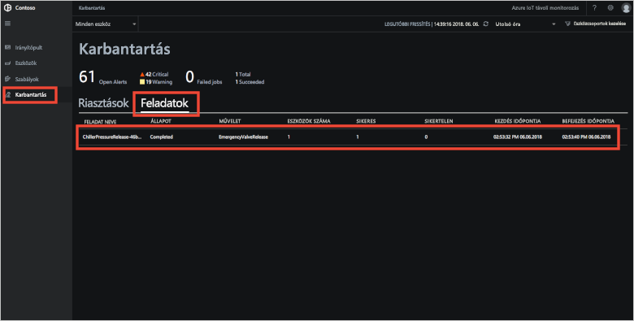](./media/quickstart-remote-monitoring-deploy/maintenancerunningjob-expanded.png#lightbox)

### A határértéken belüli nyomásérték ellenőrzése

A hűtő nyomástelemetriájának megtekintéséhez lépjen az **irányítópultra**, válassza ki a **Pressure** (Nyomás) telemetriapanelt, és ellenőrizze, hogy a **chiller-02.0** nyomása visszatért-e az engedélyezett tartományba:

[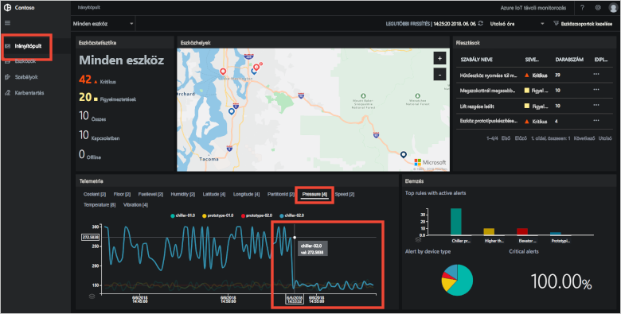](./media/quickstart-remote-monitoring-deploy/pressurenormal-expanded.png#lightbox)

Az incidens lezárásához lépjen a **karbantartási** lapra, válassza ki a riasztást, és állítsa **Closed** (Lezárva) értékre:

[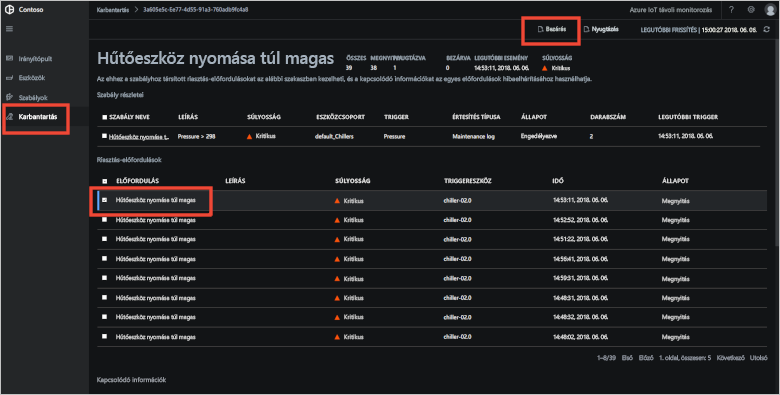](./media/quickstart-remote-monitoring-deploy/maintenanceclose-expanded.png#lightbox)

Az állapotoszlop **Closed** (Lezárva) értékre módosul.

## Az erőforrások eltávolítása

Ha tovább kíván lépni a további oktatóanyagokra, ne kapcsolja ki a távoli monitorozási megoldásgyorsítót.

Ha már nincs szüksége a megoldásgyorsítóra, törölje a [Kiépített megoldások](https://www.azureiotsolutions.com/Accelerators#dashboard) lapról. Ehhez jelölje ki, majd kattintson a **Megoldás törlése** gombra:

## További lépések

Ebben a rövid útmutatóban üzembe helyezte a távoli monitorozási megoldásgyorsítót, és elvégzett egy monitorozási feladatot az alapértelmezett Contoso üzemelő példányban szereplő szimulált eszközökön.

Ha többet szeretne megtudni a szimulált eszközöket használó megoldásgyorsítóról, lépjen tovább a következő oktatóanyagra.

> [!div class="nextstepaction"]
> [Oktatóanyag: IoT-eszközök monitorozása](iot-accelerators-remote-monitoring-monitor.md)