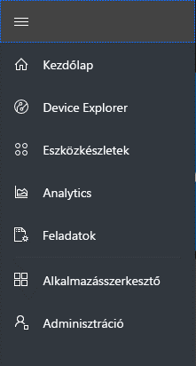
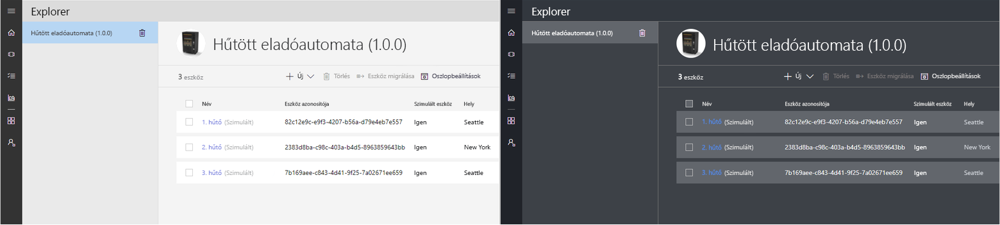
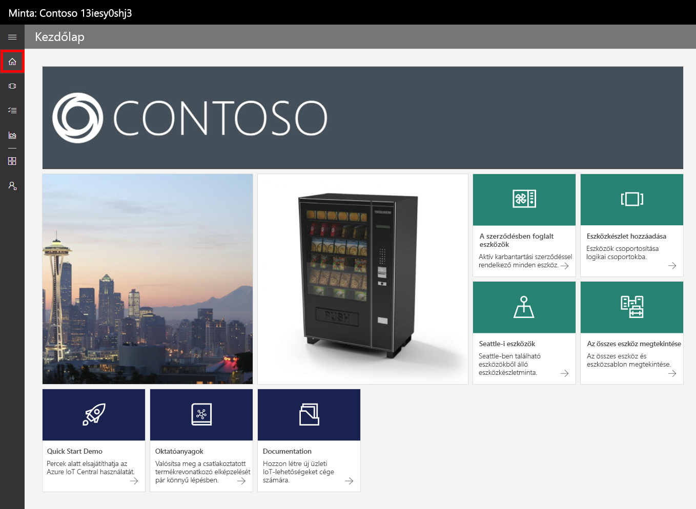
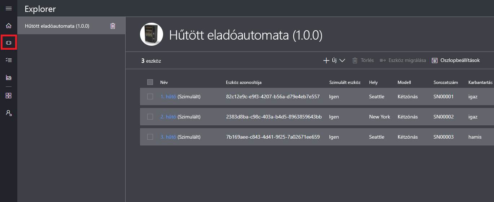
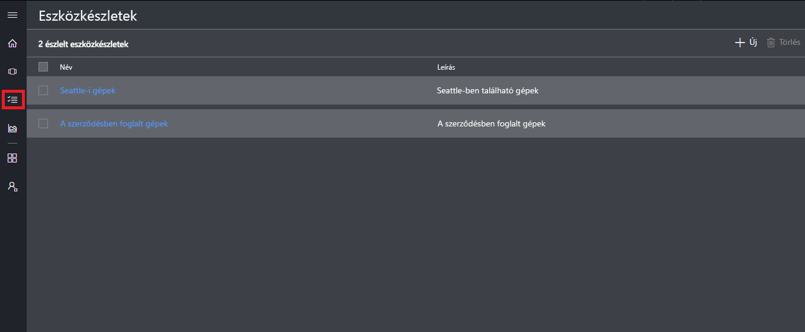
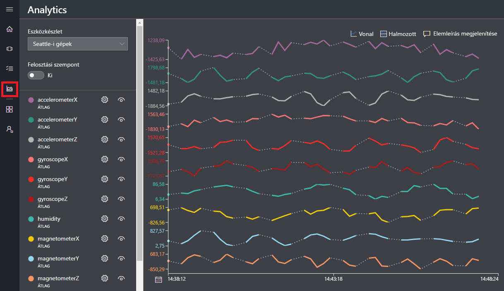
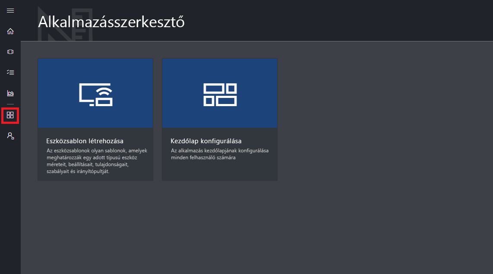
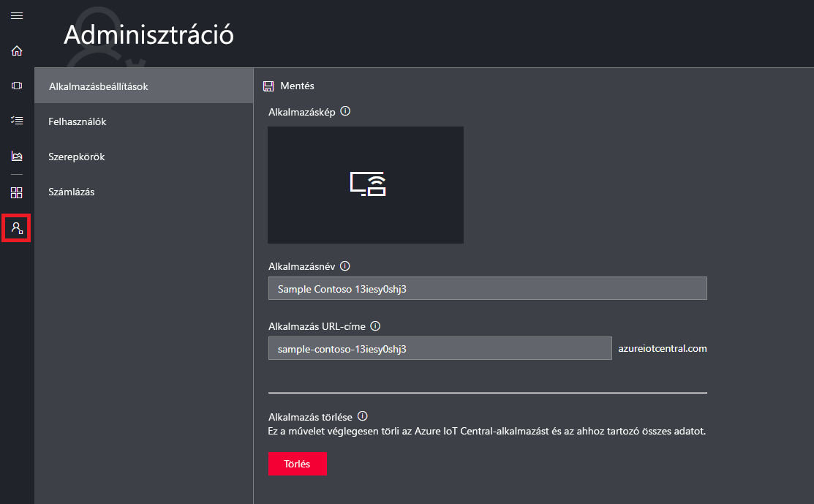

# Ismerkedés az Azure IoT Central kezelőfelületével

Ez a cikk a Microsoft Azure IoT Central kezelőfelületét mutatja be. A kezelőfelületet használhatja Azure IoT Central-megoldások és az azokhoz csatlakozó eszközök létrehozásához, felügyeletéhez és használatához.

A _szerkesztők_ az Azure IoT Central kezelőfelületén határozhatják meg az Azure IoT Central-megoldásokat. A kezelőfelületen a következő műveletek végezhetők el:

- A megoldáshoz csatlakozó eszközök típusainak meghatározása.
- Az eszközökre vonatkozó szabályok és műveletek konfigurálása.
- A felhasználói felület testreszabása a megoldást használó _operátorok_ számára.

Az _operátorok_ az Azure IoT Central kezelőfelületén felügyelhetik az Azure IoT Central-megoldást. A kezelőfelületen a következő műveletek végezhetők el:

- Eszközök monitorozása.
- Eszközök konfigurálása.
- Az eszközök hibáinak keresése és elhárítása.
- Új eszközök kiépítése.

## A bal oldali navigációs menü használata

A bal oldali navigációs menüből érhetők el az alkalmazás különböző területei:

| Menü | Leírás |
| ---- | ----------- |
|  | <ul><li>A **Kezdőlap** gomb megjeleníti az alkalmazás kezdőlapját. A szerkesztők testreszabhatják a kezdőlapot az operátorok számára.</li><li>Az **Eszközkereső** gomb felsorolja az alkalmazásban meghatározott eszközsablonokat, valamint az egyes eszközsablonokhoz tartozó valós eszközöket. Az operátorok az **Eszközkereső** használatával kezelhetik a csatlakoztatott eszközöket.</li><li>Az **Eszközkészletek** gomb lehetővé teszi eszközkészletek megtekintését és létrehozását. Az operátorok létrehozhatnak eszközkészleteket, amelyek a lekérdezés által megadott eszközök logikai gyűjteményei.</li><li>Az **Elemzés** gomb az eszközök és eszközkészletek telemetriáiból származó elemzéseket jelenít meg. Az operátorok létrehozhatnak egyéni nézeteket az eszközadatokhoz, így megjelenítve az alkalmazásból származó megállapításokat.</li><li>Az **Alkalmazásszerkesztő** gomb megjeleníti a szerkesztők által használt eszközöket, például az **Eszközsablon-készítő** eszközt.</li><li>Az **Adminisztráció** gomb jeleníti meg azokat az alkalmazásadminisztrációs oldalakat, ahol a rendszergazda az alkalmazás beállításait, felhasználóit és szerepköreit kezelheti.</li></ul> |

## Keresés, súgó és támogatás

Minden oldalon megjelenik a felső menü:

- Eszközsablonok és eszközök kereséséhez kattintson a **Keresés** ikonra.
- Ha segítségre és támogatásra van szüksége, kattintson a **Súgó** elemre, amely megnyitja az erőforrások legördülő listáját.
- Az oktatóanyagok vezérléséhez, a kezelőfelületi téma módosításához vagy az alkalmazásból való kijelentkezéshez kattintson a **Fiók** ikonra.

A kezelőfelületen egy világos és egy sötét téma közül választhat:

## Kezdőlap

A kezdőlap az első lap, amely megjelenik az Azure IoT Central-alkalmazásba való bejelentkezést követően. Szerkesztőként csempék hozzáadásával testreszabhatja a kezdőlapot az alkalmazás további felhasználói számára. További részletekért tekintse át [az Azure IoT Central operátori nézeteinek testreszabására](tutorial-customize-operator.md) vonatkozó oktatóanyagot.

## Eszközkereső

A Kereső oldalon jelennek meg az Azure IoT Central-alkalmazáson belüli _eszközsablonok_ és _eszközök_.

* Az eszközsablonok egy-egy olyan eszköztípust határoznak meg, amelyek csatlakozhatnak az alkalmazáshoz. További tudnivalókért lásd az [új eszköztípus az Azure IoT Central-alkalmazásokban történő definiálását](tutorial-define-device-type.md) ismertető szakaszt.
* Egy eszköz egy valós vagy szimulált eszközt jelöl az alkalmazásban. További tudnivalókért lásd az [új eszköz az Azure IoT Central-alkalmazásokban történő hozzáadását](tutorial-add-device.md) ismertető szakaszt.

## Eszközkészletek

Az _Eszközkészletek_ oldalon jelennek meg a szerkesztő által létrehozott eszközkészletek. Az eszközkészletek egymáshoz kapcsolódó eszközök gyűjteményei. A szerkesztő meghatároz egy lekérdezést, amely azonosítja azokat az eszközöket, amelyek egy eszközkészlethez tartoznak. Az eszközkészletek az alkalmazáson belüli elemzések testreszabásakor használatosak. További tudnivalókért lásd az [eszközkészletek az Azure IoT Central-alkalmazásokban történő használatát](howto-use-device-sets.md) ismertető szakaszt.

## Elemzés

Az Elemzés oldalon diagramok láthatók, amelyek segítenek áttekinteni az alkalmazáshoz csatlakozó eszközök viselkedését. Az operátorok ezen az oldalon monitorozhatják és vizsgálhatják ki a csatlakoztatott eszközökkel kapcsolatos problémákat. Az ezen az oldalon megjelenő diagramokat a szerkesztő határozza meg. További tudnivalókért lásd az [egyéni elemzések az Azure IoT Central-alkalmazásokban történő létrehozását](howto-create-analytics.md) ismertető szakaszt.

## Alkalmazásszerkesztő

Az Alkalmazásszerkesztő oldal hivatkozásokat tartalmaz azokra az eszközökre, amelyeket a szerkesztők használnak az Azure IoT Central-alkalmazások létrehozására, például az eszközsablonokhoz és a kezdőlap konfigurálásához. További tudnivalókért lásd az [új eszköztípus az Azure IoT Central-alkalmazásokban történő definiálását](tutorial-define-device-type.md) ismertető szakaszt.

## Adminisztráció

Az Adminisztráció oldal hivatkozásokat tartalmaz a rendszergazda által például az alkalmazás felhasználóinak és szerepköreinek meghatározásához használt eszközökhöz. További tudnivalókért lásd az [Azure IoT Central-alkalmazások adminisztrációját](howto-administer.md) ismertető szakaszt.

## További lépések

Most, hogy áttekintette az Azure IoT Central jellemzőit, és megismerkedett a kezelőfelület elrendezésével, a javasolt következő lépés az [Azure IoT Central-alkalmazás létrehozását](quick-deploy-iot-central.md) ismertető rövid útmutató elvégzése.