# Azure IoT Central-alkalmazás létrehozása

_Szerkesztőként_ az Azure IoT Central használatával határozza meg a Microsoft Azure IoT Central-alkalmazást. Ez a rövid útmutató a következőket mutatja be:

- _Eszközsablonmintát_ és szimulált _eszközöket_ tartalmazó Azure IoT Central-alkalmazás létrehozása.
- Az alkalmazásban a **Hűtött eladóautomata** eszközsablon jellemzőinek megtekintése.
- A szimulált **Hűtő** eszközök telemetriájának és elemzéseinek megtekintése.

Ebben a rövid útmutatóban egy szimulált **Hűtő** eszközt tekint meg egy eszközsablonból. A szimulált eszköz:

* Telemetriát, például hőmérséklet- és nyomásértéket küld az alkalmazásnak.
* Jelenti az eszköz tulajdonságértékeit az alkalmazásnak, például a mozgásriasztásokat.
* Az alkalmazásban beállítható eszközbeállításokkal (például a ventilátorsebesség szabályzása) rendelkezik.

Amikor szimulált eszközt hoz létre egy Azure IoT Central-alkalmazás egyik eszközsablonjából, a szimulált eszköz lehetővé teszi az alkalmazás tesztelését a valós eszköz csatlakoztatása előtt.

## Az alkalmazás létrehozása

A rövid útmutató elvégzéséhez létre kell hoznia egy Azure IoT Central-alkalmazást a **Sample Contoso** alkalmazássablonból.

Lépjen az Azure IoT Central [Alkalmazáskezelő](https://aka.ms/iotcentral) oldalára. Ezután írja be az Azure-előfizetés eléréséhez használt e-mail-címet és jelszót:

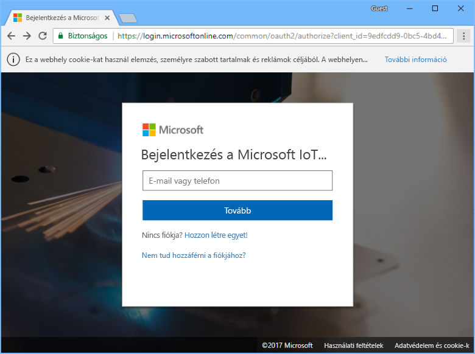

Egy új Azure IoT Central-alkalmazás létrehozásának megkezdéséhez válassza az **Új alkalmazás** lehetőséget:

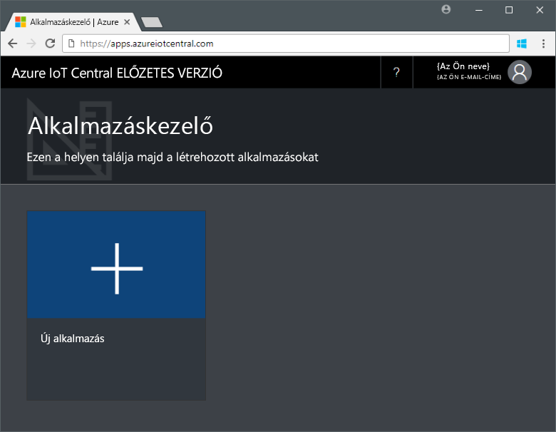

Új Azure IoT Central-alkalmazás létrehozása:

1. Válassza az **Ingyenes próbaalkalmazás** fizetési konstrukciót.
1. Válasszon egy rövid alkalmazásnevet, például a **Contoso IoT** nevet. Az Azure IoT Central létrehoz egy egyéni URL-előtagot. Ezt az URL-előtagot egy könnyebben megjegyezhető előtagra módosíthatja.
1. Válassza ki a **Sample Contoso** alkalmazássablont.
1. Ezután válassza a **Létrehozás** elemet.

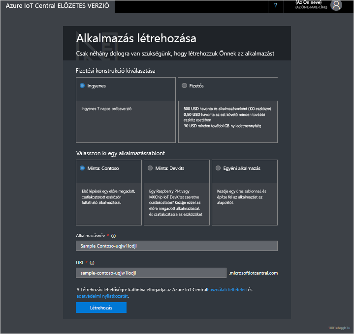

## Navigáljon az alkalmazáshoz

Ha az alkalmazás készen áll, megjelenik az alkalmazás **kezdőlapja**. A jobb felső részen lévő _Tervezési mód_ kapcsolóval szerkeszthető a kezdőlap. Az alkalmazás URL-címe az előző lépésben meghatározott URL-cím:

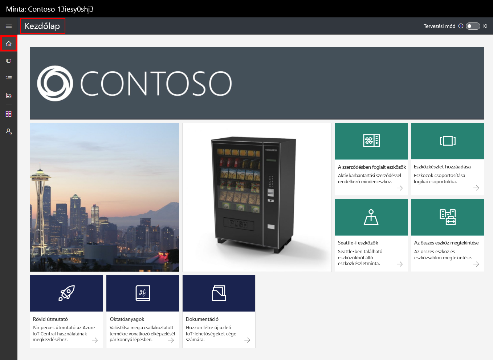

A _bal oldali navigációs menüből_ érhetők el az új Azure IoT Central-alkalmazás különböző területei:

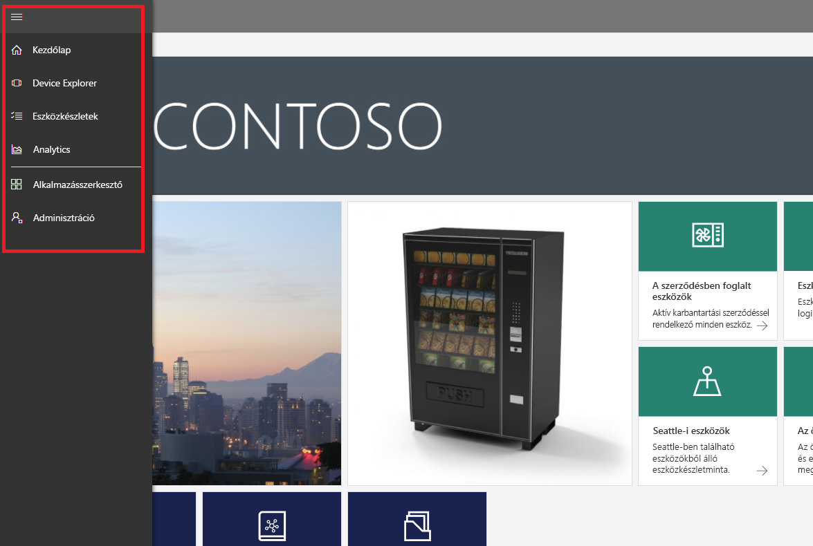

Az alkalmazásban lévő eszközsablonok és eszközök megtekintéséhez válassza a bal oldali navigációs menüben lévő **Eszközkereső** elemet. A mintaalkalmazásban szerepel a **Hűtött eladóautomata** eszközsablon. Már három szimulált eszköz létrejött ebből az eszközsablonból:

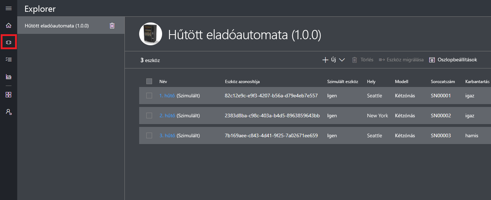

## Az eszközsablon és az eszközök megtekintése

A következő lépésekkel tekintheti meg a **Hűtött eladóautomata** eszközsablonból létrehozott hűtőeszközt. Az eszközsablonok a következőket határozzák meg:

* Az eszközről küldött _mérések_, például a hőmérséklet telemetriája.
* Az eszköz irányítását lehetővé tévő _beállítások_, például a ventilátor sebessége.
* Az eszközről információt tároló _tulajdonságok_, például a sorozatszám.
* A műveletek az eszköz viselkedésén alapuló automatizálását lehetővé tevő [szabályok](howto-create-telemetry-rules.md).
* Az eszközzel kapcsolatos információkat megjelenítő, testreszabható _irányítópult_.

Az eszközsablonokból szimulált és valós eszközöket is létrehozhat.

### Mérések

Megjelenik az **1. hűtő** **Mérések** oldala. Láthatja a szimulált eszközről küldött mérések listáját. Az oldal a látható mérések testreszabható diagramját is megjeleníti:

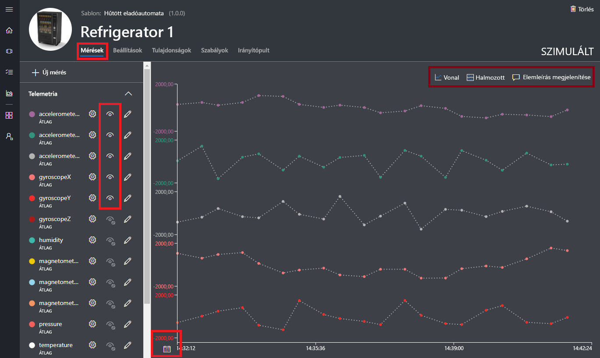

Válthat az egyes elemek megjelenítési állapota között, és testreszabhatja a diagramot. Az aktuális diagram egy szimulált eszköz telemetriáját jeleníti meg. Új méréseket adhat az eszközsablonhoz, ha rendelkezik a megfelelő engedélyekkel.

> [!NOTE]
> Előfordulhat, hogy várnia kell egy kis ideig, amíg a szimulált adatok megjelennek a diagramon.

### Beállítások

Válassza a **Beállítások** lehetőséget. A **Beállítások** lapon vezérelheti az eszközt. Frissítheti például a hűtőn a ventilátor sebességét:

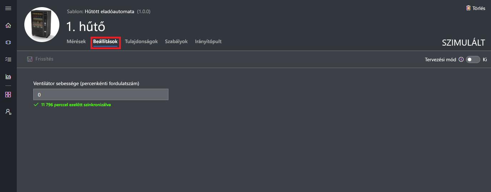

A beállítások **szinkronizálva** értékkel jelennek meg, amikor az eszköz elfogadja a módosítást.

### Tulajdonságok

Kattintson a **Tulajdonságok** elemre. A **Tulajdonságok** lapon a következőket teheti:

* Kezelheti az eszközzel kapcsolatos információkat, például az ügyfél nevét.
* Megtekintheti az eszköz által jelentett tulajdonságértékeket, például a mozgásriasztásokat.

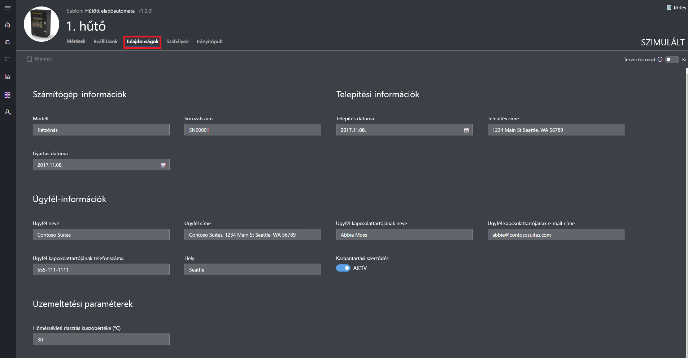

### Irányítópult

Válassza az **Irányítópult** lehetőséget. Az irányítópult az eszközzel kapcsolatos információk (például a mérések, tulajdonságok és KPI-k) testreszabható nézete:

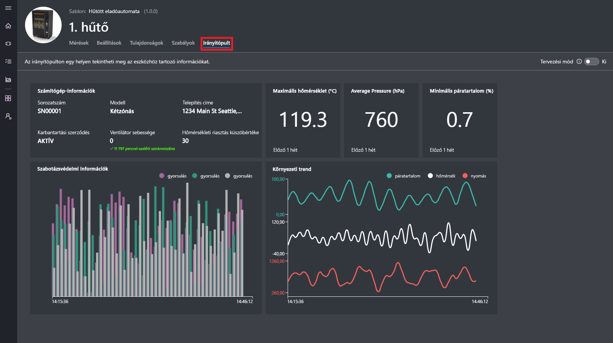

## Elemzés megtekintése

Az előző szakasz bemutatta, hogyan tekintheti meg az egyes eszközökkel kapcsolatos információkat. [Eszközkészletekkel](howto-use-device-sets.md) és [elemzéssel](howto-create-analytics.md) több eszköz összesített információit tekintheti meg.

Az eszközkészletek lekérdezésekkel választják ki dinamikusan a feltételeknek megfelelő eszközök készletét. A **Seattle-i gépek** eszközkészlet például a seattle-i hűtőeszközöket választja ki. A **Seattle-i gépek** eszközkészlet megtekintéséhez válassza bal oldali navigációs menü **Eszközkészletek** elemét, majd válassza a **Seattle-i gépek** lehetőséget:

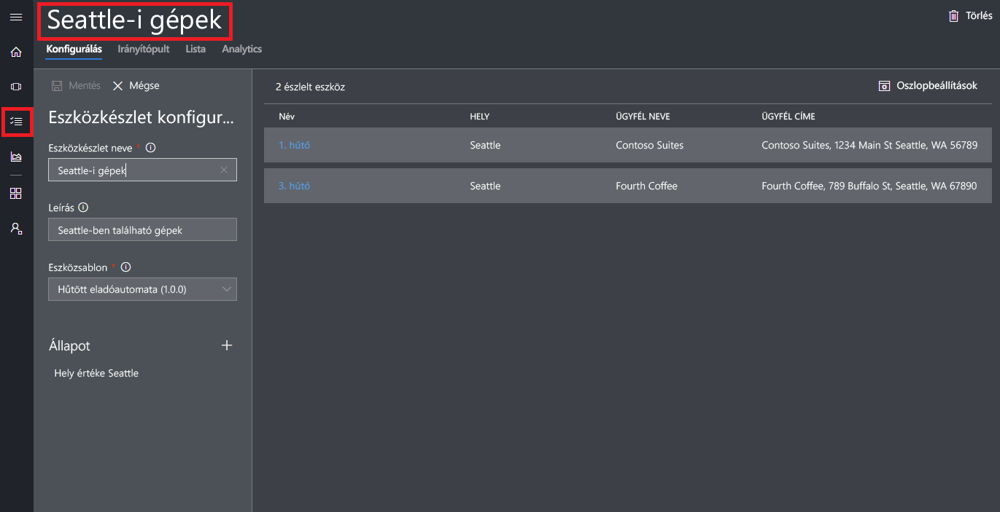

Az **Elemzés** oldalon tekintheti meg az eszközkészletekben lévő eszközökre vonatkozó elemzési adatokat:

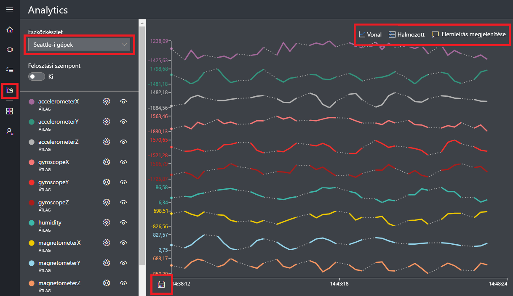

## További lépések

Ebben a rövid útmutatóban egy előre feltöltött Azure IoT Central-alkalmazást hozott létre, amely egy **Hűtött eladóautomata** eszközsablont és szimulált eszközöket tartalmaz. A saját eszközsablonok szerkesztőként történő meghatározásáról további tudnivalókért lásd az [új eszközsablon alkalmazásban való meghatározását](tutorial-define-device-type.md) ismertető szakaszt.
