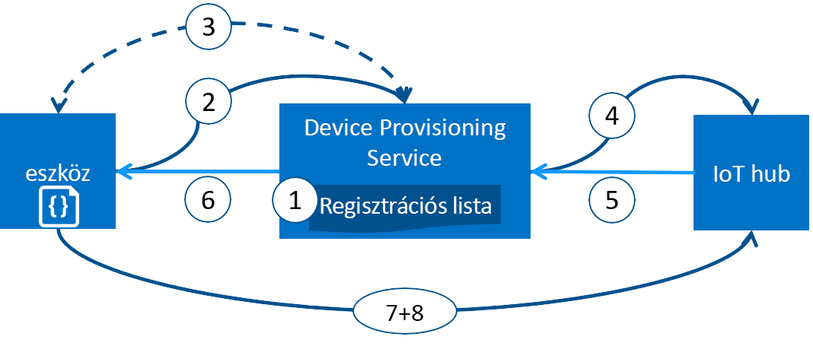

# Azure IoT Hub eszköz kiépítése szolgáltatáshoz kiépítés-eszközök
A Microsoft Azure integrált nyilvános felhőszolgáltatások minden IoT megoldás igényeinek széles skáláját biztosítja. Az IoT Hub-kiépítés szolgáltatást az IoT-központ, amely lehetővé teszi, hogy nulla érintéssel, közvetlenül az időponthoz kötött kiépítése a jobb oldali IoT hub emberi beavatkozás nélkül engedélyezése az ügyfelek számára a kiépítés több millió eszközök biztonságos és skálázható módon telepíthetők a segítő szolgáltatás módon.

## Mikor érdemes használni az eszköz kiépítése szolgáltatáshoz
Nincsenek sok kiépítési forgatókönyvben, az eszköz kiépítése szolgáltatáshoz is egy kiváló választás az első eszközök csatlakoztatva, és úgy konfigurálva, hogy az IoT-központ, például:

* Nulla érintéssel történő egyetlen IoT-megoldás nélkül hardcoding IoT-központ kapcsolatadatok gyári (kezdeti beállítás)
* Terheléselosztásának eszközök több hubok
* (Több vállalat kiszolgálása) értékesítési tranzakciós adatok alapján a tulajdonostól IoT-megoldás a csatlakoztatott eszközök
* Használati eset (megoldás elkülönítési) függően egy adott IoT-megoldás a csatlakoztatott eszközök
* Egy eszköz csatlakozik az IoT hub és a legkisebb mértékű (földrajzi-horizontális)
* Az eszköz változása alapján ismételt kiépítése
* Működés közbeni (Ha a csatlakozásra nem használ X.509-tanúsítványokat) IoT-központ csatlakozni az eszköz által használt kulcsok

## A színfalak mögött
Az előző szakaszban felsorolt összes forgatókönyv elvégezhető az üzembe helyezési szolgáltatással az adott adatfolyam a kialakítási nulla érintéssel. A manuális lépéseit hagyományosan kiépítése számos automatizált szolgáltatással a kiépítés felgyorsításához az IoT-eszközök telepítése, és manuális hiba kockázatának csökkentéséhez. Mi történik a háttérben kiépített eszköz leírása a következő: Az első lépés manuális, a következő lépéseket automatizált.

1. Eszköz gyártója ad hozzá a eszköz regisztrációs adatokat az Azure portálon beléptetési listájához.
2. Eszköz kapcsolatba lép a kiépítési szolgáltatásvégpont gyári beállítása. Az eszköz megfelel a létesítési szolgáltatás a azonosító adatok azonosítására.
3. A létesítési szolgáltatás érvényesíti az eszköz identitásának érvényesítésével azonosítsa a regisztrációs Azonosítót és a kulcs nonce kihívást használatával beléptetési listaelemet ellen ([platformmegbízhatósági modul](https://trustedcomputinggroup.org/work-groups/trusted-platform-module/)) vagy standard X.509 ellenőrzési () X.509).
4. A létesítési szolgáltatás regisztrálja az eszközt az IoT-központ tölti fel az eszköz [iker állapot szükséges](../iot-hub/iot-hub-devguide-device-twins.md).
5. Az IoT hub eszköz azonosító adatait adja vissza. az üzembe helyezési szolgáltatáshoz.
6. A létesítési szolgáltatás visszatér az eszközt az IoT hub-kapcsolódási információt. Az eszköz most elindíthatja a közvetlenül az IoT hub történő adatküldés.
7. Az eszköz csatlakozik, az IoT-központ.
8. Az eszköz a kívánt állapot lekérése az eszköz iker az IoT-központot.

## Üzembe helyezési folyamat
A telepítési folyamat az eszköz kiépítése szolgáltatáshoz vesz igénybe, amelyek egymástól függetlenül végezhető része eszköz két különálló lépésből áll:

* A **gyártási lépés** amely az eszköz létrehozása és gyári, előkészített és
* A **felhő telepítő lépés** található, amely az eszköz kiépítése szolgáltatáshoz konfigurált automatikus üzembe helyezését.

Mindkét ezeket a lépéseket elférjen zökkenőmentesen meglévő gyártási és üzembe helyezési folyamatokkal. Az eszköz kiépítése szolgáltatáshoz még egyszerűbbé teszi a néhány központi telepítési folyamat, például a nagy mennyiségű manuális tevékenység kapcsolat lekérése az eszközön.

### Gyártási lépés
Ez a lépés nem minden mi történik a gyártási sor. A részt ebben a lépésben szerepkörök a következők: szilícium designer, szilícium gyártó, integráló és/vagy az eszköz gyártója vége. Ez a lépés aggasztanak létrehozásakor a saját magát.

Az eszköz kiépítése szolgáltatáshoz nem vezet be egy új lépés a gyártási folyamat; Ehelyett azt kötelékek azokat a meglévő lépés a szoftverek, és a hardveres biztonsági MODULT (ideális esetben) telepített az eszközön. Eszközazonosítót létrehozása ebben a lépésben, helyett, a létesítési szolgáltatás lekérése a kapcsolat adatai/IoT-megoldás hozzárendelését, azt a bekapcsolt meghívja a az eszköz egyszerűen programozott van a létesítési szolgáltatás adatokkal.

Ebben a lépésben is a gyártó az eszköz deployer/operátor azonosíthatja a fontos információkat szolgáltat. Ennek oka lehet egyszerűen erősítse meg, hogy minden eszköz egy aláíró tanúsítványt, az eszköz deployer/operátor szükséges, a TPM-ellenőrző kulcs nyilvános részének kibontása minden TPM eszköz által biztosított előállított X.509 tanúsítvánnyal rendelkeznek. Ezek a szolgáltatások még ma számos szilícium gyártó kínálják.

### Felhő beállítása lépés
Ez a lépés nem a felhő beállítása a megfelelő automatikus kiépítés kapcsolatban. Általában két típusa van a felhasználók felhőalapú telepítő lépés:, aki tudja, hogyan kell eszközök kell először állítja be (egy eszköz operátor), és valaki más ki tudja, hogyan eszközök kell osztani, az IoT-központok (Ez a megoldás operátor) között vannak.

A kiépítés, amely egy egyszeri kezdeti telepítése kell történnie, és ez a feladat általában kezeli a megoldás operátor. Ha a létesítési szolgáltatás konfigurálva van, nincs lehet módosítani, kivéve, ha módosítja a használati eset.

Miután a szolgáltatás konfigurációja automatikus üzembe helyezéséhez, regisztrálhatják eszközeiket kell készíteni. Az eszköz operátor szerinti szűrése, aki ismeri a forráseszköz(ök) kívánt beállításait, és meggyőződött arról, hogy a létesítési szolgáltatás igazolják az eszköz identitása megfelelően is, az IoT-központ keres ismét feladata ebben a lépésben végezhető el. Az eszköz üzemeltető a azonosító kulcsfontosságú adatokat fogad a gyártótól, és hozzáadja azt a tanúsítványigénylési listája. Lehet soron következő frissítések a beléptetési listára új bejegyzések kerülnek, vagy meglévő bejegyzések frissítése a legújabb információkkal a eszközökről.

## Regisztrációs és üzembe helyezését
*Kiépítés* azt jelenti, hogy a különböző dolgok attól függően, hogy az iparágban használt kifejezés. Az IoT-eszközök számára a felhőalapú megoldás kiépítés összefüggésében két részből álló folyamat:

1. Az első rész a kezdeti kapcsolatot az eszköz és az IoT-megoldás meghatározása úgy, hogy az eszköz regisztrálását.
2. A második rész az eszközre, a megoldás, hogy regisztrálva van a meghatározott követelmények alapján alkalmazza a megfelelő konfigurációt.

Csak akkor, ha mindkét fenti két lépések elvégzése után is azt tegyük fel például, hogy az eszköz teljesen lett kiépítve. Egyes felhőszolgáltatások csak adja meg az első lépés a telepítési folyamatot, az IoT-megoldás végpontjának eszközök regisztrálása, de nem ad meg a kezdeti konfigurációt. Az eszköz kiépítése szolgáltatáshoz automatizálja az üzembe helyezési zökkenőmentes élményt biztosít az eszköz két lépést.

## Az eszköz-üzembehelyezési szolgáltatás jellemzői
Az eszköz kiépítése szolgáltatáshoz számos olyan szolgáltatást, amelyek révén ideális üzembe helyezési eszközök rendelkezik.

* **Állapotigazolási biztonságos** X.509- és a TPM-alapú identitás támogatása.
* **Tanúsítványigénylési listája** tartalmazó eszközök/eszközcsoportok, amelyek lehet, hogy néhány register teljes rekordot. A tanúsítványigénylési listája az eszköz a kívánt konfigurációs információkat tartalmaz, ha regisztrálja azokat, és bármikor frissítheti.
* **Több elosztási házirendek** hogyan az eszköz kiépítése szolgáltatáshoz rendel eszközök támogatásához az esetek IoT-központok szabályozására.
* **Megfigyelési és diagnosztikai naplók** való győződjön meg arról, hogy minden megfelelően működik.
* **Több központi támogatási** amely lehetővé teszi az eszköz kiépítése szolgáltatás eszközöket rendelhet hozzá több IoT-központ. Az eszköz kiépítése szolgáltatáshoz hubs több Azure-előfizetések között működik.
* **Kereszt-terület támogatása** amely lehetővé teszi az eszköz kiépítése szolgáltatás eszközöket rendeljen az IoT-központok más régiókban.

A fogalmak és az eszközök kiépítését a részt vevő szolgáltatásokkal kapcsolatban részletesebb [eszköz fogalmak](concepts-device.md), [szolgáltatással kapcsolatos fogalmak](concepts-service.md), és [biztonsági fogalmak](concepts-security.md).

## Többplatformos támogatást
Az eszközök kiépítés szolgáltatása, minden Azure IoT-szolgáltatásaival, például a különböző operációs rendszereken platformfüggetlen működik. Az Azure-ajánlatok nyissa meg a forrás SDK-k, a különböző [nyelvek](https://github.com/Azure/azure-iot-sdks) megkönnyítésére kapcsolódó eszközök és a szolgáltatás kezelése. Az eszköz kiépítése szolgáltatáshoz kapcsolódó eszközök az alábbi protokollokat támogatja:

* HTTPS
* AMQP
* Az AMQP keresztül websocket elemek
* MQTT
* MQTT websocket elemek keresztül

Az eszköz kiépítése szolgáltatáshoz a szolgáltatási műveletek HTTPS-kapcsolatok csak támogatja.

## Régiók
Az eszköz kiépítése szolgáltatáshoz sok terület érhető el. Azt a meglévő és újonnan frissített listáját jelentette be az összes szolgáltatáshoz, régiók karbantartása [Azure-régiókat](https://azure.microsoft.com/regions/). Láthatja, ahol az eszköz kiépítése szolgáltatás nem érhető el a [Azure állapot](https://azure.microsoft.com/status/) lap.

> [!NOTE]
> Az eszköz kiépítése szolgáltatáshoz a globális, és nem kötött helyre. Azonban meg kell adnia egy régiót, amelyben az eszköz kiépítése szolgáltatáshoz-profilhoz tartozó metaadatok lesznek tárolva.

## Rendelkezésre állás
99,9 %-os kezelése a Microsoft szolgáltatásiszint-megállapodás a eszköz kiépítése szolgáltatáshoz, és meg is [olvassa el a szolgáltatásiszint-szerződést](https://azure.microsoft.com/support/legal/sla/iot-hub/). Az Azure egészére vonatkozó rendelkezésre állási garancia magyarázata a teljes [Azure SLA](https://azure.microsoft.com/support/legal/sla/)-ban található.

## Kvóták
Minden Azure-előfizetéssel rendelkezik alapértelmezett kvótát, amely jelentős hatással lehet az IoT-megoldásból körét. A jelenlegi korlát előfizetésenként alapon előfizetésenként 10 eszköz kiépítése szolgáltatások.

További információ a kvótakorlátozásokról:

* [Az Azure-előfizetés szolgáltatásokra vonatkozó korlátozásai](../azure-subscription-service-limits.md)

## Kapcsolódó Azure-összetevők
Az eszköz kiépítése szolgáltatáshoz automatizálja az Azure IoT-központ az eszközök kiépítését. További információ [IoT-központ](https://docs.microsoft.com/azure/iot-hub/).

## További lépések
Most már rendelkezik az Azure IoT-eszközök kiépítés áttekintése. A következő lépés egy végpontok közötti IoT forgatókönyv kipróbálásához.
> [!div class="nextstepaction"]
> [Az Azure-portálon az IoT Hub eszköz kiépítése szolgáltatáshoz beállítása](quick-setup-auto-provision.md)
> [létrehozása és biztosítása a szimulált eszköz](quick-create-simulated-device.md)
> [kialakítási eszköz beállítása](tutorial-set-up-device.md)
