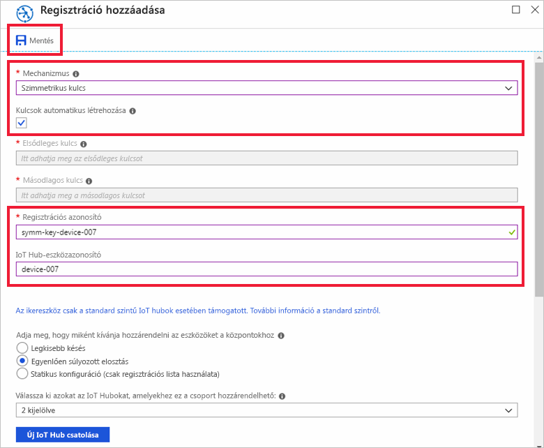
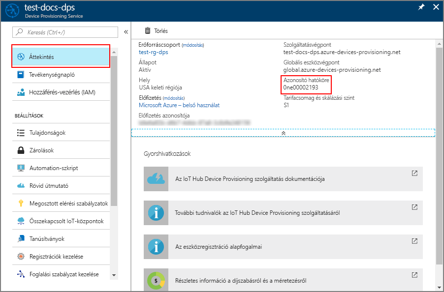
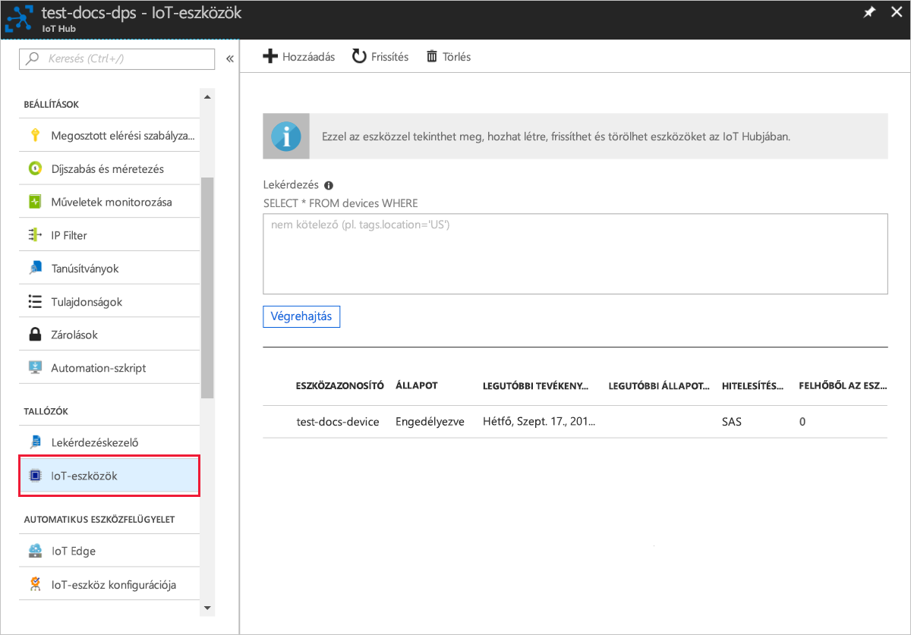

# <a name="quickstart-provision-a-simulated-device-with-symmetric-keys"></a>Gyors útmutató: Szimulált eszköz kiépítése a szimmetrikus kulcsok

Ebből a rövid útmutatóból megtudhatja, hogyan hozhat létre és futtathat eszközszimulátort a Windows rendszerű fejlesztői gépeken. A szimulált eszközt arra konfiguráljuk, hogy egy szimmetrikus kulcs használatával hitelesítse magát egy Device Provisioning Service-példánynál és hozzárendelésre kerüljön egy IoT-központhoz. Az [Azure IoT C SDK](https://github.com/Azure/azure-iot-sdk-c) mintakódját használva fogjuk szimulálni az eszközindítási szekvenciát, amely a kiosztás folyamatát fogja elindítani. A rendszer az eszközt a regisztrációs szolgáltatáspéldányban való egyéni regisztrációja alapján ismeri fel, és ez alapján társítja egy IoT-központhoz.

Bár ez a cikk csak egy egyéni regisztráció kiépítését mutatja be, ugyanezt az eljárást alkalmazhatja regisztrációs csoportok esetében is. Az egyetlen különbség, hogy ebben az esetben egy származtatott eszközkulcsot kell használnia, eszközönkénti egyedi regisztrációs azonosítóval. Regisztrációs csoportok esetében a regisztráció szimmetrikus kulcsa nem kerül közvetlenül felhasználásra. Bár a szimmetrikus kulcsot használó regisztrációs csoportok nem csak örökölt eszközök esetében használhatóak, a [Szimmetrikus kulcsok használata örökölt eszközök kiépítéséhez](how-to-legacy-device-symm-key.md) című cikk példája jól szemlélteti a regisztrációs csoportok használatát. További információért lásd: [Csoportos beléptetés használata szimmetrikus kulcsú igazolásnál](concepts-symmetric-key-attestation.md#group-enrollments)

Amennyiben nem ismeri az automatikus kiépítés folyamatát, olvassa el [az automatikus kiépítés alapfogalmait](concepts-auto-provisioning.md) ismertető cikket. 

A rövid útmutató folytatása előtt mindenképpen végezze el az [IoT Hub eszközkiépítési szolgáltatás beállítása az Azure Portallal](./quick-setup-auto-provision.md) szakasz lépéseit. Ez a rövid útmutató feltételezi, hogy korábban már létrehozott egy Device Provisioning Service-példányt.

A cikk során egy Windows-alapú munkaállomást fogunk használni. Azonban az eljárások Linux esetében is alkalmazhatóak. Linux-munkaállomást használó példát a [Több bérlős regisztráció](how-to-provision-multitenant.md) című cikkben talál.


[!INCLUDE [quickstarts-free-trial-note](../../includes/quickstarts-free-trial-note.md)]


## <a name="prerequisites"></a>Előfeltételek

* Visual Studio 2015 vagy [Visual Studio 2017](https://www.visualstudio.com/vs/), amelyben engedélyezve van az [„Asztali fejlesztés C++ használatával”](https://www.visualstudio.com/vs/support/selecting-workloads-visual-studio-2017/) számítási feladat.
* A [Git](https://git-scm.com/download/) legújabb verziójának telepített példánya.


<a id="setupdevbox"></a>

## <a name="prepare-an-azure-iot-c-sdk-development-environment"></a>Azure IoT C SDK fejlesztői környezet előkészítése

Ebben a szakaszban előkészítjük az [Azure IoT C SDK](https://github.com/Azure/azure-iot-sdk-c) build készítésére szolgáló fejlesztőkörnyezetet. 

Az SDK tartalmaz szimulált eszközök esetében használható mintakódokat is. A szimulált eszköz a beléptetést az rendszerindítási során fogja megkísérelni.

1. Töltse le a [CMake buildelési rendszert](https://cmake.org/download/).

    Fontos, hogy a Visual Studio előfeltételei (Visual Studio és az „Asztali fejlesztés C++ használatával” számítási feladat) telepítve legyenek a gépen, **mielőtt** megkezdené a `CMake` telepítését. Ha az előfeltételek telepítve vannak, és ellenőrizte a letöltött fájlt, telepítse a CMake buildelési rendszert.

2. Nyisson meg egy parancssort vagy a Git Bash-felületet. A következő parancs végrehajtásával klónozza az Azure IoT C SDK GitHub-adattárat:
    
    ```cmd/sh
    git clone https://github.com/Azure/azure-iot-sdk-c.git --recursive
    ```
    Ez a művelet várhatóan több percig is eltarthat.


3. Hozzon létre egy `cmake` alkönyvtárat a Git-adattár gyökérkönyvtárában, és lépjen erre a mappára. 

    ```cmd/sh
    cd azure-iot-sdk-c
    mkdir cmake
    cd cmake
    ```

4. Futtassa az alábbi parancsot, amely létrehozza az SDK fejlesztői ügyfélplatformra szabott verzióját. A szimulált eszközhöz tartozó Visual Studio-megoldás a `cmake` könyvtárban jön létre. 

    ```cmd
    cmake -Dhsm_type_symm_key:BOOL=ON -Duse_prov_client:BOOL=ON  ..
    ```
    
    Ha a `cmake` nem találja a C++ fordítóprogramot, a fenti parancs futtatása esetlegesen fordítási hibákat adhat vissza. Ilyen esetekben futtassa a parancsot a [Visual Studio parancssorából](https://docs.microsoft.com/dotnet/framework/tools/developer-command-prompt-for-vs). 

    A sikeres létrehozást követően a kimenet utolsó sorai a következőhöz hasonlóan néznek majd ki:

    ```cmd/sh
    $ cmake -Dhsm_type_symm_key:BOOL=ON -Duse_prov_client:BOOL=ON  ..
    -- Building for: Visual Studio 15 2017
    -- Selecting Windows SDK version 10.0.16299.0 to target Windows 10.0.17134.
    -- The C compiler identification is MSVC 19.12.25835.0
    -- The CXX compiler identification is MSVC 19.12.25835.0

    ...

    -- Configuring done
    -- Generating done
    -- Build files have been written to: E:/IoT Testing/azure-iot-sdk-c/cmake
    ```


## <a name="create-a-device-enrollment-entry-in-the-portal"></a>Eszközregisztrációs bejegyzés létrehozása a portálon

1. Jelentkezzen be az Azure Portalra, a bal oldali menüben kattintson a **Minden erőforrás** gombra, és nyissa meg a Device Provisioning Service-t.

2. Válassza a **Regisztrációk kezelése** fület, és kattintson a felül lévő **Egyéni regisztráció hozzáadása** gombra. 

3. A **Regisztráció hozzáadása** lapon adja meg az alábbi adatokat, majd kattintson a **Mentés** gombra.

   - **Mechanizmus**: Válassza ki **szimmetrikus kulcs** elemet az identitás igazolási *mechanizmus*.

   - **Kulcsok automatikus létrehozása**: Ezt a jelölőnégyzetet.

   - **Regisztrációs azonosító**: Adja meg a regisztrációs Azonosítót a regisztráció azonosításához. Csak a kisbetűs alfanumerikus karaktereket és a kötőjel karaktert használhatja. Például: `symm-key-device-007`.

   - **IoT Hub-Eszközazonosító:** Adjon meg egy eszközazonosítót. Például: **device-007**

     

4. Ha mentette a regisztrációt, a rendszer létrehozza az **Elsődleges kulcsot** és a **Másodlagos kulcsot**, majd hozzáadja őket a regisztrációs bejegyzéshez. A Szimmetrikus kulcsot használó eszközregisztráció **symm-key-device-007** néven jelenik meg az *Egyéni beléptetések* lap *Regisztrációs azonosító* oszlopában. 

    Nyissa meg a regisztrációt, és másolja ki a generált **Elsődleges kulcsot**.


<a id="firstbootsequence"></a>

## <a name="simulate-first-boot-sequence-for-the-device"></a>Első rendszerindítás szimulálása az eszközhöz

Ebben a szakaszban frissítjük a mintakódot, hogy leküldje az eszköz rendszerindítási szekvenciáját a Device Provisioning Service-példányba. A rendszerindítási szekvenciának köszönhetően a rendszer felismeri majd az eszközt, és hozzárendeli egy, a Device Provisioning Service-példányhoz társított IoT Hubhoz.


1. Az Azure Portalon válassza ki az eszközkiépítési szolgáltatás **Áttekintés** lapját, és jegyezze fel az **_Azonosító hatóköre_** értéket.

     

2. A Visual Studióban nyissa meg a CMake futtatásával létrehozott **azure_iot_sdks.sln** megoldásfájlt. A megoldásfájlnak a következő helyen kell lennie:

    ```
    \azure-iot-sdk-c\cmake\azure_iot_sdks.sln
    ```

3. A Visual Studio *Solution Explorer* (Megoldáskezelő) ablakában lépjen a **Provision\_Samples** (Kiépítés > Minták) mappára. Bontsa ki a **prov\_dev\_client\_sample** nevű mintaprojektet. Bontsa ki a **Source Files** (Forrásfájlok) elemet, és nyissa meg a **prov\_dev\_client\_sample.c** nevű forrásfájlt.

4. Keresse meg az `id_scope` állandót, és cserélje le az értékét a korábban kimásolt **Azonosító hatóköre** értékre. 

    ```c
    static const char* id_scope = "0ne00002193";
    ```

5. Keresse meg a `main()` függvény definícióját ugyanebben a fájlban. Győződjön meg róla, hogy a `hsm_type` változó értéke `SECURE_DEVICE_TYPE_SYMMETRIC_KEY`, mint az alább is látható:

    ```c
    SECURE_DEVICE_TYPE hsm_type;
    //hsm_type = SECURE_DEVICE_TYPE_TPM;
    //hsm_type = SECURE_DEVICE_TYPE_X509;
    hsm_type = SECURE_DEVICE_TYPE_SYMMETRIC_KEY;
    ```

6. Keresse meg a hívást `prov_dev_set_symmetric_key_info()` a **prov\_fejlesztési\_ügyfél\_sample.c** amely megjegyzésként szerepel.

    ```c
    // Set the symmetric key if using they auth type
    //prov_dev_set_symmetric_key_info("<symm_registration_id>", "<symmetric_Key>");
    ```

    Állítsa vissza a függvény hívásához szükséges, és cserélje le a helyőrző értékeket (beleértve a csúcsos zárójeleket) a regisztrációs Azonosítót és elsődleges kulcs értékeit.

    ```c
    // Set the symmetric key if using they auth type
    prov_dev_set_symmetric_key_info("symm-key-device-007", "your primary key here");
    ```
   
    Mentse a fájlt.

7. Kattintson a jobb gombbal a **prov\_dev\_client\_sample** projektre, és válassza a **Beállítás kezdőprojektként** lehetőséget. 

8. A Visual Studio menüjében válassza a **Debug** > **Start without debugging** (Hibakeresés > Indítás hibakeresés nélkül) lehetőséget a megoldás futtatásához. A projekt újraépítésére vonatkozó parancsablakban kattintson az **Igen** gombra a projekt újraépítéséhez a futtatás előtt.

    Az alábbi példakimeneten látható, hogy a szimulált eszköz sikeresen elindul és csatlakozik a regisztrációs szolgáltatáspéldányhoz, hogy az hozzárendelhesse egy IoT-központhoz:

    ```cmd
    Provisioning API Version: 1.2.8

    Registering Device

    Provisioning Status: PROV_DEVICE_REG_STATUS_CONNECTED
    Provisioning Status: PROV_DEVICE_REG_STATUS_ASSIGNING
    Provisioning Status: PROV_DEVICE_REG_STATUS_ASSIGNING

    Registration Information received from service: 
    test-docs-hub.azure-devices.net, deviceId: device-007    
    Press enter key to exit:
    ```

9. A Portalon lépjen ahhoz az IoT-központhoz, amelyhez a szimulált eszköz rendelve lett, és kattintson az **IoT-eszközök** fülre. Ha sikeresen kiépült a szimulált eszköz, annak eszközazonosítója megjelenik az **IoT-eszközök** panelen, a hozzá tartozó *ÁLLAPOT* pedig **Engedélyezve** értéket mutat. Lehet, hogy rá kell kattintania fent a **Frissítés** gombra. 

     


## <a name="clean-up-resources"></a>Az erőforrások eltávolítása

Ha azt tervezi, hogy folytatja az eszközügyfél minta használatát és megismerését, akkor ne törölje a rövid útmutatóban létrehozott erőforrásokat. Ha nem folytatja a munkát, akkor a következő lépésekkel törölheti a rövid útmutatóhoz létrehozott összes erőforrást.

1. Zárja be az eszközügyfél minta kimeneti ablakát a gépen.
1. Az Azure Portal bal oldali menüjében kattintson az **Összes erőforrás** lehetőségre, majd válassza ki az eszközkiépítési szolgáltatást. Nyissa meg a szolgáltatás **Regisztrációk kezelése** lapját, majd kattintson az **Egyéni regisztrációk** lapra. Válassza ki a rövid útmutatóban regisztrált eszköz *REGISZTRÁCIÓS AZONOSÍTÓJÁT*, majd kattintson a felül található **Törlés** gombra. 
1. Az Azure Portal bal oldali menüjében kattintson az **Összes erőforrás** lehetőségre, majd válassza ki az IoT Hubot. Nyissa meg a hub **IoT-eszközök** lapját, válassza ki a rövid útmutatóban regisztrált eszköz *ESZKÖZAZONOSÍTÓJÁT*, majd kattintson a felül található **Törlés** gombra.

## <a name="next-steps"></a>További lépések

Ebben a rövid útmutatóban egy szimulált eszközt hozott létre a Windows rendszerű gépén, amelyet aztán kiépített IoT-központjához a portál Azure IoT Hub Device Provisioning Service szolgáltatásának szimmetrikus kulccsal történő használatával. Ha szeretné megismerni az eszközök programozott regisztrációjának folyamatát, lépjen tovább az X.509-eszközök programozott regisztrációjának rövid útmutatójára. 

> [!div class="nextstepaction"]
> [Azure rövid útmutató – X.509-eszközök regisztrációja az Azure IoT Hub Device Provisioning Service](quick-enroll-device-x509-java.md)
